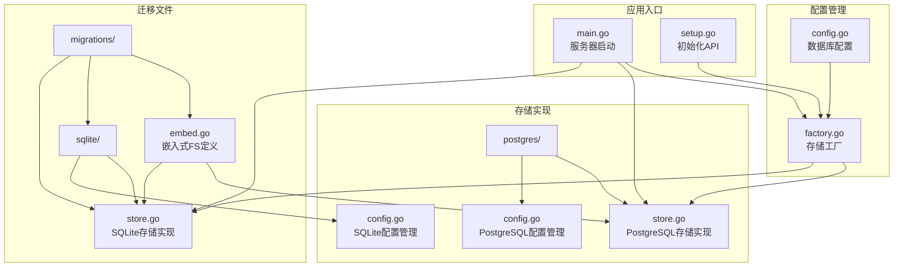
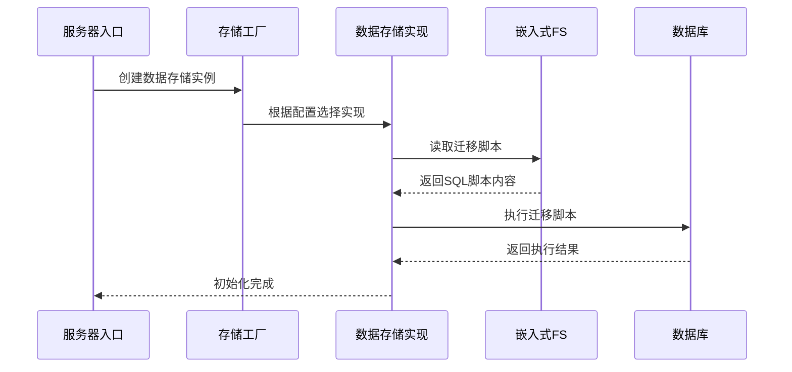
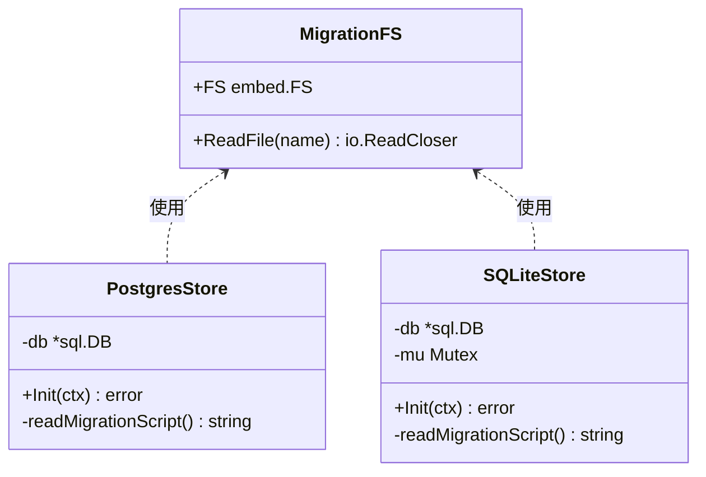
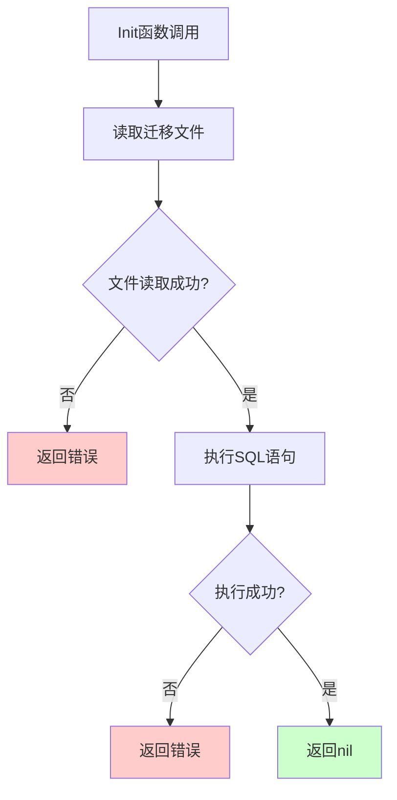
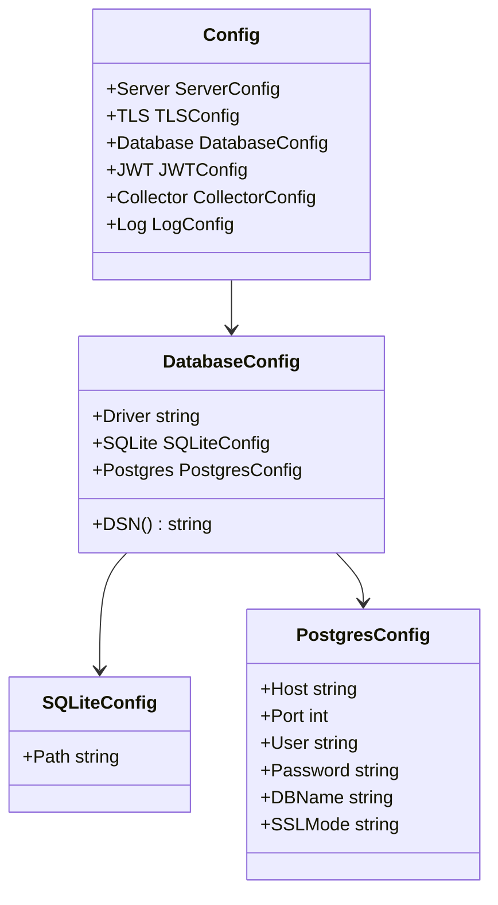
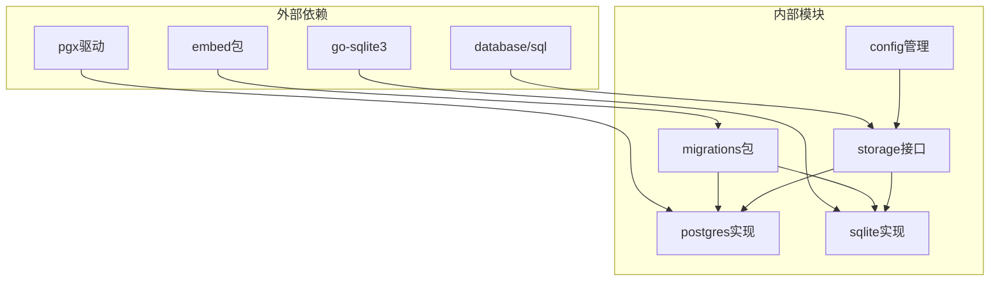

# 数据库迁移管理

<cite>
**本文档引用的文件**
- [embed.go](file://internal/storage/migrations/embed.go)
- [001_init_postgres.sql](file://internal/storage/migrations/001_init_postgres.sql)
- [001_init_sqlite.sql](file://internal/storage/migrations/001_init_sqlite.sql)
- [store.go](file://internal/storage/postgres/store.go)
- [store.go](file://internal/storage/sqlite/store.go)
- [factory.go](file://internal/storage/factory.go)
- [config.go](file://internal/config/config.go)
- [main.go](file://cmd/server/main.go)
- [setup.go](file://internal/api/setup.go)
- [config.go](file://internal/storage/sqlite/config.go)
- [config.go](file://internal/storage/postgres/config.go)
- [errors.go](file://internal/model/errors.go)
</cite>

## 目录
1. [简介](#简介)
2. [项目结构](#项目结构)
3. [核心组件](#核心组件)
4. [架构概览](#架构概览)
5. [详细组件分析](#详细组件分析)
6. [依赖关系分析](#依赖关系分析)
7. [性能考虑](#性能考虑)
8. [故障排除指南](#故障排除指南)
9. [结论](#结论)

## 简介

DataCollector项目采用嵌入式SQL脚本的方式实现数据库迁移管理。该机制通过Go的embed包将SQL迁移文件编译到二进制文件中，实现了零外部依赖的部署特性。系统支持PostgreSQL和SQLite两种数据库后端，每种数据库都有独立的初始化脚本。

迁移管理的核心设计目标是：
- 实现版本化的数据库结构变更
- 支持跨数据库平台的一致性
- 提供自动化的初始化流程
- 确保生产环境的安全部署

## 项目结构

数据库迁移相关的文件组织遵循清晰的层次结构：

**图表来源**
- [embed.go:1-7](file://internal/storage/migrations/embed.go#L1-L7)
- [001_init_postgres.sql:1-91](file://internal/storage/migrations/001_init_postgres.sql#L1-L91)
- [001_init_sqlite.sql:1-97](file://internal/storage/migrations/001_init_sqlite.sql#L1-L97)

**章节来源**
- [embed.go:1-7](file://internal/storage/migrations/embed.go#L1-L7)
- [factory.go:1-22](file://internal/storage/factory.go#L1-L22)

## 核心组件

### 嵌入式文件系统

系统使用Go的embed包将SQL脚本编译到二进制文件中，确保部署时无需额外的文件依赖。

### 存储工厂模式

通过工厂函数根据配置动态选择合适的数据库存储实现：
- SQLite：适用于开发环境和小型部署
- PostgreSQL：适用于生产环境和高并发场景

### 迁移脚本组织

每个数据库后端都有独立的初始化脚本，包含完整的数据库结构定义和索引创建。

**章节来源**
- [factory.go:11-21](file://internal/storage/factory.go#L11-L21)
- [config.go:36-56](file://internal/config/config.go#L36-L56)

## 架构概览

数据库迁移系统的整体架构采用分层设计，确保了良好的可维护性和扩展性：

**图表来源**
- [main.go:45-64](file://cmd/server/main.go#L45-L64)
- [factory.go:12-20](file://internal/storage/factory.go#L12-L20)
- [store.go:37-50](file://internal/storage/postgres/store.go#L37-L50)

## 详细组件分析

### 嵌入式迁移脚本管理

#### 文件系统嵌入

嵌入式文件系统通过Go指令将所有SQL文件编译到二进制中：

**图表来源**
- [embed.go:1-7](file://internal/storage/migrations/embed.go#L1-L7)
- [store.go:15-34](file://internal/storage/postgres/store.go#L15-L34)
- [store.go:17-21](file://internal/storage/sqlite/store.go#L17-L21)

#### 迁移脚本内容分析

##### PostgreSQL初始化脚本

PostgreSQL脚本定义了完整的数据库结构，包含以下核心组件：

**表结构定义**：
- 用户表(users)：存储系统用户信息，包含用户名、密码哈希、角色等字段
- 数据源表(data_sources)：管理数据源配置，支持JSONB格式的schema配置
- 数据Token表(data_tokens)：令牌管理和访问控制
- 数据记录表(data_records)：存储采集到的数据，支持JSONB格式
- 统计数据表(statistics)：按日期统计访问量
- 系统配置表(system_configs)：存储系统运行时配置

**索引优化**：
- 用户表：用户名唯一索引、状态索引
- 数据源表：状态索引、创建者索引
- Token表：源ID索引、哈希索引、状态索引
- 记录表：源ID索引、Token索引、时间戳索引
- 统计表：复合索引优化查询性能

##### SQLite初始化脚本

SQLite脚本针对SQLite的特性进行了优化：

**数据类型适配**：
- 使用TEXT类型替代JSONB，通过TEXT存储JSON数据
- 采用FOREIGN KEY语法支持外键约束
- 时间戳使用DATETIME类型

**性能优化**：
- WAL模式启用提高并发性能
- BUSY_TIMEOUT设置避免锁竞争
- 单连接池配置适应SQLite特性

**章节来源**
- [001_init_postgres.sql:4-91](file://internal/storage/migrations/001_init_postgres.sql#L4-L91)
- [001_init_sqlite.sql:4-97](file://internal/storage/migrations/001_init_sqlite.sql#L4-L97)

### 存储实现分析

#### PostgreSQL存储实现

PostgreSQL存储实现提供了完整的数据库连接管理和迁移执行功能：

**图表来源**
- [store.go:37-50](file://internal/storage/postgres/store.go#L37-L50)

#### SQLite存储实现

SQLite存储实现具有额外的线程安全考虑：

**并发控制**：
- 使用互斥锁确保迁移过程的线程安全
- 单连接池配置适应SQLite的并发限制
- WAL模式提升并发性能

**初始化流程**：
1. 创建数据库目录
2. 建立数据库连接
3. 启用WAL模式
4. 设置BUSY_TIMEOUT
5. 执行迁移脚本

**章节来源**
- [store.go:1-61](file://internal/storage/postgres/store.go#L1-L61)
- [store.go:1-86](file://internal/storage/sqlite/store.go#L1-L86)

### 配置管理系统

#### 数据库配置结构

配置系统支持多种数据库后端的灵活配置：

**图表来源**
- [config.go:12-80](file://internal/config/config.go#L12-L80)
- [config.go:36-56](file://internal/config/config.go#L36-L56)
- [config.go:197-214](file://internal/config/config.go#L197-L214)

**章节来源**
- [config.go:1-215](file://internal/config/config.go#L1-L215)

## 依赖关系分析

数据库迁移系统的依赖关系相对简单，主要围绕存储接口和配置管理：

**图表来源**
- [embed.go:3-6](file://internal/storage/migrations/embed.go#L3-L6)
- [store.go:8-11](file://internal/storage/postgres/store.go#L8-L11)
- [store.go:11-14](file://internal/storage/sqlite/store.go#L11-L14)

**章节来源**
- [factory.go:3-9](file://internal/storage/factory.go#L3-L9)

## 性能考虑

### 连接池配置

不同数据库后端采用了不同的连接池优化策略：

**PostgreSQL**：
- 最大连接数：25
- 空闲连接数：5
- 适合高并发场景

**SQLite**：
- 最大连接数：1（单写）
- 空闲连接数：1
- WAL模式提升并发性能

### 索引优化策略

迁移脚本包含了全面的索引设计，针对常见查询模式进行了优化：

**查询性能优化**：
- 用户认证：用户名唯一索引
- 数据查询：多字段组合索引
- 统计分析：日期范围查询优化
- 外键关联：引用完整性保证

### 内存使用优化

嵌入式文件系统将SQL脚本直接编译到二进制中，避免了运行时文件I/O开销。

## 故障排除指南

### 常见错误类型

系统定义了专门的错误码用于区分不同类型的初始化失败：

**错误码分类**：
- 系统运维类错误：初始化失败、已初始化
- 参数验证错误：参数缺失、参数无效
- 数据库连接错误：连接失败、权限不足

### 错误处理机制

#### 迁移执行错误

迁移过程中可能出现的错误类型：
- SQL语法错误
- 表结构冲突
- 权限不足
- 磁盘空间不足

#### 配置验证错误

初始化过程中的配置验证：
- 数据库连接测试
- 管理员账户创建
- 系统配置设置

**章节来源**
- [errors.go:29-37](file://internal/model/errors.go#L29-L37)
- [setup.go:134-196](file://internal/api/setup.go#L134-L196)

### 生产环境最佳实践

#### 安全部署策略

**数据库权限分离**：
- 使用专用的数据库用户
- 最小权限原则
- SSL连接加密

**备份策略**：
- 部署前完整备份
- 迁移后验证备份
- 定期恢复测试

#### 监控和告警

**健康检查**：
- 数据库连接监控
- 迁移执行监控
- 性能指标监控

**日志记录**：
- 详细的迁移日志
- 错误堆栈跟踪
- 性能分析日志

## 结论

DataCollector项目的数据库迁移管理机制展现了现代Go应用的最佳实践：

**设计优势**：
- 嵌入式部署简化了运维复杂度
- 分层架构便于扩展和维护
- 多数据库支持满足不同场景需求
- 完善的错误处理机制确保系统稳定性

**技术特色**：
- 零外部依赖的部署模型
- 自动化的初始化流程
- 线程安全的并发处理
- 全面的性能优化策略

该系统为类似的数据采集平台提供了可靠的数据库迁移解决方案，既满足了开发环境的便利性，又保证了生产环境的稳定性和安全性。