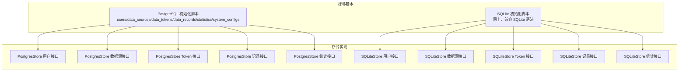
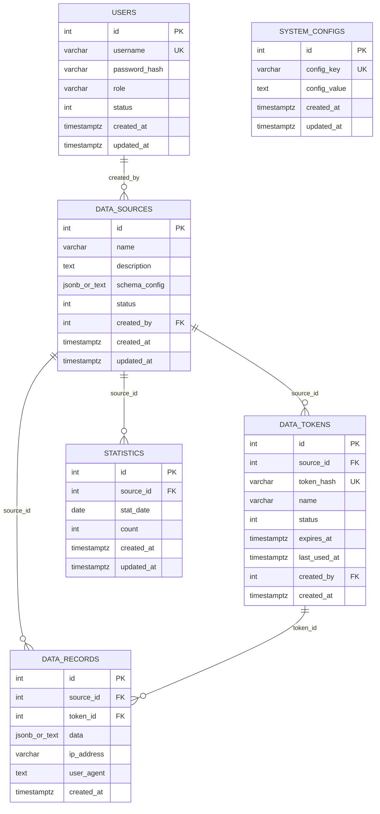
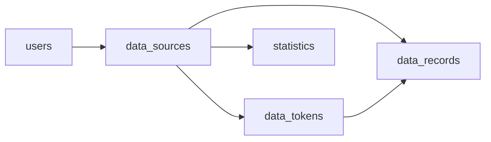

# 表结构设计

<cite>
**本文引用的文件**
- [001_init_postgres.sql](file://internal/storage/migrations/001_init_postgres.sql)
- [001_init_sqlite.sql](file://internal/storage/migrations/001_init_sqlite.sql)
- [record.go](file://internal/model/record.go)
- [source.go](file://internal/model/source.go)
- [token.go](file://internal/model/token.go)
- [user.go](file://internal/model/user.go)
- [statistics.go](file://internal/model/statistics.go)
- [user.go](file://internal/storage/postgres/user.go)
- [source.go](file://internal/storage/postgres/source.go)
- [token.go](file://internal/storage/postgres/token.go)
- [record.go](file://internal/storage/postgres/record.go)
- [statistics.go](file://internal/storage/postgres/statistics.go)
- [user.go](file://internal/storage/sqlite/user.go)
- [source.go](file://internal/storage/sqlite/source.go)
- [token.go](file://internal/storage/sqlite/token.go)
- [record.go](file://internal/storage/sqlite/record.go)
- [statistics.go](file://internal/storage/sqlite/statistics.go)
</cite>

## 目录
1. [简介](#简介)
2. [项目结构](#项目结构)
3. [核心组件](#核心组件)
4. [架构总览](#架构总览)
5. [详细组件分析](#详细组件分析)
6. [依赖分析](#依赖分析)
7. [性能考虑](#性能考虑)
8. [故障排查指南](#故障排查指南)
9. [结论](#结论)
10. [附录](#附录)

## 简介
本文件围绕 DataCollector 的数据库表结构进行系统化设计文档编写，覆盖以下内容：
- 每个核心表的字段定义、数据类型、约束与索引策略
- 表间关系与外键约束
- 主键设计、唯一性约束、默认值设置
- 字段命名规范与数据类型选择的技术考量
- 表结构优化建议与查询性能调优方案
- 数据完整性保障机制与业务规则实现
- 各表的使用场景与访问模式

## 项目结构
DataCollector 的数据库层采用“迁移脚本 + 存储实现”的分层设计：
- 迁移脚本负责在不同数据库（PostgreSQL、SQLite）上初始化表结构与索引
- 存储实现（PostgresStore/SQLiteStore）封装 CRUD 与聚合查询逻辑，确保跨数据库一致性

图表来源
- [001_init_postgres.sql:1-91](file://internal/storage/migrations/001_init_postgres.sql#L1-L91)
- [001_init_sqlite.sql:1-97](file://internal/storage/migrations/001_init_sqlite.sql#L1-L97)
- [user.go](file://internal/storage/postgres/user.go:1-110)
- [source.go](file://internal/storage/postgres/source.go:1-159)
- [token.go](file://internal/storage/postgres/token.go:1-127)
- [record.go](file://internal/storage/postgres/record.go:1-249)
- [statistics.go](file://internal/storage/postgres/statistics.go:1-143)
- [user.go](file://internal/storage/sqlite/user.go:1-114)
- [source.go](file://internal/storage/sqlite/source.go:1-166)
- [token.go](file://internal/storage/sqlite/token.go:1-137)
- [record.go](file://internal/storage/sqlite/record.go:1-246)
- [statistics.go](file://internal/storage/sqlite/statistics.go:1-146)

章节来源
- [001_init_postgres.sql:1-91](file://internal/storage/migrations/001_init_postgres.sql#L1-L91)
- [001_init_sqlite.sql:1-97](file://internal/storage/migrations/001_init_sqlite.sql#L1-L97)

## 核心组件
本节对核心表逐一进行字段、约束、索引与默认值的说明，并给出字段命名规范与数据类型选择的技术考量。

- 用户表（users）
  - 字段与类型
    - id: 自增主键（PostgreSQL 使用序列；SQLite 使用自增）
    - username: 非空唯一字符串
    - password_hash: 非空字符串（用于安全存储）
    - role: 非空字符串，默认值为“user”
    - status: 非空整数，默认值为 1（启用）
    - created_at/updated_at: 时间戳，默认当前时间
  - 约束与索引
    - 主键：id
    - 唯一：username
    - 索引：username、status
  - 技术考量
    - 使用唯一索引加速登录与权限校验
    - 默认值减少插入时的显式赋值
    - 时间戳统一使用带时区的时间类型（PostgreSQL）或本地时间（SQLite）

- 数据源表（data_sources）
  - 字段与类型
    - id: 自增主键
    - name/description: 名称与描述
    - schema_config: JSON 结构（PostgreSQL 使用 JSONB；SQLite 使用 TEXT）
    - status: 非空整数，默认 1
    - created_by: 外键引用 users(id)，非空
    - created_at/updated_at: 时间戳
  - 约束与索引
    - 主键：id
    - 外键：created_by -> users(id)
    - 索引：status、created_by
  - 技术考量
    - schema_config 以 JSON 结构保存字段定义，便于动态校验
    - PostgreSQL 使用 JSONB 提升查询与索引效率

- 数据 Token 表（data_tokens）
  - 字段与类型
    - id: 自增主键
    - source_id: 外键引用 data_sources(id)，非空
    - token_hash: 唯一字符串（哈希值）
    - name/description: 名称与描述
    - status: 非空整数，默认 1
    - expires_at/last_used_at: 时间戳
    - created_by: 外键引用 users(id)，非空
    - created_at: 时间戳
  - 约引与索引
    - 主键：id
    - 外键：source_id -> data_sources(id)、created_by -> users(id)
    - 唯一：token_hash
    - 索引：source_id、token_hash、status
  - 技术考量
    - token_hash 唯一保证令牌可快速检索
    - last_used_at 支持令牌使用追踪

- 数据记录表（data_records）
  - 字段与类型
    - id: 自增主键
    - source_id: 外键引用 data_sources(id)，非空
    - token_id: 外键引用 data_tokens(id)，非空
    - data: JSON（PostgreSQL JSONB；SQLite TEXT）
    - ip_address/user_agent: 文本
    - created_at: 时间戳
  - 约束与索引
    - 主键：id
    - 外键：source_id -> data_sources(id)、token_id -> data_tokens(id)
    - 索引：source_id、token_id、created_at
  - 技术考量
    - 记录按时间倒序查询频繁，索引 created_at 支持高效分页
    - JSON 字段支持灵活的数据结构

- 统计数据表（statistics）
  - 字段与类型
    - id: 自增主键
    - source_id: 外键引用 data_sources(id)，非空
    - stat_date: 日期（YYYY-MM-DD）
    - count: 非空整数，默认 0
    - created_at/updated_at: 时间戳
  - 约束与索引
    - 主键：id
    - 外键：source_id -> data_sources(id)
    - 唯一：(source_id, stat_date)
    - 索引：source_id、stat_date、(source_id, stat_date)
  - 技术考量
    - 唯一复合索引保证每日计数 UPSERT 的原子性
    - 统计聚合优先走该表，降低 data_records 聚合成本

- 系统配置表（system_configs）
  - 字段与类型
    - id: 自增主键
    - config_key: 非空唯一字符串
    - config_value: 文本
    - created_at/updated_at: 时间戳
  - 约束与索引
    - 主键：id
    - 唯一：config_key
    - 索引：config_key
  - 技术考量
    - 唯一键保证配置项唯一性

章节来源
- [001_init_postgres.sql:4-69](file://internal/storage/migrations/001_init_postgres.sql#L4-L69)
- [001_init_sqlite.sql:4-75](file://internal/storage/migrations/001_init_sqlite.sql#L4-L75)

## 架构总览
下图展示表之间的关系与外键约束，帮助理解数据流向与业务关联。

图表来源
- [001_init_postgres.sql:4-69](file://internal/storage/migrations/001_init_postgres.sql#L4-L69)
- [001_init_sqlite.sql:4-75](file://internal/storage/migrations/001_init_sqlite.sql#L4-L75)

## 详细组件分析

### 用户表（users）
- 字段与约束
  - 主键：id
  - 唯一：username
  - 默认值：role='user'，status=1
  - 时间戳：created_at/updated_at
- 访问模式
  - 登录：按 username 查询
  - 列表/详情：按 id 查询
  - 更新：按 id 更新
- 性能与完整性
  - username 唯一索引提升登录效率
  - 默认值减少插入开销

章节来源
- [001_init_postgres.sql:5-13](file://internal/storage/migrations/001_init_postgres.sql#L5-L13)
- [001_init_sqlite.sql:5-13](file://internal/storage/migrations/001_init_sqlite.sql#L5-L13)
- [user.go](file://internal/storage/postgres/user.go:11-109)
- [user.go](file://internal/storage/sqlite/user.go:11-113)

### 数据源表（data_sources）
- 字段与约束
  - 主键：id
  - 外键：created_by -> users(id)
  - 索引：status、created_by
  - JSON 配置：schema_config（PostgreSQL JSONB，SQLite TEXT）
- 访问模式
  - 分页列表：按 status=1 聚合计数 token_count
  - 单条查询：按 id 且 status=1
  - 更新/软删除：更新 status 与 updated_at
- 完整性与扩展性
  - status=1 作为软删除标志，避免物理删除影响历史统计
  - schema_config 支持动态字段定义，便于扩展

章节来源
- [001_init_postgres.sql:16-25](file://internal/storage/migrations/001_init_postgres.sql#L16-L25)
- [001_init_sqlite.sql:16-26](file://internal/storage/migrations/001_init_sqlite.sql#L16-L26)
- [source.go](file://internal/storage/postgres/source.go:11-159)
- [source.go](file://internal/storage/sqlite/source.go:11-166)
- [source.go](file://internal/model/source.go:8-34)

### Token 表（data_tokens）
- 字段与约束
  - 主键：id
  - 唯一：token_hash
  - 外键：source_id -> data_sources(id)、created_by -> users(id)
  - 索引：source_id、token_hash、status
- 访问模式
  - 按哈希查询：GetTokenByHash
  - 按数据源查询：ListTokensBySourceID
  - 状态管理：UpdateTokenStatus
  - 使用追踪：UpdateTokenLastUsed
- 完整性与安全
  - token_hash 唯一，防止重复生成
  - expires_at 支持过期控制

章节来源
- [001_init_postgres.sql:28-38](file://internal/storage/migrations/001_init_postgres.sql#L28-L38)
- [001_init_sqlite.sql:29-41](file://internal/storage/migrations/001_init_sqlite.sql#L29-L41)
- [token.go](file://internal/storage/postgres/token.go:11-127)
- [token.go](file://internal/storage/sqlite/token.go:11-137)
- [token.go](file://internal/model/token.go:5-16)

### 数据记录表（data_records）
- 字段与约束
  - 主键：id
  - 外键：source_id -> data_sources(id)、token_id -> data_tokens(id)
  - 索引：source_id、token_id、created_at
- 访问模式
  - 创建：CreateRecord
  - 查询：QueryRecords（支持按 source_id、日期范围分页）
  - 导出：ExportRecords（无分页）
  - 删除：DeleteRecord/DeleteRecordsByIDs
- 性能与扩展性
  - created_at 倒序分页查询频繁，索引有效
  - JSON 字段支持灵活数据结构

章节来源
- [001_init_postgres.sql:41-49](file://internal/storage/migrations/001_init_postgres.sql#L41-L49)
- [001_init_sqlite.sql:44-54](file://internal/storage/migrations/001_init_sqlite.sql#L44-L54)
- [record.go](file://internal/storage/postgres/record.go:13-249)
- [record.go](file://internal/storage/sqlite/record.go:13-246)
- [record.go](file://internal/model/record.go:8-32)

### 统计表（statistics）
- 字段与约束
  - 主键：id
  - 唯一：(source_id, stat_date)
  - 外键：source_id -> data_sources(id)
  - 索引：source_id、stat_date、(source_id, stat_date)
- 访问模式
  - 增量计数：IncrementStatCount（UPSERT）
  - 范围查询：GetStatsBySourceAndDateRange
  - 总量查询：GetTotalCountByDateRange/GetCountBySourceID
  - 趋势查询：GetDailyTrend（支持按 token 或 source 或全局）
- 性能与一致性
  - 唯一索引保证并发 UPSERT 的原子性
  - 趋势聚合优先走统计表，降低 data_records 聚合成本

章节来源
- [001_init_postgres.sql:52-60](file://internal/storage/migrations/001_init_postgres.sql#L52-L60)
- [001_init_sqlite.sql:57-66](file://internal/storage/migrations/001_init_sqlite.sql#L57-L66)
- [statistics.go](file://internal/storage/postgres/statistics.go:10-143)
- [statistics.go](file://internal/storage/sqlite/statistics.go:10-146)
- [statistics.go](file://internal/model/statistics.go:5-19)

### 系统配置表（system_configs）
- 字段与约束
  - 主键：id
  - 唯一：config_key
  - 索引：config_key
- 访问模式
  - 唯一键保证配置项唯一性，便于集中管理
- 完整性
  - 唯一键约束防止重复配置

章节来源
- [001_init_postgres.sql:63-69](file://internal/storage/migrations/001_init_postgres.sql#L63-L69)
- [001_init_sqlite.sql:69-75](file://internal/storage/migrations/001_init_sqlite.sql#L69-L75)

## 依赖分析
- 外键关系
  - data_sources.created_by → users(id)
  - data_tokens.source_id → data_sources(id)
  - data_tokens.created_by → users(id)
  - data_records.source_id → data_sources(id)
  - data_records.token_id → data_tokens(id)
  - statistics.source_id → data_sources(id)
- 索引依赖
  - users.username、status
  - data_sources.status、created_by
  - data_tokens.source_id、token_hash、status
  - data_records.source_id、token_id、created_at
  - statistics.source_id、stat_date、(source_id, stat_date)

图表来源
- [001_init_postgres.sql:22-24](file://internal/storage/migrations/001_init_postgres.sql#L22-L24)
- [001_init_postgres.sql:30-37](file://internal/storage/migrations/001_init_postgres.sql#L30-L37)
- [001_init_postgres.sql:43-44](file://internal/storage/migrations/001_init_postgres.sql#L43-L44)
- [001_init_postgres.sql:54-59](file://internal/storage/migrations/001_init_postgres.sql#L54-L59)

## 性能考虑
- 索引策略
  - users：username、status
  - data_sources：status、created_by
  - data_tokens：source_id、token_hash、status
  - data_records：source_id、token_id、created_at
  - statistics：source_id、stat_date、(source_id, stat_date)
- 查询路径优化
  - 分页查询：按 created_at 倒序，利用 created_at 索引
  - 聚合查询：优先使用 statistics 表，避免 data_records 聚合
  - 条件过滤：按 source_id、token_id、日期范围组合过滤
- 并发与一致性
  - statistics 的 (source_id, stat_date) 唯一索引配合 UPSERT，保证并发写入的一致性
- 数据类型选择
  - PostgreSQL 使用 JSONB 存储 schema_config 与 data，支持高效查询与索引
  - SQLite 使用 TEXT 存储 JSON，兼容性更好但查询能力较弱
  - 时间类型：PostgreSQL 使用带时区时间戳，SQLite 使用本地时间戳

## 故障排查指南
- 常见问题与定位
  - 插入失败（唯一冲突）：检查 username、token_hash、(source_id, stat_date) 唯一键是否已存在
  - 外键约束错误：确认关联对象是否存在且状态正常（如 data_sources.status=1）
  - 查询性能差：确认是否命中 created_at、source_id、token_id 等关键索引
- 排查步骤
  - 核对迁移脚本与实际表结构是否一致
  - 检查存储实现中的 SQL 是否与表结构匹配
  - 对高频查询添加 EXPLAIN/ANALYZE（PostgreSQL）或执行计划（SQLite）分析
- 修复建议
  - 为新增查询条件补充索引
  - 将复杂聚合迁移到 statistics 表
  - 在高并发场景下使用 UPSERT（ON CONFLICT）替代多次读写

章节来源
- [001_init_postgres.sql:71-91](file://internal/storage/migrations/001_init_postgres.sql#L71-L91)
- [001_init_sqlite.sql:77-97](file://internal/storage/migrations/001_init_sqlite.sql#L77-L97)

## 结论
本设计通过清晰的表结构、完善的索引与外键约束，实现了数据采集系统的完整生命周期管理：从数据源与令牌的创建、数据记录的采集与导出，到统计数据的聚合与趋势分析。PostgreSQL 与 SQLite 的双栈支持确保了开发与生产环境的灵活性。建议在后续迭代中持续关注查询性能与索引维护，并结合业务增长逐步引入分区表与物化视图等高级特性。

## 附录
- 字段命名规范
  - 采用小写下划线风格，如 created_at、updated_at
  - 复数名词用于集合（如 data_tokens），单数用于实体（如 data_record）
  - 外键字段以被引用表名加 _id 命名（如 source_id、token_id）
- 数据类型选择
  - JSON 结构：PostgreSQL 使用 JSONB，SQLite 使用 TEXT
  - 时间类型：PostgreSQL 使用带时区时间戳，SQLite 使用本地时间戳
  - 状态字段：统一使用整型枚举（0/1），便于索引与比较
- 业务规则实现
  - 软删除：通过 status 字段标记启用/禁用
  - 令牌有效期：通过 expires_at 控制
  - 使用追踪：通过 last_used_at 记录最近使用时间
  - 统计聚合：通过 statistics 表实现每日计数与趋势分析