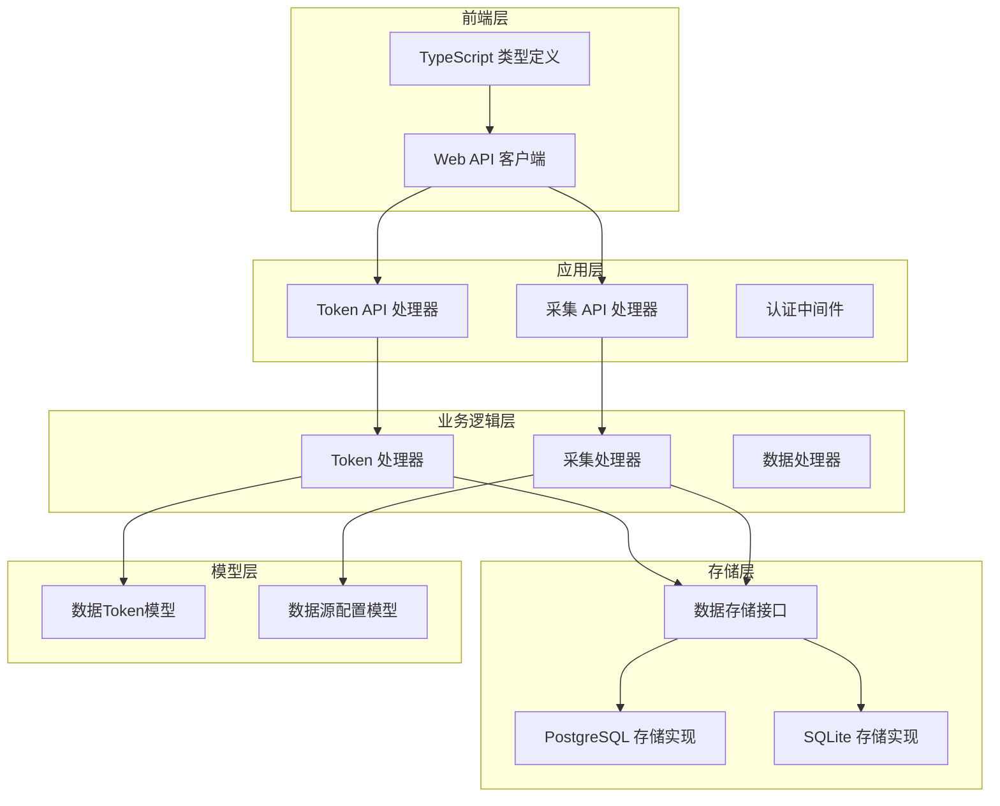
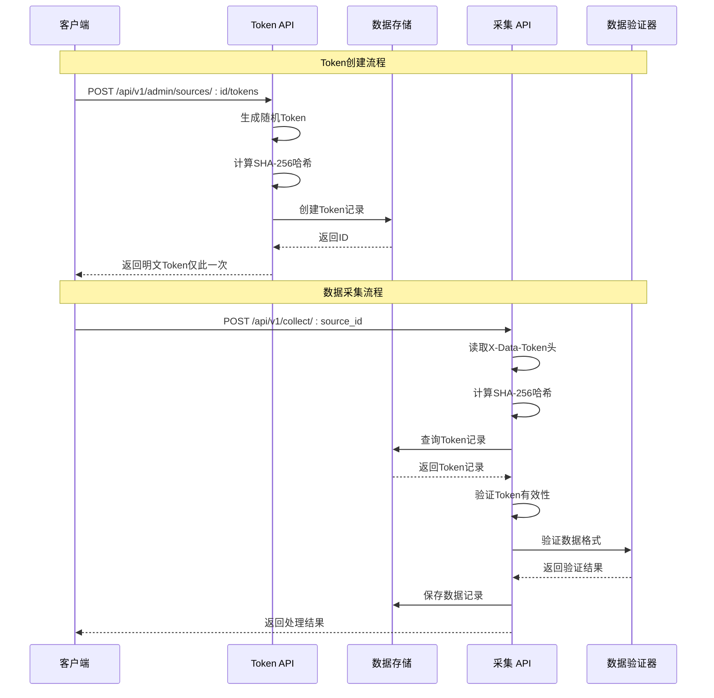
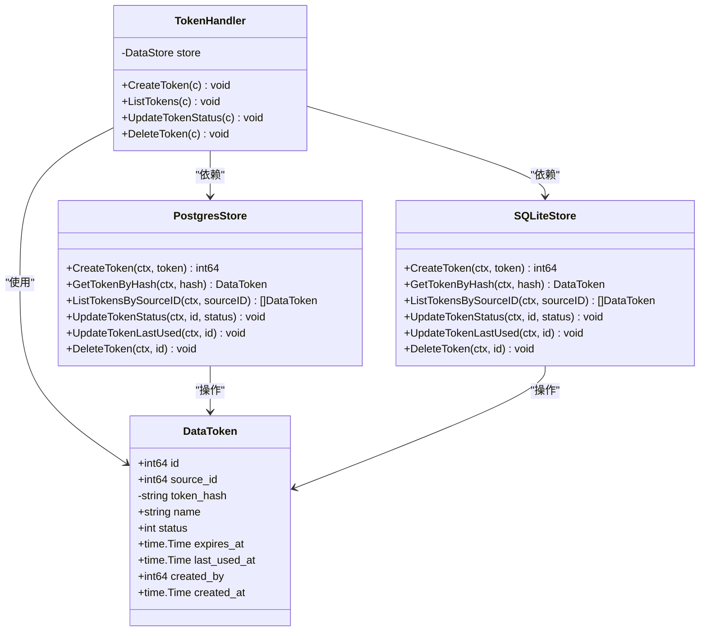
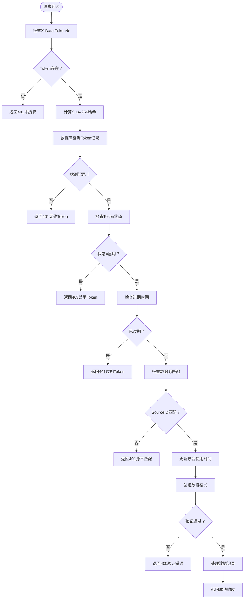
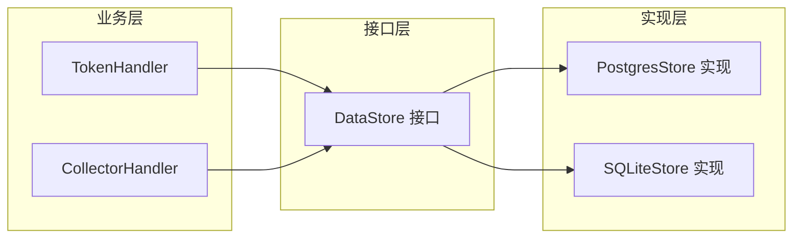

# Token管理

<cite>
**本文档引用的文件**
- [internal/model/token.go](file://internal/model/token.go)
- [internal/api/token.go](file://internal/api/token.go)
- [internal/storage/interface.go](file://internal/storage/interface.go)
- [internal/storage/postgres/token.go](file://internal/storage/postgres/token.go)
- [internal/storage/sqlite/token.go](file://internal/storage/sqlite/token.go)
- [internal/api/collector.go](file://internal/api/collector.go)
- [internal/collector/processor.go](file://internal/collector/processor.go)
- [internal/auth/middleware.go](file://internal/auth/middleware.go)
- [internal/auth/jwt.go](file://internal/auth/jwt.go)
- [web/src/api/token.ts](file://web/src/api/token.ts)
- [web/src/types/token.ts](file://web/src/types/token.ts)
- [configs/config.yaml](file://configs/config.yaml)
- [web/src/docs/api.md](file://web/src/docs/api.md)
</cite>

## 目录
1. [简介](#简介)
2. [项目结构](#项目结构)
3. [核心组件](#核心组件)
4. [架构概览](#架构概览)
5. [详细组件分析](#详细组件分析)
6. [依赖关系分析](#依赖关系分析)
7. [性能考量](#性能考量)
8. [故障排除指南](#故障排除指南)
9. [结论](#结论)
10. [附录](#附录)

## 简介
本文件详细阐述了DataCollector系统中的Token管理功能。Token作为数据采集流程中的核心安全机制，负责验证数据来源的合法性、控制访问权限以及追踪使用情况。本文档将深入解析Token模型设计、生成算法与安全机制、权限控制策略，并提供完整的API文档和使用示例。

## 项目结构
Token管理功能分布在多个层次中，采用清晰的分层架构设计：



**图表来源**
- [internal/api/token.go:1-180](file://internal/api/token.go#L1-L180)
- [internal/api/collector.go:1-278](file://internal/api/collector.go#L1-L278)
- [internal/storage/interface.go:1-57](file://internal/storage/interface.go#L1-L57)

**章节来源**
- [internal/api/token.go:1-180](file://internal/api/token.go#L1-L180)
- [internal/api/collector.go:1-278](file://internal/api/collector.go#L1-L278)
- [internal/storage/interface.go:1-57](file://internal/storage/interface.go#L1-L57)

## 核心组件
Token管理功能由以下核心组件构成：

### 数据模型
Token模型采用简洁而实用的设计，包含所有必要的属性用于安全验证和管理：

| 属性名 | 类型 | 描述 | 约束条件 |
|--------|------|------|----------|
| id | int64 | 唯一标识符 | 主键 |
| source_id | int64 | 关联的数据源ID | 外键约束 |
| token_hash | string | SHA-256哈希值 | 数据库索引，不暴露明文 |
| name | string | Token名称 | 必填，长度限制 |
| status | int | 状态：0禁用/1启用 | 默认启用 |
| expires_at | *time.Time | 过期时间 | nil表示永不过期 |
| last_used_at | *time.Time | 最后使用时间 | 自动更新 |
| created_by | int64 | 创建者ID | 外键关联用户 |
| created_at | time.Time | 创建时间 | 自动设置 |

### 生成算法
Token生成采用双重安全机制：
1. **随机字符串生成**：使用crypto/rand生成16字节随机数
2. **哈希存储**：使用SHA-256对明文Token进行哈希存储
3. **格式规范**：前缀"dt_" + 32位十六进制字符串

**章节来源**
- [internal/model/token.go:1-17](file://internal/model/token.go#L1-L17)
- [internal/api/token.go:49-62](file://internal/api/token.go#L49-L62)

## 架构概览
Token管理采用分层架构，确保职责分离和安全性：



**图表来源**
- [internal/api/token.go:64-120](file://internal/api/token.go#L64-L120)
- [internal/api/collector.go:29-138](file://internal/api/collector.go#L29-L138)

## 详细组件分析

### Token模型设计
Token模型采用最小必要原则设计，确保安全性和实用性：



**图表来源**
- [internal/model/token.go:5-16](file://internal/model/token.go#L5-L16)
- [internal/api/token.go:16-26](file://internal/api/token.go#L16-L26)
- [internal/storage/postgres/token.go:11-33](file://internal/storage/postgres/token.go#L11-L33)
- [internal/storage/sqlite/token.go:11-34](file://internal/storage/sqlite/token.go#L11-L34)

### Token生成算法与安全机制
Token生成采用多层安全防护：

#### 随机字符串生成
- 使用`crypto/rand`生成16字节（128位）随机数
- 添加"dt_"前缀形成最终Token格式
- 确保每个Token的唯一性和不可预测性

#### 哈希存储机制
- 使用SHA-256算法对明文Token进行哈希
- 数据库存储仅保存哈希值，不保存明文
- 支持快速查找和验证，同时保护敏感信息

#### 唯一性保证
- 基于128位随机数生成，理论碰撞概率极低
- 数据库层面可添加唯一约束进一步保证
- 建议在生产环境中添加数据库唯一索引

**章节来源**
- [internal/api/token.go:49-62](file://internal/api/token.go#L49-L62)
- [internal/storage/postgres/token.go:11-33](file://internal/storage/postgres/token.go#L11-L33)
- [internal/storage/sqlite/token.go:11-34](file://internal/storage/sqlite/token.go#L11-L34)

### 权限控制机制
Token权限控制采用多维度验证策略：



**图表来源**
- [internal/api/collector.go:34-75](file://internal/api/collector.go#L34-L75)

#### 数据源级别访问控制
- 每个Token严格绑定到特定数据源
- 采集请求必须与Token绑定的数据源一致
- 防止跨数据源的数据泄露和滥用

#### 操作权限限制
- Token状态控制：启用/禁用两种状态
- 时间限制：可设置过期时间，支持永不过期
- 使用追踪：自动记录最后使用时间和创建时间

**章节来源**
- [internal/api/collector.go:51-75](file://internal/api/collector.go#L51-L75)
- [internal/storage/postgres/token.go:35-64](file://internal/storage/postgres/token.go#L35-L64)
- [internal/storage/sqlite/token.go:36-65](file://internal/storage/sqlite/token.go#L36-L65)

### Token管理API文档

#### 创建Token
**请求**
- 方法：POST
- 路径：`/api/v1/admin/sources/{id}/tokens`
- 认证：需要JWT认证
- 请求体：
  ```json
  {
    "name": "string",
    "expires_at": "2024-12-31T23:59:59Z"
  }
  ```

**响应**
- 成功：返回包含明文Token的响应
- 失败：返回相应的错误码

#### 查询Token列表
**请求**
- 方法：GET
- 路径：`/api/v1/admin/sources/{id}/tokens`
- 认证：需要JWT认证

**响应**
- 返回Token元信息数组（不包含明文或哈希）

#### 更新Token状态
**请求**
- 方法：PUT
- 路径：`/api/v1/admin/tokens/{id}/status`
- 认证：需要JWT认证
- 请求体：
  ```json
  {
    "status": 0  // 0禁用, 1启用
  }
  ```

#### 删除Token
**请求**
- 方法：DELETE
- 路径：`/api/v1/admin/tokens/{id}`
- 认证：需要JWT认证

**章节来源**
- [internal/api/token.go:64-179](file://internal/api/token.go#L64-L179)
- [web/src/api/token.ts:1-19](file://web/src/api/token.ts#L1-L19)
- [web/src/types/token.ts:1-25](file://web/src/types/token.ts#L1-L25)

## 依赖关系分析

### 存储层抽象
Token管理采用接口抽象设计，支持多种数据库后端：



**图表来源**
- [internal/storage/interface.go:9-36](file://internal/storage/interface.go#L9-L36)
- [internal/storage/postgres/token.go:1-127](file://internal/storage/postgres/token.go#L1-L127)
- [internal/storage/sqlite/token.go:1-137](file://internal/storage/sqlite/token.go#L1-L137)

### 认证集成
Token管理与JWT认证系统深度集成：

| 组件 | 功能 | 集成点 |
|------|------|--------|
| JWT中间件 | 用户身份验证 | Token创建需要JWT认证 |
| Token处理器 | 使用JWT上下文中的用户信息 | 设置created_by字段 |
| 采集处理器 | 数据源权限验证 | 确保Token与数据源匹配 |

**章节来源**
- [internal/auth/middleware.go:19-63](file://internal/auth/middleware.go#L19-L63)
- [internal/api/token.go:79-84](file://internal/api/token.go#L79-L84)

## 性能考量
Token管理在设计时充分考虑了性能因素：

### 数据库优化
- Token查询基于token_hash建立索引
- 支持按数据源ID快速过滤
- 哈希存储减少存储空间占用

### 缓存策略
- 建议在高并发场景下实现Token缓存
- 可缓存常用Token的元信息
- 注意缓存失效策略与数据库一致性

### 并发控制
- SQLite实现使用互斥锁保证线程安全
- PostgreSQL实现支持并发访问
- 建议在高负载场景使用PostgreSQL

## 故障排除指南

### 常见问题及解决方案

#### Token创建失败
**症状**：创建Token时报错
**可能原因**：
- JWT认证失败
- 数据库连接异常
- Token名称重复

**解决方法**：
- 检查JWT令牌有效性
- 验证数据库连接状态
- 修改Token名称确保唯一性

#### 采集请求被拒绝
**症状**：数据采集返回401或403错误
**可能原因**：
- Token不存在或已过期
- Token状态为禁用
- 数据源ID不匹配
- 缺少X-Data-Token头

**解决方法**：
- 重新生成有效Token
- 检查Token状态和过期时间
- 确认请求URL中的数据源ID正确
- 在请求头中添加X-Data-Token

#### 数据验证失败
**症状**：采集请求返回400错误
**可能原因**：
- 数据格式不符合数据源配置
- 缺少必需字段
- 字段值超出限制

**解决方法**：
- 检查数据源的schema_config配置
- 验证数据格式和字段类型
- 确认必填字段完整性

**章节来源**
- [internal/api/collector.go:36-75](file://internal/api/collector.go#L36-L75)
- [internal/api/token.go:69-84](file://internal/api/token.go#L69-L84)

## 结论
DataCollector的Token管理功能通过精心设计的模型、安全的生成算法和严格的权限控制，为数据采集流程提供了可靠的安全保障。其分层架构设计确保了系统的可维护性和扩展性，而多数据库支持则满足了不同部署场景的需求。

关键优势包括：
- **安全性**：明文Token仅在创建时可见，后续通过哈希存储
- **灵活性**：支持过期时间设置和状态控制
- **可扩展性**：接口抽象设计支持多种存储后端
- **易用性**：清晰的API设计和完善的错误处理

建议在生产环境中：
- 使用强随机数生成器
- 定期轮换Token
- 监控Token使用情况
- 实施适当的备份策略

## 附录

### 使用示例

#### 创建Token
```javascript
// 前端调用示例
const response = await createToken(123, {
  name: "Production Token",
  expires_at: "2024-12-31T23:59:59Z"
});
console.log(response.token); // 仅在此时可见明文Token
```

#### 数据采集
```javascript
// 采集数据时使用Token
const headers = {
  "X-Data-Token": "dt_a1b2c3d4e5f6g7h8i9j0k1l2m3n4o5p6",
  "Content-Type": "application/json"
};
await fetch('/api/v1/collect/123', {
  method: 'POST',
  headers,
  body: JSON.stringify({ /* 数据内容 */ })
});
```

### 安全最佳实践

#### Token生命周期管理
- **定期轮换**：建议每6个月轮换一次Token
- **及时清理**：删除不再使用的Token
- **监控告警**：对异常使用模式进行监控

#### 配置建议
- **过期时间**：根据使用场景设置合理的过期时间
- **权限最小化**：为不同用途创建专门的Token
- **审计日志**：记录Token的创建、使用和删除操作

#### 部署注意事项
- **HTTPS传输**：确保Token在传输过程中的安全
- **环境隔离**：开发、测试、生产环境使用不同的Token
- **密钥管理**：妥善保管JWT签名密钥

**章节来源**
- [configs/config.yaml:23-30](file://configs/config.yaml#L23-L30)
- [web/src/docs/api.md:300-360](file://web/src/docs/api.md#L300-L360)