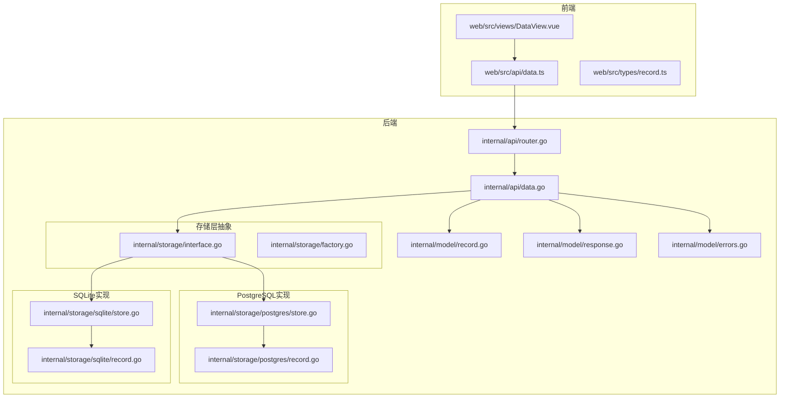
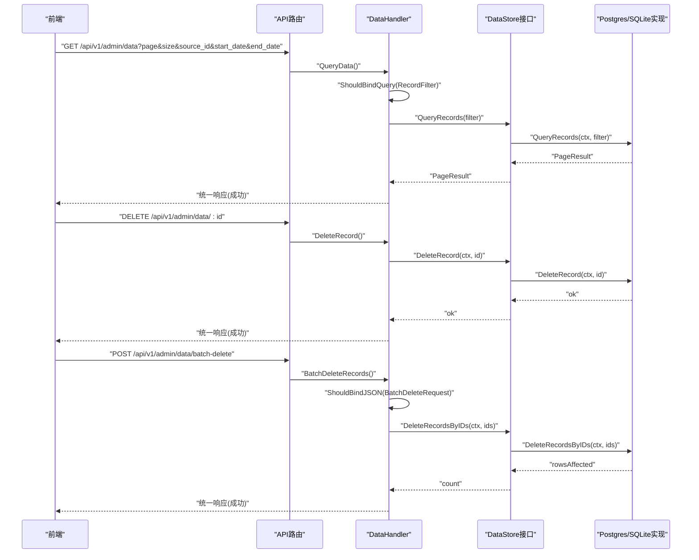
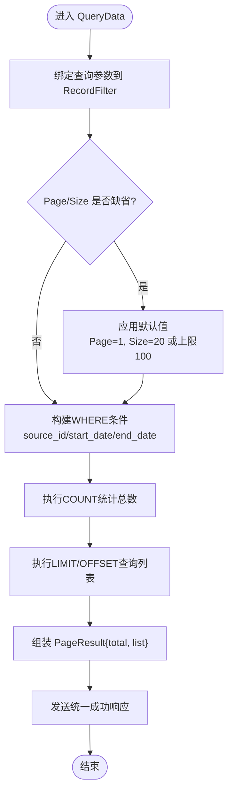
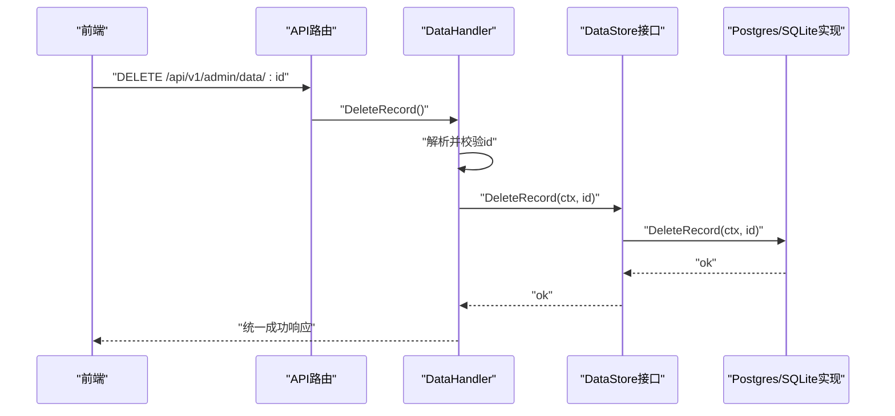
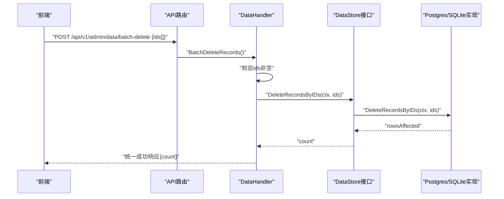
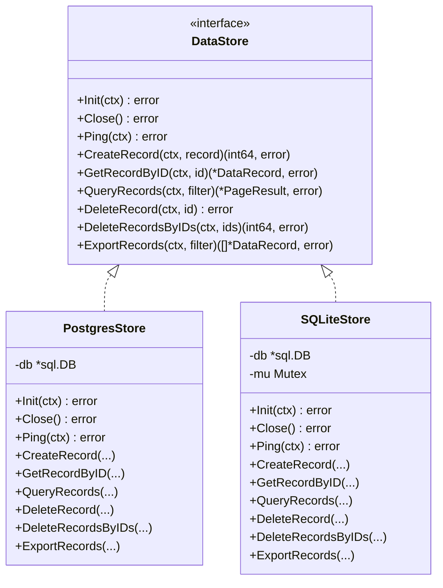
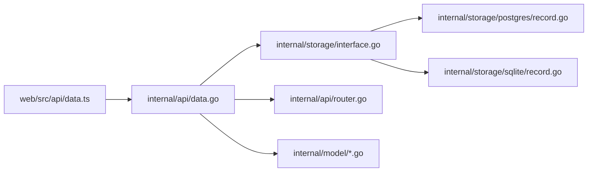

# 数据CRUD操作

<cite>
**本文引用的文件**
- [internal/api/data.go](file://internal/api/data.go)
- [internal/api/router.go](file://internal/api/router.go)
- [internal/model/record.go](file://internal/model/record.go)
- [internal/model/response.go](file://internal/model/response.go)
- [internal/model/errors.go](file://internal/model/errors.go)
- [internal/storage/interface.go](file://internal/storage/interface.go)
- [internal/storage/factory.go](file://internal/storage/factory.go)
- [internal/storage/postgres/record.go](file://internal/storage/postgres/record.go)
- [internal/storage/postgres/store.go](file://internal/storage/postgres/store.go)
- [internal/storage/sqlite/record.go](file://internal/storage/sqlite/record.go)
- [internal/storage/sqlite/store.go](file://internal/storage/sqlite/store.go)
- [internal/storage/migrations/001_init_postgres.sql](file://internal/storage/migrations/001_init_postgres.sql)
- [internal/storage/migrations/001_init_sqlite.sql](file://internal/storage/migrations/001_init_sqlite.sql)
- [web/src/api/data.ts](file://web/src/api/data.ts)
- [web/src/types/record.ts](file://web/src/types/record.ts)
- [web/src/views/DataView.vue](file://web/src/views/DataView.vue)
</cite>

## 目录
1. [简介](#简介)
2. [项目结构](#项目结构)
3. [核心组件](#核心组件)
4. [架构总览](#架构总览)
5. [详细组件分析](#详细组件分析)
6. [依赖分析](#依赖分析)
7. [性能考虑](#性能考虑)
8. [故障排查指南](#故障排查指南)
9. [结论](#结论)
10. [附录](#附录)

## 简介
本章节面向“数据CRUD操作”的完整实现与使用说明，覆盖以下内容：
- 数据查询：RecordFilter 过滤器、分页参数（Page、Size）、排序与条件查询
- 单条记录删除与批量删除：参数校验、事务处理与错误处理
- 完整的RESTful API接口文档：HTTP方法、URL模式、请求参数、响应格式与错误码
- 与存储层交互关系与数据流转过程
- 性能优化建议与最佳实践

## 项目结构
后端采用分层架构：API层负责路由与参数绑定；存储层抽象接口，分别提供PostgreSQL与SQLite实现；前端通过统一API封装进行调用。

**图表来源**
- [internal/api/router.go:14-115](file://internal/api/router.go#L14-L115)
- [internal/api/data.go:12-97](file://internal/api/data.go#L12-L97)
- [internal/model/record.go:19-32](file://internal/model/record.go#L19-L32)
- [internal/model/response.go:9-72](file://internal/model/response.go#L9-L72)
- [internal/storage/interface.go:9-56](file://internal/storage/interface.go#L9-L56)
- [internal/storage/factory.go:11-21](file://internal/storage/factory.go#L11-L21)
- [internal/storage/postgres/store.go:14-61](file://internal/storage/postgres/store.go#L14-L61)
- [internal/storage/postgres/record.go:65-182](file://internal/storage/postgres/record.go#L65-L182)
- [internal/storage/sqlite/store.go:17-86](file://internal/storage/sqlite/store.go#L17-L86)
- [internal/storage/sqlite/record.go:66-183](file://internal/storage/sqlite/record.go#L66-L183)

**章节来源**
- [internal/api/router.go:14-115](file://internal/api/router.go#L14-L115)
- [internal/api/data.go:12-97](file://internal/api/data.go#L12-L97)
- [internal/model/record.go:19-32](file://internal/model/record.go#L19-L32)
- [internal/model/response.go:9-72](file://internal/model/response.go#L9-L72)
- [internal/storage/interface.go:9-56](file://internal/storage/interface.go#L9-L56)
- [internal/storage/factory.go:11-21](file://internal/storage/factory.go#L11-L21)
- [internal/storage/postgres/store.go:14-61](file://internal/storage/postgres/store.go#L14-L61)
- [internal/storage/postgres/record.go:65-182](file://internal/storage/postgres/record.go#L65-L182)
- [internal/storage/sqlite/store.go:17-86](file://internal/storage/sqlite/store.go#L17-L86)
- [internal/storage/sqlite/record.go:66-183](file://internal/storage/sqlite/record.go#L66-L183)

## 核心组件
- API处理器：负责接收HTTP请求、参数绑定与校验、调用存储层、返回统一响应。
- 存储接口：定义数据记录的增删查等能力，屏蔽具体数据库差异。
- 具体实现：PostgreSQL与SQLite两套实现，均支持分页查询、条件过滤、单条与批量删除。
- 前端封装：提供查询、删除、批量删除与导出的API调用方法。

**章节来源**
- [internal/api/data.go:12-97](file://internal/api/data.go#L12-L97)
- [internal/storage/interface.go:9-56](file://internal/storage/interface.go#L9-L56)
- [internal/storage/postgres/record.go:65-182](file://internal/storage/postgres/record.go#L65-L182)
- [internal/storage/sqlite/record.go:66-183](file://internal/storage/sqlite/record.go#L66-L183)
- [web/src/api/data.ts:5-34](file://web/src/api/data.ts#L5-L34)

## 架构总览
后端通过Gin框架注册路由，Admin鉴权后访问数据管理接口；API层将查询参数绑定到RecordFilter，调用存储层接口完成数据查询与删除；存储层根据配置选择PostgreSQL或SQLite实现；前端通过封装的API与后端交互。

**图表来源**
- [internal/api/router.go:94-100](file://internal/api/router.go#L94-L100)
- [internal/api/data.go:29-96](file://internal/api/data.go#L29-L96)
- [internal/storage/interface.go:40-43](file://internal/storage/interface.go#L40-L43)
- [internal/storage/postgres/record.go:65-182](file://internal/storage/postgres/record.go#L65-L182)
- [internal/storage/sqlite/record.go:66-183](file://internal/storage/sqlite/record.go#L66-L183)

## 详细组件分析

### 数据查询（RecordFilter、分页、排序与条件）
- 参数绑定与默认值
  - 将查询字符串绑定到RecordFilter，自动设置Page默认值为1、Size默认值为20且上限100。
  - 支持按数据源ID、起止日期进行条件过滤。
- 排序与分页
  - 默认按创建时间降序排序。
  - 分页逻辑：LIMIT为Size，OFFSET为(Page-1)*Size。
- 存储层实现
  - PostgreSQL与SQLite实现一致：先COUNT统计总数，再LIMIT/OFFSET查询列表。
  - 条件拼接：动态构建WHERE子句，避免SQL注入。
- 响应格式
  - 使用统一响应结构，包含code、message、data(total与list)。

**图表来源**
- [internal/api/data.go:31-53](file://internal/api/data.go#L31-L53)
- [internal/model/record.go:19-26](file://internal/model/record.go#L19-L26)
- [internal/storage/postgres/record.go:65-152](file://internal/storage/postgres/record.go#L65-L152)
- [internal/storage/sqlite/record.go:66-147](file://internal/storage/sqlite/record.go#L66-L147)
- [internal/model/response.go:58-66](file://internal/model/response.go#L58-L66)

**章节来源**
- [internal/api/data.go:31-53](file://internal/api/data.go#L31-L53)
- [internal/model/record.go:19-26](file://internal/model/record.go#L19-L26)
- [internal/storage/postgres/record.go:65-152](file://internal/storage/postgres/record.go#L65-L152)
- [internal/storage/sqlite/record.go:66-147](file://internal/storage/sqlite/record.go#L66-L147)
- [internal/model/response.go:58-66](file://internal/model/response.go#L58-L66)

### 单条记录删除
- 参数校验
  - 从路径参数解析ID并校验类型转换是否成功。
- 存储层实现
  - PostgreSQL与SQLite均提供DeleteRecord，直接按ID删除。
- 错误处理
  - 失败时返回统一错误响应，HTTP状态为500。

**图表来源**
- [internal/api/router.go:98](file://internal/api/router.go#L98)
- [internal/api/data.go:55-70](file://internal/api/data.go#L55-L70)
- [internal/storage/interface.go:41](file://internal/storage/interface.go#L41)
- [internal/storage/postgres/record.go:154-159](file://internal/storage/postgres/record.go#L154-L159)
- [internal/storage/sqlite/record.go:149-157](file://internal/storage/sqlite/record.go#L149-L157)

**章节来源**
- [internal/api/data.go:55-70](file://internal/api/data.go#L55-L70)
- [internal/storage/postgres/record.go:154-159](file://internal/storage/postgres/record.go#L154-L159)
- [internal/storage/sqlite/record.go:149-157](file://internal/storage/sqlite/record.go#L149-L157)

### 批量删除
- 请求体校验
  - 校验JSON请求体中ids字段是否存在且非空。
- 存储层实现
  - PostgreSQL与SQLite均提供DeleteRecordsByIDs，使用IN子句批量删除。
  - 返回受影响的行数作为删除数量。
- 错误处理
  - 失败时返回统一错误响应，HTTP状态为500。

**图表来源**
- [internal/api/router.go:99](file://internal/api/router.go#L99)
- [internal/api/data.go:72-96](file://internal/api/data.go#L72-L96)
- [internal/storage/interface.go:42-43](file://internal/storage/interface.go#L42-L43)
- [internal/storage/postgres/record.go:161-182](file://internal/storage/postgres/record.go#L161-L182)
- [internal/storage/sqlite/record.go:159-183](file://internal/storage/sqlite/record.go#L159-L183)

**章节来源**
- [internal/api/data.go:72-96](file://internal/api/data.go#L72-L96)
- [internal/storage/postgres/record.go:161-182](file://internal/storage/postgres/record.go#L161-L182)
- [internal/storage/sqlite/record.go:159-183](file://internal/storage/sqlite/record.go#L159-L183)

### RESTful API接口文档
- 查询数据记录
  - 方法：GET
  - 路径：/api/v1/admin/data
  - 查询参数：
    - page：页码，默认1
    - size：每页条数，默认20，最大100
    - source_id：数据源ID（可选）
    - start_date：开始日期（可选，格式YYYY-MM-DD）
    - end_date：结束日期（可选，格式YYYY-MM-DD）
  - 成功响应：包含total与list字段的分页结果
  - 错误码：参数错误（4000）、内部错误（9001）

- 删除单条记录
  - 方法：DELETE
  - 路径：/api/v1/admin/data/:id
  - 路径参数：id（整型）
  - 成功响应：成功消息
  - 错误码：参数缺失（9000）、内部错误（9001）

- 批量删除记录
  - 方法：POST
  - 路径：/api/v1/admin/data/batch-delete
  - 请求体：ids数组（至少一个ID）
  - 成功响应：包含删除数量的提示
  - 错误码：参数缺失（9000）、内部错误（9001）

- 响应格式
  - 统一结构：code、message、data（可选）、errors（可选）
  - 成功：code=0；失败：对应错误码与消息

**章节来源**
- [internal/api/router.go:94-100](file://internal/api/router.go#L94-L100)
- [internal/api/data.go:29-96](file://internal/api/data.go#L29-L96)
- [internal/model/response.go:9-72](file://internal/model/response.go#L9-L72)
- [internal/model/errors.go:25-38](file://internal/model/errors.go#L25-L38)

### 与存储层的交互关系与数据流转
- 工厂创建存储实例
  - 根据配置选择驱动：sqlite或postgres
- 接口契约
  - DataStore定义了查询、删除等能力，确保API层与存储实现解耦
- 实现细节
  - PostgreSQL与SQLite均实现分页查询、条件过滤、单条与批量删除
  - SQLite在写入侧使用互斥锁保证并发安全

**图表来源**
- [internal/storage/interface.go:9-56](file://internal/storage/interface.go#L9-L56)
- [internal/storage/factory.go:11-21](file://internal/storage/factory.go#L11-L21)
- [internal/storage/postgres/store.go:14-61](file://internal/storage/postgres/store.go#L14-L61)
- [internal/storage/sqlite/store.go:17-86](file://internal/storage/sqlite/store.go#L17-L86)

**章节来源**
- [internal/storage/factory.go:11-21](file://internal/storage/factory.go#L11-L21)
- [internal/storage/interface.go:9-56](file://internal/storage/interface.go#L9-L56)
- [internal/storage/postgres/store.go:14-61](file://internal/storage/postgres/store.go#L14-L61)
- [internal/storage/sqlite/store.go:17-86](file://internal/storage/sqlite/store.go#L17-L86)

### 前端集成与使用场景
- 前端API封装
  - 提供queryData、deleteRecord、batchDeleteRecords、exportData四个方法
  - queryData使用GET携带分页与过滤参数
  - deleteRecord使用DELETE删除单条
  - batchDeleteRecords使用POST提交ids数组
- 页面行为
  - DataView中支持筛选（数据源、起止日期）、分页、展开查看数据详情、单条删除与批量删除
  - 导出CSV/JSON时根据后端响应头提取文件名

**章节来源**
- [web/src/api/data.ts:5-34](file://web/src/api/data.ts#L5-L34)
- [web/src/types/record.ts:11-17](file://web/src/types/record.ts#L11-L17)
- [web/src/views/DataView.vue:109-243](file://web/src/views/DataView.vue#L109-L243)

## 依赖分析
- 组件耦合
  - API层仅依赖DataStore接口，不关心具体实现，降低耦合度
  - 存储层通过工厂按配置选择实现，便于扩展新驱动
- 外部依赖
  - Gin用于路由与HTTP处理
  - PostgreSQL/SQLite驱动用于数据库访问
  - 前端通过封装的API模块与后端通信

**图表来源**
- [internal/api/data.go:12-22](file://internal/api/data.go#L12-L22)
- [internal/storage/interface.go:9-56](file://internal/storage/interface.go#L9-L56)
- [internal/storage/postgres/record.go:65-182](file://internal/storage/postgres/record.go#L65-L182)
- [internal/storage/sqlite/record.go:66-183](file://internal/storage/sqlite/record.go#L66-L183)
- [internal/api/router.go:14-115](file://internal/api/router.go#L14-L115)
- [web/src/api/data.ts:1-35](file://web/src/api/data.ts#L1-L35)

**章节来源**
- [internal/api/data.go:12-22](file://internal/api/data.go#L12-L22)
- [internal/storage/interface.go:9-56](file://internal/storage/interface.go#L9-L56)
- [internal/storage/postgres/record.go:65-182](file://internal/storage/postgres/record.go#L65-L182)
- [internal/storage/sqlite/record.go:66-183](file://internal/storage/sqlite/record.go#L66-L183)
- [internal/api/router.go:14-115](file://internal/api/router.go#L14-L115)
- [web/src/api/data.ts:1-35](file://web/src/api/data.ts#L1-L35)

## 性能考虑
- 分页与索引
  - 查询按created_at倒序，建议在created_at上建立索引（已迁移脚本包含）
  - PostgreSQL与SQLite迁移脚本均包含相应索引，有利于COUNT与LIMIT查询
- 并发与锁
  - SQLite写入侧使用互斥锁，限制同时只有一个写操作，避免竞争
  - PostgreSQL未显式加锁，依赖数据库事务与连接池
- 连接池
  - PostgreSQL设置最大连接数与空闲连接数
  - SQLite设置最大连接数为1，并启用WAL与busy_timeout
- 查询优化建议
  - 对高频过滤字段（如source_id、token_id）建立索引
  - 控制每页大小，避免超大页导致内存压力
  - 批量删除时尽量减少单次请求的ids数量，避免超长IN列表

**章节来源**
- [internal/storage/migrations/001_init_postgres.sql:71-91](file://internal/storage/migrations/001_init_postgres.sql#L71-L91)
- [internal/storage/migrations/001_init_sqlite.sql:77-97](file://internal/storage/migrations/001_init_sqlite.sql#L77-L97)
- [internal/storage/postgres/store.go:29-33](file://internal/storage/postgres/store.go#L29-L33)
- [internal/storage/sqlite/store.go:39-54](file://internal/storage/sqlite/store.go#L39-L54)

## 故障排查指南
- 常见错误码
  - 参数错误（4000）：查询参数绑定失败或非法
  - 参数缺失（9000）：删除请求缺少必要参数
  - 内部错误（9001）：数据库操作异常
- 排查步骤
  - 检查请求URL与方法是否正确
  - 校验查询参数范围（page≥1，1≤size≤100）
  - 确认删除ID格式与存在性
  - 查看后端日志定位具体SQL错误
- 前端提示
  - 使用Element Plus的消息与确认框，明确用户操作反馈

**章节来源**
- [internal/model/errors.go:25-38](file://internal/model/errors.go#L25-L38)
- [internal/api/data.go:33-36](file://internal/api/data.go#L33-L36)
- [internal/api/data.go:58-62](file://internal/api/data.go#L58-L62)
- [internal/api/data.go:76-84](file://internal/api/data.go#L76-L84)
- [web/src/views/DataView.vue:186-220](file://web/src/views/DataView.vue#L186-L220)

## 结论
本实现以清晰的分层架构与统一的响应格式，提供了稳定的数据CRUD能力。查询支持灵活的条件过滤与分页，删除支持单条与批量操作，前后端协作顺畅。通过索引与连接池配置，满足常见业务场景下的性能需求。建议在生产环境中持续关注索引策略与批量操作的规模控制。

## 附录
- 数据库初始化脚本
  - PostgreSQL初始化脚本包含表结构与索引
  - SQLite初始化脚本包含表结构与索引
- 前端类型定义
  - DataRecord与RecordFilter类型与后端保持一致

**章节来源**
- [internal/storage/migrations/001_init_postgres.sql:1-91](file://internal/storage/migrations/001_init_postgres.sql#L1-L91)
- [internal/storage/migrations/001_init_sqlite.sql:1-97](file://internal/storage/migrations/001_init_sqlite.sql#L1-L97)
- [web/src/types/record.ts:1-18](file://web/src/types/record.ts#L1-L18)