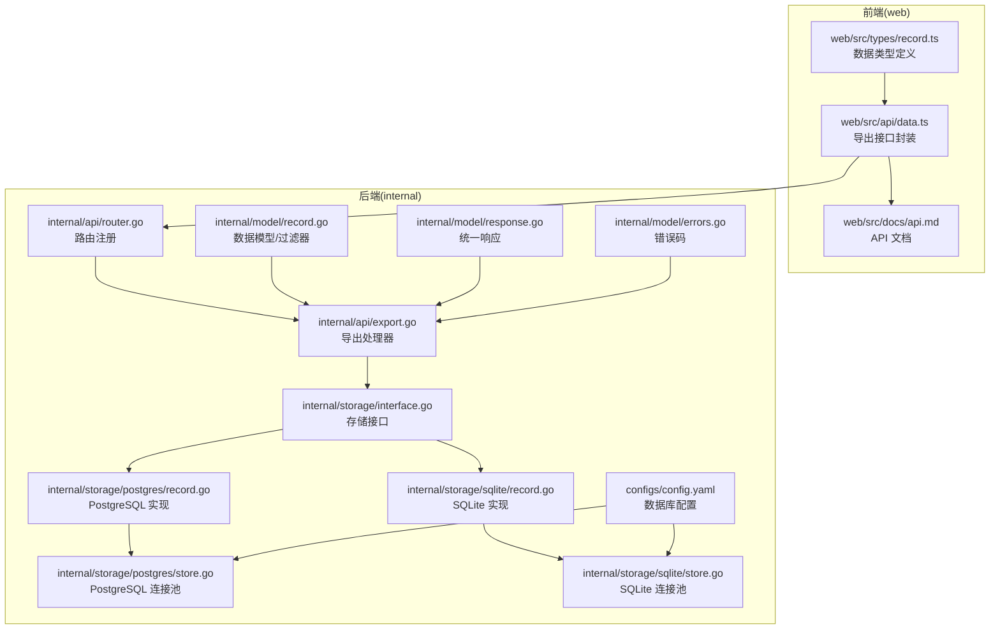
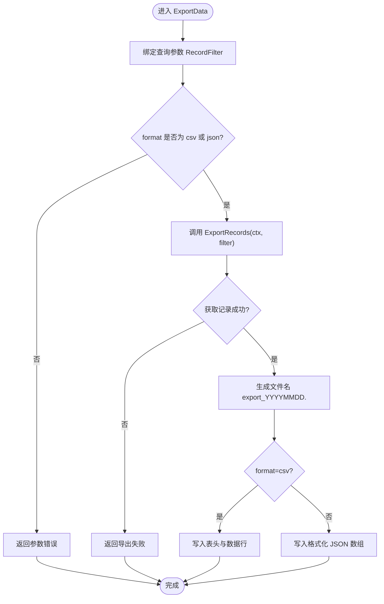
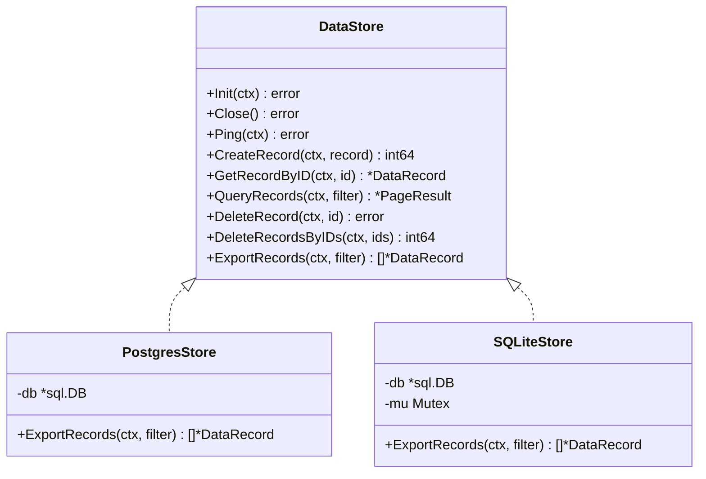
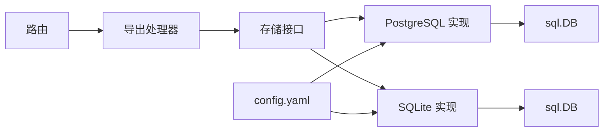

# 数据导出功能

<cite>
**本文引用的文件**
- [export.go](file://internal/api/export.go)
- [router.go](file://internal/api/router.go)
- [record.go](file://internal/model/record.go)
- [response.go](file://internal/model/response.go)
- [errors.go](file://internal/model/errors.go)
- [interface.go](file://internal/storage/interface.go)
- [record.go](file://internal/storage/postgres/record.go)
- [record.go](file://internal/storage/sqlite/record.go)
- [store.go](file://internal/storage/postgres/store.go)
- [store.go](file://internal/storage/sqlite/store.go)
- [data.ts](file://web/src/api/data.ts)
- [record.ts](file://web/src/types/record.ts)
- [api.md](file://web/src/docs/api.md)
- [config.yaml](file://configs/config.yaml)
</cite>

## 目录
1. [简介](#简介)
2. [项目结构](#项目结构)
3. [核心组件](#核心组件)
4. [架构概览](#架构概览)
5. [详细组件分析](#详细组件分析)
6. [依赖分析](#依赖分析)
7. [性能考虑](#性能考虑)
8. [故障排除指南](#故障排除指南)
9. [结论](#结论)
10. [附录](#附录)

## 简介
本文件全面介绍数据导出功能的设计与实现，重点覆盖以下方面：
- CSV/JSON 格式的导出机制、数据转换与格式化、编码处理
- 批量导出策略与性能优化（分批处理、内存管理、超大数据集处理）
- 导出过滤条件与查询参数的处理方式
- 完整的 API 接口文档（请求格式、响应处理、错误处理）
- 使用示例与性能调优建议
- 导出文件格式规范与兼容性说明

## 项目结构
数据导出功能涉及后端 API 层、存储层以及前端调用层，整体结构如下：



**图表来源**
- [export.go:1-111](file://internal/api/export.go#L1-L111)
- [router.go:1-116](file://internal/api/router.go#L1-L116)
- [record.go:1-33](file://internal/model/record.go#L1-L33)
- [response.go:1-72](file://internal/model/response.go#L1-L72)
- [errors.go:1-84](file://internal/model/errors.go#L1-L84)
- [interface.go:1-57](file://internal/storage/interface.go#L1-L57)
- [record.go:1-249](file://internal/storage/postgres/record.go#L1-L249)
- [record.go:1-246](file://internal/storage/sqlite/record.go#L1-L246)
- [store.go:1-61](file://internal/storage/postgres/store.go#L1-L61)
- [store.go:1-86](file://internal/storage/sqlite/store.go#L1-L86)
- [data.ts:1-35](file://web/src/api/data.ts#L1-L35)
- [record.ts:1-18](file://web/src/types/record.ts#L1-L18)
- [api.md:499-514](file://web/src/docs/api.md#L499-L514)
- [config.yaml:11-22](file://configs/config.yaml#L11-L22)

**章节来源**
- [export.go:1-111](file://internal/api/export.go#L1-L111)
- [router.go:102-104](file://internal/api/router.go#L102-L104)
- [record.go:19-26](file://internal/model/record.go#L19-L26)
- [interface.go:43-43](file://internal/storage/interface.go#L43-L43)

## 核心组件
- 导出处理器：负责接收导出请求、解析查询参数、调用存储层导出、按格式输出文件。
- 存储接口与实现：抽象出 ExportRecords 方法，PostgreSQL 与 SQLite 均实现该方法。
- 数据模型与过滤器：定义 RecordFilter 用于筛选导出范围。
- 统一响应与错误码：标准化错误返回，便于前端处理。

**章节来源**
- [export.go:16-26](file://internal/api/export.go#L16-L26)
- [interface.go:43-43](file://internal/storage/interface.go#L43-L43)
- [record.go:19-26](file://internal/model/record.go#L19-L26)
- [response.go:58-71](file://internal/model/response.go#L58-L71)
- [errors.go:25-38](file://internal/model/errors.go#L25-L38)

## 架构概览
导出流程从路由进入，经由导出处理器绑定查询参数并校验格式，随后调用存储层的 ExportRecords 获取全量记录，最后根据格式选择 CSV 或 JSON 输出。

```mermaid
sequenceDiagram
participant Client as "客户端"
participant Router as "路由(/admin/data/export)"
participant Handler as "导出处理器"
participant Store as "存储接口"
participant Impl as "PostgreSQL/SQLite 实现"
Client->>Router : GET /api/v1/admin/data/export?format=csv&source_id=1&start_date=...&end_date=...
Router->>Handler : 调用 ExportData
Handler->>Handler : 绑定查询参数 RecordFilter
Handler->>Handler : 校验 format(csv/json)
Handler->>Store : ExportRecords(ctx, filter)
Store->>Impl : 调用具体实现
Impl-->>Store : 返回 []*DataRecord
Store-->>Handler : 返回记录列表
alt format=csv
Handler->>Client : Content-Type : text/csv<br/>Content-Disposition : attachment; filename="export_*.csv"
Handler->>Client : 写入表头与数据行
else format=json
Handler->>Client : Content-Type : application/json<br/>Content-Disposition : attachment; filename="export_*.json"
Handler->>Client : 写入格式化 JSON 数组
end
```

**图表来源**
- [router.go:102-104](file://internal/api/router.go#L102-L104)
- [export.go:30-61](file://internal/api/export.go#L30-L61)
- [interface.go:43-43](file://internal/storage/interface.go#L43-L43)
- [record.go:184-248](file://internal/storage/postgres/record.go#L184-L248)
- [record.go:185-245](file://internal/storage/sqlite/record.go#L185-L245)

## 详细组件分析

### 导出处理器（ExportHandler）
- 职责
  - 绑定并校验查询参数（RecordFilter）
  - 校验导出格式（format），仅支持 csv 与 json
  - 调用存储层 ExportRecords 获取全量记录
  - 根据格式输出文件（CSV/JSON），设置合适的响应头
- 数据转换与格式化
  - CSV：写入固定表头；数值字段转字符串；JSON 字段转字符串
  - JSON：直接序列化记录数组，缩进格式化
- 编码处理
  - CSV 使用默认编码；JSON 使用 UTF-8 编码
  - 文件名包含日期前缀，扩展名由 format 决定



**图表来源**
- [export.go:30-61](file://internal/api/export.go#L30-L61)
- [export.go:63-97](file://internal/api/export.go#L63-L97)
- [export.go:99-110](file://internal/api/export.go#L99-L110)

**章节来源**
- [export.go:28-61](file://internal/api/export.go#L28-L61)
- [export.go:63-97](file://internal/api/export.go#L63-L97)
- [export.go:99-110](file://internal/api/export.go#L99-L110)

### 存储层接口与实现
- 接口定义
  - ExportRecords(ctx, filter) ([]*DataRecord, error)
- PostgreSQL 实现
  - 构建 where 条件（source_id、start_date、end_date）
  - 使用 ORDER BY created_at DESC 排序
  - 全量扫描返回，不做分页
- SQLite 实现
  - 逻辑与 PostgreSQL 一致，使用互斥锁保证并发安全



**图表来源**
- [interface.go:9-56](file://internal/storage/interface.go#L9-L56)
- [record.go:184-248](file://internal/storage/postgres/record.go#L184-L248)
- [record.go:185-245](file://internal/storage/sqlite/record.go#L185-L245)
- [store.go:14-34](file://internal/storage/postgres/store.go#L14-L34)
- [store.go:17-56](file://internal/storage/sqlite/store.go#L17-L56)

**章节来源**
- [interface.go:43-43](file://internal/storage/interface.go#L43-L43)
- [record.go:184-248](file://internal/storage/postgres/record.go#L184-L248)
- [record.go:185-245](file://internal/storage/sqlite/record.go#L185-L245)

### 数据模型与过滤器
- DataRecord
  - 字段：id、source_id、token_id、data(JSON Raw)、ip_address、user_agent、created_at
- RecordFilter
  - 字段：source_id、start_date、end_date、page、size
  - 用于分页查询；导出时仅使用 source_id、start_date、end_date

**章节来源**
- [record.go:8-17](file://internal/model/record.go#L8-L17)
- [record.go:19-26](file://internal/model/record.go#L19-L26)

### 统一响应与错误处理
- 统一响应结构：code、message、data、errors
- 错误码
  - CodeQueryParamError：查询参数错误
  - CodeExportFailed：导出失败
- 错误消息映射：通过 GetErrorMessage(code) 获取默认消息

**章节来源**
- [response.go:9-15](file://internal/model/response.go#L9-L15)
- [response.go:58-71](file://internal/model/response.go#L58-L71)
- [errors.go:25-38](file://internal/model/errors.go#L25-L38)
- [errors.go:77-83](file://internal/model/errors.go#L77-L83)

### 前端集成与调用
- 导出接口封装：exportData(params) 返回 { blob, filename }
- 查询参数：format、source_id、start_date、end_date
- 前端类型：DataRecord、RecordFilter

**章节来源**
- [data.ts:17-34](file://web/src/api/data.ts#L17-L34)
- [record.ts:1-18](file://web/src/types/record.ts#L1-L18)
- [api.md:499-514](file://web/src/docs/api.md#L499-L514)

## 依赖分析
- 路由依赖：/api/v1/admin/data/export -> ExportHandler.ExportData
- 处理器依赖：ExportHandler -> DataStore.ExportRecords
- 存储实现：PostgreSQL/SQLite -> sql.DB
- 配置依赖：config.yaml -> 数据库驱动选择（sqlite/postgres）



**图表来源**
- [router.go:102-104](file://internal/api/router.go#L102-L104)
- [export.go:17-26](file://internal/api/export.go#L17-L26)
- [interface.go:9-56](file://internal/storage/interface.go#L9-L56)
- [record.go:14-34](file://internal/storage/postgres/record.go#L14-L34)
- [record.go:24-56](file://internal/storage/sqlite/store.go#L24-L56)
- [config.yaml:11-22](file://configs/config.yaml#L11-L22)

**章节来源**
- [router.go:102-104](file://internal/api/router.go#L102-L104)
- [export.go:17-26](file://internal/api/export.go#L17-L26)
- [config.yaml:11-22](file://configs/config.yaml#L11-L22)

## 性能考虑
- 当前实现特点
  - 导出不进行分页，直接全量扫描返回，适合中小规模数据
  - CSV/JSON 输出均为一次性写入，未采用流式分块写入
- 潜在性能问题
  - 大数据量可能导致内存占用高、响应时间长
  - 导出期间数据库压力较大，可能影响其他查询
- 优化建议
  - 分批导出（服务端分页 + 流式写入）
    - 在存储层增加分页参数，改为分批查询与写入
    - 使用 io.Pipe 或分块缓冲减少内存峰值
  - 并发控制
    - 限制同时导出任务数量，避免数据库连接耗尽
    - 对 SQLite 使用互斥锁确保一致性
  - 连接池优化
    - PostgreSQL：合理设置最大连接数与空闲连接数
    - SQLite：WAL 模式与 busy_timeout 已启用，可进一步评估并发需求
  - 压缩与断点续传
    - 提供 gzip 压缩导出选项
    - 支持断点续传（基于时间范围或游标）
  - 前端体验
    - 显示导出进度与预计时间
    - 提供导出队列与通知

[本节为通用性能指导，不直接分析具体文件，故无“章节来源”]

## 故障排除指南
- 常见错误与处理
  - 查询参数错误：format 非 csv/json 或参数绑定失败
    - 返回 CodeQueryParamError，检查请求参数
  - 导出失败：存储层查询异常或写入失败
    - 返回 CodeExportFailed，检查数据库连接与权限
- 建议排查步骤
  - 确认 JWT 认证有效且具备管理员权限
  - 检查数据库驱动配置（sqlite/postgres）
  - 验证过滤条件（source_id、start_date、end_date）
  - 查看服务器日志定位具体错误

**章节来源**
- [export.go:33-36](file://internal/api/export.go#L33-L36)
- [export.go:47-49](file://internal/api/export.go#L47-L49)
- [errors.go:25-38](file://internal/model/errors.go#L25-L38)
- [response.go:63-66](file://internal/model/response.go#L63-L66)

## 结论
当前导出功能实现了 CSV/JSON 两种格式的快速导出，满足日常数据分析与备份场景的基本需求。对于超大规模数据，建议引入分批导出、流式写入与并发控制等优化措施，以提升稳定性与用户体验。

[本节为总结性内容，不直接分析具体文件，故无“章节来源”]

## 附录

### API 接口文档（导出）
- 路径与方法
  - GET /api/v1/admin/data/export
- 认证
  - 需要 JWT 认证（Authorization: Bearer <token>）
- 查询参数
  - format: 导出格式，csv 或 json，默认 csv
  - source_id: 数据源 ID（可选）
  - start_date: 开始日期（YYYY-MM-DD，可选）
  - end_date: 结束日期（YYYY-MM-DD，可选）
- 响应
  - Content-Type: text/csv 或 application/json
  - Content-Disposition: attachment; filename="export_YYYYMMDD.csv/json"
  - CSV：固定表头 id,source_id,data,ip_address,user_agent,created_at
  - JSON：格式化缩进的 JSON 数组
- 错误码
  - 400：CodeQueryParamError（参数错误）
  - 500：CodeExportFailed（导出失败）

**章节来源**
- [router.go:102-104](file://internal/api/router.go#L102-L104)
- [export.go:30-61](file://internal/api/export.go#L30-L61)
- [export.go:63-97](file://internal/api/export.go#L63-L97)
- [export.go:99-110](file://internal/api/export.go#L99-L110)
- [api.md:499-514](file://web/src/docs/api.md#L499-L514)
- [errors.go:25-38](file://internal/model/errors.go#L25-L38)

### 数据模型与类型定义
- DataRecord
  - 字段：id、source_id、token_id、data(JSON Raw)、ip_address、user_agent、created_at
- RecordFilter
  - 字段：source_id、start_date、end_date、page、size
- 前端类型
  - DataRecord、RecordFilter（与后端保持一致）

**章节来源**
- [record.go:8-17](file://internal/model/record.go#L8-L17)
- [record.go:19-26](file://internal/model/record.go#L19-L26)
- [record.ts:1-18](file://web/src/types/record.ts#L1-L18)

### 数据库配置与驱动
- 驱动选择
  - sqlite 或 postgres
- SQLite
  - WAL 模式、busy_timeout 已启用
  - 连接池：MaxOpenConns=1，MaxIdleConns=1
- PostgreSQL
  - 连接池：MaxOpenConns=25，MaxIdleConns=5

**章节来源**
- [config.yaml:11-22](file://configs/config.yaml#L11-L22)
- [store.go:39-53](file://internal/storage/sqlite/store.go#L39-L53)
- [store.go:29-33](file://internal/storage/postgres/store.go#L29-L33)

### 使用示例
- 导出 CSV（前端）
  - 调用 exportData({ format: 'csv', source_id: 1, start_date: '2024-01-01', end_date: '2024-12-31' })
  - 自动解析 Content-Disposition 获取文件名并触发下载
- 导出 JSON（前端）
  - 调用 exportData({ format: 'json' }) 导出全量数据
- 后端调用
  - GET /api/v1/admin/data/export?format=csv&source_id=1&start_date=2024-01-01&end_date=2024-12-31

**章节来源**
- [data.ts:17-34](file://web/src/api/data.ts#L17-L34)
- [api.md:499-514](file://web/src/docs/api.md#L499-L514)

### 导出文件格式规范与兼容性
- CSV
  - 编码：默认编码（建议客户端以 UTF-8 打开）
  - 表头：id,source_id,data,ip_address,user_agent,created_at
  - 时间格式：RFC3339
  - JSON 字段：导出为字符串形式
- JSON
  - 编码：UTF-8
  - 格式：缩进格式化，便于人工阅读
- 兼容性
  - Excel/Numbers/WPS：建议先以 UTF-8 保存再打开
  - 大文件：建议压缩后再传输或分卷导出

[本节为通用规范说明，不直接分析具体文件，故无“章节来源”]