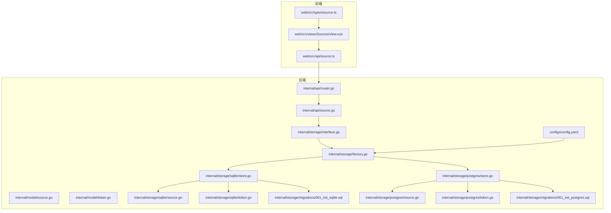
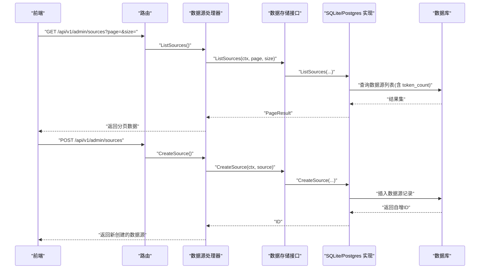
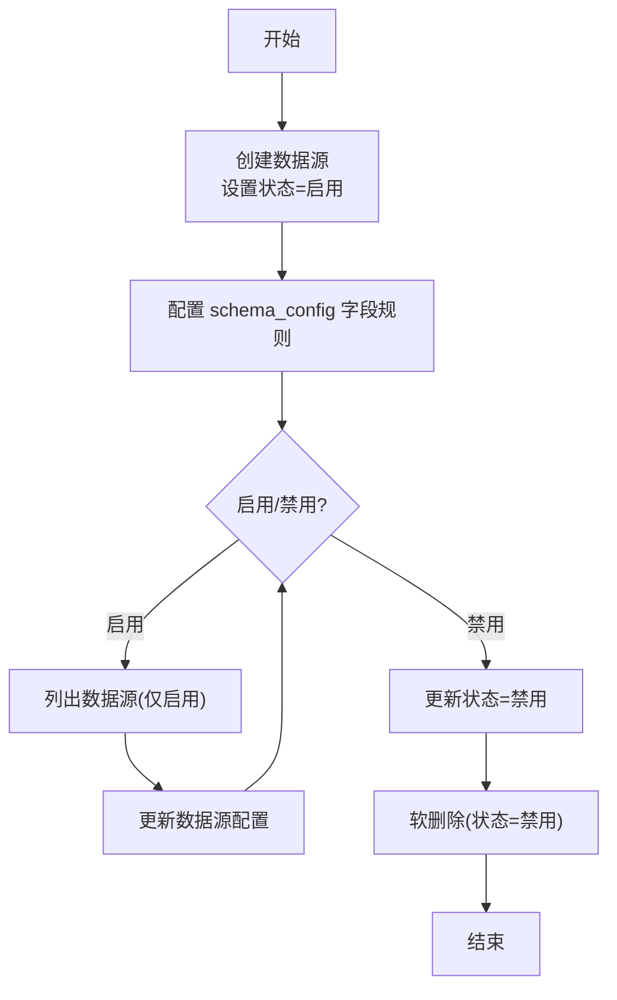
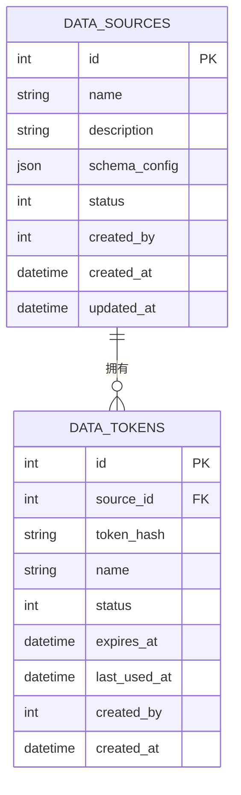
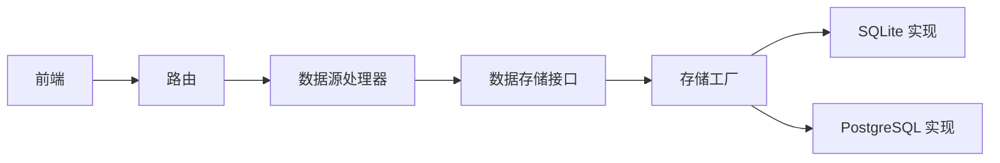

# 数据源管理

<cite>
**本文引用的文件**
- [internal/model/source.go](file://internal/model/source.go)
- [internal/model/token.go](file://internal/model/token.go)
- [internal/api/source.go](file://internal/api/source.go)
- [internal/api/router.go](file://internal/api/router.go)
- [internal/storage/interface.go](file://internal/storage/interface.go)
- [internal/storage/factory.go](file://internal/storage/factory.go)
- [internal/storage/sqlite/store.go](file://internal/storage/sqlite/store.go)
- [internal/storage/sqlite/source.go](file://internal/storage/sqlite/source.go)
- [internal/storage/sqlite/token.go](file://internal/storage/sqlite/token.go)
- [internal/storage/postgres/store.go](file://internal/storage/postgres/store.go)
- [internal/storage/postgres/source.go](file://internal/storage/postgres/source.go)
- [internal/storage/postgres/token.go](file://internal/storage/postgres/token.go)
- [internal/storage/migrations/001_init_sqlite.sql](file://internal/storage/migrations/001_init_sqlite.sql)
- [internal/storage/migrations/001_init_postgres.sql](file://internal/storage/migrations/001_init_postgres.sql)
- [configs/config.yaml](file://configs/config.yaml)
- [web/src/types/source.ts](file://web/src/types/source.ts)
- [web/src/api/source.ts](file://web/src/api/source.ts)
- [web/src/views/SourcesView.vue](file://web/src/views/SourcesView.vue)
</cite>

## 目录
1. [简介](#简介)
2. [项目结构](#项目结构)
3. [核心组件](#核心组件)
4. [架构总览](#架构总览)
5. [详细组件分析](#详细组件分析)
6. [依赖关系分析](#依赖关系分析)
7. [性能考量](#性能考量)
8. [故障排查指南](#故障排查指南)
9. [结论](#结论)
10. [附录](#附录)

## 简介
本文件围绕“数据源管理”功能进行系统化说明，涵盖以下内容：
- DataSource 模型设计与字段定义
- 数据源生命周期管理（创建、配置、启用/禁用、删除）
- 数据源与 Token 的关系及权限绑定机制
- SQLite 与 PostgreSQL 两种存储后端的实现差异
- RESTful API 接口规范（含 CRUD 操作）
- 实际使用示例与配置最佳实践
- 数据源在系统中的作用与重要性

## 项目结构
数据源管理涉及后端 Go 服务与前端 Vue 界面协同工作：
- 后端通过 Gin 路由暴露管理接口，使用接口抽象屏蔽具体存储实现
- 存储层提供 SQLite 与 PostgreSQL 两套实现，并统一通过工厂创建
- 前端提供数据源列表、创建/编辑、删除等交互界面

图表来源
- [internal/api/router.go:14-115](file://internal/api/router.go#L14-L115)
- [internal/api/source.go:13-169](file://internal/api/source.go#L13-L169)
- [internal/storage/interface.go:9-56](file://internal/storage/interface.go#L9-L56)
- [internal/storage/factory.go:11-21](file://internal/storage/factory.go#L11-L21)
- [internal/storage/sqlite/store.go:17-86](file://internal/storage/sqlite/store.go#L17-L86)
- [internal/storage/sqlite/source.go:11-166](file://internal/storage/sqlite/source.go#L11-L166)
- [internal/storage/sqlite/token.go:11-137](file://internal/storage/sqlite/token.go#L11-L137)
- [internal/storage/postgres/store.go:14-61](file://internal/storage/postgres/store.go#L14-L61)
- [internal/storage/postgres/source.go:11-159](file://internal/storage/postgres/source.go#L11-L159)
- [internal/storage/postgres/token.go:11-127](file://internal/storage/postgres/token.go#L11-L127)
- [internal/storage/migrations/001_init_sqlite.sql:1-96](file://internal/storage/migrations/001_init_sqlite.sql#L1-L96)
- [internal/storage/migrations/001_init_postgres.sql:1-42](file://internal/storage/migrations/001_init_postgres.sql#L1-L42)
- [configs/config.yaml:11-21](file://configs/config.yaml#L11-L21)

章节来源
- [internal/api/router.go:14-115](file://internal/api/router.go#L14-L115)
- [internal/storage/factory.go:11-21](file://internal/storage/factory.go#L11-L21)
- [configs/config.yaml:11-21](file://configs/config.yaml#L11-L21)

## 核心组件
- 数据源模型：包含标识、名称、描述、Schema 配置、状态、创建者与时间戳等字段；支持关联统计字段 token_count
- Token 模型：与数据源建立一对多关系，用于采集端鉴权
- API 处理器：提供数据源的分页列表、创建、更新、删除（软删除）接口
- 存储接口：定义统一的数据源与 Token 操作契约
- 存储实现：SQLite 与 PostgreSQL 两套实现，均遵循接口契约
- 前端类型与接口：定义数据结构与调用方法，支撑管理界面

章节来源
- [internal/model/source.go:8-35](file://internal/model/source.go#L8-L35)
- [internal/model/token.go:5-17](file://internal/model/token.go#L5-L17)
- [internal/api/source.go:13-169](file://internal/api/source.go#L13-L169)
- [internal/storage/interface.go:9-56](file://internal/storage/interface.go#L9-L56)
- [web/src/types/source.ts:14-37](file://web/src/types/source.ts#L14-L37)
- [web/src/api/source.ts:1-20](file://web/src/api/source.ts#L1-L20)

## 架构总览
数据源管理采用分层架构：
- 表现层：前端 Vue 页面与 API 调用
- 控制层：Gin 路由与数据源处理器
- 业务层：数据源与 Token 的增删改查逻辑
- 数据访问层：基于接口的 SQLite/PostgreSQL 实现
- 数据层：初始化迁移脚本创建表结构与索引

图表来源
- [internal/api/router.go:74-85](file://internal/api/router.go#L74-L85)
- [internal/api/source.go:39-101](file://internal/api/source.go#L39-L101)
- [internal/storage/interface.go:22-27](file://internal/storage/interface.go#L22-L27)
- [internal/storage/sqlite/source.go:11-35](file://internal/storage/sqlite/source.go#L11-L35)
- [internal/storage/postgres/source.go:11-34](file://internal/storage/postgres/source.go#L11-L34)

## 详细组件分析

### 数据源模型与字段定义
- 标识与元信息：id、created_by、created_at、updated_at
- 基本信息：name、description
- 结构化配置：schema_config（JSON 格式），用于定义数据字段约束
- 状态：status（0 禁用，1 启用）
- 关联统计：token_count（查询时填充）

Schema 字段定义：
- 字段名、类型（string/number/boolean/array/object 等）、是否必填
- 长度限制与正则校验等扩展约束

章节来源
- [internal/model/source.go:8-35](file://internal/model/source.go#L8-L35)

### 数据源生命周期管理
- 创建：接收名称、描述与可选的 schema_config，设置初始状态为启用，记录创建者
- 配置：通过 schema_config 定义字段规则，支持必填、长度、正则等约束
- 启用/禁用：通过更新状态字段实现；查询时默认仅返回启用状态
- 删除：软删除（将状态置为禁用），不影响历史数据与记录

图表来源
- [internal/api/source.go:61-101](file://internal/api/source.go#L61-L101)
- [internal/api/source.go:103-144](file://internal/api/source.go#L103-L144)
- [internal/api/source.go:146-168](file://internal/api/source.go#L146-L168)
- [internal/storage/sqlite/source.go:132-151](file://internal/storage/sqlite/source.go#L132-L151)
- [internal/storage/postgres/source.go:131-147](file://internal/storage/postgres/source.go#L131-L147)

章节来源
- [internal/api/source.go:61-168](file://internal/api/source.go#L61-L168)
- [internal/storage/sqlite/source.go:11-166](file://internal/storage/sqlite/source.go#L11-L166)
- [internal/storage/postgres/source.go:11-159](file://internal/storage/postgres/source.go#L11-L159)

### 数据源与 Token 的关系与权限绑定
- 关系：一个数据源可拥有多个 Token，Token 与数据源为一对多关系
- 权限绑定：采集端通过 Token 进行鉴权，Token 绑定到特定数据源
- 管理入口：在数据源详情页可创建/查看/停用/删除 Token
- 状态联动：数据源禁用会影响 Token 的有效性；删除数据源会级联影响 Token

图表来源
- [internal/storage/migrations/001_init_sqlite.sql:15-41](file://internal/storage/migrations/001_init_sqlite.sql#L15-L41)
- [internal/storage/migrations/001_init_postgres.sql:15-38](file://internal/storage/migrations/001_init_postgres.sql#L15-L38)
- [internal/model/token.go:5-17](file://internal/model/token.go#L5-L17)

章节来源
- [internal/model/token.go:5-17](file://internal/model/token.go#L5-L17)
- [internal/storage/sqlite/token.go:11-137](file://internal/storage/sqlite/token.go#L11-L137)
- [internal/storage/postgres/token.go:11-127](file://internal/storage/postgres/token.go#L11-L127)

### SQLite 与 PostgreSQL 实现差异
- 连接与初始化
  - SQLite：单写连接、WAL 模式、busy_timeout；初始化执行 SQLite 迁移脚本
  - PostgreSQL：标准连接池；初始化执行 PostgreSQL 迁移脚本
- SQL 语法差异
  - 参数占位符：SQLite 使用问号，PostgreSQL 使用 $1/$2...
  - 返回自增主键：PostgreSQL 支持 RETURNING，SQLite 使用 LastInsertId
- 并发控制：SQLite 使用互斥锁保护写操作，PostgreSQL 依赖连接池并发
- 迁移脚本差异：字段类型与索引略有不同（如 JSON/JSONB、时间类型）

章节来源
- [internal/storage/sqlite/store.go:17-86](file://internal/storage/sqlite/store.go#L17-L86)
- [internal/storage/postgres/store.go:14-61](file://internal/storage/postgres/store.go#L14-L61)
- [internal/storage/sqlite/source.go:11-35](file://internal/storage/sqlite/source.go#L11-L35)
- [internal/storage/postgres/source.go:11-34](file://internal/storage/postgres/source.go#L11-L34)
- [internal/storage/migrations/001_init_sqlite.sql:1-96](file://internal/storage/migrations/001_init_sqlite.sql#L1-L96)
- [internal/storage/migrations/001_init_postgres.sql:1-42](file://internal/storage/migrations/001_init_postgres.sql#L1-L42)

### RESTful API 接口文档
- 路由前缀：/api/v1/admin/sources
- 认证：需要 JWT 认证
- 分页参数：page（默认 1，最小 1）、size（默认 10，最大 100）

接口定义
- 列表数据源
  - 方法：GET
  - 路径：/api/v1/admin/sources
  - 查询参数：page、size
  - 成功响应：分页结果（包含 total 与 list）
- 创建数据源
  - 方法：POST
  - 路径：/api/v1/admin/sources
  - 请求体：name、description、schema_config（可选）
  - 成功响应：创建后的数据源对象
- 更新数据源
  - 方法：PUT
  - 路径：/api/v1/admin/sources/:id
  - 路径参数：id
  - 请求体：name、description、schema_config（可选）
  - 成功响应：更新后的数据源对象
- 删除数据源（软删除）
  - 方法：DELETE
  - 路径：/api/v1/admin/sources/:id
  - 路径参数：id
  - 成功响应：成功消息

前端调用参考
- 列表：listSources(page, size)
- 创建：createSource(data)
- 更新：updateSource(id, data)
- 删除：deleteSource(id)

章节来源
- [internal/api/router.go:74-85](file://internal/api/router.go#L74-L85)
- [internal/api/source.go:39-168](file://internal/api/source.go#L39-L168)
- [web/src/api/source.ts:1-20](file://web/src/api/source.ts#L1-L20)

### 实际使用示例与配置最佳实践
- 创建数据源
  - 在前端页面填写名称与描述，配置 schema_config 字段规则（如必填、类型、长度等）
  - 提交后后端创建数据源并返回结果
- 配置采集
  - 在数据源详情页创建 Token，用于采集端鉴权
  - 采集端携带 Token 向 /api/v1/collect/:source_id 发送数据
- 最佳实践
  - 为每个业务场景或环境创建独立数据源，便于隔离与审计
  - 合理设置 schema_config，确保采集数据结构一致
  - 定期清理过期或无效 Token，保持安全
  - 生产环境优先使用 PostgreSQL，具备更好的并发与可靠性

章节来源
- [web/src/views/SourcesView.vue:118-197](file://web/src/views/SourcesView.vue#L118-L197)
- [internal/api/router.go:47-55](file://internal/api/router.go#L47-L55)

## 依赖关系分析
- 路由到处理器：路由集中注册，将 /api/v1/admin/sources 映射到数据源处理器
- 处理器到存储：处理器通过 DataStore 接口调用具体实现
- 工厂到实现：根据配置选择 SQLite 或 PostgreSQL 实例
- 前端到后端：前端通过封装的 API 方法调用后端接口

图表来源
- [internal/api/router.go:14-115](file://internal/api/router.go#L14-L115)
- [internal/storage/interface.go:9-56](file://internal/storage/interface.go#L9-L56)
- [internal/storage/factory.go:11-21](file://internal/storage/factory.go#L11-L21)

章节来源
- [internal/api/router.go:14-115](file://internal/api/router.go#L14-L115)
- [internal/storage/factory.go:11-21](file://internal/storage/factory.go#L11-L21)

## 性能考量
- SQLite
  - 单写连接与互斥锁保证一致性，适合小规模或开发测试
  - WAL 模式提升读性能，busy_timeout 减少锁等待
- PostgreSQL
  - 连接池配置（最大打开/空闲连接数）提升并发能力
  - JSONB 类型与索引优化查询性能
- 共同建议
  - 对高频查询字段建立索引（如 status、created_by）
  - 合理分页 size，避免一次性加载过多数据
  - 采集端使用批量提交减少请求次数

章节来源
- [internal/storage/sqlite/store.go:39-53](file://internal/storage/sqlite/store.go#L39-L53)
- [internal/storage/postgres/store.go:29-32](file://internal/storage/postgres/store.go#L29-L32)
- [internal/storage/migrations/001_init_sqlite.sql:78-96](file://internal/storage/migrations/001_init_sqlite.sql#L78-L96)
- [internal/storage/migrations/001_init_postgres.sql:1-42](file://internal/storage/migrations/001_init_postgres.sql#L1-L42)

## 故障排查指南
- 无法连接数据库
  - 检查配置文件中数据库驱动与连接参数
  - 确认迁移脚本已执行且表结构正确
- 创建/更新失败
  - 校验 schema_config 是否为合法 JSON
  - 确认用户上下文包含有效的 user_id
- 列表为空或分页异常
  - 检查 status 字段过滤条件（默认仅返回启用状态）
  - 确认 page/size 参数范围
- 删除数据源后仍可采集
  - 确认删除为软删除（状态置为禁用）
  - 检查 Token 状态是否为启用

章节来源
- [configs/config.yaml:11-21](file://configs/config.yaml#L11-L21)
- [internal/api/source.go:61-101](file://internal/api/source.go#L61-L101)
- [internal/api/source.go:103-168](file://internal/api/source.go#L103-L168)
- [internal/storage/sqlite/source.go:67-130](file://internal/storage/sqlite/source.go#L67-L130)
- [internal/storage/postgres/source.go:66-129](file://internal/storage/postgres/source.go#L66-L129)

## 结论
数据源管理通过清晰的模型设计、统一的接口抽象与前后端协作，实现了灵活而安全的数据采集入口管理。SQLite 与 PostgreSQL 两种后端满足不同规模需求，配合完善的迁移与索引策略，保障了系统的稳定性与可扩展性。

## 附录
- 配置项参考
  - database.driver：sqlite 或 postgres
  - database.sqlite.path：SQLite 文件路径
  - database.postgres.*：PostgreSQL 连接参数
- 前端类型参考
  - DataSource、SchemaField、SchemaConfig、CreateSourceRequest、UpdateSourceRequest

章节来源
- [configs/config.yaml:11-21](file://configs/config.yaml#L11-L21)
- [web/src/types/source.ts:14-37](file://web/src/types/source.ts#L14-L37)