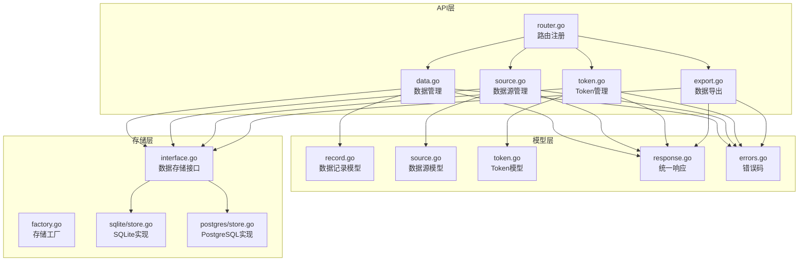
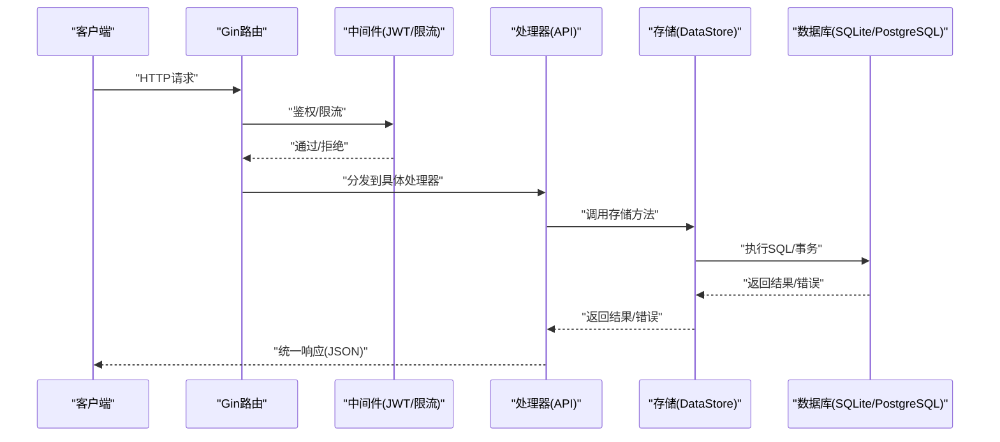
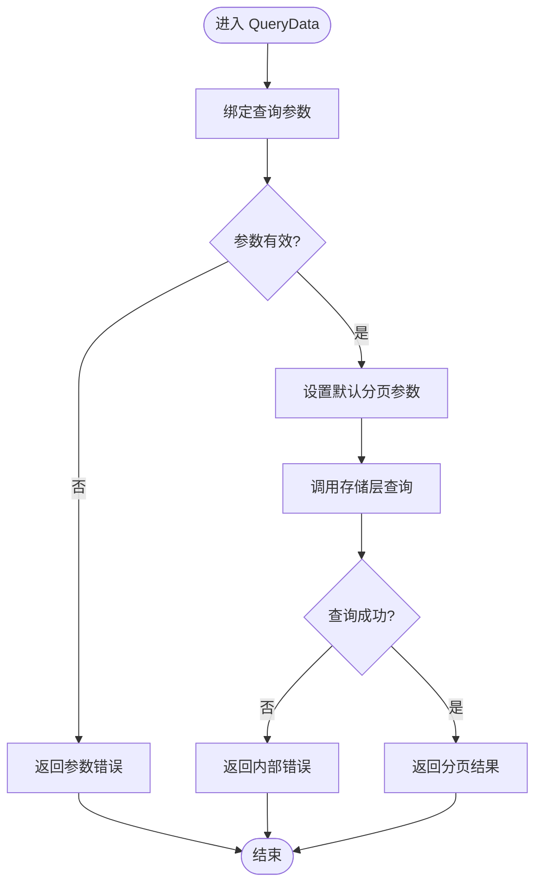
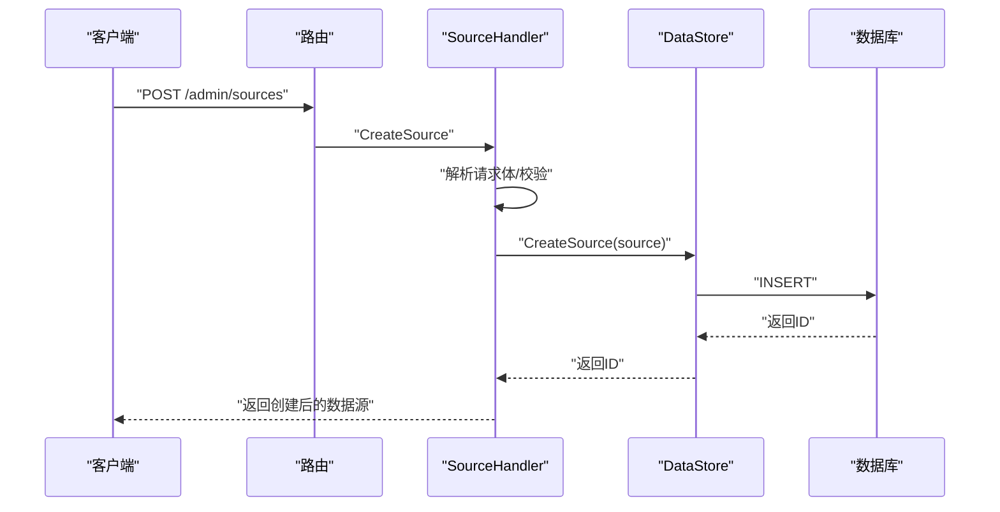
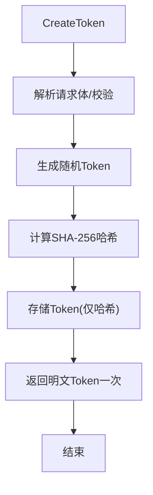
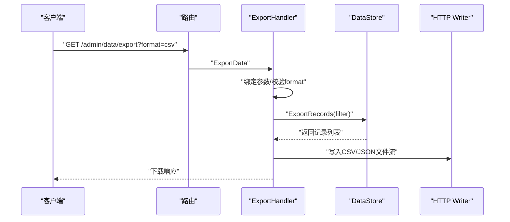
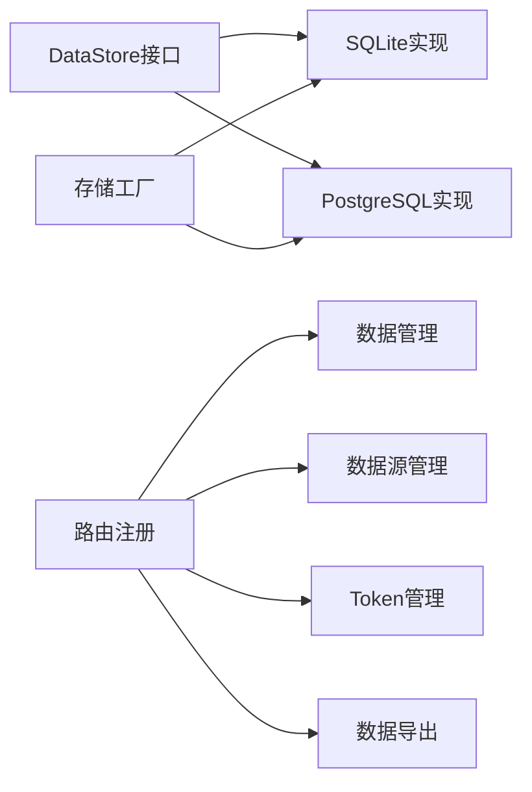

# 数据管理模块

<cite>
**本文档引用的文件**
- [internal/api/data.go](file://internal/api/data.go)
- [internal/api/source.go](file://internal/api/source.go)
- [internal/api/token.go](file://internal/api/token.go)
- [internal/api/export.go](file://internal/api/export.go)
- [internal/api/router.go](file://internal/api/router.go)
- [internal/model/record.go](file://internal/model/record.go)
- [internal/model/source.go](file://internal/model/source.go)
- [internal/model/token.go](file://internal/model/token.go)
- [internal/model/response.go](file://internal/model/response.go)
- [internal/model/errors.go](file://internal/model/errors.go)
- [internal/storage/interface.go](file://internal/storage/interface.go)
- [internal/storage/factory.go](file://internal/storage/factory.go)
- [internal/storage/sqlite/store.go](file://internal/storage/sqlite/store.go)
- [internal/storage/postgres/store.go](file://internal/storage/postgres/store.go)
- [web/src/types/record.ts](file://web/src/types/record.ts)
</cite>

## 目录
1. [简介](#简介)
2. [项目结构](#项目结构)
3. [核心组件](#核心组件)
4. [架构总览](#架构总览)
5. [详细组件分析](#详细组件分析)
6. [依赖关系分析](#依赖关系分析)
7. [性能考虑](#性能考虑)
8. [故障排除指南](#故障排除指南)
9. [结论](#结论)
10. [附录](#附录)

## 简介
本文件为数据管理模块的综合技术文档，覆盖以下主题：
- 数据CRUD与查询：记录查询、分页、条件过滤、批量删除
- 数据源管理（DataSource）生命周期：创建、查询、更新、软删除
- Token管理机制：生成、权限控制、访问限制
- 数据导出功能：CSV/JSON格式、批量导出策略与性能优化
- RESTful API接口文档：请求参数、响应格式、错误码
- 使用示例与最佳实践
- 与其他模块的集成关系与数据流转

## 项目结构
数据管理模块位于后端Go服务的API层与存储层之间，采用清晰的分层设计：
- API层：提供REST接口，负责参数绑定、鉴权、调用存储层
- Model层：定义数据模型与统一响应结构
- Storage层：抽象数据访问接口，支持SQLite与PostgreSQL两种实现
- Web前端：提供类型定义与交互界面

**图表来源**
- [internal/api/router.go:14-115](file://internal/api/router.go#L14-L115)
- [internal/api/data.go:12-97](file://internal/api/data.go#L12-L97)
- [internal/api/source.go:13-169](file://internal/api/source.go#L13-L169)
- [internal/api/token.go:16-180](file://internal/api/token.go#L16-L180)
- [internal/api/export.go:16-111](file://internal/api/export.go#L16-L111)
- [internal/model/record.go:8-33](file://internal/model/record.go#L8-L33)
- [internal/model/source.go:8-35](file://internal/model/source.go#L8-L35)
- [internal/model/token.go:5-17](file://internal/model/token.go#L5-L17)
- [internal/model/response.go:9-72](file://internal/model/response.go#L9-L72)
- [internal/model/errors.go:3-84](file://internal/model/errors.go#L3-L84)
- [internal/storage/interface.go:9-57](file://internal/storage/interface.go#L9-L57)
- [internal/storage/factory.go:11-22](file://internal/storage/factory.go#L11-L22)
- [internal/storage/sqlite/store.go:17-86](file://internal/storage/sqlite/store.go#L17-L86)
- [internal/storage/postgres/store.go:14-61](file://internal/storage/postgres/store.go#L14-L61)

**章节来源**
- [internal/api/router.go:14-115](file://internal/api/router.go#L14-L115)
- [internal/storage/factory.go:11-22](file://internal/storage/factory.go#L11-L22)

## 核心组件
- 数据管理处理器：提供记录查询、单条删除、批量删除
- 数据源处理器：提供数据源的增删改查与Token管理入口
- Token处理器：提供Token生成、状态变更、列表查询、删除
- 导出处理器：提供CSV/JSON格式导出
- 存储接口与实现：抽象数据访问，支持SQLite与PostgreSQL
- 统一响应与错误码：规范API响应与错误语义

**章节来源**
- [internal/api/data.go:12-97](file://internal/api/data.go#L12-L97)
- [internal/api/source.go:13-169](file://internal/api/source.go#L13-L169)
- [internal/api/token.go:16-180](file://internal/api/token.go#L16-L180)
- [internal/api/export.go:16-111](file://internal/api/export.go#L16-L111)
- [internal/storage/interface.go:9-57](file://internal/storage/interface.go#L9-L57)

## 架构总览
数据管理模块通过Gin框架暴露REST接口，所有请求先经过鉴权与限流中间件，再由对应处理器调用存储接口完成业务逻辑。

**图表来源**
- [internal/api/router.go:14-115](file://internal/api/router.go#L14-L115)
- [internal/storage/interface.go:9-57](file://internal/storage/interface.go#L9-L57)
- [internal/storage/sqlite/store.go:58-86](file://internal/storage/sqlite/store.go#L58-L86)
- [internal/storage/postgres/store.go:36-61](file://internal/storage/postgres/store.go#L36-L61)

## 详细组件分析

### 数据CRUD与查询
- 查询记录
  - 方法：GET /api/v1/admin/data
  - 查询参数：source_id、start_date、end_date、page、size
  - 分页与默认值：page默认1；size默认20且最大100
  - 返回：PageResult(total, list)
- 删除单条记录
  - 方法：DELETE /api/v1/admin/data/:id
  - 参数：路径参数id
- 批量删除
  - 方法：POST /api/v1/admin/data/batch-delete
  - 请求体：ids数组（至少一个）
  - 返回：包含删除数量的统计

**图表来源**
- [internal/api/data.go:29-53](file://internal/api/data.go#L29-L53)
- [internal/model/record.go:19-32](file://internal/model/record.go#L19-L32)

**章节来源**
- [internal/api/data.go:29-97](file://internal/api/data.go#L29-L97)
- [internal/model/record.go:19-32](file://internal/model/record.go#L19-L32)

### 数据源管理（DataSource）生命周期
- 列表查询
  - 方法：GET /api/v1/admin/sources
  - 参数：page、size（默认1/10，上限100）
- 创建数据源
  - 方法：POST /api/v1/admin/sources
  - 请求体：name、description、schema_config（可选空对象）
  - 上下文：从JWT中提取user_id作为创建者
  - 状态：默认启用
- 更新数据源
  - 方法：PUT /api/v1/admin/sources/:id
  - 请求体：name、description、schema_config（可为空对象）
  - 校验：存在性检查
- 删除数据源（软删除）
  - 方法：DELETE /api/v1/admin/sources/:id
  - 校验：存在性检查

**图表来源**
- [internal/api/source.go:61-101](file://internal/api/source.go#L61-L101)
- [internal/storage/interface.go:22-27](file://internal/storage/interface.go#L22-L27)

**章节来源**
- [internal/api/source.go:39-169](file://internal/api/source.go#L39-L169)
- [internal/model/source.go:8-19](file://internal/model/source.go#L8-L19)

### Token管理机制
- 生成Token
  - 方法：POST /api/v1/admin/sources/:id/tokens
  - 请求体：name、expires_at（可选）
  - 生成规则：随机字符串(dt_xxx)，仅首次明文可见
  - 存储：仅保存SHA-256哈希
  - 上下文：从JWT提取user_id作为创建者
- 列表查询
  - 方法：GET /api/v1/admin/sources/:id/tokens
  - 返回：不包含明文与哈希的Token元信息
- 更新状态
  - 方法：PUT /api/v1/admin/tokens/:id/status
  - 请求体：status（0禁用/1启用）
- 删除Token
  - 方法：DELETE /api/v1/admin/tokens/:id

**图表来源**
- [internal/api/token.go:64-120](file://internal/api/token.go#L64-L120)
- [internal/api/token.go:49-62](file://internal/api/token.go#L49-L62)

**章节来源**
- [internal/api/token.go:16-180](file://internal/api/token.go#L16-L180)
- [internal/model/token.go:5-17](file://internal/model/token.go#L5-L17)

### 数据导出功能
- 导出接口
  - 方法：GET /api/v1/admin/data/export
  - 查询参数：format(csv/json，默认csv)、source_id、start_date、end_date、page、size
- CSV导出
  - 响应头：text/csv，附件下载
  - 表头：id, source_id, data, ip_address, user_agent, created_at
  - 数据行：逐条写入，data字段转为字符串
- JSON导出
  - 响应头：application/json，附件下载
  - 结果：直接序列化记录数组，带缩进

**图表来源**
- [internal/api/export.go:28-61](file://internal/api/export.go#L28-L61)
- [internal/api/export.go:63-110](file://internal/api/export.go#L63-L110)

**章节来源**
- [internal/api/export.go:16-111](file://internal/api/export.go#L16-L111)

### RESTful API接口文档

- 数据查询
  - 路径：/api/v1/admin/data
  - 方法：GET
  - 查询参数：
    - source_id: 整数
    - start_date: 字符串(YYYY-MM-DD)
    - end_date: 字符串(YYYY-MM-DD)
    - page: 整数，默认1
    - size: 整数，默认20，最大100
  - 成功响应：PageResult
  - 错误码：4000(参数错误)、9001(内部错误)

- 删除单条记录
  - 路径：/api/v1/admin/data/:id
  - 方法：DELETE
  - 成功响应：{"message":"record deleted successfully"}
  - 错误码：9000(参数缺失)、9001(内部错误)

- 批量删除
  - 路径：/api/v1/admin/data/batch-delete
  - 方法：POST
  - 请求体：ids数组（至少一个）
  - 成功响应：{"message":"records deleted successfully","count":N}
  - 错误码：9000(参数缺失)、9001(内部错误)

- 数据源列表
  - 路径：/api/v1/admin/sources
  - 方法：GET
  - 查询参数：page、size（默认1/10，上限100）
  - 成功响应：PageResult
  - 错误码：9001(内部错误)

- 创建数据源
  - 路径：/api/v1/admin/sources
  - 方法：POST
  - 请求体：name、description、schema_config
  - 成功响应：DataSource
  - 错误码：9000(参数缺失)、3001(创建失败)、9001(内部错误)

- 更新数据源
  - 路径：/api/v1/admin/sources/:id
  - 方法：PUT
  - 请求体：name、description、schema_config
  - 成功响应：DataSource
  - 错误码：9000(参数缺失)、3000(未找到)、3002(更新失败)、9001(内部错误)

- 删除数据源（软删除）
  - 路径：/api/v1/admin/sources/:id
  - 方法：DELETE
  - 成功响应：{"message":"source deleted successfully"}
  - 错误码：9000(参数缺失)、3000(未找到)、3003(删除失败)、9001(内部错误)

- 创建Token
  - 路径：/api/v1/admin/sources/:id/tokens
  - 方法：POST
  - 请求体：name、expires_at
  - 成功响应：包含明文Token一次
  - 错误码：9000(参数缺失)、9001(内部错误)

- Token列表
  - 路径：/api/v1/admin/sources/:id/tokens
  - 方法：GET
  - 成功响应：Token数组（不含明文与哈希）
  - 错误码：9001(内部错误)

- 更新Token状态
  - 路径：/api/v1/admin/tokens/:id/status
  - 方法：PUT
  - 请求体：status(0/1)
  - 成功响应：{"message":"token status updated successfully"}
  - 错误码：9000(参数缺失)、9001(内部错误)

- 删除Token
  - 路径：/api/v1/admin/tokens/:id
  - 方法：DELETE
  - 成功响应：{"message":"token deleted successfully"}
  - 错误码：9000(参数缺失)、9001(内部错误)

- 数据导出
  - 路径：/api/v1/admin/data/export
  - 方法：GET
  - 查询参数：format(csv/json，默认csv)、source_id、start_date、end_date、page、size
  - 成功响应：CSV/JSON文件下载
  - 错误码：4000(参数错误)、4001(导出失败)、9001(内部错误)

**章节来源**
- [internal/api/data.go:29-97](file://internal/api/data.go#L29-L97)
- [internal/api/source.go:39-169](file://internal/api/source.go#L39-L169)
- [internal/api/token.go:64-180](file://internal/api/token.go#L64-L180)
- [internal/api/export.go:28-111](file://internal/api/export.go#L28-L111)
- [internal/model/errors.go:3-84](file://internal/model/errors.go#L3-L84)

### 使用示例与最佳实践
- 查询与分页
  - 示例：GET /api/v1/admin/data?page=1&size=50&source_id=123
  - 最佳实践：合理设置page与size，避免过大size导致内存压力
- 条件过滤
  - 示例：GET /api/v1/admin/data?start_date=2024-01-01&end_date=2024-12-31
  - 最佳实践：日期格式严格遵循YYYY-MM-DD
- 批量删除
  - 示例：POST /api/v1/admin/data/batch-delete
  - 请求体：{"ids":[1,2,3]}
  - 最佳实践：分批提交，避免单次提交过多ID
- 导出策略
  - 示例：GET /api/v1/admin/data/export?format=json&page=1&size=1000
  - 最佳实践：大批量导出建议使用CSV以降低内存占用；设置合理的page与size
- Token管理
  - 生成后妥善保存明文Token（仅首次可见），定期轮换
  - 设置合理的过期时间与状态

**章节来源**
- [internal/api/data.go:29-97](file://internal/api/data.go#L29-L97)
- [internal/api/export.go:28-111](file://internal/api/export.go#L28-L111)
- [internal/api/token.go:64-120](file://internal/api/token.go#L64-L120)

## 依赖关系分析
- 接口与实现解耦：通过DataStore接口隔离不同数据库实现
- 存储工厂：根据配置动态选择SQLite或PostgreSQL
- 路由聚合：统一在router.go中注册各模块路由，明确鉴权与限流策略

**图表来源**
- [internal/storage/interface.go:9-57](file://internal/storage/interface.go#L9-L57)
- [internal/storage/factory.go:11-22](file://internal/storage/factory.go#L11-L22)
- [internal/storage/sqlite/store.go:17-86](file://internal/storage/sqlite/store.go#L17-L86)
- [internal/storage/postgres/store.go:14-61](file://internal/storage/postgres/store.go#L14-L61)
- [internal/api/router.go:14-115](file://internal/api/router.go#L14-L115)

**章节来源**
- [internal/storage/interface.go:9-57](file://internal/storage/interface.go#L9-L57)
- [internal/storage/factory.go:11-22](file://internal/storage/factory.go#L11-L22)
- [internal/api/router.go:14-115](file://internal/api/router.go#L14-L115)

## 性能考虑
- 分页与大小限制：默认每页20条，最大100条，避免一次性加载过多数据
- 导出优化：优先使用CSV以减少内存占用；按需分页导出
- 数据库连接池：PostgreSQL设置较大连接池，SQLite限制为1以保证一致性
- WAL模式：SQLite启用WAL提升并发读写性能
- 限流策略：采集接口对IP与Token分别限流，防止滥用

**章节来源**
- [internal/api/data.go:38-44](file://internal/api/data.go#L38-L44)
- [internal/api/export.go:55-60](file://internal/api/export.go#L55-L60)
- [internal/storage/sqlite/store.go:39-53](file://internal/storage/sqlite/store.go#L39-L53)
- [internal/storage/postgres/store.go:29-32](file://internal/storage/postgres/store.go#L29-L32)
- [internal/api/router.go:47-55](file://internal/api/router.go#L47-L55)

## 故障排除指南
- 常见错误码
  - 4000：查询参数错误
  - 9000：缺少必要参数
  - 9001：内部错误
  - 3000：数据源不存在
  - 4001：导出失败
- 排查步骤
  - 检查请求参数格式与范围
  - 确认JWT有效性与权限
  - 查看存储层日志与数据库状态
  - 对于导出失败，确认过滤条件与数据库连接

**章节来源**
- [internal/model/errors.go:3-84](file://internal/model/errors.go#L3-L84)
- [internal/model/response.go:58-72](file://internal/model/response.go#L58-L72)

## 结论
数据管理模块通过清晰的分层设计与统一的接口规范，提供了完整的数据CRUD、数据源与Token管理、以及高效的数据导出能力。配合鉴权与限流中间件，确保了系统的安全性与稳定性。建议在生产环境中结合分页与导出策略，合理配置数据库连接池，并定期轮换Token以保障安全。

## 附录
- 前端类型参考
  - DataRecord与RecordFilter类型定义用于前端交互与TS类型约束

**章节来源**
- [web/src/types/record.ts:1-18](file://web/src/types/record.ts#L1-L18)