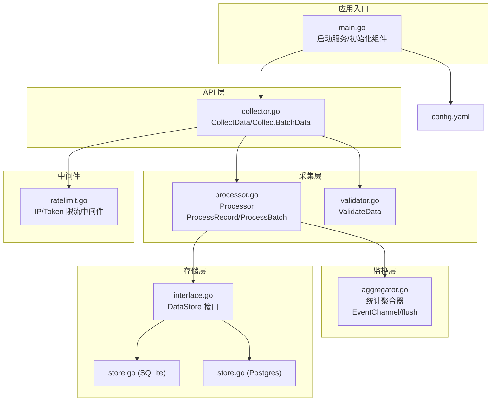
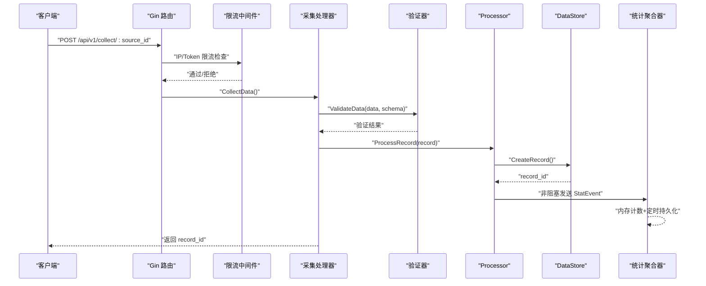
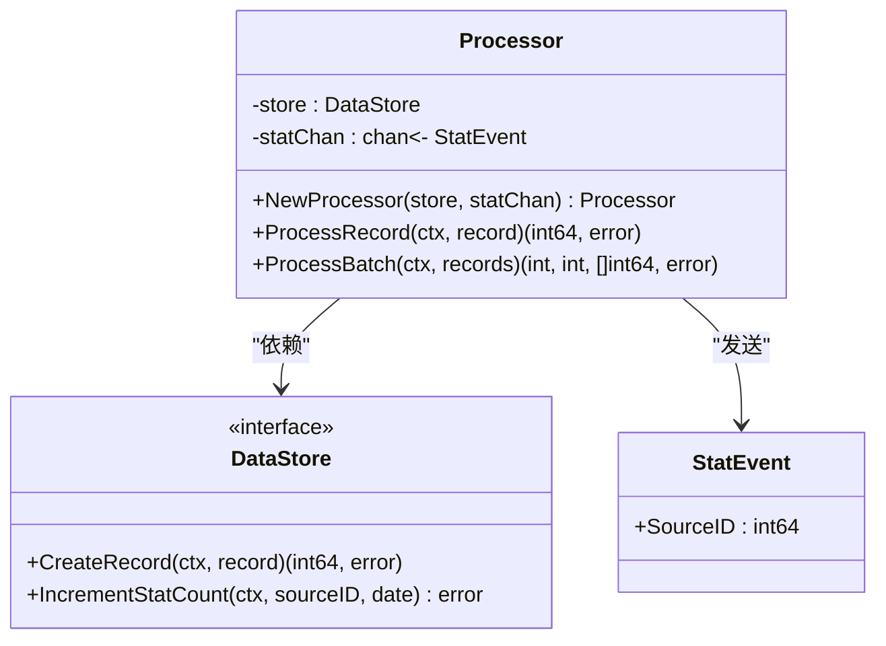
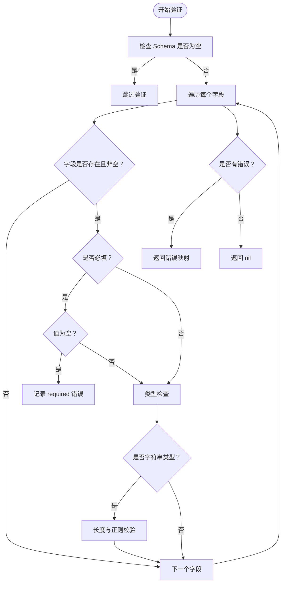
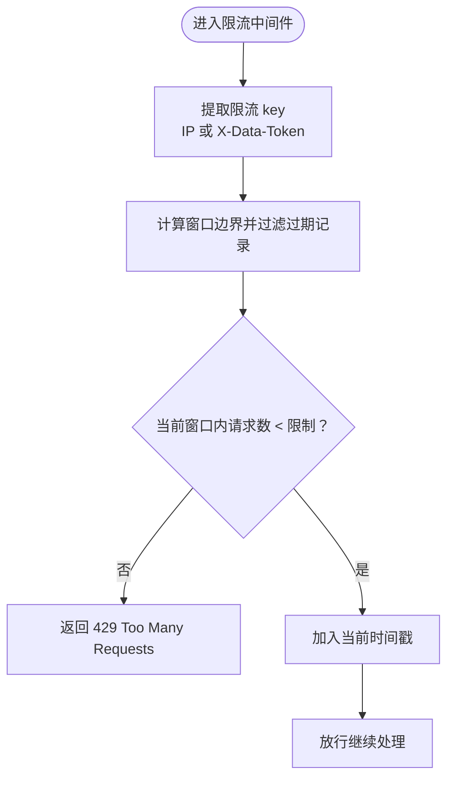
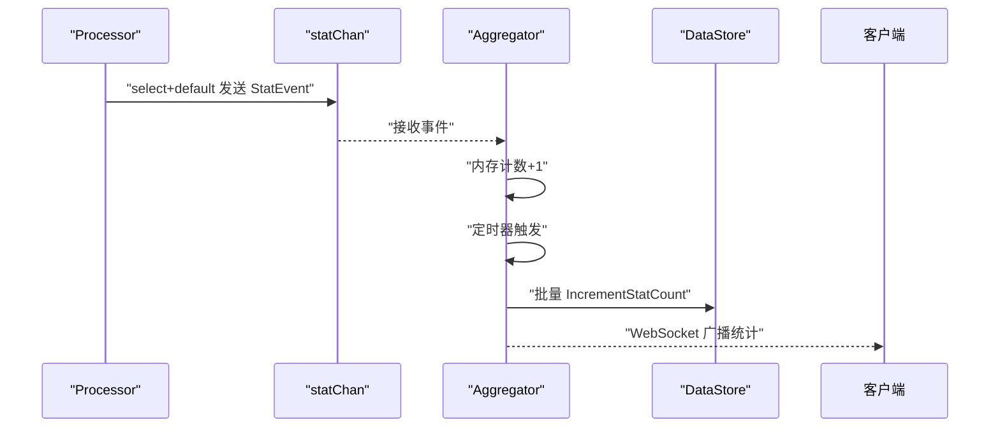
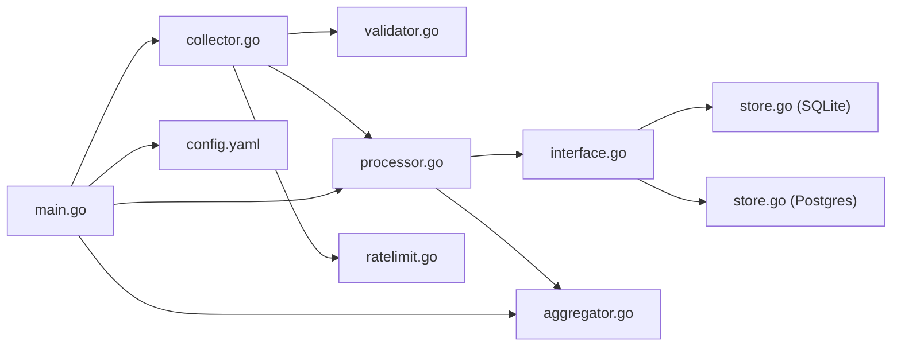
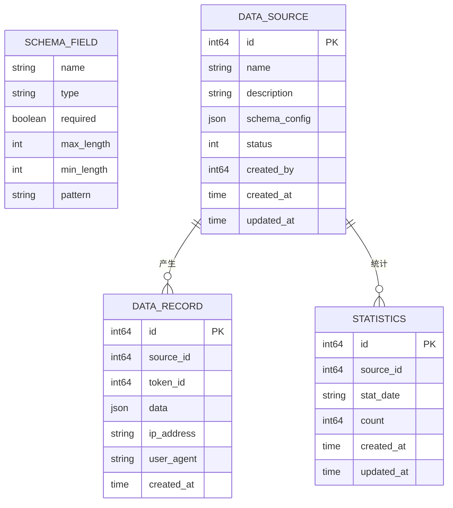

# 数据采集模块

<cite>
**本文引用的文件**
- [processor.go](file://internal/collector/processor.go)
- [validator.go](file://internal/collector/validator.go)
- [ratelimit.go](file://internal/middleware/ratelimit.go)
- [collector.go](file://internal/api/collector.go)
- [aggregator.go](file://internal/monitor/aggregator.go)
- [main.go](file://cmd/server/main.go)
- [config.yaml](file://configs/config.yaml)
- [interface.go](file://internal/storage/interface.go)
- [record.go](file://internal/model/record.go)
- [source.go](file://internal/model/source.go)
- [statistics.go](file://internal/model/statistics.go)
- [store.go (SQLite)](file://internal/storage/sqlite/store.go)
- [store.go (Postgres)](file://internal/storage/postgres/store.go)
</cite>

## 目录
1. [简介](#简介)
2. [项目结构](#项目结构)
3. [核心组件](#核心组件)
4. [架构总览](#架构总览)
5. [详细组件分析](#详细组件分析)
6. [依赖分析](#依赖分析)
7. [性能考虑](#性能考虑)
8. [故障排查指南](#故障排查指南)
9. [结论](#结论)
10. [附录](#附录)

## 简介
本文件面向数据采集模块，系统性阐述数据处理器（Processor）的设计与实现，覆盖单条数据处理与批量数据处理的工作原理；详解数据验证机制（Validator），包括 Schema 验证、数据类型检查、长度限制等；解释限流策略（IP 限流与 Token 限流）的实现方式；说明 StatEvent 统计事件的设计思路与 channel 通信的非阻塞实现；提供使用 ProcessRecord 与 ProcessBatch 的示例路径；总结错误处理策略与性能优化技巧，并给出数据采集流程图与最佳实践。

## 项目结构
数据采集模块位于 internal/collector，配合 API 层、中间件、监控与存储层协同工作。关键文件与职责如下：
- internal/collector：数据处理器与验证器
- internal/api：采集 API 入口（单条/批量）
- internal/middleware：限流中间件（基于滑动窗口）
- internal/monitor：统计聚合器（基于 channel 的异步统计）
- internal/storage：数据存储接口与具体实现（SQLite/Postgres）
- internal/model：数据模型（记录、来源、统计等）
- configs/config.yaml：系统配置（限流阈值、日志级别等）

图表来源
- [main.go:25-129](file://cmd/server/main.go#L25-L129)
- [collector.go:15-289](file://internal/api/collector.go#L15-L289)
- [processor.go:16-84](file://internal/collector/processor.go#L16-L84)
- [validator.go:19-222](file://internal/collector/validator.go#L19-L222)
- [ratelimit.go:12-137](file://internal/middleware/ratelimit.go#L12-L137)
- [aggregator.go:17-197](file://internal/monitor/aggregator.go#L17-L197)
- [interface.go:9-56](file://internal/storage/interface.go#L9-L56)
- [store.go (SQLite):17-86](file://internal/storage/sqlite/store.go#L17-L86)
- [store.go (Postgres):14-61](file://internal/storage/postgres/store.go#L14-L61)
- [config.yaml:27-30](file://configs/config.yaml#L27-L30)

章节来源
- [main.go:25-129](file://cmd/server/main.go#L25-L129)
- [collector.go:15-289](file://internal/api/collector.go#L15-L289)
- [processor.go:16-84](file://internal/collector/processor.go#L16-L84)
- [validator.go:19-222](file://internal/collector/validator.go#L19-L222)
- [ratelimit.go:12-137](file://internal/middleware/ratelimit.go#L12-L137)
- [aggregator.go:17-197](file://internal/monitor/aggregator.go#L17-L197)
- [interface.go:9-56](file://internal/storage/interface.go#L9-L56)
- [store.go (SQLite):17-86](file://internal/storage/sqlite/store.go#L17-L86)
- [store.go (Postgres):14-61](file://internal/storage/postgres/store.go#L14-L61)
- [config.yaml:27-30](file://configs/config.yaml#L27-L30)

## 核心组件
- 数据处理器（Processor）
  - 提供单条记录写入与批量记录处理能力
  - 写入后向统计通道发送 StatEvent，采用非阻塞 select
  - 返回记录 ID、成功/失败计数与 IDs 列表
- 数据验证器（Validator）
  - 基于 SchemaConfig 对提交数据进行字段级校验
  - 支持必填、类型、长度、正则、URL、邮箱、日期/时间等
- 限流中间件（RateLimiter）
  - 滑动窗口算法，按 IP 与 Token 维度限流
  - 定期清理过期记录，避免内存膨胀
- 统计聚合器（Aggregator）
  - 基于 channel 接收 StatEvent，内存计数+定时持久化
  - 提供 WebSocket 广播与查询接口

章节来源
- [processor.go:16-84](file://internal/collector/processor.go#L16-L84)
- [validator.go:19-222](file://internal/collector/validator.go#L19-L222)
- [ratelimit.go:12-137](file://internal/middleware/ratelimit.go#L12-L137)
- [aggregator.go:17-197](file://internal/monitor/aggregator.go#L17-L197)

## 架构总览
下图展示了从客户端到存储的完整数据采集链路，以及统计事件的异步传播路径。

图表来源
- [collector.go:29-140](file://internal/api/collector.go#L29-L140)
- [validator.go:19-84](file://internal/collector/validator.go#L19-L84)
- [processor.go:30-52](file://internal/collector/processor.go#L30-L52)
- [aggregator.go:47-133](file://internal/monitor/aggregator.go#L47-L133)

## 详细组件分析

### 数据处理器（Processor）
- 设计要点
  - 通过构造函数注入 DataStore 与统计通道，解耦存储与统计
  - ProcessRecord：写入记录后非阻塞发送 StatEvent，避免阻塞主流程
  - ProcessBatch：逐条调用 ProcessRecord，汇总成功/失败计数与 IDs
  - 全部失败时返回错误，部分成功时返回成功计数与 IDs
- 关键行为
  - 写入失败直接返回错误
  - 统计事件发送使用 select+default，防止阻塞
  - 批量处理中失败项以占位 0 标记，便于上层识别

图表来源
- [processor.go:16-84](file://internal/collector/processor.go#L16-L84)
- [interface.go:9-56](file://internal/storage/interface.go#L9-L56)

章节来源
- [processor.go:16-84](file://internal/collector/processor.go#L16-L84)
- [interface.go:38-42](file://internal/storage/interface.go#L38-L42)

### 数据验证器（Validator）
- 设计要点
  - ValidateData 接受用户数据与 SchemaConfig，返回字段级错误映射
  - 支持必填、类型（string/number/boolean/date/datetime/integer/float/array/object/email/url）、长度（最大/最小）、正则匹配
  - 对字符串类型进行预编译正则校验，提升性能
- 错误处理
  - 任一字段校验失败即记录错误，最终统一返回
  - 若 SchemaConfig 为空或无效，跳过验证（兼容自由格式）

图表来源
- [validator.go:19-84](file://internal/collector/validator.go#L19-L84)
- [validator.go:102-221](file://internal/collector/validator.go#L102-L221)

章节来源
- [validator.go:19-222](file://internal/collector/validator.go#L19-L222)
- [source.go:21-34](file://internal/model/source.go#L21-L34)

### 限流策略（IP 限流与 Token 限流）
- 设计要点
  - 滑动窗口：以时间戳列表记录请求，窗口外的请求被过滤
  - 定时清理：每分钟触发一次清理过期记录的 goroutine
  - 中间件封装：IP 限流与 Token 限流分别针对客户端 IP 与 X-Data-Token 头
- 行为特征
  - 超限返回 429，阻止后续处理
  - 缺少 Token 时返回 400
  - 限流 key 为 IP 或 Token 值，窗口默认 1 分钟

图表来源
- [ratelimit.go:68-98](file://internal/middleware/ratelimit.go#L68-L98)
- [ratelimit.go:100-136](file://internal/middleware/ratelimit.go#L100-L136)

章节来源
- [ratelimit.go:12-137](file://internal/middleware/ratelimit.go#L12-L137)
- [config.yaml:27-30](file://configs/config.yaml#L27-L30)

### 统计事件与非阻塞通信（StatEvent 与 channel）
- 设计思路
  - StatEvent 结构简单，仅包含 SourceID，用于标识来源
  - Processor 在写入成功后尝试向 statChan 发送事件
  - 使用 select+default 实现非阻塞发送，避免阻塞主处理流程
- 聚合与持久化
  - Aggregator 以 channel 接收事件，内存计数器按来源累加
  - 定时器（每分钟）将内存计数批量持久化到数据库
  - 同时通过 WebSocket 广播实时统计

图表来源
- [processor.go:42-49](file://internal/collector/processor.go#L42-L49)
- [aggregator.go:47-133](file://internal/monitor/aggregator.go#L47-L133)

章节来源
- [processor.go:11-20](file://internal/collector/processor.go#L11-L20)
- [aggregator.go:14-45](file://internal/monitor/aggregator.go#L14-L45)

### API 使用示例（ProcessRecord 与 ProcessBatch）
以下为使用示例的代码片段路径（不直接展示代码内容）：
- 单条数据采集
  - 路由与处理：[collector.go:29-140](file://internal/api/collector.go#L29-L140)
  - 调用处理器：[collector.go:129-134](file://internal/api/collector.go#L129-L134)
  - 处理器实现：[processor.go:30-52](file://internal/collector/processor.go#L30-L52)
- 批量数据采集
  - 路由与处理：[collector.go:142-279](file://internal/api/collector.go#L142-L279)
  - 调用处理器：[collector.go:257-262](file://internal/api/collector.go#L257-L262)
  - 处理器实现：[processor.go:54-83](file://internal/collector/processor.go#L54-L83)

章节来源
- [collector.go:29-140](file://internal/api/collector.go#L29-L140)
- [collector.go:142-279](file://internal/api/collector.go#L142-L279)
- [processor.go:30-83](file://internal/collector/processor.go#L30-L83)

## 依赖分析
- 组件耦合
  - API 层依赖验证器与处理器
  - 处理器依赖 DataStore 接口与统计通道
  - 统计聚合器依赖 DataStore 与 WebSocket Hub
  - 限流中间件独立于业务逻辑，仅依赖 Gin
- 外部依赖
  - 存储层通过工厂模式创建 SQLite/Postgres 实现
  - 日志使用标准库 slog，支持文件轮转

图表来源
- [collector.go:15-289](file://internal/api/collector.go#L15-L289)
- [validator.go:19-222](file://internal/collector/validator.go#L19-L222)
- [processor.go:16-84](file://internal/collector/processor.go#L16-L84)
- [interface.go:9-56](file://internal/storage/interface.go#L9-L56)
- [store.go (SQLite):17-86](file://internal/storage/sqlite/store.go#L17-L86)
- [store.go (Postgres):14-61](file://internal/storage/postgres/store.go#L14-L61)
- [aggregator.go:17-197](file://internal/monitor/aggregator.go#L17-L197)
- [ratelimit.go:12-137](file://internal/middleware/ratelimit.go#L12-L137)
- [main.go:25-129](file://cmd/server/main.go#L25-L129)
- [config.yaml:27-30](file://configs/config.yaml#L27-L30)

章节来源
- [collector.go:15-289](file://internal/api/collector.go#L15-L289)
- [processor.go:16-84](file://internal/collector/processor.go#L16-L84)
- [interface.go:9-56](file://internal/storage/interface.go#L9-L56)
- [aggregator.go:17-197](file://internal/monitor/aggregator.go#L17-L197)
- [ratelimit.go:12-137](file://internal/middleware/ratelimit.go#L12-L137)
- [main.go:25-129](file://cmd/server/main.go#L25-L129)
- [config.yaml:27-30](file://configs/config.yaml#L27-L30)

## 性能考虑
- 验证阶段
  - 预编译正则表达式，减少重复编译开销
  - 类型检查优先短路，避免不必要的转换
- 处理阶段
  - 批量处理逐条写入，便于失败定位与部分回滚
  - 统计事件非阻塞发送，避免影响主流程吞吐
- 存储阶段
  - SQLite 使用 WAL 模式与忙等待超时，降低锁竞争
  - Postgres 设置合理的连接池大小，避免过度并发
- 限流阶段
  - 滑动窗口+定期清理，控制内存占用
  - 限流阈值在配置文件中集中管理，便于调优

章节来源
- [validator.go:14-17](file://internal/collector/validator.go#L14-L17)
- [store.go (SQLite):43-53](file://internal/storage/sqlite/store.go#L43-L53)
- [store.go (Postgres):29-32](file://internal/storage/postgres/store.go#L29-L32)
- [ratelimit.go:34-41](file://internal/middleware/ratelimit.go#L34-L41)
- [config.yaml:27-30](file://configs/config.yaml#L27-L30)

## 故障排查指南
- 采集失败
  - 检查 Token 状态与有效期、SourceID 是否匹配
  - 核对请求体 JSON 与 SchemaConfig，确认验证错误
  - 查看处理器返回的错误码与记录 ID 列表
- 统计异常
  - 确认 statChan 是否被正确注入到 Processor
  - 观察 Aggregator 的 flush 日志与 WebSocket 广播
- 限流问题
  - 检查 IP 与 Token 限流阈值配置
  - 关注限流中间件返回的 429 与 400 错误
- 存储异常
  - SQLite/Postgres 初始化与迁移是否成功
  - 连接池参数与数据库可用性

章节来源
- [collector.go:34-81](file://internal/api/collector.go#L34-L81)
- [collector.go:106-112](file://internal/api/collector.go#L106-L112)
- [collector.go:129-134](file://internal/api/collector.go#L129-L134)
- [aggregator.go:94-133](file://internal/monitor/aggregator.go#L94-L133)
- [ratelimit.go:100-136](file://internal/middleware/ratelimit.go#L100-L136)
- [store.go (SQLite):58-75](file://internal/storage/sqlite/store.go#L58-L75)
- [store.go (Postgres):36-50](file://internal/storage/postgres/store.go#L36-L50)

## 结论
数据采集模块通过清晰的分层设计实现了高内聚、低耦合的处理链：API 层负责接入与鉴权，验证器保障数据质量，处理器完成持久化与统计事件发送，限流中间件保护系统稳定，聚合器实现高效统计与实时广播。该架构具备良好的扩展性与可维护性，适合在生产环境中部署与演进。

## 附录

### 数据模型概览

图表来源
- [record.go:8-17](file://internal/model/record.go#L8-L17)
- [statistics.go:5-13](file://internal/model/statistics.go#L5-L13)
- [source.go:8-19](file://internal/model/source.go#L8-L19)
- [source.go:21-34](file://internal/model/source.go#L21-L34)

### 最佳实践
- 配置管理
  - 在配置文件中统一设置限流阈值、日志级别与数据库驱动
- 数据源 Schema
  - 明确字段类型、长度与正则约束，减少验证失败
- 错误处理
  - 单条失败不影响整体流程，批量处理需区分成功/失败
- 性能优化
  - 使用预编译正则与短路类型检查
  - 合理设置存储连接池与 WAL 模式
- 可观测性
  - 通过统计聚合器与 WebSocket 实时查看采集趋势
  - 记录关键日志以便问题定位

章节来源
- [config.yaml:27-30](file://configs/config.yaml#L27-L30)
- [validator.go:14-17](file://internal/collector/validator.go#L14-L17)
- [store.go (SQLite):43-53](file://internal/storage/sqlite/store.go#L43-L53)
- [aggregator.go:47-133](file://internal/monitor/aggregator.go#L47-L133)