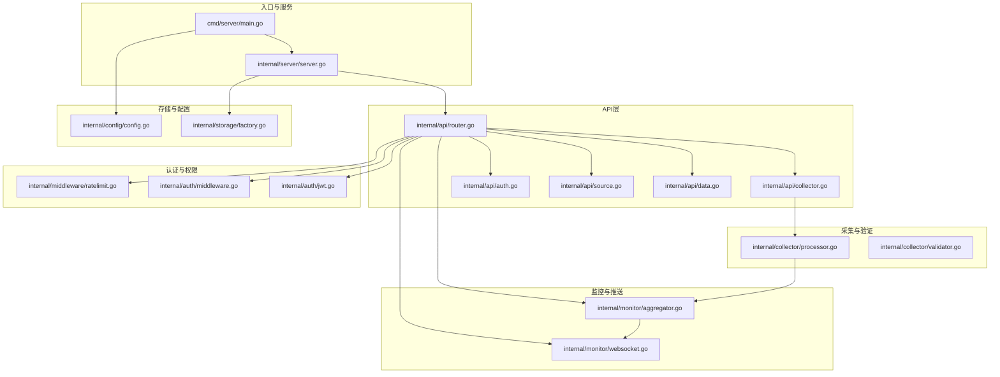
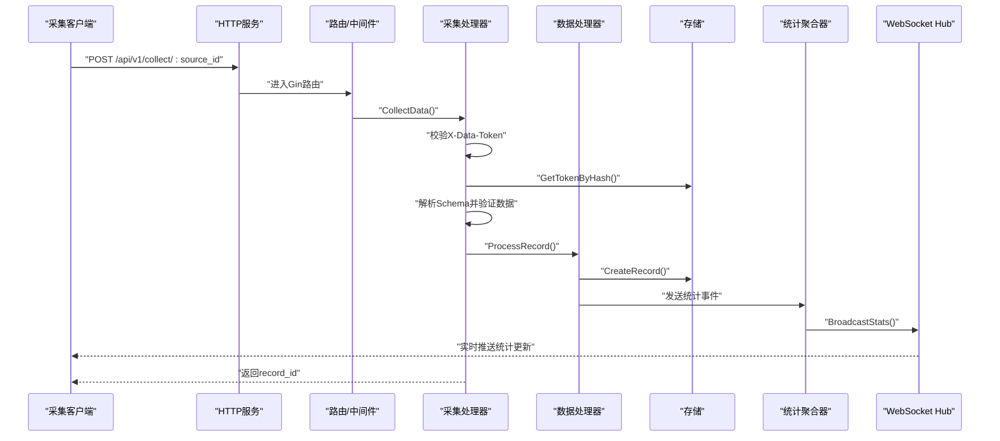
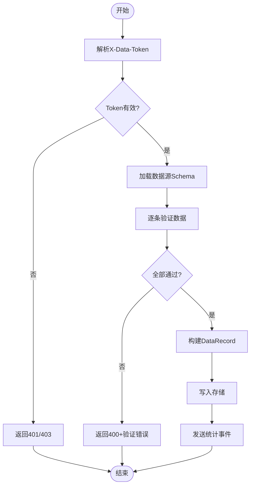
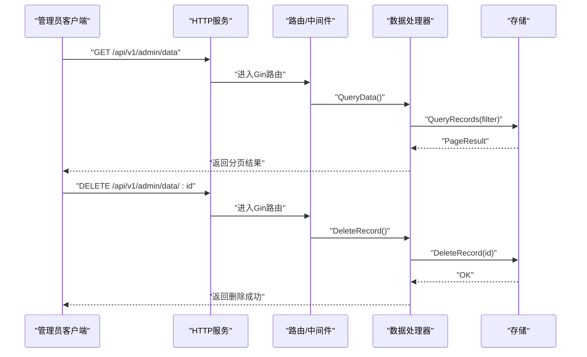
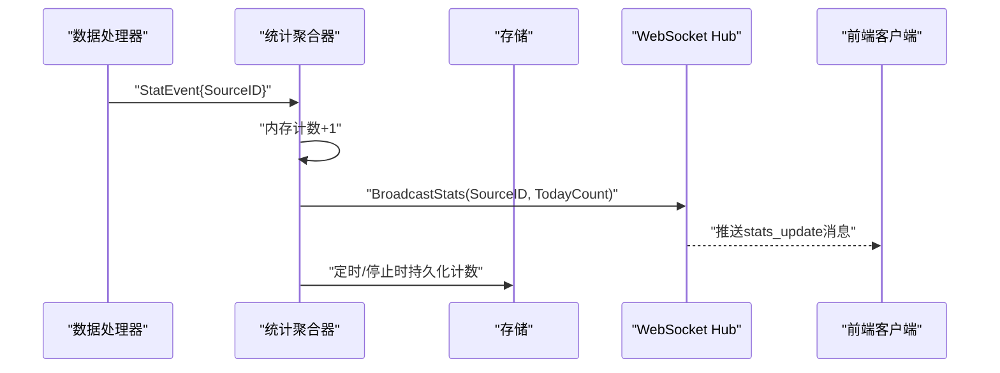
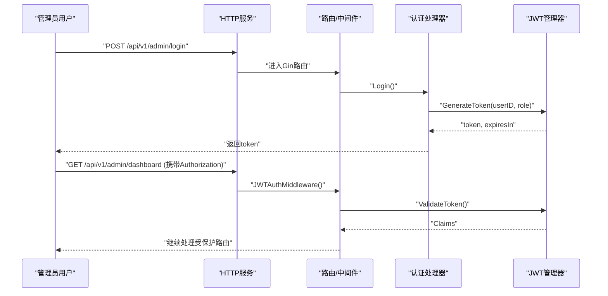
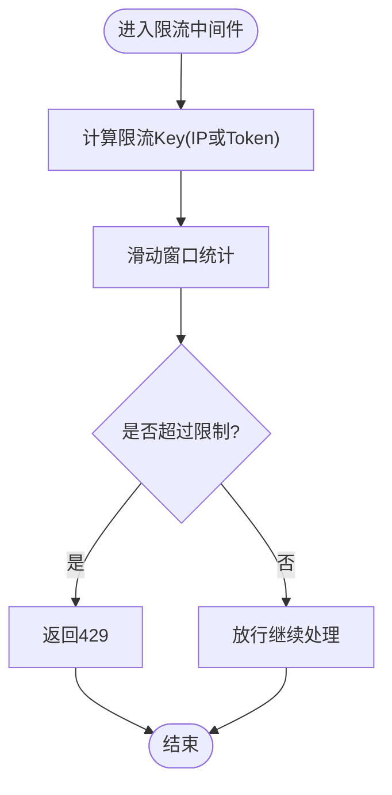
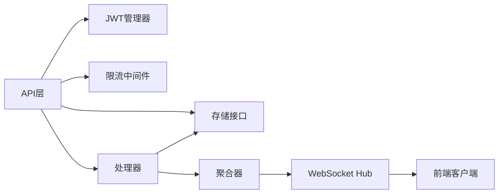

# 核心功能模块

<cite>
**本文引用的文件**
- [main.go](file://cmd/server/main.go)
- [router.go](file://internal/api/router.go)
- [processor.go](file://internal/collector/processor.go)
- [validator.go](file://internal/collector/validator.go)
- [aggregator.go](file://internal/monitor/aggregator.go)
- [websocket.go](file://internal/monitor/websocket.go)
- [jwt.go](file://internal/auth/jwt.go)
- [middleware.go](file://internal/auth/middleware.go)
- [ratelimit.go](file://internal/middleware/ratelimit.go)
- [factory.go](file://internal/storage/factory.go)
- [source.go](file://internal/model/source.go)
- [record.go](file://internal/model/record.go)
- [collector.go](file://internal/api/collector.go)
- [data.go](file://internal/api/data.go)
- [source.go](file://internal/api/source.go)
- [auth.go](file://internal/api/auth.go)
- [config.go](file://internal/config/config.go)
- [server.go](file://internal/server/server.go)
</cite>

## 目录
1. [简介](#简介)
2. [项目结构](#项目结构)
3. [核心组件](#核心组件)
4. [架构总览](#架构总览)
5. [详细组件分析](#详细组件分析)
6. [依赖分析](#依赖分析)
7. [性能考量](#性能考量)
8. [故障排查指南](#故障排查指南)
9. [结论](#结论)
10. [附录](#附录)

## 简介
本文件面向DataCollector的核心功能模块，系统性梳理数据采集、数据管理、监控与WebSocket推送、用户管理与权限控制等模块的设计理念、实现原理与使用方法。文档以循序渐进的方式呈现，既适合快速上手，也便于深入理解模块间的交互关系与数据流向，并提供性能优化建议与扩展点说明。

## 项目结构
DataCollector采用分层与按功能域划分的组织方式：
- cmd/server：应用入口，负责初始化配置、存储、JWT、WebSocket、统计聚合器与HTTP服务，以及优雅关闭流程。
- internal/api：API路由与各领域处理器（采集、数据、源、认证、导出等），统一注册到Gin引擎。
- internal/collector：数据采集处理与验证逻辑。
- internal/monitor：统计聚合与WebSocket推送。
- internal/auth：JWT签发、校验与RBAC中间件。
- internal/middleware：通用中间件（CORS、日志、限流、请求体大小限制等）。
- internal/storage：存储抽象与工厂，支持SQLite与PostgreSQL。
- internal/model：领域模型（数据源、记录、响应、统计等）。
- internal/server：HTTP服务封装，注册中间件与路由，提供SPA静态资源服务。
- internal/config：配置加载与默认值、环境变量覆盖。
- web：前端Vue应用（打包产物通过embed注入）。

图表来源
- [main.go:25-129](file://cmd/server/main.go#L25-L129)
- [server.go:54-87](file://internal/server/server.go#L54-L87)
- [router.go:14-115](file://internal/api/router.go#L14-L115)

章节来源
- [main.go:25-129](file://cmd/server/main.go#L25-L129)
- [server.go:54-87](file://internal/server/server.go#L54-L87)
- [router.go:14-115](file://internal/api/router.go#L14-L115)

## 核心组件
- 数据采集模块
  - 处理器：接收采集请求，构建记录并写入存储，同时向统计聚合器发送事件。
  - 验证器：基于数据源Schema进行字段必填、类型、长度、正则等校验。
- 数据管理模块
  - 提供CRUD与查询接口，支持分页、批量删除、导出等。
- 监控模块
  - 统计聚合器：滑动窗口计数、定时持久化、内存缓存与WebSocket广播。
  - WebSocket：Hub管理连接、广播统计更新、心跳与断线处理。
- 用户管理与权限控制
  - JWT：签发、校验、刷新；支持过期保护。
  - 中间件：认证、角色校验、初始化状态检查、限流中间件。
- 限流模块
  - 基于滑动窗口的并发限流，支持按IP与按Data Token两种维度。
- 存储与配置
  - 存储工厂：根据配置选择SQLite或PostgreSQL实现。
  - 配置：YAML加载、默认值、环境变量覆盖。

章节来源
- [processor.go:16-83](file://internal/collector/processor.go#L16-L83)
- [validator.go:19-84](file://internal/collector/validator.go#L19-L84)
- [aggregator.go:17-197](file://internal/monitor/aggregator.go#L17-L197)
- [websocket.go:14-221](file://internal/monitor/websocket.go#L14-L221)
- [jwt.go:19-114](file://internal/auth/jwt.go#L19-L114)
- [middleware.go:11-148](file://internal/auth/middleware.go#L11-L148)
- [ratelimit.go:12-137](file://internal/middleware/ratelimit.go#L12-L137)
- [factory.go:11-21](file://internal/storage/factory.go#L11-L21)
- [config.go:82-215](file://internal/config/config.go#L82-L215)

## 架构总览
DataCollector遵循“入口初始化—HTTP服务—路由分发—业务处理—存储与监控”的清晰流水线。采集链路通过限流中间件保障稳定性，验证器确保Schema一致性，处理器将记录写入存储并触发统计事件，聚合器周期性持久化并在内存中维护当日计数，最终通过WebSocket向前端推送实时统计。

图表来源
- [router.go:47-55](file://internal/api/router.go#L47-L55)
- [collector.go:29-140](file://internal/api/collector.go#L29-L140)
- [processor.go:30-52](file://internal/collector/processor.go#L30-L52)
- [aggregator.go:76-87](file://internal/monitor/aggregator.go#L76-L87)
- [websocket.go:108-132](file://internal/monitor/websocket.go#L108-L132)

## 详细组件分析

### 数据采集模块
- 设计理念
  - 采集链路强调“安全优先”：Token校验、Schema验证、限流保护。
  - “可扩展性”：验证规则可由数据源Schema动态定义。
- 实现要点
  - 采集处理器：解析请求头X-Data-Token，校验Token有效性与过期，解析Schema，逐条验证并持久化。
  - 批量采集：对每条记录进行独立验证，聚合错误，部分成功仍返回有效ID集合。
  - 处理器：写入记录后异步发送统计事件，非阻塞设计避免影响主流程。
  - 验证器：支持字符串长度、正则、类型（数字、整数、浮点、布尔、URL、邮箱、日期、时间、数组、对象）等。
- 使用场景
  - 单条上报：适用于轻量采集或调试。
  - 批量上报：适用于高吞吐场景，需注意单次请求体大小限制与限流策略。
- 代码示例路径
  - [采集单条数据:29-140](file://internal/api/collector.go#L29-L140)
  - [采集批量数据:142-279](file://internal/api/collector.go#L142-L279)
  - [处理器写入与事件发送:30-52](file://internal/collector/processor.go#L30-L52)
  - [验证器类型与规则:19-222](file://internal/collector/validator.go#L19-L222)

图表来源
- [collector.go:29-140](file://internal/api/collector.go#L29-L140)
- [validator.go:19-84](file://internal/collector/validator.go#L19-L84)
- [processor.go:30-52](file://internal/collector/processor.go#L30-L52)

章节来源
- [collector.go:29-279](file://internal/api/collector.go#L29-L279)
- [processor.go:16-83](file://internal/collector/processor.go#L16-L83)
- [validator.go:19-222](file://internal/collector/validator.go#L19-L222)

### 数据管理模块
- 设计理念
  - 提供管理员视角下的数据全生命周期管理：查询、删除、批量删除、导出。
  - 分页查询与过滤参数标准化，保证易用性与性能。
- 实现要点
  - 查询：支持按数据源ID、日期范围、分页参数查询，返回总数与列表。
  - 删除：单条与批量删除，批量删除返回删除数量。
  - 导出：通过管理端导出接口触发导出任务（具体实现位于export.go，此处聚焦CRUD）。
- 使用场景
  - 日常运维：查看与清理异常数据。
  - 合规审计：按时间范围导出数据。
- 代码示例路径
  - [查询数据:29-53](file://internal/api/data.go#L29-L53)
  - [删除单条记录:55-70](file://internal/api/data.go#L55-L70)
  - [批量删除记录:72-96](file://internal/api/data.go#L72-L96)

图表来源
- [router.go:94-104](file://internal/api/router.go#L94-L104)
- [data.go:29-96](file://internal/api/data.go#L29-L96)

章节来源
- [data.go:12-96](file://internal/api/data.go#L12-L96)
- [router.go:94-104](file://internal/api/router.go#L94-L104)

### 监控模块（统计聚合与WebSocket推送）
- 设计理念
  - 内存计数+定时落库：兼顾实时性与持久化可靠性。
  - 广播推送：通过WebSocket向前端推送实时统计，提升可观测性。
- 实现要点
  - 统计聚合器：接收处理器事件，原子性累加计数，定时器周期性持久化，支持强制刷新。
  - WebSocket Hub：注册/注销客户端、广播消息、心跳与断线清理。
  - 事件通道：使用带缓冲channel，避免阻塞主流程。
- 使用场景
  - 实时看板：前端订阅WebSocket，展示当日各数据源采集量趋势。
  - 运维告警：结合阈值与持久化统计，触发告警。
- 代码示例路径
  - [聚合器事件通道与持久化:42-133](file://internal/monitor/aggregator.go#L42-L133)
  - [WebSocket Hub广播与心跳:63-132](file://internal/monitor/websocket.go#L63-132)

图表来源
- [aggregator.go:42-133](file://internal/monitor/aggregator.go#L42-L133)
- [websocket.go:108-132](file://internal/monitor/websocket.go#L108-L132)

章节来源
- [aggregator.go:17-197](file://internal/monitor/aggregator.go#L17-L197)
- [websocket.go:14-221](file://internal/monitor/websocket.go#L14-L221)

### 用户管理模块（JWT认证与权限控制）
- 设计理念
  - 基于HS256的JWT签发与校验，支持刷新策略与角色控制。
  - 中间件贯穿认证、授权与初始化状态检查，统一错误响应。
- 实现要点
  - JWT管理器：签发、校验、刷新；刷新条件为剩余有效期小于阈值。
  - 认证中间件：支持Authorization头与URL查询参数token（兼容WebSocket）。
  - 角色中间件：RBAC角色白名单校验。
  - 初始化检查：未初始化时对非初始化路由返回不可用或重定向。
- 使用场景
  - 管理员登录：获取短期JWT令牌。
  - 资源访问：携带JWT访问受保护路由。
  - WebSocket：携带token建立监控连接。
- 代码示例路径
  - [JWT签发与校验:33-82](file://internal/auth/jwt.go#L33-L82)
  - [认证中间件:19-63](file://internal/auth/middleware.go#L19-63)
  - [角色中间件:65-95](file://internal/auth/middleware.go#L65-95)
  - [初始化检查中间件:100-147](file://internal/auth/middleware.go#L100-147)

图表来源
- [auth.go:38-77](file://internal/api/auth.go#L38-L77)
- [jwt.go:33-82](file://internal/auth/jwt.go#L33-L82)
- [middleware.go:19-63](file://internal/auth/middleware.go#L19-L63)

章节来源
- [jwt.go:19-114](file://internal/auth/jwt.go#L19-L114)
- [middleware.go:11-148](file://internal/auth/middleware.go#L11-L148)
- [auth.go:12-147](file://internal/api/auth.go#L12-L147)

### 限流模块
- 设计理念
  - 滑动窗口算法，支持按IP与按Data Token两种维度限流，定期清理过期记录。
- 实现要点
  - 中间件：IP限流与Token限流，缺失请求头时直接拒绝。
  - 清理机制：后台定时器清理过期时间戳，降低内存占用。
- 使用场景
  - 防刷与削峰：保护采集接口免受突发流量冲击。
  - 合规配额：按Token维度控制接入方上报频率。
- 代码示例路径
  - [滑动窗口与清理:33-98](file://internal/middleware/ratelimit.go#L33-L98)
  - [IP限流中间件:100-114](file://internal/middleware/ratelimit.go#L100-L114)
  - [Token限流中间件:116-136](file://internal/middleware/ratelimit.go#L116-L136)

图表来源
- [ratelimit.go:68-98](file://internal/middleware/ratelimit.go#L68-L98)
- [router.go:47-55](file://internal/api/router.go#L47-L55)

章节来源
- [ratelimit.go:12-137](file://internal/middleware/ratelimit.go#L12-L137)
- [router.go:47-55](file://internal/api/router.go#L47-L55)

### 存储与配置
- 存储工厂：根据配置选择SQLite或PostgreSQL实现，屏蔽底层差异。
- 配置：支持YAML文件与环境变量覆盖，提供默认值与DSN生成。
- 代码示例路径
  - [存储工厂:11-21](file://internal/storage/factory.go#L11-L21)
  - [配置加载与默认值:82-195](file://internal/config/config.go#L82-L195)

章节来源
- [factory.go:11-21](file://internal/storage/factory.go#L11-L21)
- [config.go:82-215](file://internal/config/config.go#L82-L215)

## 依赖分析
- 组件耦合
  - 采集链路：API层依赖存储与处理器；处理器依赖存储与聚合器事件通道；聚合器依赖存储与WebSocket Hub。
  - 认证链路：API层依赖JWT管理器与中间件；中间件依赖存储（查询用户/Token）。
  - 限流链路：API层依赖限流器中间件。
- 外部依赖
  - Gin：Web框架与路由。
  - Gorilla WebSocket：实时推送。
  - golang-jwt：JWT处理。
  - lumberjack：日志轮转。
- 循环依赖
  - 未发现直接循环依赖；事件通道为单向，避免了环形依赖风险。

图表来源
- [router.go:14-115](file://internal/api/router.go#L14-L115)
- [processor.go:16-28](file://internal/collector/processor.go#L16-L28)
- [aggregator.go:30-40](file://internal/monitor/aggregator.go#L30-L40)
- [websocket.go:52-61](file://internal/monitor/websocket.go#L52-L61)

章节来源
- [router.go:14-115](file://internal/api/router.go#L14-L115)
- [processor.go:16-28](file://internal/collector/processor.go#L16-L28)
- [aggregator.go:30-40](file://internal/monitor/aggregator.go#L30-L40)
- [websocket.go:52-61](file://internal/monitor/websocket.go#L52-L61)

## 性能考量
- 采集链路
  - 非阻塞事件：处理器发送统计事件使用非阻塞通道，避免阻塞写入主流程。
  - 批量处理：批量接口逐条验证与持久化，建议控制单批大小与请求体上限。
- 验证器
  - 预编译正则与类型判断，减少重复开销；Schema为空时跳过验证，提高灵活性。
- 聚合器
  - 内存计数+定时落库，降低写放大；Ticker周期可按需求调整。
  - 广播通道带缓冲，丢弃策略避免拥塞。
- 限流
  - 滑动窗口基于内存时间戳列表，定期清理；合理设置窗口与容量。
- 存储
  - SQLite适合小规模部署，PostgreSQL适合高并发与持久化需求。
- 建议
  - 对高频接口开启限流与请求体大小限制。
  - 适当增大聚合器Ticker间隔以降低数据库写压力。
  - 使用PostgreSQL并开启索引优化查询（如按SourceID、时间范围）。

## 故障排查指南
- 采集失败
  - 检查X-Data-Token是否正确、是否过期、是否与source_id匹配。
  - 查看验证错误返回，修正数据格式或Schema配置。
  - 关注处理器写入错误与统计事件发送失败。
- 认证失败
  - 确认Authorization头格式与token有效性；检查刷新策略。
  - 管理员账户状态与角色。
- WebSocket无法连接
  - 检查JWT认证与URL参数token；确认Hub运行与广播通道状态。
- 限流频繁
  - 调整IP或Token限流阈值；检查客户端重试策略。
- 存储问题
  - 确认数据库驱动与DSN配置；检查迁移是否成功。

章节来源
- [collector.go:34-81](file://internal/api/collector.go#L34-L81)
- [auth.go:88-126](file://internal/api/auth.go#L88-L126)
- [websocket.go:134-152](file://internal/monitor/websocket.go#L134-L152)
- [ratelimit.go:100-136](file://internal/middleware/ratelimit.go#L100-L136)
- [config.go:197-215](file://internal/config/config.go#L197-L215)

## 结论
DataCollector通过清晰的模块边界与稳定的事件驱动架构，实现了从采集、验证、持久化到监控与推送的完整闭环。其可配置的存储后端、灵活的Schema验证、完善的JWT与限流机制，使其既能满足开发与小规模生产，又具备扩展与定制能力。建议在生产环境中结合限流、日志与监控策略，持续优化性能与可用性。

## 附录
- 领域模型
  - 数据源：名称、描述、Schema配置、状态、创建者、时间戳。
  - 数据记录：来源ID、TokenID、原始数据、IP、UA、时间戳。
- API概览（节选）
  - 采集：POST /api/v1/collect/:source_id、POST /api/v1/collect/:source_id/batch
  - 管理：GET/POST/PUT/DELETE /api/v1/admin/sources、/api/v1/admin/data、/api/v1/admin/tokens
  - 认证：POST /api/v1/admin/login、POST /api/v1/admin/refresh-token
  - 监控：GET /api/v1/admin/dashboard、GET /api/v1/admin/dashboard/trend、GET /api/v1/admin/ws/monitor

章节来源
- [source.go:8-35](file://internal/model/source.go#L8-L35)
- [record.go:8-33](file://internal/model/record.go#L8-L33)
- [router.go:34-114](file://internal/api/router.go#L34-L114)