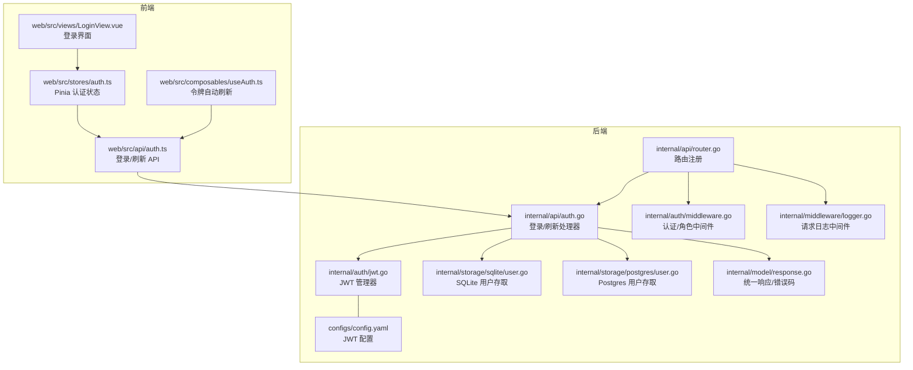
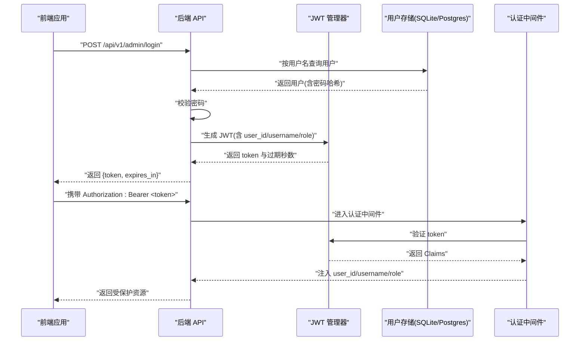
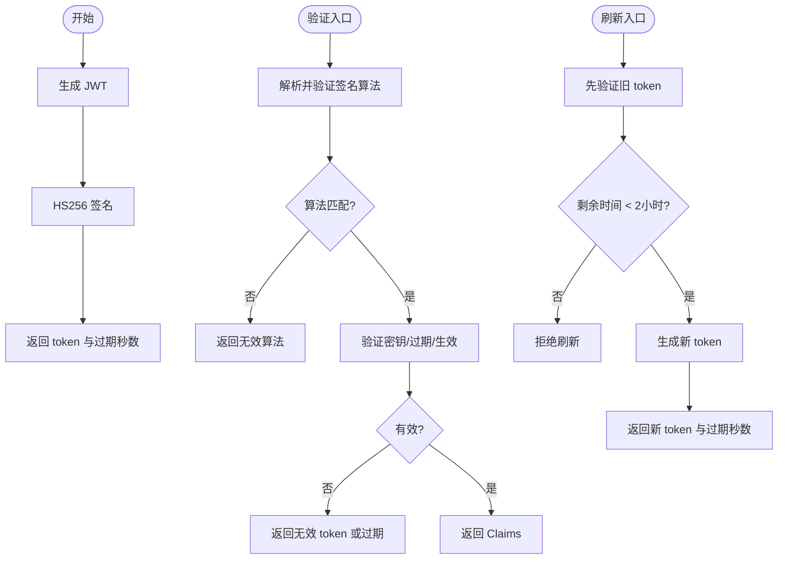
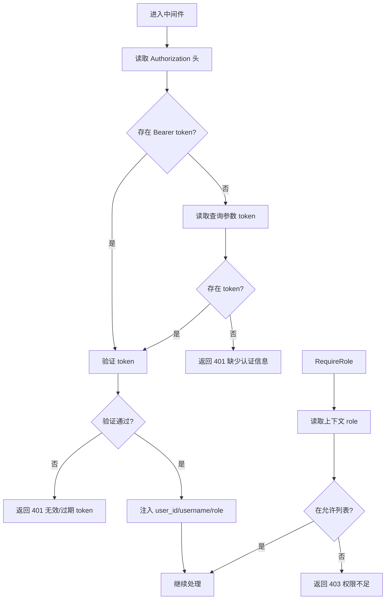
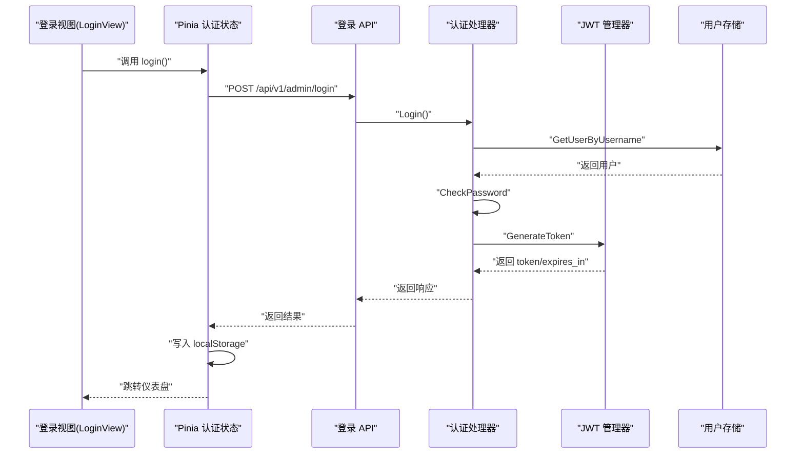
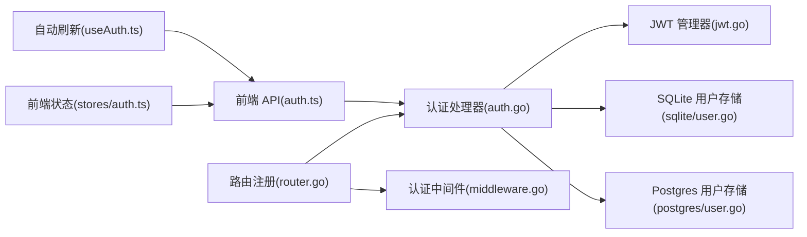

# 用户管理模块

<cite>
**本文引用的文件**
- [internal/auth/jwt.go](file://internal/auth/jwt.go)
- [internal/auth/middleware.go](file://internal/auth/middleware.go)
- [internal/api/auth.go](file://internal/api/auth.go)
- [internal/api/router.go](file://internal/api/router.go)
- [internal/model/user.go](file://internal/model/user.go)
- [internal/model/response.go](file://internal/model/response.go)
- [internal/model/errors.go](file://internal/model/errors.go)
- [internal/storage/sqlite/user.go](file://internal/storage/sqlite/user.go)
- [internal/storage/postgres/user.go](file://internal/storage/postgres/user.go)
- [configs/config.yaml](file://configs/config.yaml)
- [web/src/api/auth.ts](file://web/src/api/auth.ts)
- [web/src/stores/auth.ts](file://web/src/stores/auth.ts)
- [web/src/composables/useAuth.ts](file://web/src/composables/useAuth.ts)
- [web/src/views/LoginView.vue](file://web/src/views/LoginView.vue)
- [internal/middleware/logger.go](file://internal/middleware/logger.go)
- [internal/api/setup.go](file://internal/api/setup.go)
</cite>

## 目录
1. [简介](#简介)
2. [项目结构](#项目结构)
3. [核心组件](#核心组件)
4. [架构总览](#架构总览)
5. [详细组件分析](#详细组件分析)
6. [依赖分析](#依赖分析)
7. [性能考虑](#性能考虑)
8. [故障排查指南](#故障排查指南)
9. [结论](#结论)
10. [附录](#附录)

## 简介
本文件为用户管理模块的综合技术文档，覆盖以下主题：
- JWT 认证机制：令牌生成、验证与刷新流程
- 认证中间件设计与使用：权限检查、角色控制
- 用户登录流程与会话管理策略
- 完整 API 接口文档：登录、刷新、注销等
- 安全配置：JWT 密钥、过期时间、签名算法
- 前端认证状态管理与令牌存储最佳实践
- 安全审计与日志记录方案
- 多用户场景下的权限控制与数据隔离

## 项目结构
用户管理模块围绕后端 Go 服务与前端 Vue 应用协同工作，关键目录与职责如下：
- 后端
  - internal/auth：JWT 管理与 Gin 中间件
  - internal/api：认证与系统初始化等业务 API
  - internal/storage：SQLite/Postgres 用户数据访问层
  - internal/model：统一响应与错误码、用户模型
  - internal/middleware：请求日志中间件
  - configs：运行时配置（含 JWT 密钥与过期时间）
- 前端
  - web/src/api：与后端交互的 API 方法
  - web/src/stores：Pinia 状态管理（令牌与登录态）
  - web/src/composables：自动刷新逻辑
  - web/src/views：登录页与路由守卫配合

**图表来源**
- [internal/api/router.go:14-115](file://internal/api/router.go#L14-L115)
- [internal/api/auth.go:18-77](file://internal/api/auth.go#L18-L77)
- [internal/auth/jwt.go:25-58](file://internal/auth/jwt.go#L25-L58)
- [internal/auth/middleware.go:19-63](file://internal/auth/middleware.go#L19-L63)
- [internal/storage/sqlite/user.go:36-62](file://internal/storage/sqlite/user.go#L36-L62)
- [internal/storage/postgres/user.go:35-62](file://internal/storage/postgres/user.go#L35-L62)
- [internal/model/response.go:9-71](file://internal/model/response.go#L9-L71)
- [internal/middleware/logger.go:13-66](file://internal/middleware/logger.go#L13-L66)
- [configs/config.yaml:23-25](file://configs/config.yaml#L23-L25)
- [web/src/api/auth.ts:13-19](file://web/src/api/auth.ts#L13-L19)
- [web/src/stores/auth.ts:7-25](file://web/src/stores/auth.ts#L7-L25)
- [web/src/composables/useAuth.ts:4-36](file://web/src/composables/useAuth.ts#L4-L36)
- [web/src/views/LoginView.vue:34-55](file://web/src/views/LoginView.vue#L34-L55)

**章节来源**
- [internal/api/router.go:14-115](file://internal/api/router.go#L14-L115)
- [configs/config.yaml:23-25](file://configs/config.yaml#L23-L25)

## 核心组件
- JWT 管理器：负责生成、验证与刷新令牌；内置密码哈希与校验
- 认证中间件：从请求头或查询参数提取并验证 JWT，注入用户上下文
- 角色中间件：基于上下文中的角色进行权限判定
- 认证处理器：登录与刷新 Token 的 API 实现
- 用户模型与统一响应：标准化前后端交互格式
- 前端状态管理：本地存储令牌、登录登出、自动刷新

**章节来源**
- [internal/auth/jwt.go:11-114](file://internal/auth/jwt.go#L11-L114)
- [internal/auth/middleware.go:11-95](file://internal/auth/middleware.go#L11-L95)
- [internal/api/auth.go:12-77](file://internal/api/auth.go#L12-L77)
- [internal/model/user.go:5-14](file://internal/model/user.go#L5-L14)
- [internal/model/response.go:9-71](file://internal/model/response.go#L9-L71)
- [web/src/stores/auth.ts:7-25](file://web/src/stores/auth.ts#L7-L25)

## 架构总览
后端通过 Gin 路由分组与中间件实现“无需认证”“需认证”“需管理员角色”的三层保护；前端通过 Pinia 管理登录态，并在令牌即将过期时自动刷新。

**图表来源**
- [internal/api/auth.go:38-77](file://internal/api/auth.go#L38-L77)
- [internal/auth/jwt.go:33-58](file://internal/auth/jwt.go#L33-L58)
- [internal/storage/sqlite/user.go:36-62](file://internal/storage/sqlite/user.go#L36-L62)
- [internal/storage/postgres/user.go:35-62](file://internal/storage/postgres/user.go#L35-L62)
- [internal/auth/middleware.go:19-63](file://internal/auth/middleware.go#L19-L63)

## 详细组件分析

### JWT 认证机制
- 令牌结构：包含自定义声明（用户ID、用户名、角色）与标准声明（签发时间、生效时间、过期时间）
- 生成流程：以 HS256 签名，使用配置的密钥与过期时间生成
- 验证流程：校验签名算法与密钥，检查过期与生效时间，返回 Claims
- 刷新流程：仅当剩余有效期小于 2 小时时允许刷新，新令牌继承原 Claims

**图表来源**
- [internal/auth/jwt.go:33-101](file://internal/auth/jwt.go#L33-L101)
- [configs/config.yaml:23-25](file://configs/config.yaml#L23-L25)

**章节来源**
- [internal/auth/jwt.go:11-114](file://internal/auth/jwt.go#L11-L114)
- [configs/config.yaml:23-25](file://configs/config.yaml#L23-L25)

### 认证中间件与权限控制
- JWTAuthMiddleware：优先从 Authorization 头提取 Bearer token，否则从查询参数 token 获取；验证失败返回 401；成功将 user_id、username、role 注入上下文
- RequireRole：检查上下文中的角色是否在允许列表内，不在则返回 403
- SetupCheckMiddleware：系统未初始化时，对管理页面请求重定向至 /setup，API 请求返回 503

**图表来源**
- [internal/auth/middleware.go:19-95](file://internal/auth/middleware.go#L19-L95)

**章节来源**
- [internal/auth/middleware.go:11-148](file://internal/auth/middleware.go#L11-L148)

### 用户登录流程与会话管理
- 登录接口：接收用户名与密码，查询用户并校验密码，检查用户状态，生成 JWT 返回
- 会话策略：前端将 token 存入 localStorage，后续请求由中间件自动验证；提供自动刷新逻辑，避免频繁过期

**图表来源**
- [web/src/views/LoginView.vue:34-55](file://web/src/views/LoginView.vue#L34-L55)
- [web/src/stores/auth.ts:12-16](file://web/src/stores/auth.ts#L12-L16)
- [web/src/api/auth.ts:13-15](file://web/src/api/auth.ts#L13-L15)
- [internal/api/auth.go:38-77](file://internal/api/auth.go#L38-L77)
- [internal/auth/jwt.go:33-58](file://internal/auth/jwt.go#L33-L58)
- [internal/storage/sqlite/user.go:36-62](file://internal/storage/sqlite/user.go#L36-L62)

**章节来源**
- [internal/api/auth.go:38-77](file://internal/api/auth.go#L38-L77)
- [web/src/stores/auth.ts:7-25](file://web/src/stores/auth.ts#L7-L25)
- [web/src/views/LoginView.vue:34-55](file://web/src/views/LoginView.vue#L34-L55)

### API 接口文档
- 登录
  - 方法与路径：POST /api/v1/admin/login
  - 请求体：{ username, password }
  - 成功响应：{ token, expires_in }
  - 错误码：登录失败、参数缺失、内部错误
- 刷新 Token
  - 方法与路径：POST /api/v1/admin/refresh-token
  - 请求头：Authorization: Bearer <token>
  - 成功响应：{ token, expires_in }
  - 错误码：无效 JWT、Token 已过期、参数缺失、内部错误
- 注销
  - 前端：清除 localStorage 中的 token，跳转到登录页
  - 后端：无专用注销接口，依赖 token 过期与黑名单策略（可选）

**章节来源**
- [internal/api/auth.go:38-126](file://internal/api/auth.go#L38-L126)
- [web/src/api/auth.ts:13-19](file://web/src/api/auth.ts#L13-L19)
- [web/src/stores/auth.ts:18-22](file://web/src/stores/auth.ts#L18-L22)

### 安全配置选项
- JWT 密钥管理：配置文件中的 secret 字段用于 HS256 签名，建议使用强随机字符串并在部署环境以环境变量注入
- 过期时间设置：expiration 字段支持时长单位（如 24h），根据业务调整
- 签名算法选择：当前实现固定为 HS256，如需 RS256 等非对称算法需扩展 JWT 管理器
- TLS 与传输安全：可在配置中启用 TLS 并指定证书文件

**章节来源**
- [configs/config.yaml:23-25](file://configs/config.yaml#L23-L25)
- [configs/config.yaml:6-9](file://configs/config.yaml#L6-L9)
- [internal/auth/jwt.go:50](file://internal/auth/jwt.go#L50)

### 前端认证状态管理与令牌存储最佳实践
- 令牌存储：使用 localStorage 持久化 token，避免内存中泄露
- 自动刷新：在令牌剩余时间小于 2 小时窗口时定期刷新，减少用户体验中断
- 登录页与路由：登录成功后跳转到受保护页面；未登录访问受保护路由时重定向至登录页
- 错误处理：捕获登录/刷新失败并提示用户

**章节来源**
- [web/src/stores/auth.ts:7-25](file://web/src/stores/auth.ts#L7-L25)
- [web/src/composables/useAuth.ts:4-36](file://web/src/composables/useAuth.ts#L4-L36)
- [web/src/views/LoginView.vue:34-55](file://web/src/views/LoginView.vue#L34-L55)

### 安全审计与日志记录方案
- 结构化日志：记录 trace_id、方法、路径、状态码、耗时、客户端 IP、User-Agent，错误时附加错误列表
- 日志级别：依据状态码自动选择日志级别（错误/警告/信息）
- 建议：生产环境输出到文件并轮转，结合 trace_id 进行问题追踪

**章节来源**
- [internal/middleware/logger.go:13-66](file://internal/middleware/logger.go#L13-L66)

### 多用户场景下的权限控制与数据隔离
- 角色模型：用户模型包含 role 字段，支持 admin/user 等角色
- 路由级权限：通过 RequireRole 中间件限制管理员操作
- 数据隔离：用户信息存储于数据库，不同用户的数据通过业务层隔离；建议在数据查询时加入用户维度过滤

**章节来源**
- [internal/model/user.go:5-14](file://internal/model/user.go#L5-L14)
- [internal/auth/middleware.go:65-95](file://internal/auth/middleware.go#L65-L95)
- [internal/api/router.go:107-114](file://internal/api/router.go#L107-L114)

## 依赖分析
- 组件耦合
  - 认证处理器依赖 JWT 管理器与存储层
  - 路由注册集中装配处理器与中间件
  - 前端 API 与状态管理依赖后端接口契约
- 外部依赖
  - JWT 库：github.com/golang-jwt/jwt/v5
  - Web 框架：github.com/gin-gonic/gin
  - 日志：log/slog
  - 数据库驱动：SQLite/Postgres

**图表来源**
- [internal/api/router.go:14-115](file://internal/api/router.go#L14-L115)
- [internal/api/auth.go:18-77](file://internal/api/auth.go#L18-L77)
- [internal/auth/jwt.go:25-58](file://internal/auth/jwt.go#L25-L58)
- [internal/storage/sqlite/user.go:36-62](file://internal/storage/sqlite/user.go#L36-L62)
- [internal/storage/postgres/user.go:35-62](file://internal/storage/postgres/user.go#L35-L62)
- [internal/auth/middleware.go:19-63](file://internal/auth/middleware.go#L19-L63)
- [web/src/api/auth.ts:13-19](file://web/src/api/auth.ts#L13-L19)
- [web/src/stores/auth.ts:7-25](file://web/src/stores/auth.ts#L7-L25)
- [web/src/composables/useAuth.ts:4-36](file://web/src/composables/useAuth.ts#L4-L36)

**章节来源**
- [internal/api/router.go:14-115](file://internal/api/router.go#L14-L115)

## 性能考虑
- JWT 验证成本低：HS256 仅需解码与哈希校验
- 密码哈希：bcrypt cost=12，兼顾安全性与性能
- 前端自动刷新：定时器周期性检查，建议在后台标签页降低频率或暂停
- 数据库访问：用户查询走索引（username），并发写入加锁（SQLite）

[本节为通用指导，无需具体文件分析]

## 故障排查指南
- 常见错误码
  - 登录失败：用户名不存在或密码错误
  - 无效 JWT/Token 已过期：检查请求头 Authorization 或刷新 token
  - 权限不足：确认角色是否满足 RequireRole 要求
  - 参数缺失/内部错误：检查请求体与服务端日志
- 日志定位
  - 查看 trace_id 对应的日志条目，定位请求链路与错误原因
- 前端问题
  - 无法登录：确认 token 是否写入 localStorage，网络请求是否成功
  - 刷新失败：确认剩余有效期是否小于 2 小时

**章节来源**
- [internal/model/errors.go:13-38](file://internal/model/errors.go#L13-L38)
- [internal/middleware/logger.go:13-66](file://internal/middleware/logger.go#L13-L66)
- [web/src/stores/auth.ts:18-22](file://web/src/stores/auth.ts#L18-L22)

## 结论
该用户管理模块以 JWT 为核心，结合 Gin 中间件实现了完善的认证与授权能力；前端通过 Pinia 与自动刷新机制保障了良好的用户体验。建议在生产环境中强化密钥管理、启用 TLS、完善审计日志，并根据业务需求扩展角色与数据隔离策略。

[本节为总结性内容，无需具体文件分析]

## 附录

### 配置项速览
- JWT 密钥与过期时间：在配置文件中设置
- TLS 开关与证书：用于 HTTPS 传输
- 日志级别与输出：控制日志格式与落盘

**章节来源**
- [configs/config.yaml:23-25](file://configs/config.yaml#L23-L25)
- [configs/config.yaml:6-9](file://configs/config.yaml#L6-L9)
- [configs/config.yaml:34-41](file://configs/config.yaml#L34-L41)