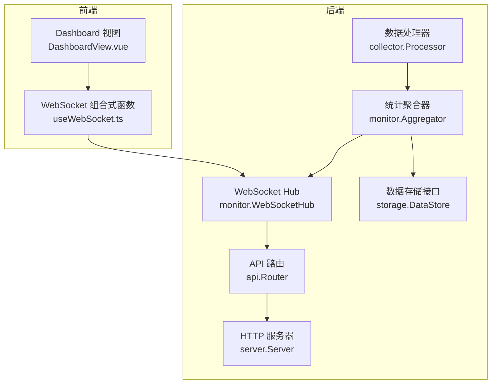
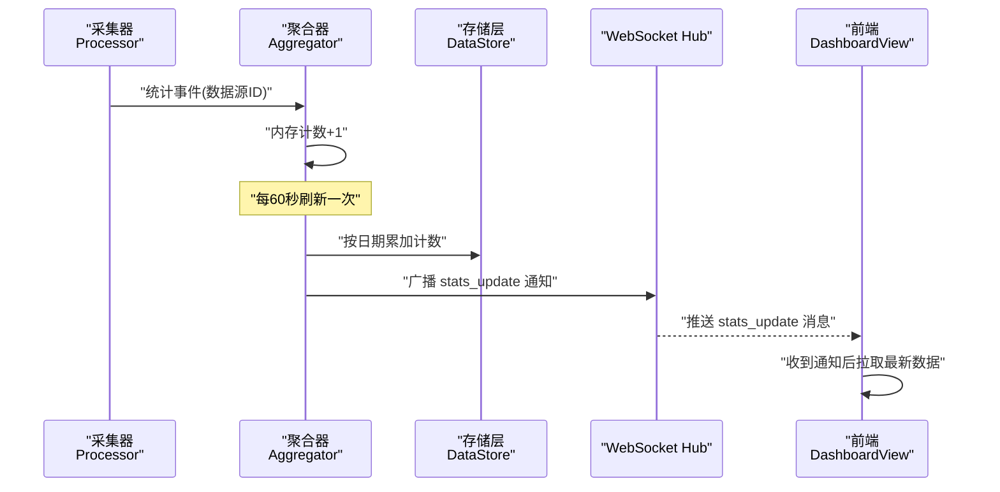
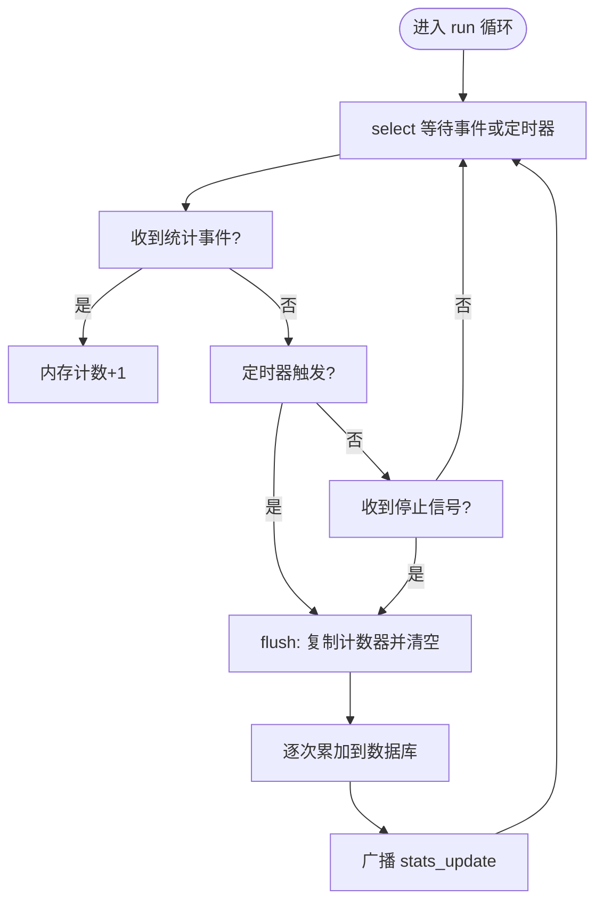
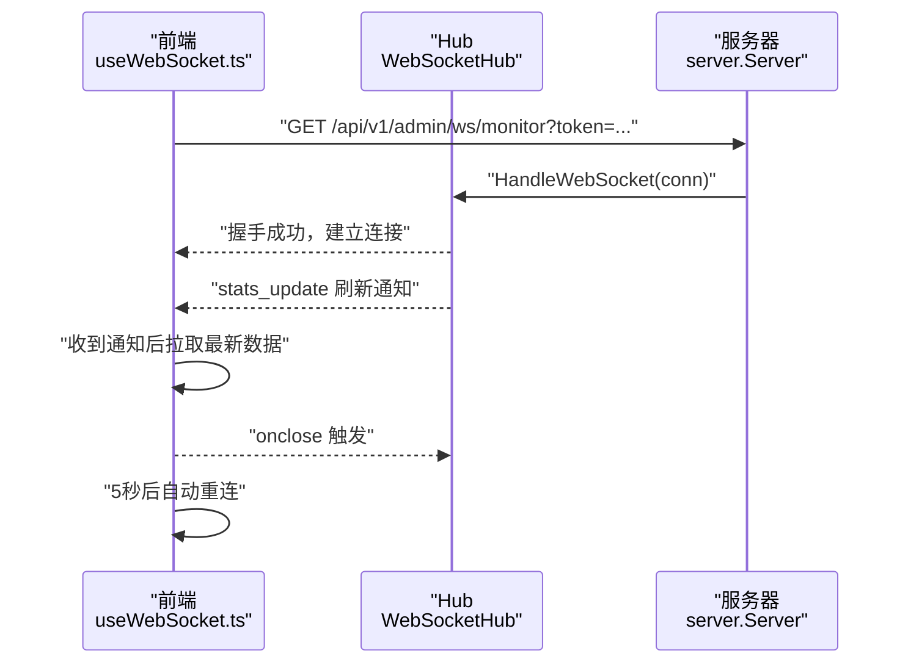
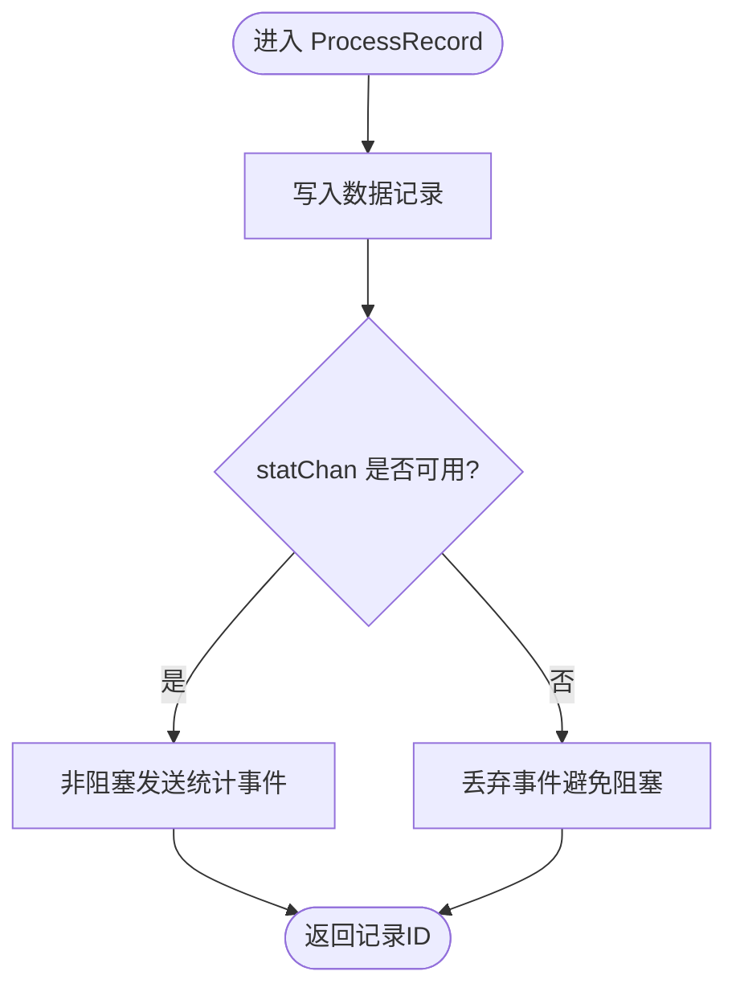
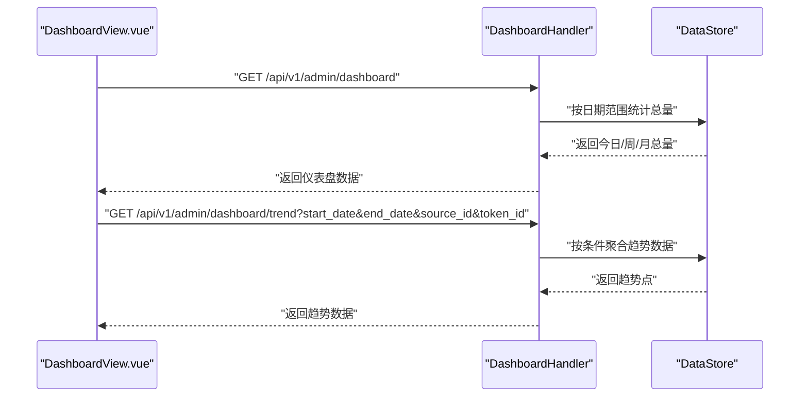
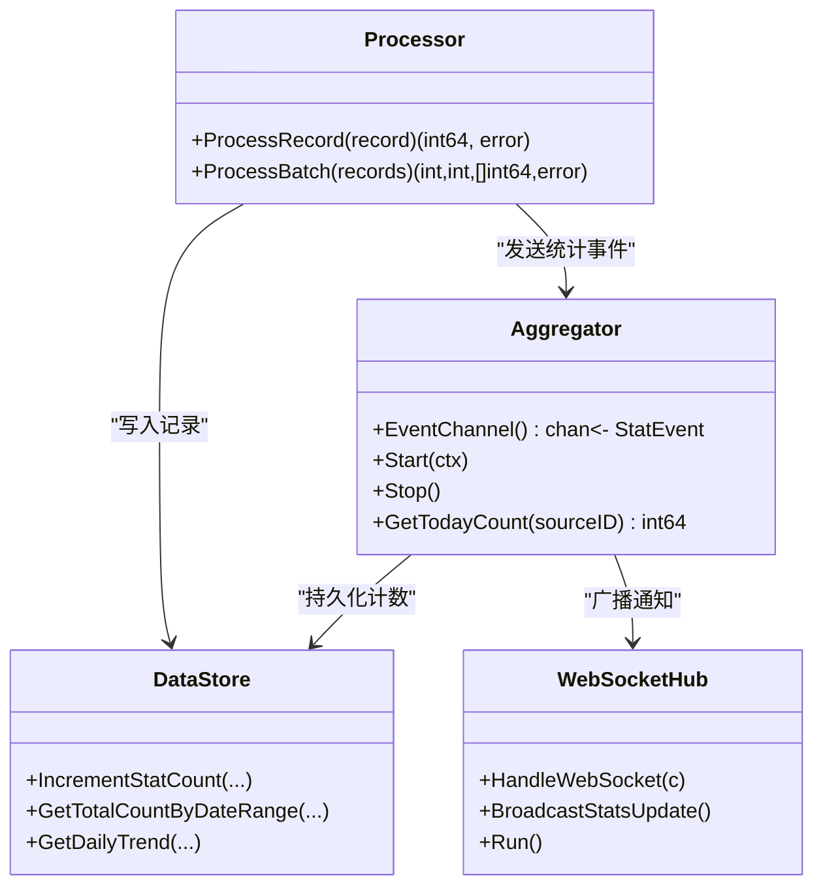

# 监控模块

<cite>
**本文引用的文件**
- [cmd/server/main.go](file://cmd/server/main.go)
- [internal/monitor/aggregator.go](file://internal/monitor/aggregator.go)
- [internal/monitor/websocket.go](file://internal/monitor/websocket.go)
- [internal/collector/processor.go](file://internal/collector/processor.go)
- [internal/api/router.go](file://internal/api/router.go)
- [internal/api/dashboard.go](file://internal/api/dashboard.go)
- [internal/server/server.go](file://internal/server/server.go)
- [internal/storage/interface.go](file://internal/storage/interface.go)
- [internal/storage/sqlite/statistics.go](file://internal/storage/sqlite/statistics.go)
- [internal/storage/postgres/statistics.go](file://internal/storage/postgres/statistics.go)
- [internal/model/statistics.go](file://internal/model/statistics.go)
- [web/src/views/DashboardView.vue](file://web/src/views/DashboardView.vue)
- [web/src/composables/useWebSocket.ts](file://web/src/composables/useWebSocket.ts)
</cite>

## 目录
1. [简介](#简介)
2. [项目结构](#项目结构)
3. [核心组件](#核心组件)
4. [架构总览](#架构总览)
5. [详细组件分析](#详细组件分析)
6. [依赖分析](#依赖分析)
7. [性能考量](#性能考量)
8. [故障排除指南](#故障排除指南)
9. [结论](#结论)
10. [附录](#附录)

## 简介
本文件系统性阐述监控模块的实现与使用，覆盖以下主题：
- WebSocket 实时通信：连接建立、消息推送、断线重连机制
- 统计数据聚合器（Aggregator）：日统计计算、趋势分析、数据缓存策略
- 监控事件触发与推送频率控制
- WebSocket 客户端连接示例与消息格式说明
- 监控数据的存储与查询优化方案
- 实时图表实现与前端集成方法
- 性能监控指标与调优建议
- 故障排除与调试技巧

## 项目结构
监控模块位于后端 Go 代码与前端 Vue 代码中，核心交互路径如下：
- 数据采集链路：采集器将数据写入数据库，同时通过通道向聚合器上报统计事件
- 聚合器：周期性刷新内存计数到数据库，并广播“统计数据更新”通知
- WebSocket Hub：维护客户端连接，接收广播并向所有客户端推送通知
- 前端：通过 WebSocket 监听“统计数据更新”，拉取最新仪表盘数据并渲染趋势图

**图表来源**
- [internal/collector/processor.go:1-84](file://internal/collector/processor.go#L1-L84)
- [internal/monitor/aggregator.go:1-197](file://internal/monitor/aggregator.go#L1-L197)
- [internal/monitor/websocket.go:1-216](file://internal/monitor/websocket.go#L1-L216)
- [internal/storage/interface.go:1-57](file://internal/storage/interface.go#L1-L57)
- [internal/api/router.go:1-116](file://internal/api/router.go#L1-L116)
- [internal/server/server.go:1-139](file://internal/server/server.go#L1-L139)
- [web/src/views/DashboardView.vue:1-470](file://web/src/views/DashboardView.vue#L1-L470)
- [web/src/composables/useWebSocket.ts:1-66](file://web/src/composables/useWebSocket.ts#L1-L66)

**章节来源**
- [cmd/server/main.go:1-201](file://cmd/server/main.go#L1-L201)
- [internal/server/server.go:54-87](file://internal/server/server.go#L54-L87)
- [internal/api/router.go:14-116](file://internal/api/router.go#L14-L116)

## 核心组件
- 统计聚合器（Aggregator）
  - 负责接收统计事件、累积内存计数、定时刷新到数据库、触发 WebSocket 广播
  - 提供查询当前日期累计值与强制刷新能力
- WebSocket Hub
  - 维护客户端集合、注册/注销客户端、广播消息、心跳与超时处理
- 数据处理器（Processor）
  - 写入数据记录后，向聚合器事件通道发送统计事件
- 仪表盘 API
  - 提供今日/周/月总量、最近记录、趋势数据查询接口
- 前端 Dashboard
  - 通过 WebSocket 监听更新通知，拉取最新数据并渲染趋势图

**章节来源**
- [internal/monitor/aggregator.go:17-197](file://internal/monitor/aggregator.go#L17-L197)
- [internal/monitor/websocket.go:14-216](file://internal/monitor/websocket.go#L14-L216)
- [internal/collector/processor.go:16-84](file://internal/collector/processor.go#L16-L84)
- [internal/api/dashboard.go:13-139](file://internal/api/dashboard.go#L13-L139)
- [web/src/views/DashboardView.vue:122-366](file://web/src/views/DashboardView.vue#L122-L366)

## 架构总览
监控模块采用“事件驱动 + 分层存储”的设计：
- 事件通道：采集器将事件推送到聚合器的事件通道
- 聚合层：聚合器按固定周期（每分钟）将内存计数持久化，并广播“统计数据更新”
- 传输层：WebSocket Hub 将广播消息推送给所有已认证连接的客户端
- 展示层：前端收到通知后主动拉取最新数据并渲染

**图表来源**
- [internal/collector/processor.go:34-52](file://internal/collector/processor.go#L34-L52)
- [internal/monitor/aggregator.go:53-133](file://internal/monitor/aggregator.go#L53-L133)
- [internal/monitor/websocket.go:110-127](file://internal/monitor/websocket.go#L110-L127)
- [web/src/views/DashboardView.vue:163-182](file://web/src/views/DashboardView.vue#L163-L182)

## 详细组件分析

### 统计聚合器（Aggregator）
- 设计要点
  - 内存计数：以 sourceID 为键的 map，避免频繁写库
  - 定时刷新：每 60 秒将内存计数复制并清空，再批量持久化
  - 广播通知：刷新完成后通过 Hub 广播“stats_update”，前端收到后拉取最新数据
  - 并发安全：使用互斥锁保护计数器与刷新过程
- 关键行为
  - EventChannel：对外暴露只写通道，供 Processor 使用
  - Start/Stop：启动后台循环与优雅停止
  - Flush：将计数器复制到临时 map，清空原表，逐次调用存储接口累加
  - 查询接口：GetTodayCount、GetAllCounters（调试）

**图表来源**
- [internal/monitor/aggregator.go:53-133](file://internal/monitor/aggregator.go#L53-L133)

**章节来源**
- [internal/monitor/aggregator.go:17-197](file://internal/monitor/aggregator.go#L17-L197)

### WebSocket 实时通信
- 连接建立
  - 路由：/api/v1/admin/ws/monitor，需 JWT 认证
  - 升级：使用 Gorilla WebSocket Upgrader，设置读写缓冲与跨域策略
- 消息推送
  - 广播：Hub 将 JSON 消息推送到每个客户端 send 缓冲
  - 消息类型：stats_update，内容为刷新动作提示
- 心跳与断线重连
  - 心跳：每 30 秒发送 Ping，客户端超时后自动断开
  - 断线重连：前端组合式函数在 onclose 后 5 秒重连

**图表来源**
- [internal/server/server.go:79-83](file://internal/server/server.go#L79-L83)
- [internal/monitor/websocket.go:130-147](file://internal/monitor/websocket.go#L130-L147)
- [web/src/composables/useWebSocket.ts:9-38](file://web/src/composables/useWebSocket.ts#L9-L38)

**章节来源**
- [internal/monitor/websocket.go:14-216](file://internal/monitor/websocket.go#L14-L216)
- [web/src/composables/useWebSocket.ts:1-66](file://web/src/composables/useWebSocket.ts#L1-L66)

### 数据处理器（Processor）
- 处理流程
  - 写入数据记录到存储层
  - 将统计事件发送至聚合器事件通道
  - 对于通道阻塞，采用非阻塞发送，避免影响主流程吞吐
- 批量处理
  - 逐条处理，统计成功/失败数量，返回批次结果

**图表来源**
- [internal/collector/processor.go:34-52](file://internal/collector/processor.go#L34-L52)

**章节来源**
- [internal/collector/processor.go:16-84](file://internal/collector/processor.go#L16-L84)

### 仪表盘 API 与前端集成
- 后端 API
  - 仪表盘汇总：今日/周/月总量、数据源总数、最近记录
  - 趋势数据：支持按日期范围、数据源、Token 聚合
- 前端集成
  - 使用组合式函数 useWebSocket 建立连接与断线重连
  - 监听 stats_update，触发刷新逻辑
  - ECharts 渲染趋势图，按日期范围填充空缺日期

**图表来源**
- [internal/api/dashboard.go:34-139](file://internal/api/dashboard.go#L34-L139)
- [web/src/views/DashboardView.vue:171-311](file://web/src/views/DashboardView.vue#L171-L311)

**章节来源**
- [internal/api/dashboard.go:13-139](file://internal/api/dashboard.go#L13-L139)
- [web/src/views/DashboardView.vue:122-366](file://web/src/views/DashboardView.vue#L122-L366)

## 依赖分析
- 组件耦合
  - Processor 仅依赖 DataStore 接口与聚合器事件通道
  - Aggregator 依赖 DataStore 接口与 WebSocket Hub
  - Hub 与前端无直接依赖，仅通过消息协议交互
- 数据流
  - 数据写入：Processor → DataStore
  - 统计事件：Processor → Aggregator → Hub → 前端
- 存储接口
  - DataStore 定义了统计相关方法：增量计数、按日期范围查询、按数据源聚合、趋势查询

**图表来源**
- [internal/collector/processor.go:16-84](file://internal/collector/processor.go#L16-L84)
- [internal/monitor/aggregator.go:17-197](file://internal/monitor/aggregator.go#L17-L197)
- [internal/monitor/websocket.go:14-216](file://internal/monitor/websocket.go#L14-L216)
- [internal/storage/interface.go:9-56](file://internal/storage/interface.go#L9-L56)

**章节来源**
- [internal/storage/interface.go:9-56](file://internal/storage/interface.go#L9-L56)

## 性能考量
- 聚合器刷新频率
  - 默认每 60 秒刷新一次，平衡延迟与写库压力；可根据流量调优
- 事件通道容量
  - 聚合器事件通道容量为 1000，可减少高并发下的阻塞；如仍出现丢弃，可考虑增大或引入背压策略
- 存储层优化
  - SQLite/Postgres 的增量计数使用 UPSERT，避免重复查询；建议为 statistics 表的 (source_id, stat_date) 建立复合索引
  - 趋势查询按日期范围扫描，建议为 stat_date 建立索引
- WebSocket
  - Hub 广播通道为无缓冲，消息会阻塞直到有消费者消费；建议前端及时消费并降低刷新频率
  - 心跳间隔 30 秒，超时时间 10 秒，适合大多数网络环境
- 前端渲染
  - 趋势图按日期范围填充空缺日期，避免折线断裂；建议对大数据集启用虚拟滚动或分页

[本节为通用性能建议，无需特定文件来源]

## 故障排除指南
- WebSocket 无法连接
  - 检查路由是否正确：/api/v1/admin/ws/monitor
  - 确认已携带有效 JWT token
  - 查看服务器日志中“websocket upgrade failed”相关错误
- 前端不断重连
  - 检查 onclose 回调是否被触发，确认断线重连逻辑生效
  - 若网络不稳定，可适当延长重连间隔
- 数据未更新
  - 确认聚合器是否正常运行且定时刷新
  - 检查存储层是否成功写入（日志中是否有“failed to increment stat count”）
  - 前端是否收到“stats_update”通知并触发刷新
- 趋势数据为空
  - 检查日期范围参数是否正确传递
  - 确认数据源/Token 选择与查询条件一致
- 日志定位
  - 聚合器与 Hub 均记录关键事件与错误，优先查看对应日志

**章节来源**
- [internal/monitor/websocket.go:130-147](file://internal/monitor/websocket.go#L130-L147)
- [internal/monitor/aggregator.go:115-125](file://internal/monitor/aggregator.go#L115-L125)
- [web/src/composables/useWebSocket.ts:27-34](file://web/src/composables/useWebSocket.ts#L27-L34)

## 结论
监控模块通过“事件通道 + 聚合器 + WebSocket Hub”的解耦设计，实现了低延迟、可扩展的实时监控能力。聚合器以内存计数与定时刷新兼顾吞吐与一致性；WebSocket 提供可靠的推送通道；前端以通知驱动的方式拉取最新数据并渲染趋势图。配合合理的存储索引与前端渲染优化，可在高并发场景下保持稳定表现。

[本节为总结性内容，无需特定文件来源]

## 附录

### WebSocket 客户端连接示例与消息格式
- 连接地址
  - ws://host/api/v1/admin/ws/monitor?token=YOUR_JWT_TOKEN
  - https://host/api/v1/admin/ws/monitor?token=YOUR_JWT_TOKEN
- 消息格式
  - 类型：stats_update
  - 数据：包含 action 字段，值为 refresh，提示前端刷新数据
- 断线重连
  - 前端在 onclose 时 5 秒后自动重连

**章节来源**
- [web/src/views/DashboardView.vue:157-168](file://web/src/views/DashboardView.vue#L157-L168)
- [web/src/composables/useWebSocket.ts:9-38](file://web/src/composables/useWebSocket.ts#L9-L38)
- [internal/monitor/websocket.go:110-127](file://internal/monitor/websocket.go#L110-L127)

### 监控数据的存储与查询优化
- 存储接口方法
  - 增量计数：IncrementStatCount
  - 按日期范围统计总量：GetTotalCountByDateRange
  - 按数据源统计总量：GetCountBySourceID
  - 趋势查询：GetDailyTrend（支持全局/数据源/Token 三种粒度）
- 建议索引
  - statistics(source_id, stat_date)：加速按数据源与日期的查询
  - statistics(stat_date)：加速按日期范围的聚合
- 查询优化
  - 前端传入明确的日期范围，避免全表扫描
  - 趋势数据按日聚合，必要时进行分页或采样

**章节来源**
- [internal/storage/interface.go:45-50](file://internal/storage/interface.go#L45-L50)
- [internal/storage/sqlite/statistics.go:10-146](file://internal/storage/sqlite/statistics.go#L10-L146)
- [internal/storage/postgres/statistics.go:10-143](file://internal/storage/postgres/statistics.go#L10-L143)
- [internal/model/statistics.go:5-20](file://internal/model/statistics.go#L5-L20)

### 实时图表实现与前端集成方法
- 图表库
  - 使用 ECharts，按日期范围渲染折线图
- 数据填充
  - 前端将趋势数据映射为日期到数值的字典，再按起止日期生成完整序列，缺失日期补 0
- 交互
  - 时间范围切换（今日/7天/30天/自定义），支持数据源与 Token 下拉筛选
  - WebSocket 监听 stats_update，自动刷新数据

**章节来源**
- [web/src/views/DashboardView.vue:199-311](file://web/src/views/DashboardView.vue#L199-L311)