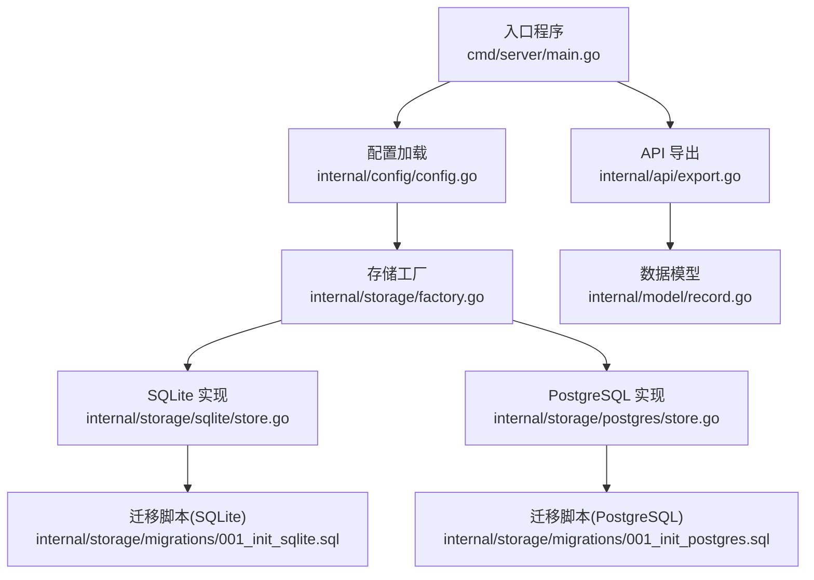
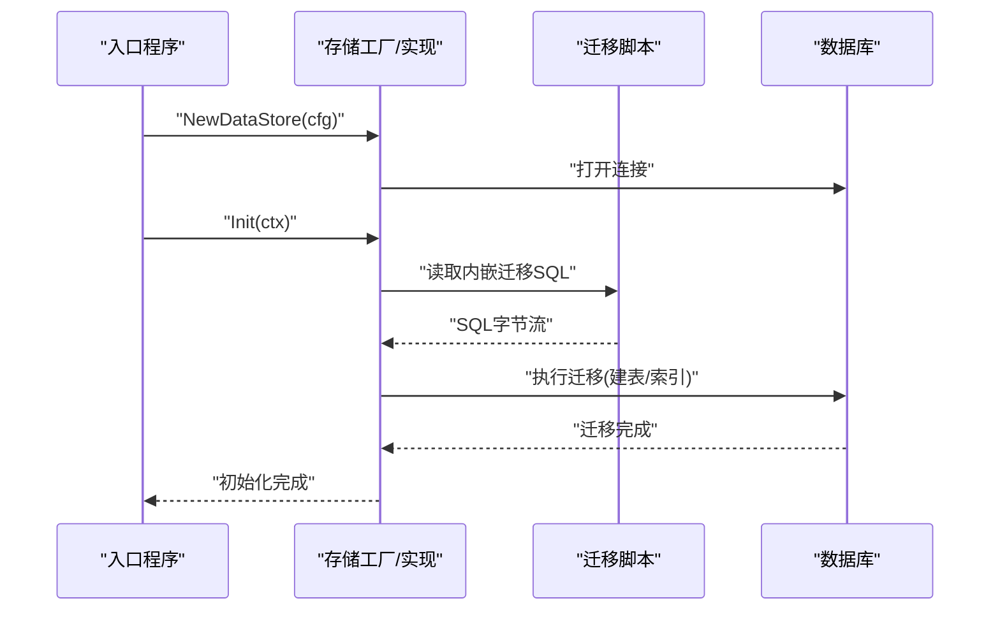
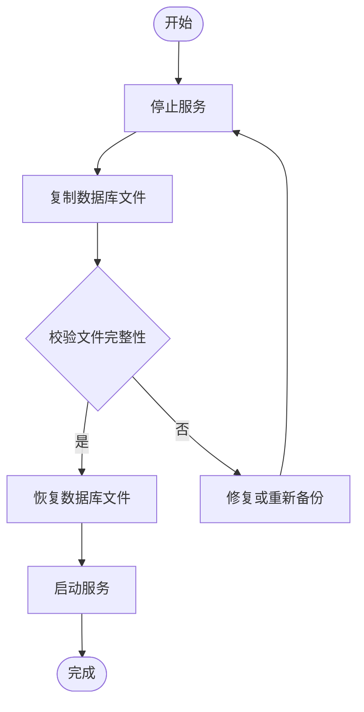
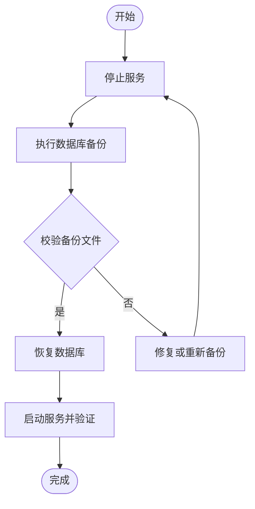
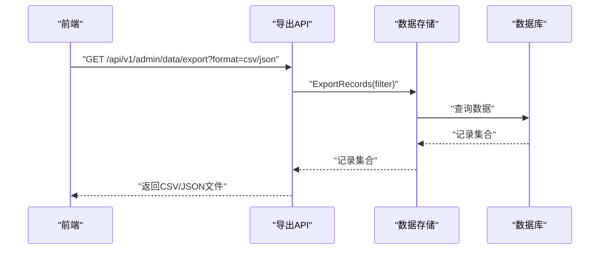
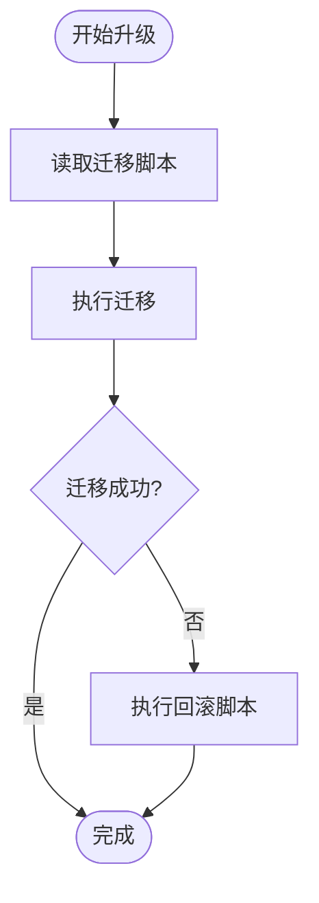
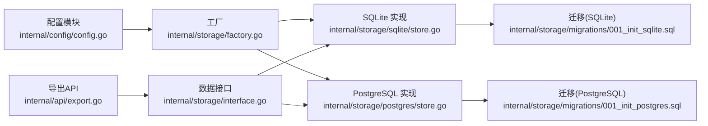

# 备份恢复

<cite>
**本文引用的文件**
- [configs/config.yaml](file://configs/config.yaml)
- [internal/config/config.go](file://internal/config/config.go)
- [internal/storage/factory.go](file://internal/storage/factory.go)
- [internal/storage/interface.go](file://internal/storage/interface.go)
- [internal/storage/sqlite/store.go](file://internal/storage/sqlite/store.go)
- [internal/storage/postgres/store.go](file://internal/storage/postgres/store.go)
- [internal/storage/migrations/001_init_sqlite.sql](file://internal/storage/migrations/001_init_sqlite.sql)
- [internal/storage/migrations/001_init_postgres.sql](file://internal/storage/migrations/001_init_postgres.sql)
- [internal/storage/migrations/embed.go](file://internal/storage/migrations/embed.go)
- [internal/api/export.go](file://internal/api/export.go)
- [internal/model/record.go](file://internal/model/record.go)
- [cmd/server/main.go](file://cmd/server/main.go)
- [web/src/docs/api.md](file://web/src/docs/api.md)
- [web/src/api/data.ts](file://web/src/api/data.ts)
</cite>

## 目录
1. [简介](#简介)
2. [项目结构](#项目结构)
3. [核心组件](#核心组件)
4. [架构总览](#架构总览)
5. [详细组件分析](#详细组件分析)
6. [依赖关系分析](#依赖关系分析)
7. [性能考量](#性能考量)
8. [故障排查指南](#故障排查指南)
9. [结论](#结论)
10. [附录](#附录)

## 简介
本指南聚焦于 DataCollector 的备份与恢复机制，覆盖 SQLite 与 PostgreSQL 两种数据库后端的备份策略、恢复流程、自动化脚本与配置建议、数据库迁移与版本升级流程、数据导出与导入使用方法、备份数据的存储位置与命名规范、灾难恢复计划与应急响应流程、数据完整性验证与恢复测试方法，以及针对不同数据库后端的特定注意事项。

## 项目结构
DataCollector 的数据库相关能力由以下模块协同实现：
- 配置层：负责解析 YAML 配置与环境变量覆盖，提供数据库驱动与连接信息。
- 存储层：根据配置动态创建 SQLite 或 PostgreSQL 实现，并在启动时执行迁移。
- 迁移层：内嵌 SQL 文件，定义初始表结构与索引。
- API 层：提供数据导出能力，支持 CSV/JSON 格式下载。
- 入口程序：应用启动时确保目录、加载配置、初始化存储并执行迁移。

图表来源
- [cmd/server/main.go:45-57](file://cmd/server/main.go#L45-L57)
- [internal/config/config.go:197-215](file://internal/config/config.go#L197-L215)
- [internal/storage/factory.go:11-21](file://internal/storage/factory.go#L11-L21)
- [internal/storage/sqlite/store.go:58-75](file://internal/storage/sqlite/store.go#L58-L75)
- [internal/storage/postgres/store.go:36-50](file://internal/storage/postgres/store.go#L36-L50)
- [internal/storage/migrations/001_init_sqlite.sql:1-97](file://internal/storage/migrations/001_init_sqlite.sql#L1-L97)
- [internal/storage/migrations/001_init_postgres.sql:1-91](file://internal/storage/migrations/001_init_postgres.sql#L1-L91)
- [internal/api/export.go:28-61](file://internal/api/export.go#L28-L61)
- [internal/model/record.go:8-26](file://internal/model/record.go#L8-L26)

章节来源
- [configs/config.yaml:11-21](file://configs/config.yaml#L11-L21)
- [internal/config/config.go:36-56](file://internal/config/config.go#L36-L56)
- [internal/storage/factory.go:11-21](file://internal/storage/factory.go#L11-L21)
- [internal/storage/sqlite/store.go:23-56](file://internal/storage/sqlite/store.go#L23-L56)
- [internal/storage/postgres/store.go:19-34](file://internal/storage/postgres/store.go#L19-L34)
- [internal/storage/migrations/001_init_sqlite.sql:1-97](file://internal/storage/migrations/001_init_sqlite.sql#L1-L97)
- [internal/storage/migrations/001_init_postgres.sql:1-91](file://internal/storage/migrations/001_init_postgres.sql#L1-L91)
- [internal/api/export.go:28-61](file://internal/api/export.go#L28-L61)
- [internal/model/record.go:8-26](file://internal/model/record.go#L8-L26)
- [cmd/server/main.go:45-64](file://cmd/server/main.go#L45-L64)

## 核心组件
- 配置与连接
  - 数据库驱动与连接信息来自配置文件与环境变量覆盖，支持 sqlite 与 postgres 两种驱动。
  - DSN 构造函数用于生成 PostgreSQL 连接字符串；SQLite 使用本地文件路径。
- 存储实现
  - 工厂根据驱动选择具体实现：SQLite 实现启用 WAL 并设置 busy timeout；PostgreSQL 实现设置连接池大小。
  - 初始化时读取内嵌迁移脚本并执行，完成表结构与索引创建。
- 导出能力
  - 提供 CSV/JSON 两种导出格式，文件名包含日期前缀，便于识别与归档。
- 迁移与版本
  - 迁移脚本内嵌于二进制，首次启动自动执行；当前版本为初始化脚本。

章节来源
- [internal/config/config.go:197-215](file://internal/config/config.go#L197-L215)
- [internal/storage/factory.go:11-21](file://internal/storage/factory.go#L11-L21)
- [internal/storage/sqlite/store.go:43-53](file://internal/storage/sqlite/store.go#L43-L53)
- [internal/storage/postgres/store.go:29-31](file://internal/storage/postgres/store.go#L29-L31)
- [internal/storage/sqlite/store.go:63-74](file://internal/storage/sqlite/store.go#L63-L74)
- [internal/storage/postgres/store.go:38-49](file://internal/storage/postgres/store.go#L38-L49)
- [internal/api/export.go:52-61](file://internal/api/export.go#L52-L61)

## 架构总览
下图展示启动阶段的数据库初始化与迁移流程，以及导出流程的关键节点。

图表来源
- [cmd/server/main.go:45-57](file://cmd/server/main.go#L45-L57)
- [internal/storage/factory.go:11-21](file://internal/storage/factory.go#L11-L21)
- [internal/storage/sqlite/store.go:63-74](file://internal/storage/sqlite/store.go#L63-L74)
- [internal/storage/postgres/store.go:38-49](file://internal/storage/postgres/store.go#L38-L49)
- [internal/storage/migrations/embed.go:1-7](file://internal/storage/migrations/embed.go#L1-L7)

## 详细组件分析

### SQLite 备份与恢复
- 备份策略
  - 文件级备份：直接复制 SQLite 数据库文件（默认路径见配置）。
  - WAL 模式：SQLite 在 WAL 模式下具备更强的并发读取能力，但文件级备份需考虑一致性。
  - 建议在停止服务或确保无写入后再进行文件复制，避免损坏。
- 恢复流程
  - 停止服务，替换或还原数据库文件，启动服务后验证连接与迁移。
- 自动化建议
  - 使用定时任务在低峰期执行文件复制到备份目录。
  - 对备份文件进行压缩与校验，保留多版本以便回滚。
- 特定注意事项
  - SQLite 不支持在线热备，需在维护窗口进行。
  - 若使用 WAL，可考虑在备份期间切换到常规模式以获得一致快照。

章节来源
- [configs/config.yaml:13-14](file://configs/config.yaml#L13-L14)
- [internal/storage/sqlite/store.go:23-56](file://internal/storage/sqlite/store.go#L23-L56)
- [internal/storage/sqlite/store.go:43-53](file://internal/storage/sqlite/store.go#L43-L53)

### PostgreSQL 备份与恢复
- 备份策略
  - 逻辑备份：使用逻辑导出工具生成 SQL/自定义格式备份，便于跨版本与平台迁移。
  - 物理备份：使用数据库自带物理备份工具，适合快速恢复。
  - 增量备份：结合全量与增量策略，缩短 RTO/RPO。
- 恢复流程
  - 停止服务，恢复数据库至目标实例，执行迁移（如需），启动服务并验证。
- 自动化建议
  - 配置定时任务调用备份工具，上传至对象存储或本地归档。
  - 对备份进行校验与解压测试，确保可恢复性。
- 特定注意事项
  - 连接池参数已设定，恢复后需确保连接可用。
  - 注意 SSL 模式与凭据配置，确保恢复后连接正常。

章节来源
- [configs/config.yaml:15-21](file://configs/config.yaml#L15-L21)
- [internal/config/config.go:197-215](file://internal/config/config.go#L197-L215)
- [internal/storage/postgres/store.go:19-34](file://internal/storage/postgres/store.go#L19-L34)

### 数据导出与导入
- 导出使用
  - 通过管理端 API 导出 CSV/JSON，文件名包含日期前缀，便于归档与检索。
  - 前端封装了导出请求与文件名解析逻辑。
- 导入说明
  - 当前代码未提供专用的“导入”接口。若需批量导入，建议通过数据源与令牌机制进行采集，或采用数据库层面的批量插入脚本（需自行开发）。
  - 导出文件可用于离线归档与审计，作为恢复测试的数据样本。

图表来源
- [internal/api/export.go:28-61](file://internal/api/export.go#L28-L61)
- [internal/model/record.go:8-26](file://internal/model/record.go#L8-L26)
- [web/src/api/data.ts:17-34](file://web/src/api/data.ts#L17-L34)
- [web/src/docs/api.md:60-147](file://web/src/docs/api.md#L60-L147)

章节来源
- [internal/api/export.go:28-61](file://internal/api/export.go#L28-L61)
- [internal/model/record.go:8-26](file://internal/model/record.go#L8-L26)
- [web/src/api/data.ts:17-34](file://web/src/api/data.ts#L17-L34)
- [web/src/docs/api.md:60-147](file://web/src/docs/api.md#L60-L147)

### 数据库迁移与版本升级
- 当前状态
  - 应用启动时会读取内嵌迁移脚本并执行，完成初始化建表与索引创建。
  - 迁移脚本通过嵌入资源管理，随二进制分发。
- 升级流程建议
  - 新增迁移：编写新版本 SQL，按顺序命名并在工厂中读取执行。
  - 回滚策略：对破坏性变更准备逆向迁移脚本。
  - 测试：在预生产环境验证迁移与回滚。
- 版本控制
  - 通过迁移文件名与内容版本号管理，确保升级顺序与幂等性。

图表来源
- [internal/storage/sqlite/store.go:63-74](file://internal/storage/sqlite/store.go#L63-L74)
- [internal/storage/postgres/store.go:38-49](file://internal/storage/postgres/store.go#L38-L49)
- [internal/storage/migrations/embed.go:1-7](file://internal/storage/migrations/embed.go#L1-L7)

章节来源
- [internal/storage/sqlite/store.go:63-74](file://internal/storage/sqlite/store.go#L63-L74)
- [internal/storage/postgres/store.go:38-49](file://internal/storage/postgres/store.go#L38-L49)
- [internal/storage/migrations/embed.go:1-7](file://internal/storage/migrations/embed.go#L1-L7)

### 备份数据存储位置与命名规范
- SQLite
  - 默认路径：配置文件中的 SQLite 路径。
  - 建议备份目录：独立的备份卷或对象存储，按日期分层存放。
  - 命名规范：数据库文件名+日期后缀，例如 datacollector.db.20250315。
- PostgreSQL
  - 建议备份目录：与数据库管理策略一致，远程对象存储或本地归档。
  - 命名规范：包含数据库名、时间戳与类型（逻辑/物理），例如 datacollector_pg_dump_20250315.sql。
- 导出文件
  - 命名规范：export_YYYYMMDD.format，便于识别与归档。

章节来源
- [configs/config.yaml:13-14](file://configs/config.yaml#L13-L14)
- [internal/api/export.go:52-61](file://internal/api/export.go#L52-L61)

### 灾难恢复计划与应急响应
- DRP 关键步骤
  - 评估：确定故障影响范围与恢复优先级。
  - 恢复：从最近可用备份恢复数据库，执行迁移，启动服务。
  - 验证：检查数据库连通性、关键指标与导出数据完整性。
  - 通知：发布服务状态更新，记录事件与处理过程。
- 应急响应
  - 快速切换：在高可用部署中准备备用实例。
  - 降级：在部分功能不可用时，优先保证核心采集与监控。
  - 回滚：若升级导致问题，使用上一版本二进制与备份回滚。

章节来源
- [cmd/server/main.go:103-129](file://cmd/server/main.go#L103-L129)
- [internal/storage/sqlite/store.go:58-85](file://internal/storage/sqlite/store.go#L58-L85)
- [internal/storage/postgres/store.go:36-60](file://internal/storage/postgres/store.go#L36-L60)

### 数据完整性验证与恢复测试
- 验证方法
  - 结构一致性：比对表与索引是否存在。
  - 数据一致性：抽样记录比对导出结果与数据库原始数据。
  - 连接与迁移：Ping 数据库并确认迁移执行成功。
- 恢复测试
  - 定期在隔离环境中执行恢复演练，验证备份文件可用性与恢复时间。
  - 验证导出功能，确保可导出历史数据用于审计与交叉验证。

章节来源
- [internal/storage/sqlite/store.go:82-85](file://internal/storage/sqlite/store.go#L82-L85)
- [internal/storage/postgres/store.go:57-60](file://internal/storage/postgres/store.go#L57-L60)
- [internal/api/export.go:28-61](file://internal/api/export.go#L28-L61)

## 依赖关系分析
- 配置依赖
  - 配置模块提供数据库驱动与连接参数，被存储工厂与实现依赖。
- 存储依赖
  - 工厂根据驱动选择具体实现；实现依赖迁移资源与数据库驱动。
- API 依赖
  - 导出 API 依赖数据存储接口与数据模型。

图表来源
- [internal/config/config.go:197-215](file://internal/config/config.go#L197-L215)
- [internal/storage/factory.go:11-21](file://internal/storage/factory.go#L11-L21)
- [internal/storage/sqlite/store.go:63-74](file://internal/storage/sqlite/store.go#L63-L74)
- [internal/storage/postgres/store.go:38-49](file://internal/storage/postgres/store.go#L38-L49)
- [internal/storage/migrations/001_init_sqlite.sql:1-97](file://internal/storage/migrations/001_init_sqlite.sql#L1-L97)
- [internal/storage/migrations/001_init_postgres.sql:1-91](file://internal/storage/migrations/001_init_postgres.sql#L1-L91)
- [internal/api/export.go:28-61](file://internal/api/export.go#L28-L61)
- [internal/storage/interface.go:9-56](file://internal/storage/interface.go#L9-L56)

章节来源
- [internal/config/config.go:197-215](file://internal/config/config.go#L197-L215)
- [internal/storage/factory.go:11-21](file://internal/storage/factory.go#L11-L21)
- [internal/storage/sqlite/store.go:63-74](file://internal/storage/sqlite/store.go#L63-L74)
- [internal/storage/postgres/store.go:38-49](file://internal/storage/postgres/store.go#L38-L49)
- [internal/storage/migrations/001_init_sqlite.sql:1-97](file://internal/storage/migrations/001_init_sqlite.sql#L1-L97)
- [internal/storage/migrations/001_init_postgres.sql:1-91](file://internal/storage/migrations/001_init_postgres.sql#L1-L91)
- [internal/api/export.go:28-61](file://internal/api/export.go#L28-L61)
- [internal/storage/interface.go:9-56](file://internal/storage/interface.go#L9-L56)

## 性能考量
- SQLite
  - 连接池：最大并发限制为 1，适合单写场景；高并发读取可通过 WAL 提升。
  - 锁等待：设置 busy timeout，减少锁竞争导致的失败。
- PostgreSQL
  - 连接池：最大打开连接数与空闲连接数已配置，建议结合负载调整。
- 导出性能
  - 导出为 CSV/JSON 时，注意网络与磁盘 I/O；建议在低峰期执行大批量导出。

章节来源
- [internal/storage/sqlite/store.go:40-53](file://internal/storage/sqlite/store.go#L40-L53)
- [internal/storage/postgres/store.go:29-31](file://internal/storage/postgres/store.go#L29-L31)
- [internal/api/export.go:63-110](file://internal/api/export.go#L63-L110)

## 故障排查指南
- 启动失败
  - 检查配置文件与环境变量覆盖是否正确。
  - 确认数据库目录存在且权限足够。
- 连接失败
  - 验证 DSN 与凭据；检查网络与防火墙。
  - 对 PostgreSQL 检查 SSL 模式与端口。
- 迁移失败
  - 查看迁移脚本内容与数据库兼容性。
  - 确认数据库用户权限与表空间。
- 导出异常
  - 检查导出参数与过滤条件。
  - 确认响应头与文件名解析逻辑。

章节来源
- [cmd/server/main.go:155-184](file://cmd/server/main.go#L155-L184)
- [internal/config/config.go:148-195](file://internal/config/config.go#L148-L195)
- [internal/storage/sqlite/store.go:27-37](file://internal/storage/sqlite/store.go#L27-L37)
- [internal/storage/postgres/store.go:23-27](file://internal/storage/postgres/store.go#L23-L27)
- [internal/api/export.go:32-50](file://internal/api/export.go#L32-L50)

## 结论
DataCollector 的备份与恢复体系围绕配置驱动的数据库实现展开：SQLite 适合轻量部署，PostgreSQL 适合高可用与企业级需求。通过文件级备份、逻辑/物理备份与导出能力相结合，可满足日常归档与灾难恢复需求。建议完善自动化脚本、定期演练与验证流程，确保在真实故障中快速、可靠地恢复业务。

## 附录
- 自动化脚本与配置建议
  - 定时任务：在低峰期执行数据库备份与导出。
  - 存储：备份文件上传至对象存储或本地归档，保留多版本。
  - 校验：对备份文件进行完整性校验与解压测试。
- 命名规范
  - SQLite：数据库文件名+日期后缀。
  - PostgreSQL：数据库名+时间戳+类型。
  - 导出：export_YYYYMMDD.format。
- 迁移与升级
  - 新增迁移脚本并按序执行；准备回滚脚本；在预生产验证。