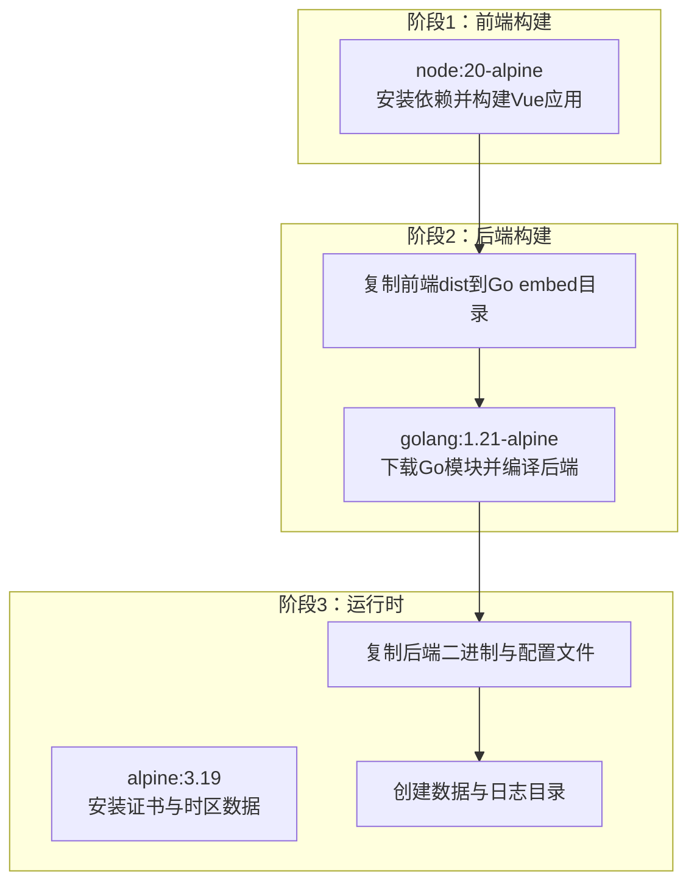
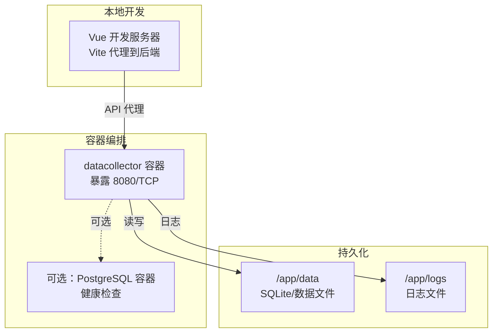
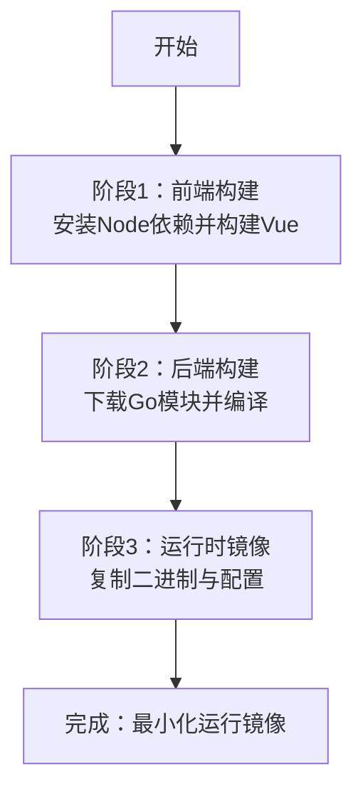
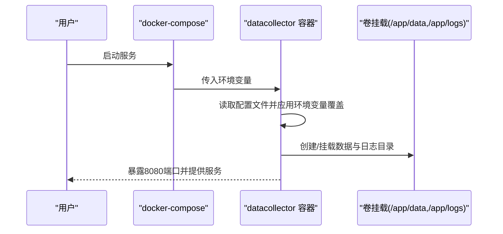
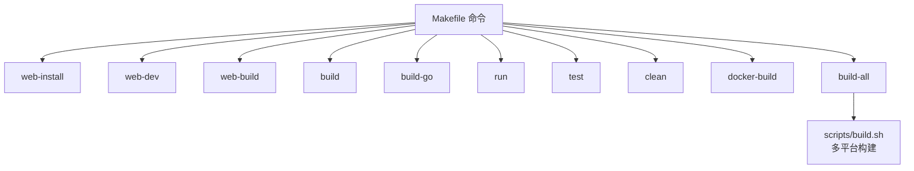
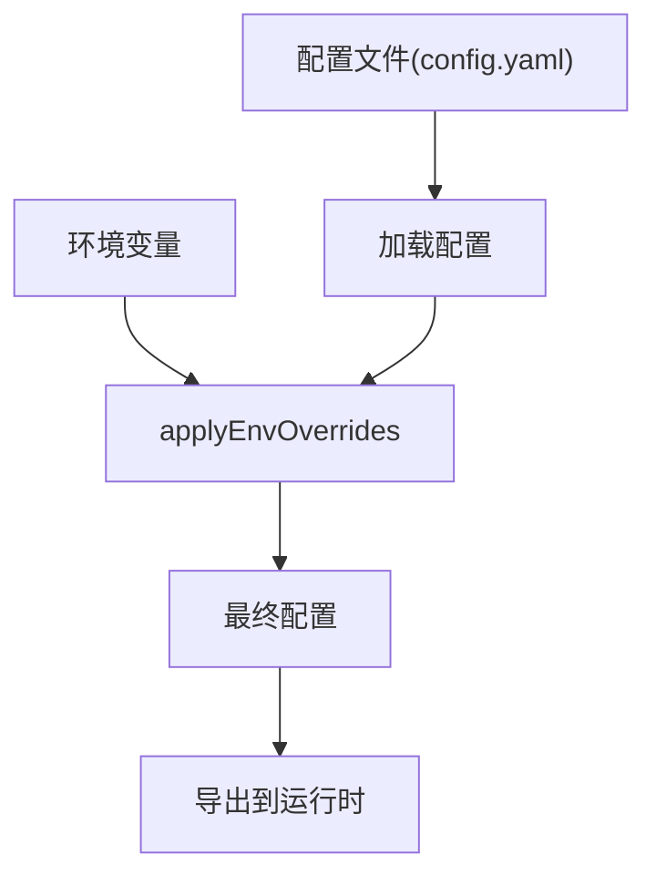
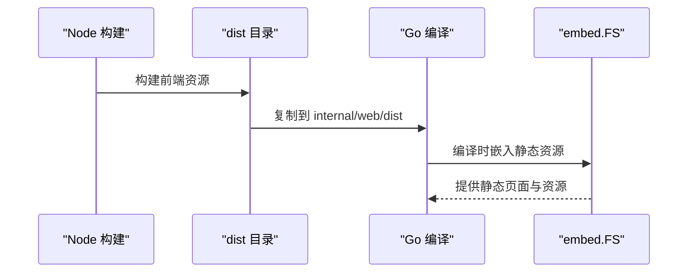
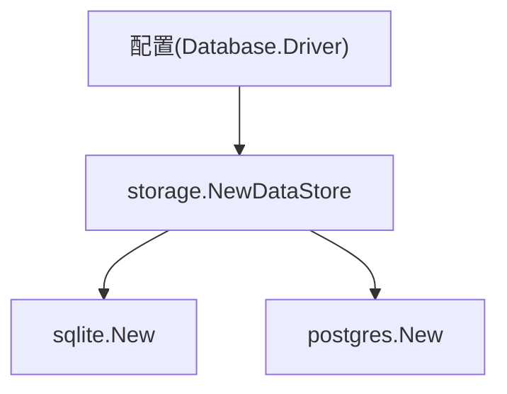
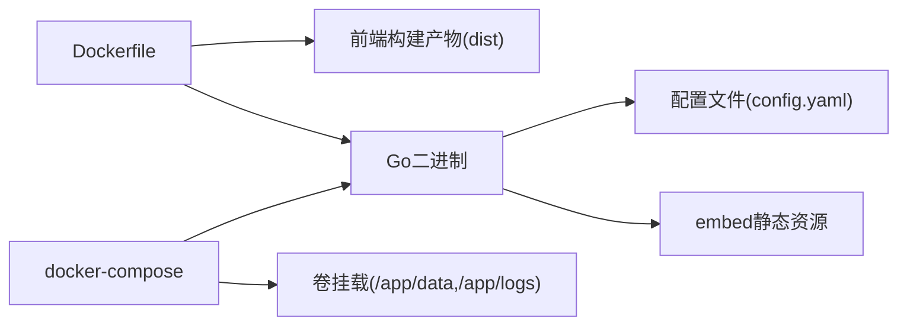

# 容器化部署

<cite>
**本文引用的文件**
- [Dockerfile](file://Dockerfile)
- [docker-compose.yml](file://docker-compose.yml)
- [Makefile](file://Makefile)
- [scripts/build.sh](file://scripts/build.sh)
- [configs/config.yaml](file://configs/config.yaml)
- [cmd/server/main.go](file://cmd/server/main.go)
- [internal/config/config.go](file://internal/config/config.go)
- [internal/web/embed.go](file://internal/web/embed.go)
- [internal/storage/factory.go](file://internal/storage/factory.go)
- [web/package.json](file://web/package.json)
- [web/vite.config.ts](file://web/vite.config.ts)
</cite>

## 目录
1. [简介](#简介)
2. [项目结构](#项目结构)
3. [核心组件](#核心组件)
4. [架构总览](#架构总览)
5. [详细组件分析](#详细组件分析)
6. [依赖分析](#依赖分析)
7. [性能考虑](#性能考虑)
8. [故障排查指南](#故障排查指南)
9. [结论](#结论)
10. [附录](#附录)

## 简介
本指南面向DataCollector的容器化部署，系统性讲解Docker多阶段构建流程（前端Vue.js应用构建与Go后端编译）、镜像分层优化策略、docker-compose配置与环境变量覆盖机制、构建脚本与Makefile命令说明，以及生产环境的最佳实践与安全建议。文档同时提供可视化图示，帮助读者快速理解容器化架构与数据流。

## 项目结构
DataCollector采用前后端分离的多阶段Docker镜像构建：
- 阶段1：前端构建（Node.js Alpine），打包Vue应用至dist目录
- 阶段2：后端构建（Go 1.21 Alpine），启用CGO以支持SQLite，将前端产物复制到Go的embed目录
- 阶段3：运行时镜像（Alpine 3.19），仅包含运行所需的二进制、证书与配置文件

图表来源
- [Dockerfile:1-52](file://Dockerfile#L1-L52)

章节来源
- [Dockerfile:1-52](file://Dockerfile#L1-L52)

## 核心组件
- 多阶段Dockerfile：定义前端构建、后端编译与运行时三层，减少最终镜像体积并提升安全性
- docker-compose：提供SQLite与PostgreSQL两种模式的编排示例，支持持久化卷与健康检查
- Makefile：封装前端安装、开发、构建、后端构建、清理与Docker构建等常用命令
- scripts/build.sh：跨平台二进制构建脚本，支持Windows/Linux/macOS与多种CPU架构
- 配置系统：YAML配置文件 + 环境变量覆盖，支持数据库驱动切换、日志输出与JWT密钥等参数
- Web嵌入：将前端dist目录作为Go的embed.FS资源，便于单体二进制部署

章节来源
- [Dockerfile:1-52](file://Dockerfile#L1-L52)
- [docker-compose.yml:1-56](file://docker-compose.yml#L1-L56)
- [Makefile:1-57](file://Makefile#L1-L57)
- [scripts/build.sh:1-65](file://scripts/build.sh#L1-L65)
- [configs/config.yaml:1-41](file://configs/config.yaml#L1-L41)
- [internal/config/config.go:148-195](file://internal/config/config.go#L148-L195)
- [internal/web/embed.go:1-7](file://internal/web/embed.go#L1-L7)

## 架构总览
容器化部署的关键在于“构建期”与“运行期”的职责分离：
- 构建期：Node与Go工具链仅存在于构建镜像，不进入最终运行镜像
- 运行期：仅包含运行时所需二进制、证书与时区数据，最小化攻击面
- 配置覆盖：通过环境变量在运行时覆盖默认配置，避免硬编码敏感信息

图表来源
- [docker-compose.yml:3-56](file://docker-compose.yml#L3-L56)
- [Dockerfile:30-52](file://Dockerfile#L30-L52)

## 详细组件分析

### Dockerfile 多阶段构建详解
- 阶段1：前端构建
  - 基础镜像：node:20-alpine
  - 工作目录：/app/web
  - 步骤：复制package.json与lock文件、安装依赖、复制源码、执行构建，生成dist
  - 作用：产出静态前端资源，供后端阶段复制到embed目录
- 阶段2：后端构建
  - 基础镜像：golang:1.21-alpine
  - 安装gcc/musl-dev以启用CGO（SQLite需要）
  - 工作目录：/app
  - 步骤：复制go.mod/go.sum并下载依赖；复制全部源码；复制前端dist到internal/web/dist；编译后端二进制（Linux、CGO启用）
  - 作用：生成可在Alpine上运行的Go二进制，内嵌前端资源
- 阶段3：运行时
  - 基础镜像：alpine:3.19
  - 安装ca-certificates与tzdata
  - 工作目录：/app
  - 步骤：复制二进制与配置文件；创建/app/data与/app/logs目录；暴露8080端口；设置默认环境变量（DB_DRIVER、DB_SQLITE_PATH、LOG_OUTPUT、LOG_FILE_PATH）；入口命令为二进制
  - 作用：最小化运行时镜像，仅包含必要组件

图表来源
- [Dockerfile:1-52](file://Dockerfile#L1-L52)

章节来源
- [Dockerfile:1-52](file://Dockerfile#L1-L52)

### docker-compose 配置与环境变量覆盖
- 默认服务：datacollector
  - 构建上下文：当前目录
  - 端口映射：宿主8080 -> 容器8080
  - 卷挂载：./data -> /app/data；./logs -> /app/logs
  - 环境变量：DB_DRIVER=sqlite；DB_SQLITE_PATH=/app/data/datacollector.db
  - 重启策略：unless-stopped
- 可选PostgreSQL模式：注释掉的服务块展示了如何切换到PostgreSQL，包括环境变量（DB_DRIVER、DB_HOST、DB_PORT、DB_USER、DB_PASSWORD、DB_NAME）与健康检查
- 环境变量覆盖机制：容器启动时可通过环境变量覆盖配置文件中的数据库、服务器端口、JWT密钥、日志级别等

图表来源
- [docker-compose.yml:3-36](file://docker-compose.yml#L3-L36)
- [Dockerfile:45-51](file://Dockerfile#L45-L51)
- [internal/config/config.go:148-195](file://internal/config/config.go#L148-L195)

章节来源
- [docker-compose.yml:1-56](file://docker-compose.yml#L1-L56)
- [Dockerfile:45-51](file://Dockerfile#L45-L51)
- [internal/config/config.go:148-195](file://internal/config/config.go#L148-L195)

### Makefile 命令与构建脚本
- 前端相关
  - web-install：在web目录执行npm install
  - web-dev：在web目录启动Vite开发服务器
  - web-build：在web目录执行构建并将dist复制到internal/web/dist
- 后端相关
  - build：先执行web-build，再调用go build生成二进制（包含版本信息）
  - build-go：直接go build（跳过前端）
  - run：go run启动后端
  - test：go test执行测试
  - clean：清理dist与internal/web/dist
  - docker-build：docker build并打tag
  - build-all：调用scripts/build.sh进行多平台二进制构建
- scripts/build.sh
  - 支持Windows/Linux/macOS与amd64/arm64/armv7
  - Linux/amd64启用CGO（SQLite原生），其他平台禁用CGO（使用纯Go SQLite驱动）
  - 输出带版本号的二进制文件到dist目录

图表来源
- [Makefile:1-57](file://Makefile#L1-L57)
- [scripts/build.sh:1-65](file://scripts/build.sh#L1-L65)

章节来源
- [Makefile:1-57](file://Makefile#L1-L57)
- [scripts/build.sh:1-65](file://scripts/build.sh#L1-L65)

### 配置系统与环境变量覆盖
- 配置文件：configs/config.yaml定义了服务器、TLS、数据库、JWT、采集器与日志等默认值
- 环境变量覆盖：internal/config/config.go在加载配置后调用applyEnvOverrides，按需覆盖数据库驱动、SQLite路径、PostgreSQL主机/端口/用户/密码/库名、服务器端口、JWT密钥、日志级别等
- 运行时默认环境变量：Dockerfile在运行阶段设置了DB_DRIVER、DB_SQLITE_PATH、LOG_OUTPUT、LOG_FILE_PATH等，确保容器启动时具备基本配置

图表来源
- [configs/config.yaml:1-41](file://configs/config.yaml#L1-L41)
- [internal/config/config.go:82-98](file://internal/config/config.go#L82-L98)
- [internal/config/config.go:148-195](file://internal/config/config.go#L148-L195)
- [Dockerfile:45-51](file://Dockerfile#L45-L51)

章节来源
- [configs/config.yaml:1-41](file://configs/config.yaml#L1-L41)
- [internal/config/config.go:82-98](file://internal/config/config.go#L82-L98)
- [internal/config/config.go:148-195](file://internal/config/config.go#L148-L195)
- [Dockerfile:45-51](file://Dockerfile#L45-L51)

### 前端构建与嵌入
- Vue应用：使用Vite与Vue 3，开发服务器默认端口5173，构建输出到dist
- 嵌入资源：Docker构建阶段将dist复制到internal/web/dist，Go通过embed.FS提供静态资源
- 运行时访问：后端路由会返回embed的静态页面与API

图表来源
- [web/vite.config.ts:32-35](file://web/vite.config.ts#L32-L35)
- [Dockerfile:24-25](file://Dockerfile#L24-L25)
- [internal/web/embed.go:1-7](file://internal/web/embed.go#L1-L7)

章节来源
- [web/vite.config.ts:1-36](file://web/vite.config.ts#L1-L36)
- [Dockerfile:24-25](file://Dockerfile#L24-L25)
- [internal/web/embed.go:1-7](file://internal/web/embed.go#L1-L7)

### 数据存储工厂与驱动切换
- 工厂函数：根据配置的Database.Driver选择SQLite或PostgreSQL实现
- 运行时切换：通过环境变量DB_DRIVER与DB_SQLITE_PATH或PostgreSQL相关变量控制

图表来源
- [internal/storage/factory.go:11-21](file://internal/storage/factory.go#L11-L21)
- [internal/config/config.go:148-195](file://internal/config/config.go#L148-L195)

章节来源
- [internal/storage/factory.go:1-22](file://internal/storage/factory.go#L1-L22)
- [internal/config/config.go:148-195](file://internal/config/config.go#L148-L195)

## 依赖分析
- 组件耦合
  - Dockerfile对前端构建产物与Go编译产物有强依赖
  - 运行时镜像依赖配置文件与embed的静态资源
  - 配置系统通过环境变量覆盖实现松耦合
- 外部依赖
  - Node与Go工具链仅在构建阶段使用
  - Alpine基础镜像提供最小运行时环境
- 潜在循环依赖
  - 未发现直接循环依赖；配置覆盖逻辑在运行前完成

图表来源
- [Dockerfile:1-52](file://Dockerfile#L1-L52)
- [configs/config.yaml:1-41](file://configs/config.yaml#L1-L41)
- [docker-compose.yml:3-16](file://docker-compose.yml#L3-L16)

章节来源
- [Dockerfile:1-52](file://Dockerfile#L1-L52)
- [configs/config.yaml:1-41](file://configs/config.yaml#L1-L41)
- [docker-compose.yml:1-56](file://docker-compose.yml#L1-L56)

## 性能考虑
- 镜像大小优化
  - 使用Alpine基础镜像，减少包管理器与冗余文件
  - 多阶段构建，最终镜像仅包含运行时必需组件
- 构建速度优化
  - 前端与后端分别在独立阶段构建，充分利用缓存
  - scripts/build.sh支持多平台并行构建（脚本内部逐个平台构建，可扩展为并行）
- 运行时性能
  - SQLite适合小规模数据；PostgreSQL适合高并发与复杂查询
  - 日志轮转与文件输出可降低I/O开销

## 故障排查指南
- 容器无法启动或端口占用
  - 检查端口映射与宿主端口是否被占用
  - 查看容器日志（默认stdout或文件输出）
- 数据库连接失败
  - 确认DB_DRIVER与DB_SQLITE_PATH或PostgreSQL相关环境变量正确
  - 若使用PostgreSQL，确认容器网络与健康检查状态
- 前端静态资源缺失
  - 确认Dockerfile已将dist复制到internal/web/dist
  - 确认Go编译时embed成功
- 日志问题
  - 检查LOG_OUTPUT与LOG_FILE_PATH环境变量
  - 确认/app/logs目录已创建并具有写权限

章节来源
- [Dockerfile:30-52](file://Dockerfile#L30-L52)
- [internal/config/config.go:148-195](file://internal/config/config.go#L148-L195)
- [internal/web/embed.go:1-7](file://internal/web/embed.go#L1-L7)

## 结论
通过多阶段Docker构建，DataCollector实现了“构建期工具链隔离、运行期最小化”的容器化目标。配合docker-compose的卷挂载与环境变量覆盖机制，既满足开发调试需求，又便于生产部署。建议在生产环境中结合安全加固与监控策略，进一步提升可用性与安全性。

## 附录

### 生产环境部署最佳实践
- 安全加固
  - 使用只读根文件系统与最小权限用户运行容器
  - 限制容器资源（CPU/内存配额）
  - 启用HTTPS（TLS）并在compose中配置证书文件
- 配置管理
  - 将敏感信息（JWT密钥、数据库密码）放入环境变量或密钥管理服务
  - 使用独立的配置文件与环境变量组合，避免硬编码
- 监控与日志
  - 使用集中式日志收集（stdout JSON + 外部日志系统）
  - 添加健康检查与就绪探针
- 数据持久化
  - 使用命名卷或持久化存储，定期备份数据与日志
- 网络与防火墙
  - 仅暴露必要端口，使用反向代理与WAF
  - 在容器编排中设置网络隔离与访问控制

### 环境变量清单（运行时）
- 数据库相关
  - DB_DRIVER：sqlite 或 postgres
  - DB_SQLITE_PATH：SQLite文件路径
  - DB_HOST/DB_PORT/DB_USER/DB_PASSWORD/DB_NAME：PostgreSQL连接参数
- 服务器与日志
  - SERVER_PORT：HTTP服务端口
  - LOG_LEVEL：日志级别（debug/info/warn/error）
  - LOG_OUTPUT：stdout 或 file
  - LOG_FILE_PATH：日志文件路径
- JWT
  - JWT_SECRET：JWT签名密钥

章节来源
- [Dockerfile:45-51](file://Dockerfile#L45-L51)
- [internal/config/config.go:148-195](file://internal/config/config.go#L148-L195)