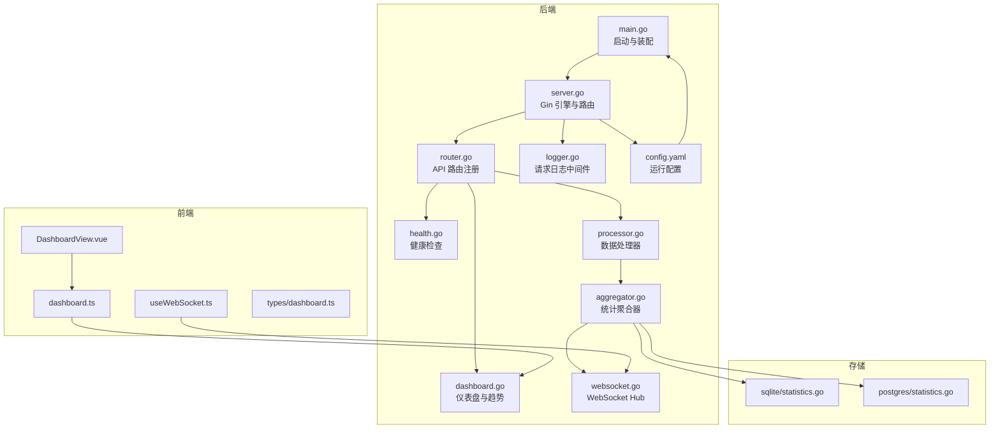
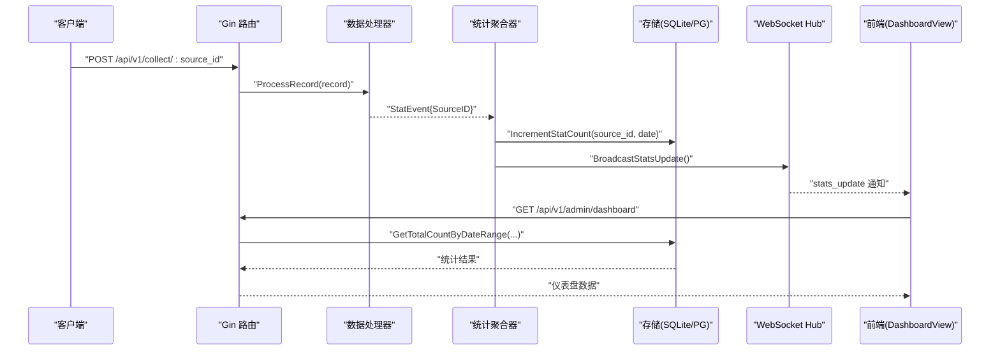
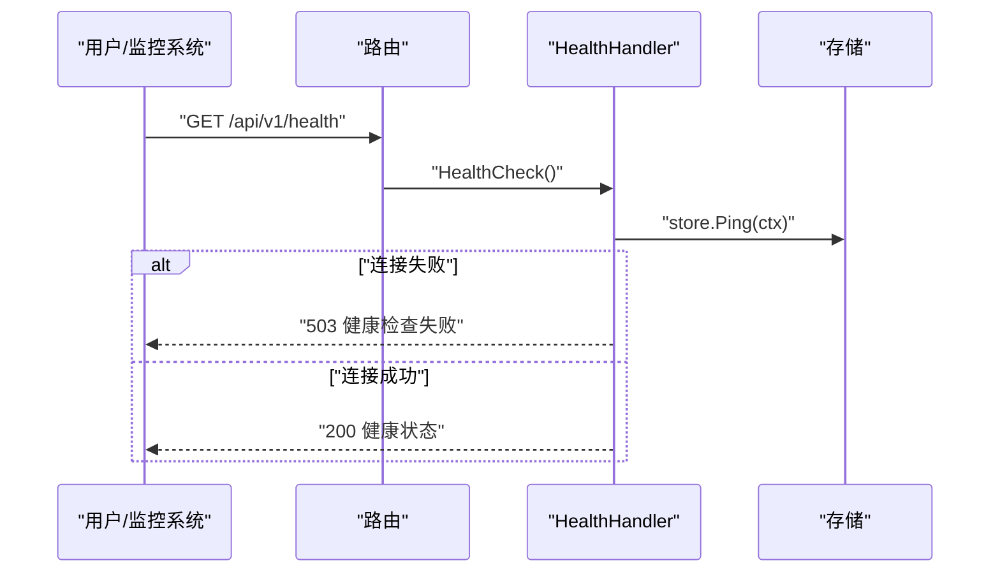
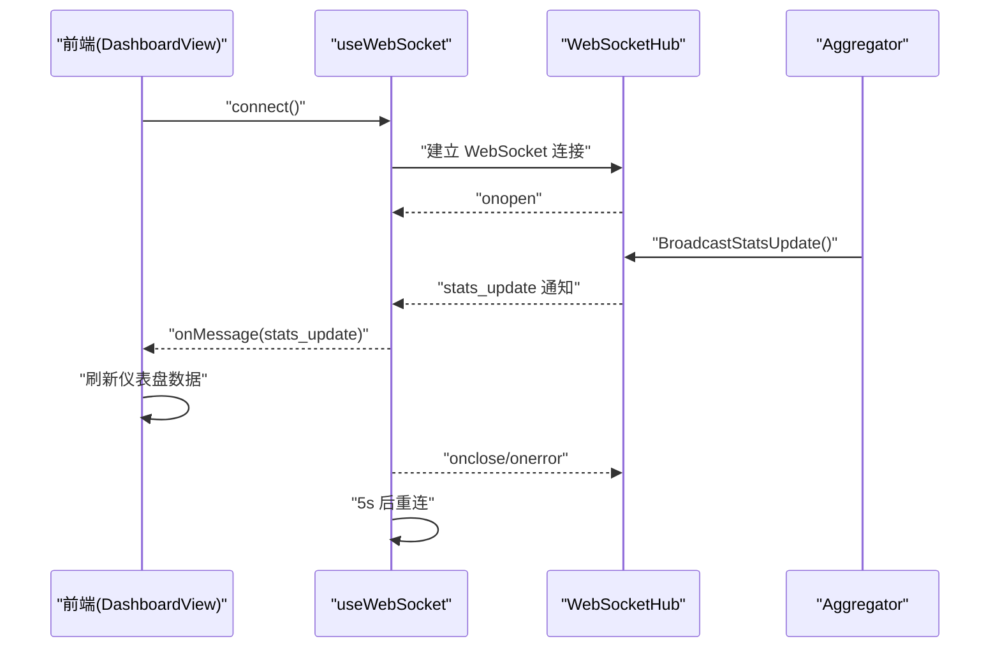
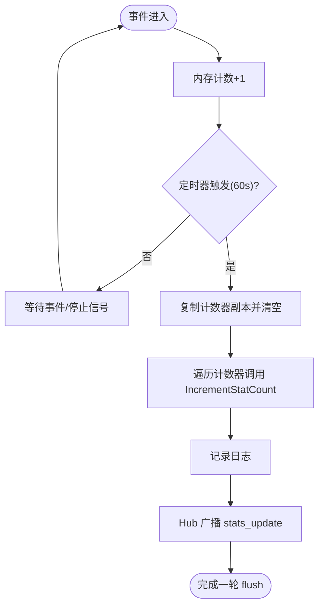
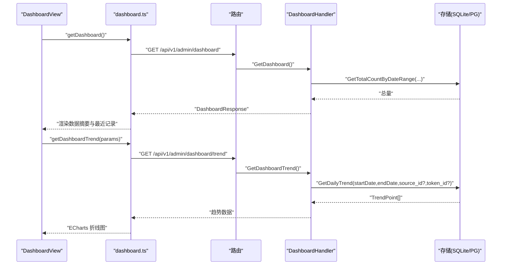
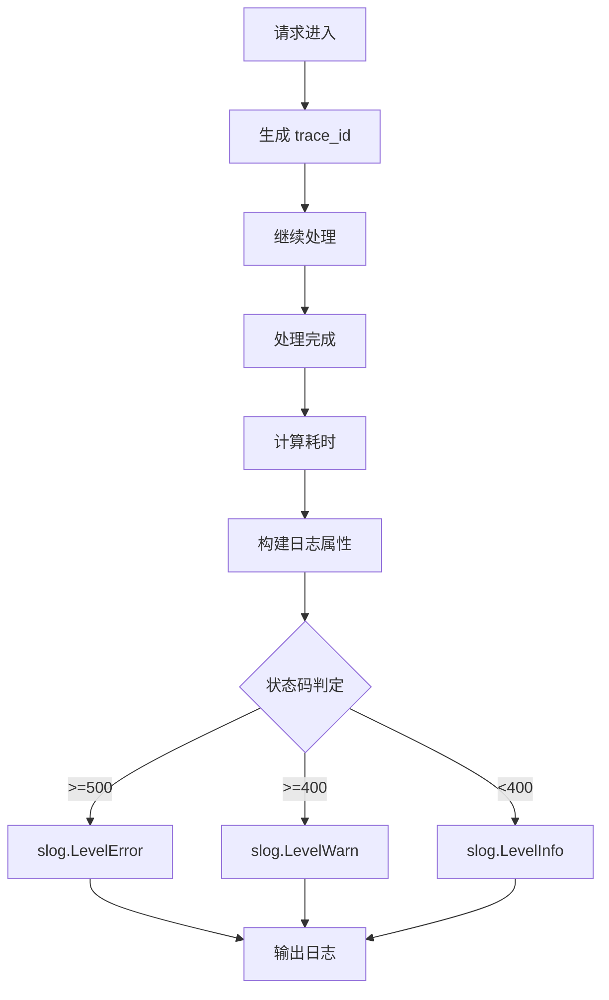
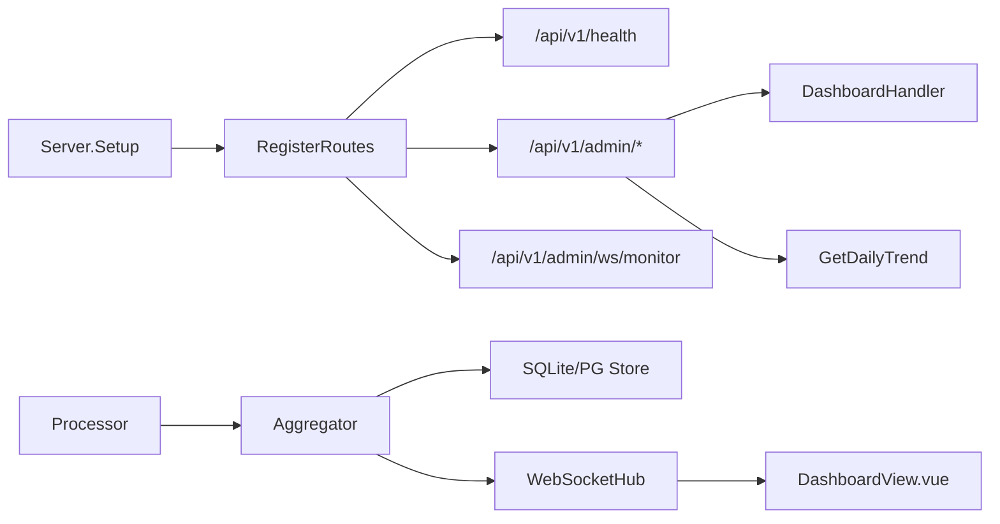

# 监控告警

<cite>
**本文引用的文件**   
- [main.go](file://cmd/server/main.go)
- [server.go](file://internal/server/server.go)
- [router.go](file://internal/api/router.go)
- [health.go](file://internal/api/health.go)
- [dashboard.go](file://internal/api/dashboard.go)
- [aggregator.go](file://internal/monitor/aggregator.go)
- [websocket.go](file://internal/monitor/websocket.go)
- [processor.go](file://internal/collector/processor.go)
- [sqlite/statistics.go](file://internal/storage/sqlite/statistics.go)
- [postgres/statistics.go](file://internal/storage/postgres/statistics.go)
- [logger.go](file://internal/middleware/logger.go)
- [config.yaml](file://configs/config.yaml)
- [Dockerfile](file://Dockerfile)
- [docker-compose.yml](file://docker-compose.yml)
- [useWebSocket.ts](file://web/src/composables/useWebSocket.ts)
- [DashboardView.vue](file://web/src/views/DashboardView.vue)
- [dashboard.ts](file://web/src/api/dashboard.ts)
- [dashboard.ts（类型）](file://web/src/types/dashboard.ts)
</cite>

## 目录
1. [简介](#简介)
2. [项目结构](#项目结构)
3. [核心组件](#核心组件)
4. [架构总览](#架构总览)
5. [详细组件分析](#详细组件分析)
6. [依赖关系分析](#依赖关系分析)
7. [性能与监控指标](#性能与监控指标)
8. [告警规则与通知](#告警规则与通知)
9. [Prometheus 集成与 Grafana 仪表板](#prometheus-集成与-grafana-仪表板)
10. [故障排查指南](#故障排查指南)
11. [结论](#结论)
12. [附录](#附录)

## 简介
本文件面向 DataCollector 的监控告警体系，围绕以下目标展开：
- 内置健康检查接口的使用与监控指标
- WebSocket 实时监控的实现原理与客户端连接管理
- 日志系统的配置与日志级别设置
- 性能监控指标收集与分析方法
- 告警规则配置与通知机制
- Prometheus 集成方案与 Grafana 仪表板配置
- 监控数据可视化与趋势分析功能使用指南

## 项目结构
DataCollector 的监控与告警涉及后端 Go 代码、前端 Vue 应用、配置文件与容器编排。核心路径如下：
- 后端入口与服务装配：cmd/server/main.go、internal/server/server.go
- API 路由与健康检查：internal/api/router.go、internal/api/health.go
- 仪表盘与趋势：internal/api/dashboard.go、web/src/views/DashboardView.vue
- 监控与 WebSocket：internal/monitor/aggregator.go、internal/monitor/websocket.go
- 数据处理与统计：internal/collector/processor.go、internal/storage/sqlite/statistics.go、internal/storage/postgres/statistics.go
- 日志与中间件：internal/middleware/logger.go、configs/config.yaml
- 前端 WebSocket 客户端：web/src/composables/useWebSocket.ts、web/src/api/dashboard.ts、web/src/types/dashboard.ts
- 容器与部署：Dockerfile、docker-compose.yml

**图示来源**
- [main.go:48-138](file://cmd/server/main.go#L48-L138)
- [server.go:54-93](file://internal/server/server.go#L54-L93)
- [router.go:14-76](file://internal/api/router.go#L14-L76)
- [health.go:36-64](file://internal/api/health.go#L36-L64)
- [dashboard.go:34-139](file://internal/api/dashboard.go#L34-L139)
- [processor.go:16-84](file://internal/collector/processor.go#L16-L84)
- [aggregator.go:17-197](file://internal/monitor/aggregator.go#L17-L197)
- [websocket.go:14-216](file://internal/monitor/websocket.go#L14-L216)
- [logger.go:11-67](file://internal/middleware/logger.go#L11-L67)
- [sqlite/statistics.go:10-146](file://internal/storage/sqlite/statistics.go#L10-L146)
- [postgres/statistics.go:10-143](file://internal/storage/postgres/statistics.go#L10-L143)
- [useWebSocket.ts:1-66](file://web/src/composables/useWebSocket.ts#L1-L66)
- [DashboardView.vue:105-351](file://web/src/views/DashboardView.vue#L105-L351)
- [dashboard.ts:1-10](file://web/src/api/dashboard.ts#L1-L10)
- [dashboard.ts（类型）:1-21](file://web/src/types/dashboard.ts#L1-L21)

**章节来源**
- [main.go:48-138](file://cmd/server/main.go#L48-L138)
- [server.go:54-93](file://internal/server/server.go#L54-L93)
- [router.go:14-76](file://internal/api/router.go#L14-L76)

## 核心组件
- 健康检查接口：提供系统健康状态、版本、运行时长与数据库连接状态。
- 统计聚合器：接收数据处理事件，累积计数并在固定周期持久化，同时触发 WebSocket 广播。
- WebSocket Hub：管理客户端连接、广播消息、心跳与断线重连。
- 仪表盘与趋势：提供当日/周/月总量、最近记录与按日期范围的趋势折线。
- 日志中间件：结构化记录请求链路、状态码与耗时，并按级别输出。
- 存储层：SQLite/Postgres 提供统计计数的 UPSERT、范围查询与趋势聚合。

**章节来源**
- [health.go:12-64](file://internal/api/health.go#L12-L64)
- [aggregator.go:17-197](file://internal/monitor/aggregator.go#L17-L197)
- [websocket.go:14-216](file://internal/monitor/websocket.go#L14-L216)
- [dashboard.go:13-139](file://internal/api/dashboard.go#L13-L139)
- [logger.go:11-67](file://internal/middleware/logger.go#L11-L67)
- [sqlite/statistics.go:10-146](file://internal/storage/sqlite/statistics.go#L10-L146)
- [postgres/statistics.go:10-143](file://internal/storage/postgres/statistics.go#L10-L143)

## 架构总览
下图展示从数据采集到实时监控的关键流转：

**图示来源**
- [router.go:47-55](file://internal/api/router.go#L47-L55)
- [processor.go:30-52](file://internal/collector/processor.go#L30-L52)
- [aggregator.go:76-133](file://internal/monitor/aggregator.go#L76-L133)
- [sqlite/statistics.go:10-25](file://internal/storage/sqlite/statistics.go#L10-L25)
- [postgres/statistics.go:10-22](file://internal/storage/postgres/statistics.go#L10-L22)
- [server.go:79-83](file://internal/server/server.go#L79-L83)
- [DashboardView.vue:163-182](file://web/src/views/DashboardView.vue#L163-L182)

## 详细组件分析

### 健康检查接口
- 路径：/api/v1/health
- 功能：Ping 数据库，返回系统状态、版本、运行时长与数据库连接状态。
- 响应字段：status、version、uptime、database。
- 错误场景：数据库不可达时返回 503。

**图示来源**
- [router.go:36-37](file://internal/api/router.go#L36-L37)
- [health.go:36-64](file://internal/api/health.go#L36-L64)

**章节来源**
- [health.go:12-64](file://internal/api/health.go#L12-L64)
- [router.go:36-37](file://internal/api/router.go#L36-L37)

### WebSocket 实时监控
- 路由：/api/v1/admin/ws/monitor（需 JWT 认证）
- Hub 职责：维护客户端集合、广播消息、注册/注销、心跳与缓冲区溢出处理。
- 客户端行为：连接、接收 stats_update 通知、自动重连。
- 前端交互：收到通知后刷新仪表盘数据。

**图示来源**
- [server.go:79-83](file://internal/server/server.go#L79-L83)
- [websocket.go:108-127](file://internal/monitor/websocket.go#L108-L127)
- [useWebSocket.ts:9-38](file://web/src/composables/useWebSocket.ts#L9-L38)
- [DashboardView.vue:163-182](file://web/src/views/DashboardView.vue#L163-L182)

**章节来源**
- [server.go:79-83](file://internal/server/server.go#L79-L83)
- [websocket.go:14-216](file://internal/monitor/websocket.go#L14-L216)
- [useWebSocket.ts:1-66](file://web/src/composables/useWebSocket.ts#L1-L66)
- [DashboardView.vue:105-351](file://web/src/views/DashboardView.vue#L105-L351)

### 统计聚合器与持久化
- 事件通道：Processor 将 StatEvent 发送到聚合器的 eventCh。
- 聚合策略：内存中按 sourceID 计数，定时器每 60 秒 flush。
- 持久化：调用存储层 IncrementStatCount（UPSERT），记录当天计数。
- 广播：flush 成功后通过 Hub 广播 stats_update 通知。

**图示来源**
- [aggregator.go:52-133](file://internal/monitor/aggregator.go#L52-L133)
- [processor.go:30-52](file://internal/collector/processor.go#L30-L52)
- [sqlite/statistics.go:10-25](file://internal/storage/sqlite/statistics.go#L10-L25)
- [postgres/statistics.go:10-22](file://internal/storage/postgres/statistics.go#L10-L22)

**章节来源**
- [aggregator.go:17-197](file://internal/monitor/aggregator.go#L17-L197)
- [processor.go:16-84](file://internal/collector/processor.go#L16-L84)
- [sqlite/statistics.go:10-146](file://internal/storage/sqlite/statistics.go#L10-L146)
- [postgres/statistics.go:10-143](file://internal/storage/postgres/statistics.go#L10-L143)

### 仪表盘与趋势分析
- 仪表盘接口：/api/v1/admin/dashboard（当日/周/月总量、数据源总数、最近记录）
- 趋势接口：/api/v1/admin/dashboard/trend（支持按日期范围、数据源或 Token 粒度）
- 前端：DashboardView 通过 useWebSocket 监听 stats_update，自动刷新；ECharts 展示趋势折线。

**图示来源**
- [router.go:70-72](file://internal/api/router.go#L70-L72)
- [dashboard.go:34-139](file://internal/api/dashboard.go#L34-L139)
- [sqlite/statistics.go:65-87](file://internal/storage/sqlite/statistics.go#L65-L87)
- [postgres/statistics.go:62-84](file://internal/storage/postgres/statistics.go#L62-L84)
- [DashboardView.vue:163-351](file://web/src/views/DashboardView.vue#L163-L351)
- [dashboard.ts:1-10](file://web/src/api/dashboard.ts#L1-L10)

**章节来源**
- [dashboard.go:13-139](file://internal/api/dashboard.go#L13-L139)
- [sqlite/statistics.go:65-146](file://internal/storage/sqlite/statistics.go#L65-L146)
- [postgres/statistics.go:62-143](file://internal/storage/postgres/statistics.go#L62-L143)
- [DashboardView.vue:105-351](file://web/src/views/DashboardView.vue#L105-L351)
- [dashboard.ts:1-10](file://web/src/api/dashboard.ts#L1-L10)

### 日志系统与配置
- 结构化日志：记录 trace_id、method、path、status、latency、client_ip、user_agent、errors。
- 日志级别：根据状态码自动选择 error/warn/info。
- 配置项：level、format、output、file_path、max_size、max_age。
- Docker 环境变量：LOG_OUTPUT、LOG_FILE_PATH。

**图示来源**
- [logger.go:11-67](file://internal/middleware/logger.go#L11-L67)
- [config.yaml:34-41](file://configs/config.yaml#L34-L41)
- [Dockerfile:45-50](file://Dockerfile#L45-L50)

**章节来源**
- [logger.go:11-67](file://internal/middleware/logger.go#L11-L67)
- [config.yaml:34-41](file://configs/config.yaml#L34-L41)
- [Dockerfile:45-50](file://Dockerfile#L45-L50)

## 依赖关系分析
- 组件耦合：
  - Server 在 Setup 中注册路由、中间件与 WebSocket 路由。
  - Router 将 /api/v1/health 与 /api/v1/admin/* 分组，分别对应健康检查与管理后台。
  - Processor 通过 EventChannel 与 Aggregator 解耦。
  - Aggregator 仅依赖存储接口与 Hub 广播，不直接访问前端。
- 外部依赖：
  - Gin 作为 Web 框架。
  - Gorilla WebSocket 用于 Hub。
  - SQLite/Postgres 驱动与迁移工具。
  - ECharts（前端）用于趋势可视化。

**图示来源**
- [server.go:54-93](file://internal/server/server.go#L54-L93)
- [router.go:14-76](file://internal/api/router.go#L14-L76)
- [aggregator.go:17-45](file://internal/monitor/aggregator.go#L17-L45)
- [processor.go:16-28](file://internal/collector/processor.go#L16-L28)

**章节来源**
- [server.go:54-93](file://internal/server/server.go#L54-L93)
- [router.go:14-76](file://internal/api/router.go#L14-L76)
- [aggregator.go:17-45](file://internal/monitor/aggregator.go#L17-L45)
- [processor.go:16-28](file://internal/collector/processor.go#L16-L28)

## 性能与监控指标
- 指标建议（基于现有实现可导出）：
  - 每分钟新增记录数（通过趋势接口按分钟粒度聚合）
  - 当日/周/月累计记录数（仪表盘接口）
  - 数据源维度计数（按 source_id 聚合）
  - Token 维度计数（按 token_id 聚合）
  - 请求延迟分布（日志中间件 latency 字段）
  - WebSocket 客户端数量（Hub 维护的 clients 集合大小）
  - 数据库写入成功率（聚合器 flush 失败次数）
- 收集与分析方法：
  - 使用趋势接口按天/小时粒度拉取，结合前端 ECharts 进行可视化。
  - 通过日志中间件的 latency、status、path 等字段进行性能分析。
  - 监控 Hub 的 broadcast 缓冲区与 unregister 触发频率评估连接稳定性。

**章节来源**
- [dashboard.go:34-139](file://internal/api/dashboard.go#L34-L139)
- [sqlite/statistics.go:89-146](file://internal/storage/sqlite/statistics.go#L89-L146)
- [postgres/statistics.go:86-143](file://internal/storage/postgres/statistics.go#L86-L143)
- [logger.go:11-67](file://internal/middleware/logger.go#L11-L67)
- [websocket.go:63-106](file://internal/monitor/websocket.go#L63-L106)

## 告警规则与通知
- 告警规则建议（基于可用指标）：
  - 数据库连接不可用：健康检查返回 503。
  - 新增记录数骤降：对比 N 分钟窗口，若低于阈值触发。
  - WebSocket 客户端异常掉线：Hub unregister 频率过高。
  - 请求错误率上升：日志中间件 status>=400 的比例。
  - 写入失败：聚合器 flush 失败计数。
- 通知机制：
  - 健康检查接口可被外部监控系统定时探测。
  - WebSocket 通知用于前端自动刷新，可在告警系统中模拟“连接断开”场景以验证通知链路。

**章节来源**
- [health.go:36-64](file://internal/api/health.go#L36-L64)
- [logger.go:11-67](file://internal/middleware/logger.go#L11-L67)
- [websocket.go:63-106](file://internal/monitor/websocket.go#L63-L106)
- [aggregator.go:89-133](file://internal/monitor/aggregator.go#L89-L133)

## Prometheus 集成与 Grafana 仪表板
- Prometheus 抓取目标：
  - HTTP 指标：通过日志中间件的 latency、status、path 等字段，结合日志采集器（如 Promtail/Fluent Bit）将日志转化为指标。
  - 自定义指标：建议在后端暴露 /metrics（例如使用 github.com/prometheus/client_golang），导出：
    - requests_total{method,path,status}
    - requests_duration_seconds{method,path}
    - websocket_clients
    - flush_errors_total
    - records_total{source_id,token_id}
- Grafana 仪表板：
  - 面板 1：系统健康（健康检查探活）
  - 面板 2：吞吐量（按分钟/小时的新增记录数）
  - 面板 3：延迟分布（P50/P90/P99）
  - 面板 4：趋势折线（按天/周/月）
  - 面板 5：连接与错误（WS 客户端数、错误率）

[本节为通用集成指导，不直接分析具体文件，故不附“章节来源”]

## 故障排查指南
- 健康检查 503：
  - 检查数据库连接字符串与凭据。
  - 查看启动日志中数据库 Ping 是否成功。
- WebSocket 无法连接：
  - 确认路由 /api/v1/admin/ws/monitor 已注册且受 JWT 保护。
  - 检查前端是否正确传递 JWT Token。
  - 查看 Hub 日志中 register/unregister 次数与 broadcast 缓冲区状态。
- 仪表盘数据不刷新：
  - 确认前端收到 stats_update 通知并触发刷新。
  - 检查聚合器 flush 是否成功，以及存储层写入是否报错。
- 日志级别与输出：
  - 修改 config.yaml 中 log.level/format/output/file_path。
  - Docker 环境变量 LOG_OUTPUT/LOG_FILE_PATH 生效于容器内。

**章节来源**
- [health.go:36-64](file://internal/api/health.go#L36-L64)
- [server.go:79-83](file://internal/server/server.go#L79-L83)
- [useWebSocket.ts:1-66](file://web/src/composables/useWebSocket.ts#L1-L66)
- [DashboardView.vue:163-182](file://web/src/views/DashboardView.vue#L163-L182)
- [aggregator.go:89-133](file://internal/monitor/aggregator.go#L89-L133)
- [config.yaml:34-41](file://configs/config.yaml#L34-L41)
- [Dockerfile:45-50](file://Dockerfile#L45-L50)

## 结论
DataCollector 的监控告警体系以健康检查、统计聚合、WebSocket 实时推送与结构化日志为核心，配合前端趋势可视化形成闭环。通过扩展自定义指标与 Prometheus/Grafana，可进一步完善可观测性与自动化告警能力。

[本节为总结性内容，不直接分析具体文件，故不附“章节来源”]

## 附录
- 部署与配置要点：
  - Docker Compose 默认使用 SQLite；可通过环境变量切换至 PostgreSQL。
  - 日志输出默认 stdout，可通过环境变量改为文件并设置轮转参数。
- 前端开发提示：
  - 使用 useWebSocket.ts 管理连接生命周期与重连逻辑。
  - DashboardView.vue 中 onMessage 收到 stats_update 后调用刷新函数。

**章节来源**
- [docker-compose.yml:1-56](file://docker-compose.yml#L1-L56)
- [Dockerfile:45-50](file://Dockerfile#L45-L50)
- [useWebSocket.ts:1-66](file://web/src/composables/useWebSocket.ts#L1-L66)
- [DashboardView.vue:163-182](file://web/src/views/DashboardView.vue#L163-L182)