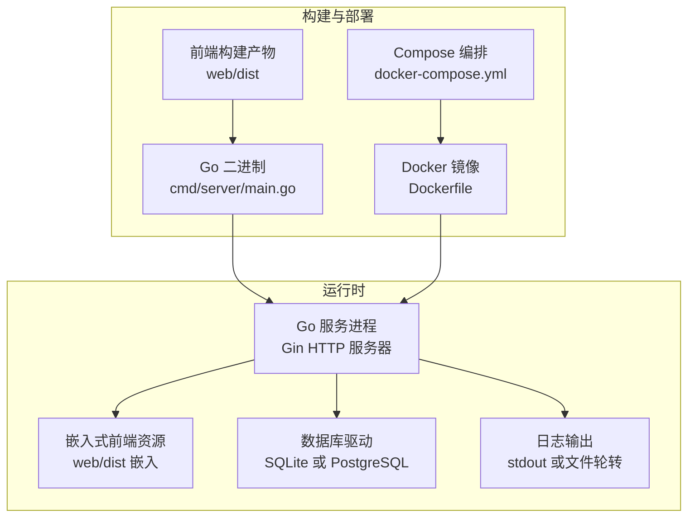
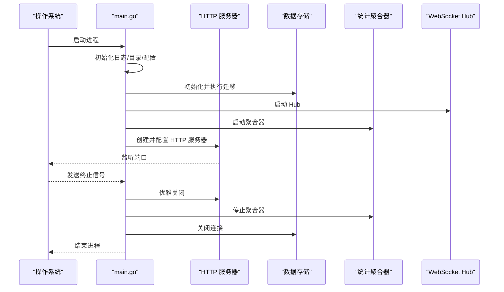
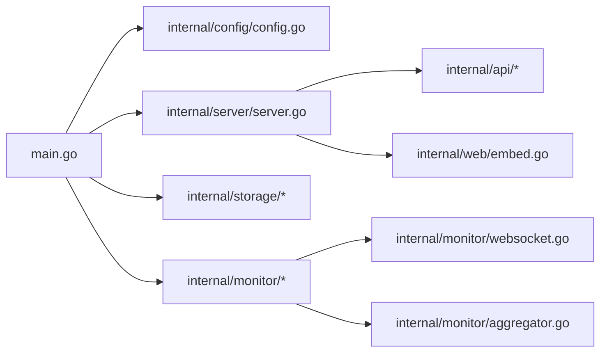

# 运维工具

<cite>
**本文引用的文件**
- [cmd/server/main.go](file://cmd/server/main.go)
- [configs/config.yaml](file://configs/config.yaml)
- [internal/config/config.go](file://internal/config/config.go)
- [internal/server/server.go](file://internal/server/server.go)
- [internal/api/router.go](file://internal/api/router.go)
- [internal/api/health.go](file://internal/api/health.go)
- [internal/api/setup.go](file://internal/api/setup.go)
- [internal/api/dashboard.go](file://internal/api/dashboard.go)
- [internal/api/data.go](file://internal/api/data.go)
- [internal/monitor/aggregator.go](file://internal/monitor/aggregator.go)
- [internal/monitor/websocket.go](file://internal/monitor/websocket.go)
- [Dockerfile](file://Dockerfile)
- [docker-compose.yml](file://docker-compose.yml)
- [Makefile](file://Makefile)
- [scripts/build.sh](file://scripts/build.sh)
</cite>

## 目录
1. [简介](#简介)
2. [项目结构](#项目结构)
3. [核心组件](#核心组件)
4. [架构总览](#架构总览)
5. [详细组件分析](#详细组件分析)
6. [依赖分析](#依赖分析)
7. [性能考虑](#性能考虑)
8. [故障排查指南](#故障排查指南)
9. [结论](#结论)
10. [附录](#附录)

## 简介
本指南面向运维与平台管理员，围绕 DataCollector 的服务器生命周期管理、配置热重载与动态参数调整、日志与性能分析、系统状态监控与健康检查、批量维护与自动化脚本、以及管理界面功能进行系统性说明。文档以仓库中现有实现为依据，提供可操作的步骤与最佳实践。

## 项目结构
DataCollector 采用前后端一体化打包方式：后端使用 Go + Gin，前端使用 Vue，构建时将前端产物嵌入后端二进制，通过嵌入文件系统提供静态资源与 SPA 路由回退。容器镜像同样将前端构建产物复制到嵌入目录，便于直接运行。

图表来源
- [Dockerfile:1-52](file://Dockerfile#L1-L52)
- [Makefile:20-25](file://Makefile#L20-L25)
- [internal/server/server.go:94-138](file://internal/server/server.go#L94-L138)

章节来源
- [Dockerfile:1-52](file://Dockerfile#L1-L52)
- [Makefile:1-57](file://Makefile#L1-L57)
- [internal/server/server.go:94-138](file://internal/server/server.go#L94-L138)

## 核心组件
- 服务器入口与生命周期
  - 信号监听与优雅关闭：接收终止信号后，关闭 HTTP 服务、停止统计聚合器、关闭数据库连接。
  - 日志初始化：默认输出到 stdout；当配置为文件输出时，使用文件轮转。
  - 目录准备：确保数据与日志目录存在。
  - 配置加载：优先从配置文件加载，失败则使用默认配置；支持环境变量覆盖。
- HTTP 服务器与路由
  - Gin 引擎按配置模式初始化；注册全局中间件（恢复、请求日志、CORS、请求体大小限制、初始化检查）。
  - 注册 API v1 路由组，含健康检查、初始化、采集、管理后台、导出等。
  - 提供嵌入式前端静态资源与 SPA 回退。
- 监控与统计
  - WebSocket Hub 管理客户端连接，广播统计更新。
  - 统计聚合器周期性刷新内存计数到数据库，并触发 WebSocket 广播。
- 配置系统
  - YAML 配置结构清晰，支持环境变量覆盖；数据库 DSN 动态生成。
- 健康检查
  - 健康检查接口对数据库进行 Ping，返回状态、版本、运行时长与数据库连接状态。

章节来源
- [cmd/server/main.go:25-129](file://cmd/server/main.go#L25-L129)
- [internal/server/server.go:54-87](file://internal/server/server.go#L54-L87)
- [internal/monitor/websocket.go:14-127](file://internal/monitor/websocket.go#L14-L127)
- [internal/monitor/aggregator.go:47-133](file://internal/monitor/aggregator.go#L47-L133)
- [internal/config/config.go:82-195](file://internal/config/config.go#L82-L195)
- [internal/api/health.go:36-64](file://internal/api/health.go#L36-L64)

## 架构总览
DataCollector 的运行时由“HTTP 服务 + 嵌入式前端 + 数据存储 + 监控通道”构成。启动流程从 main.go 开始，随后初始化存储、启动聚合器与 WebSocket Hub，最后启动 HTTP 服务。停止时按顺序优雅关闭。

图表来源
- [cmd/server/main.go:25-129](file://cmd/server/main.go#L25-L129)
- [internal/server/server.go:84-101](file://internal/server/server.go#L84-L101)
- [internal/monitor/aggregator.go:84-87](file://internal/monitor/aggregator.go#L84-L87)

## 详细组件分析

### 服务器启动、停止与重启
- 启动
  - 本地开发：使用构建脚本或直接运行后端入口。
  - 生产部署：推荐使用容器镜像，容器启动后自动创建数据与日志目录并监听端口。
- 停止
  - 通过发送终止信号触发优雅关闭流程，确保统计聚合器完成最终刷新、数据库连接正常关闭。
- 重启
  - 通过容器编排或进程管理器进行滚动重启；容器内已设置健康检查与重启策略。

章节来源
- [cmd/server/main.go:103-129](file://cmd/server/main.go#L103-L129)
- [Dockerfile:30-52](file://Dockerfile#L30-L52)
- [docker-compose.yml:3-16](file://docker-compose.yml#L3-L16)

### 配置热重载与动态参数调整
- 配置来源与优先级
  - 文件优先：从配置文件加载；失败则回退默认配置。
  - 环境变量覆盖：支持数据库驱动、SQLite 路径、PostgreSQL 连接参数、服务器端口、JWT 密钥、日志级别等。
- 可动态调整项
  - 日志级别：通过环境变量设置，不影响运行时数据库连接参数。
  - 服务器端口：可通过环境变量覆盖，需重启生效。
  - 数据库类型与连接参数：当前实现不支持运行时切换，需重启生效。
- 建议
  - 在容器中通过环境变量进行参数调整；生产建议将敏感参数放入密钥管理。

章节来源
- [configs/config.yaml:1-41](file://configs/config.yaml#L1-L41)
- [internal/config/config.go:82-195](file://internal/config/config.go#L82-L195)
- [Dockerfile:45-50](file://Dockerfile#L45-L50)

### 日志查看与分析
- 输出方式
  - 默认输出到标准输出；容器镜像示例将日志写入文件并启用轮转。
- 日志轮转
  - 当配置为文件输出时，使用文件轮转器，按大小与天数进行轮转。
- 查看建议
  - 容器环境：查看容器日志；结合日志轮转文件定位问题。
  - 本地开发：关注控制台输出，必要时临时提升日志级别。

章节来源
- [cmd/server/main.go:131-153](file://cmd/server/main.go#L131-L153)
- [configs/config.yaml:34-41](file://configs/config.yaml#L34-L41)
- [Dockerfile:39-49](file://Dockerfile#L39-L49)

### 性能分析与调试
- 统计聚合与推送
  - 聚合器每分钟刷新一次内存计数到数据库，并通过 WebSocket 广播更新通知。
- 调试建议
  - 通过健康检查接口验证数据库连通性。
  - 使用仪表盘趋势接口查询指定时间范围内的数据增长趋势。
  - 如需强制持久化，可调用聚合器的强制刷新方法（用于测试或紧急场景）。

章节来源
- [internal/monitor/aggregator.go:47-133](file://internal/monitor/aggregator.go#L47-L133)
- [internal/api/health.go:36-64](file://internal/api/health.go#L36-L64)
- [internal/api/dashboard.go:97-138](file://internal/api/dashboard.go#L97-L138)

### 系统状态监控与健康检查
- 健康检查接口
  - 路径：GET /api/v1/health
  - 行为：对数据库执行 Ping，返回状态、版本、运行时长与数据库连接状态。
- 健康检查命令示例
  - curl 示例：curl -s http://HOST:PORT/api/v1/health
  - 返回 200 且包含 healthy 表示服务健康；否则检查数据库连接与日志。

章节来源
- [internal/api/health.go:36-64](file://internal/api/health.go#L36-L64)
- [internal/api/router.go:36-37](file://internal/api/router.go#L36-L37)

### 批量操作与维护任务
- 批量删除数据
  - 管理接口：POST /api/v1/admin/data/batch-delete
  - 请求体包含待删除记录 ID 列表；成功返回删除数量。
- 单条删除
  - 管理接口：DELETE /api/v1/admin/data/:id
- 数据查询与分页
  - 管理接口：GET /api/v1/admin/data
  - 支持分页参数与过滤条件。
- 维护建议
  - 批量删除前建议先查询确认；定期清理历史数据以控制存储增长。

章节来源
- [internal/api/data.go:29-96](file://internal/api/data.go#L29-L96)
- [internal/api/router.go:94-100](file://internal/api/router.go#L94-L100)

### 运维面板与管理界面
- 前端资源
  - 嵌入式静态资源：通过 Gin 的嵌入文件系统提供前端产物。
  - SPA 回退：未匹配 API 路由时返回前端首页，交由前端路由处理。
- 登录与鉴权
  - 管理登录：POST /api/v1/admin/login（无需 JWT）
  - 鉴权中间件：后续管理接口均需 JWT 认证。
- 仪表盘
  - 今日/本周/本月总量与最近记录：GET /api/v1/admin/dashboard
  - 趋势查询：GET /api/v1/admin/dashboard/trend（需起止日期参数）
- 数据源与 Token 管理
  - 数据源增删改查与 Token 管理：见路由分组与子路由。
- 导出
  - 数据导出：GET /api/v1/admin/data/export

章节来源
- [internal/server/server.go:94-138](file://internal/server/server.go#L94-L138)
- [internal/api/router.go:57-114](file://internal/api/router.go#L57-L114)
- [internal/api/dashboard.go:34-95](file://internal/api/dashboard.go#L34-L95)
- [internal/api/dashboard.go:97-138](file://internal/api/dashboard.go#L97-L138)

### 常见运维场景与最佳实践
- 首次初始化
  - 步骤：检查初始化状态 → 测试数据库连接（PostgreSQL 时）→ 执行初始化（设置数据库与服务器配置、创建管理员用户、标记初始化完成）。
  - 注意：初始化完成后需重启服务以应用新配置。
- 重新初始化
  - 需要管理员 JWT 与确认字符串；会重置初始化标记，建议配合存储清理策略使用。
- 切换数据库
  - 通过环境变量或配置文件修改数据库驱动与连接参数；需重启生效。
- 调整限流与跨域
  - 通过配置文件调整每 Token/每 IP 的速率限制与允许的来源列表；需重启生效。
- 容器化部署
  - 使用 Compose 快速启动；SQLite 模式默认启用；可切换至 PostgreSQL 模式并配置依赖服务。

章节来源
- [internal/api/setup.go:40-196](file://internal/api/setup.go#L40-L196)
- [internal/api/setup.go:198-236](file://internal/api/setup.go#L198-L236)
- [configs/config.yaml:27-33](file://configs/config.yaml#L27-L33)
- [docker-compose.yml:3-36](file://docker-compose.yml#L3-L36)

## 依赖分析
- 组件耦合
  - main.go 依赖配置、存储、监控与服务器模块；服务器模块负责路由注册与静态资源服务。
  - 监控模块通过事件通道与处理器交互，聚合器与 Hub 协作推送更新。
- 外部依赖
  - Gin、WebSocket、数据库驱动（SQLite/PostgreSQL）、日志轮转库。
- 可能的改进点
  - 配置热重载：当前未实现运行时配置热加载，建议引入配置变更监听与按需重载逻辑。

图表来源
- [cmd/server/main.go:15-21](file://cmd/server/main.go#L15-L21)
- [internal/server/server.go:12-20](file://internal/server/server.go#L12-L20)
- [internal/monitor/websocket.go:14-22](file://internal/monitor/websocket.go#L14-L22)
- [internal/monitor/aggregator.go:17-28](file://internal/monitor/aggregator.go#L17-L28)

## 性能考虑
- 统计聚合频率：聚合器每分钟刷新一次，适合中小规模数据采集场景；高并发时可评估降低刷新频率或优化数据库写入路径。
- WebSocket 广播：广播通道采用异步队列，若客户端过多可能导致消息积压；建议监控广播通道长度与客户端数量。
- 日志级别：生产环境建议使用 info 或更高级别，避免过多 debug 日志影响性能。
- 数据库驱动：SQLite 适合单机与小规模；大规模或高并发建议使用 PostgreSQL 并合理配置连接池与索引。

## 故障排查指南
- 服务无法启动
  - 检查配置文件与环境变量是否正确；确认数据与日志目录权限。
- 数据库连接失败
  - 使用健康检查接口验证；如为 PostgreSQL，使用初始化测试接口验证连接参数。
- 健康检查异常
  - 返回非 200 或状态为 unhealthy 时，检查数据库服务与网络连通性。
- WebSocket 无法接收更新
  - 检查 Hub 是否运行、客户端是否保持连接、广播通道是否阻塞。
- 日志为空或未轮转
  - 确认日志输出配置为文件；检查容器卷挂载与文件权限。

章节来源
- [internal/api/health.go:36-64](file://internal/api/health.go#L36-L64)
- [internal/api/setup.go:62-105](file://internal/api/setup.go#L62-L105)
- [internal/monitor/websocket.go:63-106](file://internal/monitor/websocket.go#L63-L106)

## 结论
DataCollector 提供了完整的运维能力：从启动/停止/重启、配置覆盖、健康检查、监控推送，到管理界面与批量维护接口。建议在生产环境中结合容器编排、日志轮转与健康检查策略，确保系统的稳定性与可观测性。

## 附录

### 常用命令与脚本
- 构建
  - 前端安装与构建：make web-install, make web-build
  - 后端构建：make build（先构建前端再构建后端），或 make build-go（仅后端）
  - 多平台构建：make build-all（调用脚本）
- 运行
  - 本地运行：make run
  - 容器运行：docker-compose up -d
- 清理
  - make clean

章节来源
- [Makefile:12-57](file://Makefile#L12-L57)
- [scripts/build.sh:1-65](file://scripts/build.sh#L1-65)
- [docker-compose.yml:3-16](file://docker-compose.yml#L3-L16)