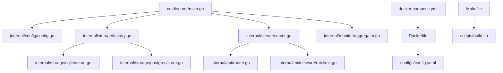
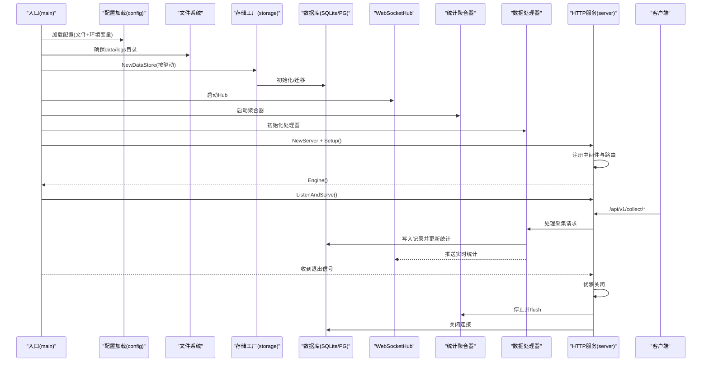
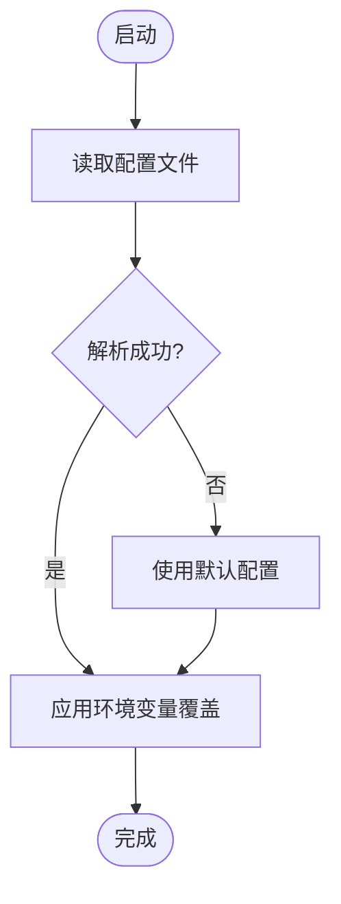
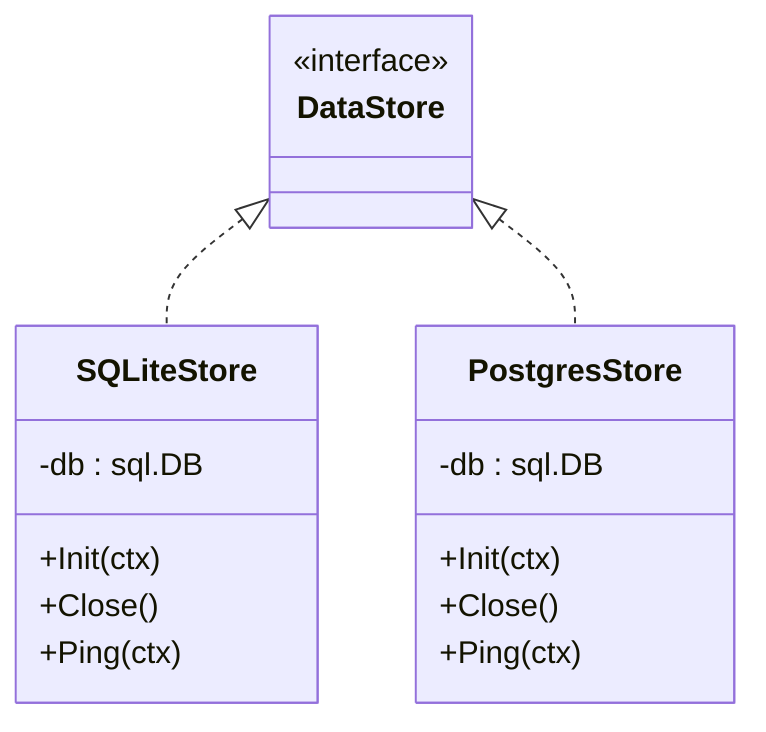
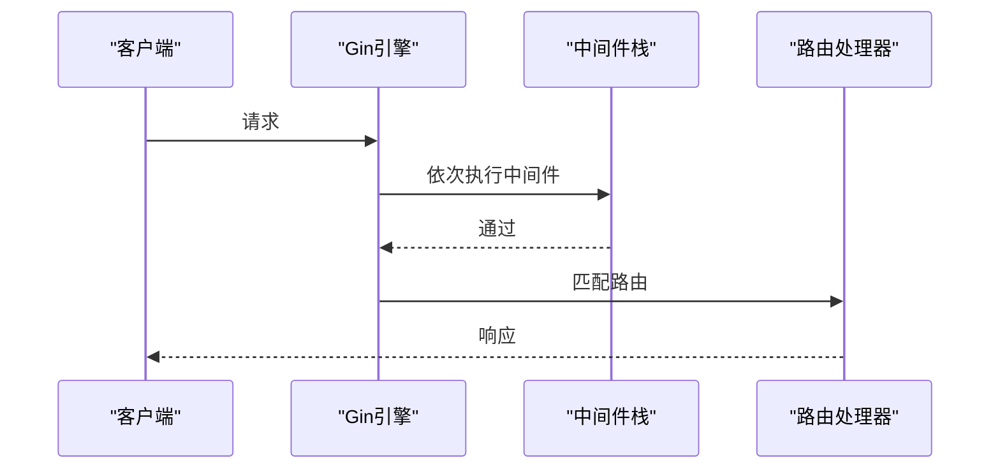
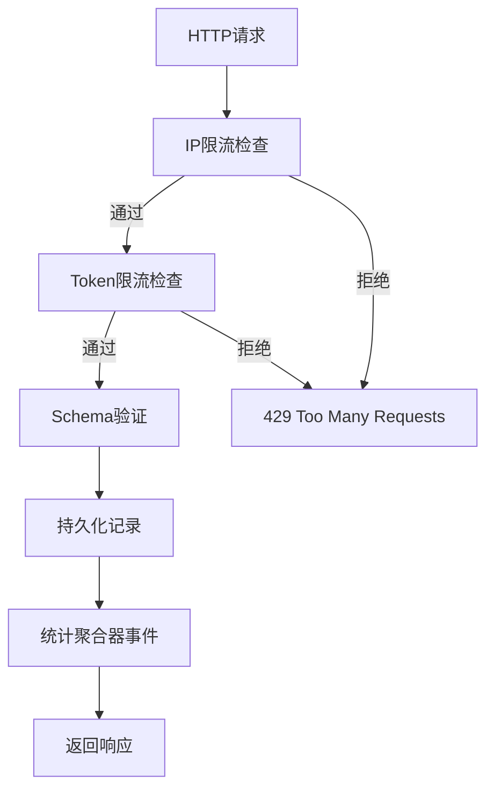
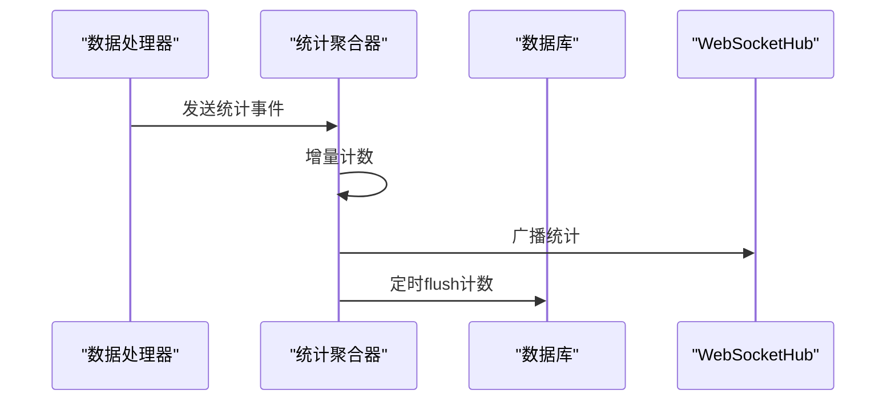
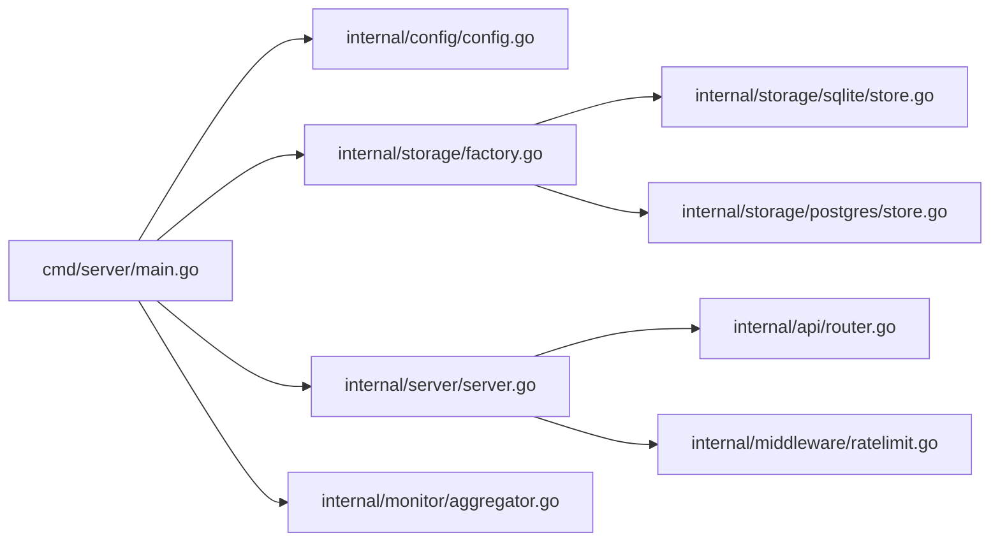
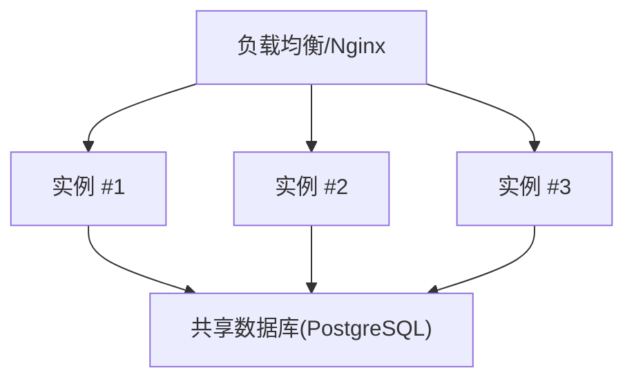
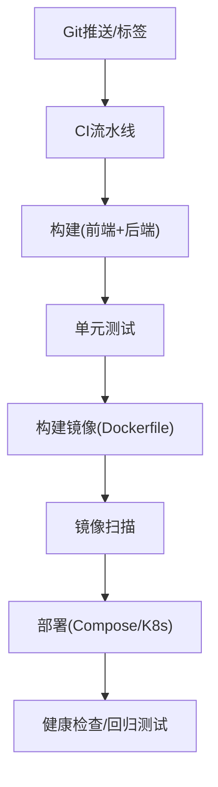

# 部署和运维

<cite>
**本文引用的文件**
- [Dockerfile](file://Dockerfile)
- [docker-compose.yml](file://docker-compose.yml)
- [configs/config.yaml](file://configs/config.yaml)
- [cmd/server/main.go](file://cmd/server/main.go)
- [internal/config/config.go](file://internal/config/config.go)
- [internal/server/server.go](file://internal/server/server.go)
- [internal/api/router.go](file://internal/api/router.go)
- [internal/middleware/ratelimit.go](file://internal/middleware/ratelimit.go)
- [internal/storage/factory.go](file://internal/storage/factory.go)
- [internal/storage/sqlite/store.go](file://internal/storage/sqlite/store.go)
- [internal/storage/postgres/store.go](file://internal/storage/postgres/store.go)
- [internal/monitor/aggregator.go](file://internal/monitor/aggregator.go)
- [scripts/build.sh](file://scripts/build.sh)
- [Makefile](file://Makefile)
- [docs/architecture.md](file://docs/architecture.md)
</cite>

## 目录
1. [简介](#简介)
2. [项目结构](#项目结构)
3. [核心组件](#核心组件)
4. [架构总览](#架构总览)
5. [详细组件分析](#详细组件分析)
6. [依赖关系分析](#依赖关系分析)
7. [性能与容量规划](#性能与容量规划)
8. [日志与监控告警](#日志与监控告警)
9. [备份与恢复](#备份与恢复)
10. [负载均衡与高可用](#负载均衡与高可用)
11. [生产环境配置与安全加固](#生产环境配置与安全加固)
12. [自动化部署与CI/CD集成](#自动化部署与cicd集成)
13. [故障排除与应急响应](#故障排除与应急响应)
14. [运维工具与管理界面](#运维工具与管理界面)
15. [结论](#结论)

## 简介
本指南面向DataCollector的部署与运维团队，围绕容器化部署、Kubernetes集群管理、生产配置与安全加固、自动化流水线、日志监控告警、备份恢复、高可用与负载均衡、容量规划与性能监控、故障排除与应急响应、以及运维工具与管理界面使用等方面，提供可操作的实践建议。文档严格基于仓库现有实现与架构说明，确保内容可追溯、可落地。

## 项目结构
DataCollector采用“后端Go + 前端静态资源嵌入”的单二进制分发模式，核心目录与职责如下：
- cmd/server：服务入口，负责配置加载、存储初始化、HTTP服务启动与优雅关闭
- internal：核心业务包，按职责拆分，包括API路由、鉴权、采集、配置、存储、中间件、监控、Web资源嵌入等
- configs：默认配置文件
- scripts：多平台构建脚本
- docker-compose：本地容器编排示例
- docs：架构与需求文档

**图示来源**
- [cmd/server/main.go:1-201](file://cmd/server/main.go#L1-L201)
- [internal/config/config.go:1-215](file://internal/config/config.go#L1-L215)
- [internal/storage/factory.go:1-22](file://internal/storage/factory.go#L1-L22)
- [internal/storage/sqlite/store.go:1-86](file://internal/storage/sqlite/store.go#L1-L86)
- [internal/storage/postgres/store.go:1-61](file://internal/storage/postgres/store.go#L1-L61)
- [internal/server/server.go:1-139](file://internal/server/server.go#L1-L139)
- [internal/api/router.go:1-116](file://internal/api/router.go#L1-L116)
- [internal/middleware/ratelimit.go:1-137](file://internal/middleware/ratelimit.go#L1-L137)
- [internal/monitor/aggregator.go:1-197](file://internal/monitor/aggregator.go#L1-L197)
- [Dockerfile:1-52](file://Dockerfile#L1-L52)
- [docker-compose.yml:1-56](file://docker-compose.yml#L1-L56)
- [configs/config.yaml:1-41](file://configs/config.yaml#L1-L41)
- [Makefile:1-57](file://Makefile#L1-L57)
- [scripts/build.sh:1-65](file://scripts/build.sh#L1-L65)

**章节来源**
- [docs/architecture.md:260-316](file://docs/architecture.md#L260-L316)
- [Dockerfile:1-52](file://Dockerfile#L1-L52)
- [docker-compose.yml:1-56](file://docker-compose.yml#L1-L56)
- [configs/config.yaml:1-41](file://configs/config.yaml#L1-L41)
- [Makefile:1-57](file://Makefile#L1-L57)

## 核心组件
- 配置系统：支持YAML文件与环境变量覆盖，提供服务器、TLS、数据库、JWT、采集限流、日志等配置项
- 存储层：工厂模式按驱动选择SQLite或PostgreSQL实现，支持迁移与连接池
- HTTP服务：Gin引擎封装，注册全局中间件与路由组，提供SPA回退
- 采集与限流：双维度限流（IP与Data Token），采集请求经Token校验与Schema验证后持久化
- 监控聚合：内存计数器+定时落库，WebSocket推送仪表盘实时更新
- 日志：slog JSON输出，支持stdout/file轮转

**章节来源**
- [internal/config/config.go:1-215](file://internal/config/config.go#L1-L215)
- [internal/storage/factory.go:1-22](file://internal/storage/factory.go#L1-L22)
- [internal/storage/sqlite/store.go:1-86](file://internal/storage/sqlite/store.go#L1-L86)
- [internal/storage/postgres/store.go:1-61](file://internal/storage/postgres/store.go#L1-L61)
- [internal/server/server.go:1-139](file://internal/server/server.go#L1-L139)
- [internal/api/router.go:1-116](file://internal/api/router.go#L1-L116)
- [internal/middleware/ratelimit.go:1-137](file://internal/middleware/ratelimit.go#L1-L137)
- [internal/monitor/aggregator.go:1-197](file://internal/monitor/aggregator.go#L1-L197)
- [cmd/server/main.go:131-201](file://cmd/server/main.go#L131-L201)

## 架构总览
DataCollector的服务生命周期与关键交互如下：

**图示来源**
- [cmd/server/main.go:25-129](file://cmd/server/main.go#L25-L129)
- [internal/config/config.go:82-195](file://internal/config/config.go#L82-L195)
- [internal/storage/factory.go:11-21](file://internal/storage/factory.go#L11-L21)
- [internal/storage/sqlite/store.go:58-85](file://internal/storage/sqlite/store.go#L58-L85)
- [internal/storage/postgres/store.go:36-60](file://internal/storage/postgres/store.go#L36-L60)
- [internal/server/server.go:54-87](file://internal/server/server.go#L54-L87)
- [internal/api/router.go:12-115](file://internal/api/router.go#L12-L115)
- [internal/monitor/aggregator.go:47-133](file://internal/monitor/aggregator.go#L47-L133)

## 详细组件分析

### 配置与环境变量覆盖
- 配置来源：优先读取configs/config.yaml，若失败则使用默认配置
- 环境变量覆盖：支持数据库驱动、SQLite路径、PG主机/端口/用户/密码/库名、服务器端口、JWT密钥、日志级别等
- 日志：支持stdout/file两种输出，file模式启用lumberjack轮转

**图示来源**
- [cmd/server/main.go:155-169](file://cmd/server/main.go#L155-L169)
- [internal/config/config.go:82-195](file://internal/config/config.go#L82-L195)

**章节来源**
- [configs/config.yaml:1-41](file://configs/config.yaml#L1-L41)
- [internal/config/config.go:82-195](file://internal/config/config.go#L82-L195)
- [cmd/server/main.go:155-201](file://cmd/server/main.go#L155-L201)

### 存储层与数据库驱动
- 工厂模式：根据配置的driver选择SQLite或PostgreSQL实现
- SQLite：单文件、WAL模式、busy_timeout、连接池限制为1
- PostgreSQL：连接池参数可配置，支持DSN拼接

**图示来源**
- [internal/storage/factory.go:11-21](file://internal/storage/factory.go#L11-L21)
- [internal/storage/sqlite/store.go:17-85](file://internal/storage/sqlite/store.go#L17-L85)
- [internal/storage/postgres/store.go:14-60](file://internal/storage/postgres/store.go#L14-L60)

**章节来源**
- [internal/storage/factory.go:1-22](file://internal/storage/factory.go#L1-L22)
- [internal/storage/sqlite/store.go:1-86](file://internal/storage/sqlite/store.go#L1-L86)
- [internal/storage/postgres/store.go:1-61](file://internal/storage/postgres/store.go#L1-L61)

### HTTP服务与路由
- Gin模式：debug/release由配置决定
- 全局中间件：恢复、请求日志、CORS、请求体大小限制、初始化状态检查
- 路由组：/api/v1，包含健康检查、初始化、采集（双限流）、管理后台（JWT认证）、导出等
- SPA回退：未命中API的路由返回前端index.html

**图示来源**
- [internal/server/server.go:54-87](file://internal/server/server.go#L54-L87)
- [internal/api/router.go:12-115](file://internal/api/router.go#L12-L115)

**章节来源**
- [internal/server/server.go:1-139](file://internal/server/server.go#L1-L139)
- [internal/api/router.go:1-116](file://internal/api/router.go#L1-L116)

### 采集与限流
- 采集路由：/api/v1/collect/:source_id 及批量接口
- 限流：按IP与Data Token分别限流，滑动窗口算法，定期清理过期记录
- Token校验：X-Data-Token头，哈希比对（基于架构文档）

**图示来源**
- [internal/api/router.go:47-55](file://internal/api/router.go#L47-L55)
- [internal/middleware/ratelimit.go:68-98](file://internal/middleware/ratelimit.go#L68-L98)

**章节来源**
- [internal/api/router.go:1-116](file://internal/api/router.go#L1-L116)
- [internal/middleware/ratelimit.go:1-137](file://internal/middleware/ratelimit.go#L1-L137)

### 监控与实时推送
- 内存计数器：按sourceID累加
- 定时刷新：每分钟将计数持久化到statistics表
- WebSocket：向仪表盘推送实时统计

**图示来源**
- [internal/monitor/aggregator.go:47-133](file://internal/monitor/aggregator.go#L47-L133)

**章节来源**
- [internal/monitor/aggregator.go:1-197](file://internal/monitor/aggregator.go#L1-L197)

## 依赖关系分析
- 入口依赖配置、存储工厂、HTTP服务、监控与采集模块
- 存储层通过接口解耦，支持多数据库驱动
- API层依赖鉴权、限流、处理器与存储
- 中间件提供横切关注点（日志、CORS、限流、大小限制）

**图示来源**
- [cmd/server/main.go:15-21](file://cmd/server/main.go#L15-L21)
- [internal/server/server.go:12-20](file://internal/server/server.go#L12-L20)
- [internal/api/router.go:3-10](file://internal/api/router.go#L3-L10)
- [internal/storage/factory.go:6-9](file://internal/storage/factory.go#L6-L9)

**章节来源**
- [cmd/server/main.go:1-201](file://cmd/server/main.go#L1-L201)
- [internal/server/server.go:1-139](file://internal/server/server.go#L1-L139)
- [internal/api/router.go:1-116](file://internal/api/router.go#L1-L116)
- [internal/storage/factory.go:1-22](file://internal/storage/factory.go#L1-L22)

## 性能与容量规划
- 数据库选择
  - SQLite：默认、零配置，适合小规模与开发；单写连接，WAL与busy_timeout优化
  - PostgreSQL：生产高并发首选，合理设置连接池参数
- 采集限流
  - IP与Token双维度限流，结合请求体大小限制，降低突发流量冲击
- 监控聚合
  - 内存计数器+定时flush，避免频繁写库；可根据数据量调整flush周期
- 前端资源
  - 静态资源嵌入二进制，减少I/O与网络传输

**章节来源**
- [internal/storage/sqlite/store.go:39-53](file://internal/storage/sqlite/store.go#L39-L53)
- [internal/storage/postgres/store.go:29-32](file://internal/storage/postgres/store.go#L29-L32)
- [internal/middleware/ratelimit.go:12-31](file://internal/middleware/ratelimit.go#L12-L31)
- [internal/monitor/aggregator.go:52-74](file://internal/monitor/aggregator.go#L52-L74)

## 日志与监控告警
- 日志
  - 默认stdout JSON输出；file模式启用lumberjack轮转（最大尺寸、最大保留天数）
  - 建议生产环境使用file轮转，结合集中日志收集（如Fluent Bit/Vector+ELK/Graylog）
- 监控
  - 仪表盘通过WebSocket接收实时统计
  - 建议接入Prometheus/Grafana，暴露/采集关键指标（QPS、P95/P99延迟、数据库连接数、队列长度、错误码分布）
- 告警
  - 基于阈值（如错误率、延迟、连接池耗尽、磁盘空间、日志异常）触发告警

**章节来源**
- [configs/config.yaml:34-41](file://configs/config.yaml#L34-L41)
- [cmd/server/main.go:138-153](file://cmd/server/main.go#L138-L153)
- [internal/monitor/aggregator.go:83-86](file://internal/monitor/aggregator.go#L83-L86)

## 备份与恢复
- SQLite
  - 备份：停止服务后复制数据库文件；或在WAL模式下进行一致性快照
  - 恢复：替换数据库文件后重启服务
- PostgreSQL
  - 备份：使用pg_dump/pg_basebackup；恢复：重建实例后导入
- 日志与配置
  - 备份logs与configs目录；恢复时注意权限与路径映射

**章节来源**
- [internal/storage/sqlite/store.go:27-31](file://internal/storage/sqlite/store.go#L27-L31)
- [internal/storage/sqlite/store.go:43-53](file://internal/storage/sqlite/store.go#L43-L53)
- [configs/config.yaml:13-21](file://configs/config.yaml#L13-L21)

## 负载均衡与高可用
- 单实例
  - 适合小规模与开发测试
- 容器化
  - 使用Docker Compose或Kubernetes部署；建议将logs与data挂载为持久卷
- 高可用
  - 多实例水平扩展需使用PostgreSQL；JWT密钥需在实例间保持一致
  - 前端静态资源嵌入二进制，无需共享存储
- 负载均衡
  - 使用Nginx/LB分发至多个实例；健康检查指向/health端点

**图示来源**
- [docs/architecture.md:232-256](file://docs/architecture.md#L232-L256)
- [docker-compose.yml:18-36](file://docker-compose.yml#L18-L36)

**章节来源**
- [docs/architecture.md:188-256](file://docs/architecture.md#L188-L256)
- [docker-compose.yml:1-56](file://docker-compose.yml#L1-56)

## 生产环境配置与安全加固
- TLS
  - 启用TLS并配置证书/私钥文件；生产环境强制HTTPS
- JWT
  - 使用强随机密钥，设置合理过期时间；密钥在多实例间保持一致
- 数据库
  - 生产使用PostgreSQL，开启SSL；最小权限账号；定期审计
- 限流与防护
  - 合理设置IP与Token限流阈值；启用CORS白名单；请求体大小限制
- 文件系统
  - data/logs目录使用独立持久卷；权限最小化；定期清理旧日志

**章节来源**
- [configs/config.yaml:6-9](file://configs/config.yaml#L6-L9)
- [configs/config.yaml:23-25](file://configs/config.yaml#L23-L25)
- [configs/config.yaml:11-21](file://configs/config.yaml#L11-L21)
- [internal/server/server.go:63-67](file://internal/server/server.go#L63-L67)
- [internal/api/router.go:50-51](file://internal/api/router.go#L50-L51)

## 自动化部署与CI/CD集成
- 多平台构建
  - 使用scripts/build.sh生成多平台二进制；Makefile提供一键构建与打包
- 容器化
  - Dockerfile多阶段构建，前端构建产物复制到Go嵌入目录；Compose提供SQLite/PG示例
- CI/CD建议
  - 触发条件：push/tag
  - 步骤：安装依赖 → 前端构建 → 后端构建 → 镜像构建 → 推送镜像 → 部署（Compose/K8s）
  - 安全：镜像扫描、密钥注入、只读根文件系统、最小权限

**图示来源**
- [scripts/build.sh:1-65](file://scripts/build.sh#L1-L65)
- [Makefile:28-57](file://Makefile#L28-L57)
- [Dockerfile:1-52](file://Dockerfile#L1-L52)
- [docker-compose.yml:1-56](file://docker-compose.yml#L1-L56)

**章节来源**
- [scripts/build.sh:1-65](file://scripts/build.sh#L1-L65)
- [Makefile:1-57](file://Makefile#L1-L57)
- [Dockerfile:1-52](file://Dockerfile#L1-L52)
- [docker-compose.yml:1-56](file://docker-compose.yml#L1-L56)

## 故障排除与应急响应
- 启动失败
  - 检查配置文件与环境变量覆盖；确认data/logs目录可写；查看日志轮转配置
- 数据库问题
  - SQLite：检查WAL模式与busy_timeout；确认单写限制；必要时迁移至PostgreSQL
  - PostgreSQL：核对DSN、连接池参数、网络连通性
- 采集异常
  - 检查限流阈值与Token有效性；查看/health端点；确认Schema验证规则
- 优雅关闭
  - 确认信号处理与关闭顺序；避免资源泄漏

**章节来源**
- [cmd/server/main.go:25-129](file://cmd/server/main.go#L25-L129)
- [internal/storage/sqlite/store.go:43-53](file://internal/storage/sqlite/store.go#L43-L53)
- [internal/storage/postgres/store.go:29-32](file://internal/storage/postgres/store.go#L29-L32)
- [internal/api/router.go:36-45](file://internal/api/router.go#L36-L45)

## 运维工具与管理界面
- 管理后台
  - 基于嵌入的前端资源，提供数据源管理、Token管理、数据查询、导出、仪表盘等功能
- 健康检查
  - /api/v1/health 无需认证，便于LB与探针使用
- 初始化流程
  - /api/v1/setup/status → /api/v1/setup/test-db → /api/v1/setup/init
- 日志与监控
  - 结合集中日志与可视化面板，持续观察关键指标

**章节来源**
- [internal/server/server.go:85-138](file://internal/server/server.go#L85-L138)
- [internal/api/router.go:36-45](file://internal/api/router.go#L36-L45)
- [docs/architecture.md:112-118](file://docs/architecture.md#L112-L118)

## 结论
DataCollector以“单二进制+嵌入前端资源”为核心，结合多数据库适配、限流与监控聚合，提供了从开发到生产的完整能力。生产部署建议采用PostgreSQL、TLS、严格的密钥与权限管理，并通过容器化与Kubernetes实现弹性与高可用。配合完善的日志、监控与备份策略，可满足大多数企业级数据采集场景。