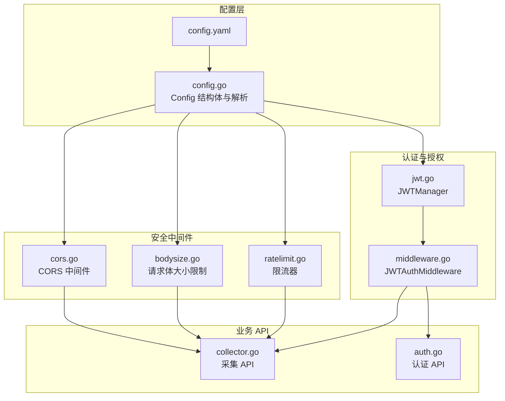
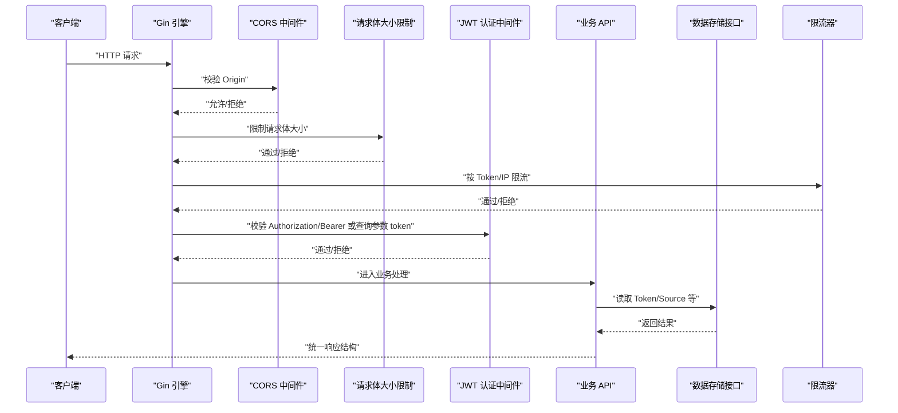
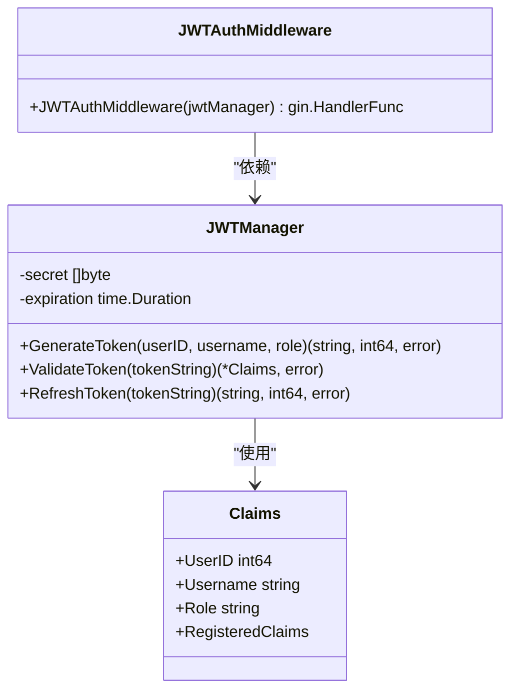
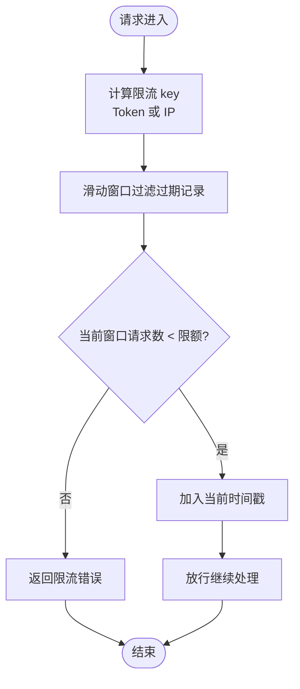
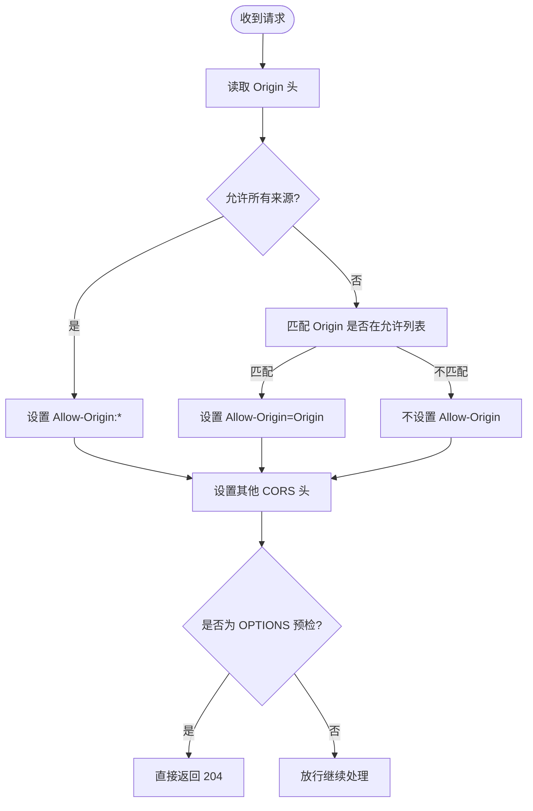
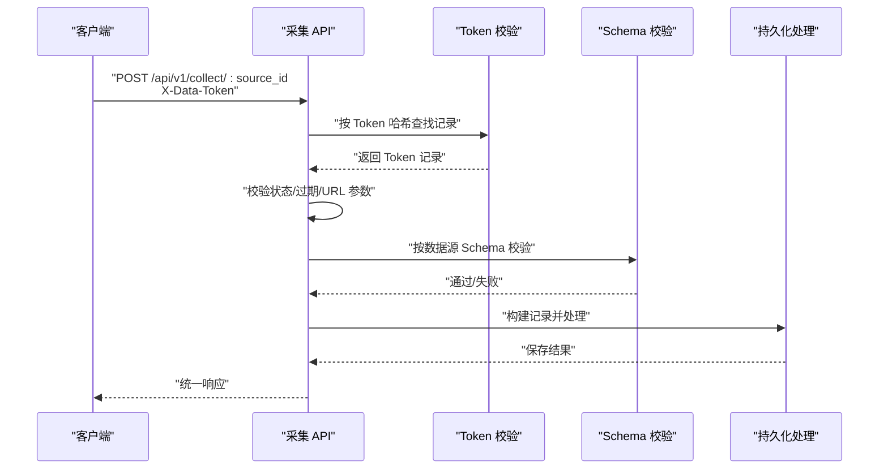
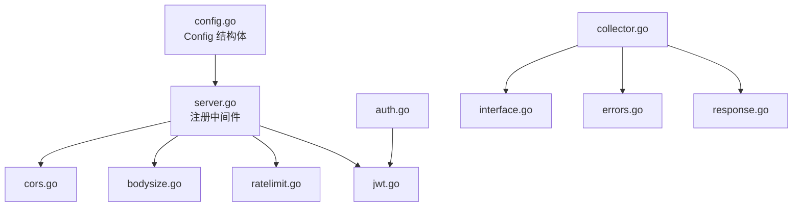

# 安全配置

<cite>
**本文引用的文件**
- [config.yaml](file://configs/config.yaml)
- [config.go](file://internal/config/config.go)
- [jwt.go](file://internal/auth/jwt.go)
- [middleware.go](file://internal/auth/middleware.go)
- [ratelimit.go](file://internal/middleware/ratelimit.go)
- [cors.go](file://internal/middleware/cors.go)
- [bodysize.go](file://internal/middleware/bodysize.go)
- [collector.go](file://internal/api/collector.go)
- [auth.go](file://internal/api/auth.go)
- [server.go](file://internal/server/server.go)
- [errors.go](file://internal/model/errors.go)
- [response.go](file://internal/model/response.go)
- [token.go](file://internal/model/token.go)
- [interface.go](file://internal/storage/interface.go)
</cite>

## 目录
1. [简介](#简介)
2. [项目结构](#项目结构)
3. [核心组件](#核心组件)
4. [架构总览](#架构总览)
5. [详细组件分析](#详细组件分析)
6. [依赖分析](#依赖分析)
7. [性能考量](#性能考量)
8. [故障排查指南](#故障排查指南)
9. [结论](#结论)
10. [附录](#附录)

## 简介
本文件聚焦于 DataCollector 的安全配置，围绕配置文件 config.yaml 中的 jwt 与 collector 两大部分展开，系统性阐述以下主题：
- JWT 密钥 secret、过期时间 expiration 的安全意义与最佳实践
- 采集端限流配置 rate_limit_per_token 与 rate_limit_per_ip 对系统安全与性能的影响
- CORS 配置 allowed_origins 的安全考量与跨域访问控制策略
- 配置项在代码中的落地实现、调用链路与错误处理
- 安全配置的审计与监控建议

## 项目结构
与安全配置直接相关的文件分布如下：
- 配置定义与加载：internal/config/config.go
- 配置文件：configs/config.yaml
- JWT 管理与认证中间件：internal/auth/jwt.go、internal/auth/middleware.go
- 采集端限流与 CORS、请求体大小限制：internal/middleware/ratelimit.go、internal/middleware/cors.go、internal/middleware/bodysize.go
- 采集 API 与认证 API：internal/api/collector.go、internal/api/auth.go
- 服务器装配与中间件注册：internal/server/server.go
- 统一响应与错误码：internal/model/response.go、internal/model/errors.go
- 存储接口与 Token 模型：internal/storage/interface.go、internal/model/token.go

图表来源
- [config.yaml:1-41](file://configs/config.yaml#L1-L41)
- [config.go:58-70](file://internal/config/config.go#L58-L70)
- [cors.go:9-51](file://internal/middleware/cors.go#L9-L51)
- [ratelimit.go:12-137](file://internal/middleware/ratelimit.go#L12-L137)
- [bodysize.go:10-40](file://internal/middleware/bodysize.go#L10-L40)
- [jwt.go:19-114](file://internal/auth/jwt.go#L19-L114)
- [middleware.go:11-148](file://internal/auth/middleware.go#L11-L148)
- [collector.go:15-278](file://internal/api/collector.go#L15-L278)
- [auth.go:12-147](file://internal/api/auth.go#L12-L147)

章节来源
- [config.yaml:1-41](file://configs/config.yaml#L1-L41)
- [config.go:58-70](file://internal/config/config.go#L58-L70)

## 核心组件
本节聚焦 config.yaml 中与安全直接相关的关键配置项及其在代码中的映射与行为。

- JWT 配置（jwt）
  - secret：用于 HMAC 签名的密钥，必须足够随机且保密
  - expiration：Token 有效期，到期后需刷新或重新登录
  - 在代码中通过 internal/config/config.go 的 JWTConfig 结构体定义，并在 internal/auth/jwt.go 中被 JWTManager 使用；同时在 internal/server/server.go 中被初始化

- 采集端安全配置（collector）
  - max_body_size：请求体最大字节数，防止过大请求导致资源耗尽
  - rate_limit_per_token：按 Data Token 的每分钟请求数上限
  - rate_limit_per_ip：按客户端 IP 的每分钟请求数上限
  - allowed_origins：允许的 CORS 来源列表，支持通配符
  - 在 internal/config/config.go 的 CollectorConfig 中定义；在 internal/server/server.go 中注册为全局中间件；在 internal/api/collector.go 中通过 X-Data-Token 头进行 Token 校验

章节来源
- [config.yaml:23-32](file://configs/config.yaml#L23-L32)
- [config.go:58-70](file://internal/config/config.go#L58-L70)
- [server.go:65-67](file://internal/server/server.go#L65-L67)
- [collector.go:34-78](file://internal/api/collector.go#L34-L78)

## 架构总览
下图展示安全配置在系统中的装配与调用关系，以及关键错误码与响应结构。

图表来源
- [server.go:65-83](file://internal/server/server.go#L65-L83)
- [cors.go:9-51](file://internal/middleware/cors.go#L9-L51)
- [bodysize.go:10-40](file://internal/middleware/bodysize.go#L10-L40)
- [ratelimit.go:100-137](file://internal/middleware/ratelimit.go#L100-L137)
- [middleware.go:19-63](file://internal/auth/middleware.go#L19-L63)
- [collector.go:15-278](file://internal/api/collector.go#L15-L278)
- [interface.go:9-57](file://internal/storage/interface.go#L9-L57)
- [response.go:9-72](file://internal/model/response.go#L9-L72)

## 详细组件分析

### JWT 安全配置
- 配置项
  - secret：HMAC 签名密钥，必须足够随机且保密，建议使用强随机字符串
  - expiration：Token 有效期，到期后需刷新或重新登录
- 代码实现要点
  - JWTManager 负责签发、验证与刷新 Token，使用 HS256 算法
  - 刷新逻辑要求剩余有效期小于阈值才允许刷新
  - 认证中间件支持从 Authorization 头或查询参数 token 获取并验证
- 安全影响
  - 密钥泄露将导致伪造 Token；过期时间过长会增加风险窗口
  - 刷新策略可降低频繁登录成本，但需严格控制刷新条件

图表来源
- [jwt.go:19-114](file://internal/auth/jwt.go#L19-L114)
- [middleware.go:19-63](file://internal/auth/middleware.go#L19-L63)

章节来源
- [config.yaml:23-25](file://configs/config.yaml#L23-L25)
- [config.go:58-62](file://internal/config/config.go#L58-L62)
- [jwt.go:33-101](file://internal/auth/jwt.go#L33-L101)
- [middleware.go:19-63](file://internal/auth/middleware.go#L19-L63)
- [server.go:67](file://internal/server/server.go#L67)

### 采集端限流配置
- 配置项
  - rate_limit_per_token：按 Data Token 的每分钟请求数上限
  - rate_limit_per_ip：按客户端 IP 的每分钟请求数上限
- 代码实现要点
  - 限流器基于滑动窗口算法，维护每个 key 的请求时间戳列表
  - 提供按 IP 与按 Token 的两个中间件，分别在请求到达时检查
  - 超限时返回统一错误码与响应结构
- 安全与性能影响
  - 有效抵御暴力破解、DDoS 与滥用
  - 合理设置可平衡用户体验与系统负载

图表来源
- [ratelimit.go:68-98](file://internal/middleware/ratelimit.go#L68-L98)
- [ratelimit.go:100-137](file://internal/middleware/ratelimit.go#L100-L137)

章节来源
- [config.yaml:29-30](file://configs/config.yaml#L29-L30)
- [config.go:64-70](file://internal/config/config.go#L64-L70)
- [ratelimit.go:12-137](file://internal/middleware/ratelimit.go#L12-L137)
- [errors.go:7-17](file://internal/model/errors.go#L7-L17)
- [response.go:58-71](file://internal/model/response.go#L58-L71)

### CORS 配置与跨域访问控制
- 配置项
  - allowed_origins：允许的来源列表，支持通配符 "*"
- 代码实现要点
  - 中间件根据请求 Origin 与允许列表决定是否放行
  - 设置常用 CORS 头，处理预检请求 OPTIONS
- 安全考量
  - 生产环境建议明确列出可信域名，避免使用通配符
  - 配合严格的鉴权与限流策略，降低跨站请求伪造风险

图表来源
- [cors.go:9-51](file://internal/middleware/cors.go#L9-L51)

章节来源
- [config.yaml:31-32](file://configs/config.yaml#L31-L32)
- [config.go:64-70](file://internal/config/config.go#L64-L70)
- [cors.go:9-51](file://internal/middleware/cors.go#L9-L51)

### 请求体大小限制
- 配置项
  - max_body_size：最大请求体字节数
- 代码实现要点
  - 使用 MaxBytesReader 限制请求体大小
  - 配合错误处理中间件识别“请求体过大”错误并返回统一响应
- 安全影响
  - 防止恶意或异常的大体积请求导致内存与磁盘压力

章节来源
- [config.yaml:28](file://configs/config.yaml#L28)
- [config.go:64-70](file://internal/config/config.go#L64-L70)
- [bodysize.go:10-40](file://internal/middleware/bodysize.go#L10-L40)

### 采集 API 的 Token 校验与安全流程
- 关键点
  - 采集 API 通过 X-Data-Token 头获取 Token，并计算哈希查找 Token 记录
  - 校验 Token 状态、过期时间与 source_id 匹配
  - 更新 Token 最后使用时间
  - 配合限流中间件按 Token/IP 控制请求速率
- 错误码与响应
  - 使用统一响应结构与错误码，便于前端与监控系统识别

图表来源
- [collector.go:29-138](file://internal/api/collector.go#L29-L138)
- [token.go:5-16](file://internal/model/token.go#L5-L16)
- [interface.go:29-35](file://internal/storage/interface.go#L29-L35)
- [response.go:58-71](file://internal/model/response.go#L58-L71)

章节来源
- [collector.go:29-138](file://internal/api/collector.go#L29-L138)
- [token.go:5-16](file://internal/model/token.go#L5-L16)
- [interface.go:29-35](file://internal/storage/interface.go#L29-L35)

## 依赖分析
- 配置加载与应用
  - config.go 定义 Config 结构体，解析 config.yaml 并支持环境变量覆盖
  - server.go 在启动阶段读取配置并注册中间件与路由
- 中间件耦合
  - CORS、请求体大小限制、限流器作为全局中间件，贯穿所有路由
  - JWT 认证中间件仅作用于需要鉴权的路由
- API 层依赖
  - 采集 API 依赖存储接口以读取 Token 与数据源配置
  - 认证 API 依赖 JWTManager 生成与刷新 Token

图表来源
- [config.go:82-98](file://internal/config/config.go#L82-L98)
- [server.go:65-83](file://internal/server/server.go#L65-L83)
- [cors.go:9-51](file://internal/middleware/cors.go#L9-L51)
- [bodysize.go:10-40](file://internal/middleware/bodysize.go#L10-L40)
- [ratelimit.go:12-137](file://internal/middleware/ratelimit.go#L12-L137)
- [jwt.go:19-114](file://internal/auth/jwt.go#L19-L114)
- [auth.go:12-147](file://internal/api/auth.go#L12-L147)
- [collector.go:15-278](file://internal/api/collector.go#L15-L278)
- [interface.go:9-57](file://internal/storage/interface.go#L9-L57)
- [errors.go:3-84](file://internal/model/errors.go#L3-L84)
- [response.go:9-72](file://internal/model/response.go#L9-L72)

章节来源
- [config.go:82-98](file://internal/config/config.go#L82-L98)
- [server.go:65-83](file://internal/server/server.go#L65-L83)

## 性能考量
- 限流窗口与内存占用
  - 滑动窗口按分钟维护时间戳，key 数量与并发量成正比，需关注内存增长
  - 建议结合令牌桶或分布式缓存优化大规模场景
- 请求体限制
  - 合理设置 max_body_size 可避免内存峰值过高
- CORS 预检
  - 设置合理的 Max-Age 可减少重复预检请求，提升前端体验
- JWT 过期与刷新
  - 适当缩短 expiration 并采用刷新策略，可在安全性与用户体验之间取得平衡

## 故障排查指南
- 常见错误与定位
  - 无效 Token/Token 已过期：检查 JWT 密钥、过期时间与刷新策略
  - 请求频率超限：检查 rate_limit_per_token 与 rate_limit_per_ip 配置及限流中间件是否生效
  - 请求体过大：确认 max_body_size 配置与 bodysize 中间件是否正确注册
  - CORS 跨域失败：核对 allowed_origins 配置与实际请求 Origin
- 统一响应与错误码
  - 使用统一响应结构与错误码，便于前端与日志系统识别与追踪

章节来源
- [errors.go:7-17](file://internal/model/errors.go#L7-L17)
- [response.go:58-71](file://internal/model/response.go#L58-L71)
- [ratelimit.go:100-137](file://internal/middleware/ratelimit.go#L100-L137)
- [bodysize.go:20-40](file://internal/middleware/bodysize.go#L20-L40)
- [cors.go:9-51](file://internal/middleware/cors.go#L9-L51)

## 结论
- config.yaml 中的 jwt 与 collector 安全配置在代码中得到完整实现与集成
- JWT 通过强随机密钥与合理过期策略保障身份安全；采集端通过限流与 CORS 等中间件形成多层防护
- 建议生产环境关闭通配符 CORS、设置更短的过期时间并启用刷新策略，同时结合监控与审计持续优化

## 附录

### 安全配置审计清单
- 密钥与过期
  - 是否使用强随机密钥替换默认值
  - 过期时间是否符合最小权限原则
- 限流策略
  - 是否针对不同 Token 与 IP 分别设置合理限额
  - 是否结合业务峰值进行容量评估
- CORS 策略
  - 是否从通配符改为精确域名白名单
  - 是否仅开放必要的方法与头
- 请求体限制
  - 是否根据业务数据规模设置合理上限
- 监控与告警
  - 是否记录限流、跨域、认证失败等事件
  - 是否对异常峰值与错误码进行告警