# 数据库配置

<cite>
**本文档引用的文件**
- [config.yaml](file://configs/config.yaml)
- [config.go](file://internal/config/config.go)
- [factory.go](file://internal/storage/factory.go)
- [interface.go](file://internal/storage/interface.go)
- [store.go (SQLite)](file://internal/storage/sqlite/store.go)
- [store.go (PostgreSQL)](file://internal/storage/postgres/store.go)
- [001_init_sqlite.sql](file://internal/storage/migrations/001_init_sqlite.sql)
- [001_init_postgres.sql](file://internal/storage/migrations/001_init_postgres.sql)
- [main.go](file://cmd/server/main.go)
- [docker-compose.yml](file://docker-compose.yml)
- [go.mod](file://go.mod)
</cite>

## 目录
1. [简介](#简介)
2. [项目结构](#项目结构)
3. [核心组件](#核心组件)
4. [架构概览](#架构概览)
5. [详细组件分析](#详细组件分析)
6. [依赖分析](#依赖分析)
7. [性能考虑](#性能考虑)
8. [故障排除指南](#故障排除指南)
9. [结论](#结论)
10. [附录](#附录)

## 简介
本文档详细说明DataCollector项目的数据库配置，涵盖config.yaml中database部分的所有配置选项，包括驱动选择、SQLite配置、PostgreSQL配置、连接池设置、迁移机制以及不同部署环境下的配置示例。通过深入分析代码实现，帮助用户正确配置和优化数据库连接。

## 项目结构
DataCollector采用分层架构设计，数据库配置相关的核心文件分布如下：

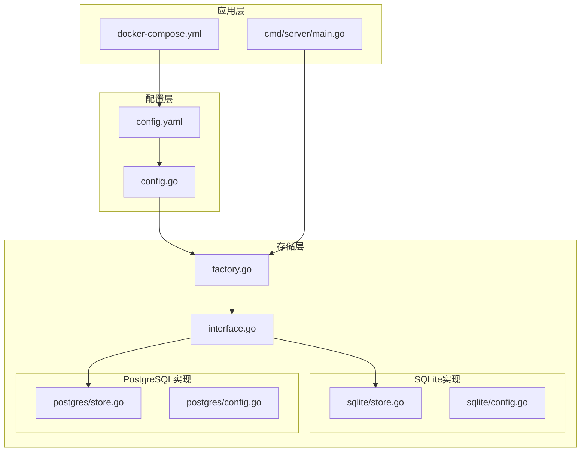

**图表来源**
- [config.yaml:1-41](file://configs/config.yaml#L1-L41)
- [config.go:1-215](file://internal/config/config.go#L1-L215)
- [factory.go:1-22](file://internal/storage/factory.go#L1-L22)

**章节来源**
- [config.yaml:1-41](file://configs/config.yaml#L1-L41)
- [config.go:1-215](file://internal/config/config.go#L1-L215)
- [factory.go:1-22](file://internal/storage/factory.go#L1-L22)

## 核心组件
数据库配置系统由以下核心组件构成：

### 配置数据结构
配置系统采用结构化设计，支持YAML配置文件和环境变量覆盖：

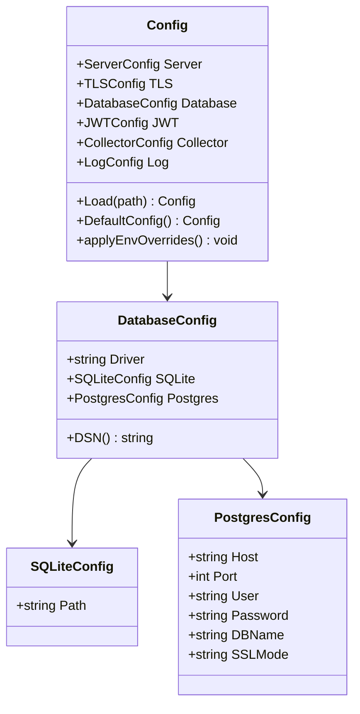

**图表来源**
- [config.go:12-56](file://internal/config/config.go#L12-L56)

### 存储工厂模式
系统采用工厂模式根据配置动态创建相应的数据库存储实现：

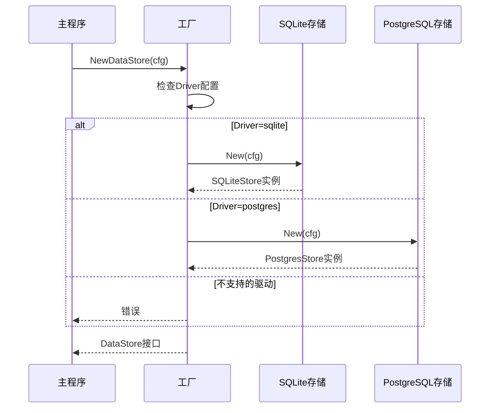

**图表来源**
- [factory.go:11-21](file://internal/storage/factory.go#L11-L21)

**章节来源**
- [config.go:12-56](file://internal/config/config.go#L12-L56)
- [factory.go:11-21](file://internal/storage/factory.go#L11-L21)

## 架构概览
数据库配置架构采用分层设计，确保配置的灵活性和可扩展性：

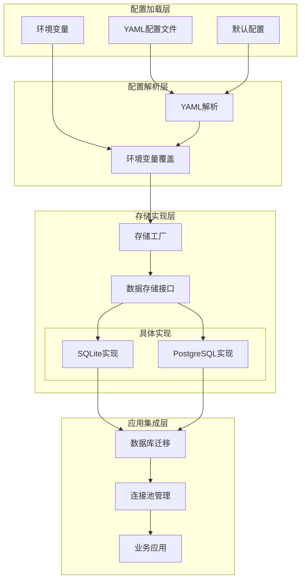

**图表来源**
- [config.go:82-98](file://internal/config/config.go#L82-L98)
- [factory.go:11-21](file://internal/storage/factory.go#L11-L21)

## 详细组件分析

### 配置文件详解

#### 基础配置结构
config.yaml中的database部分定义了完整的数据库配置：

| 配置项 | 类型 | 默认值 | 描述 |
|--------|------|--------|------|
| driver | string | "sqlite" | 数据库驱动类型，支持"sqlite"或"postgres" |
| sqlite.path | string | "./data/datacollector.db" | SQLite数据库文件路径 |
| postgres.host | string | "localhost" | PostgreSQL主机地址 |
| postgres.port | int | 5432 | PostgreSQL端口号 |
| postgres.user | string | "datacollector" | 数据库用户名 |
| postgres.password | string | "" | 数据库密码 |
| postgres.dbname | string | "datacollector" | 数据库名称 |
| postgres.sslmode | string | "disable" | SSL连接模式 |

#### 环境变量覆盖机制
系统支持通过环境变量动态覆盖配置：

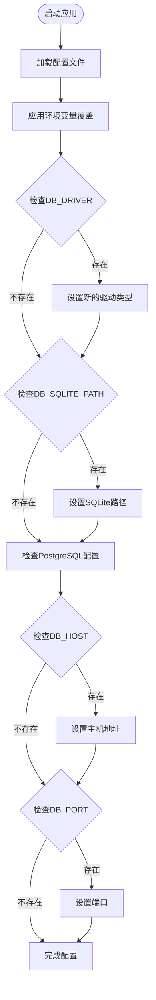

**图表来源**
- [config.go:148-195](file://internal/config/config.go#L148-L195)

**章节来源**
- [config.yaml:11-21](file://configs/config.yaml#L11-L21)
- [config.go:148-195](file://internal/config/config.go#L148-L195)

### SQLite配置分析

#### 连接池配置
SQLite实现采用单连接模式以适应其单写特性：

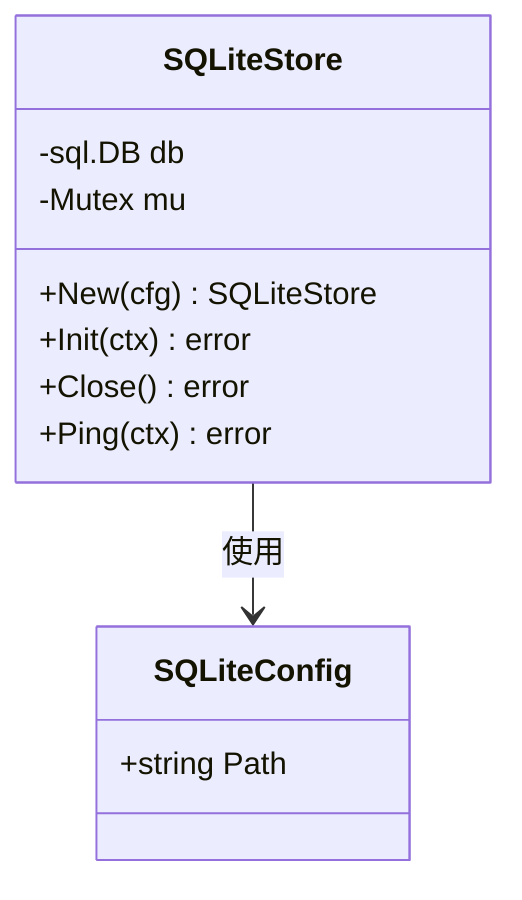

**图表来源**
- [store.go:17-56](file://internal/storage/sqlite/store.go#L17-L56)

#### 特殊配置
SQLite实现包含以下特殊配置：
- **WAL模式**：启用写-ahead日志模式提高并发性能
- **Busy Timeout**：设置5秒超时避免长时间阻塞
- **单连接限制**：最大打开连接数和空闲连接数均为1

#### 初始化流程
SQLite数据库初始化包含以下步骤：

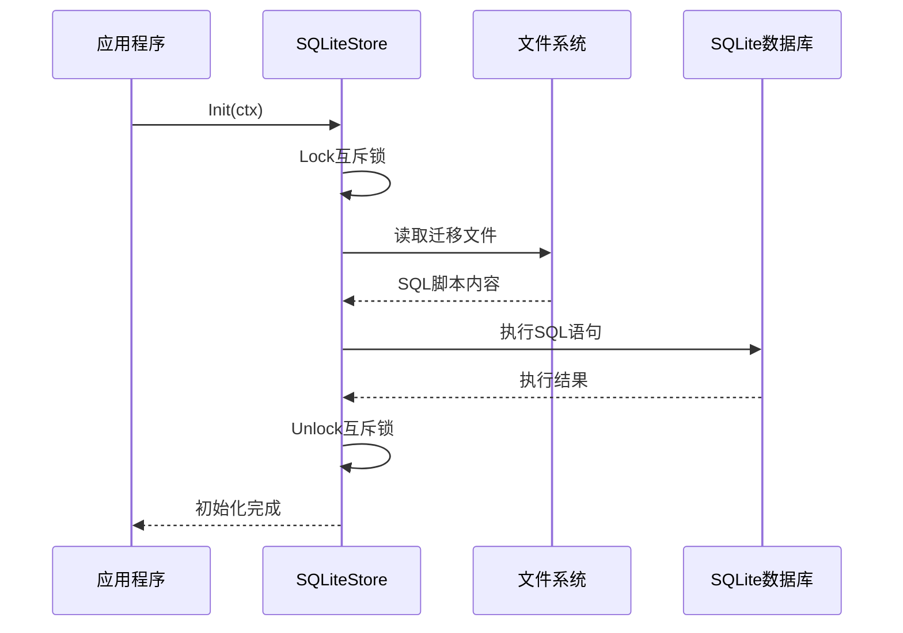

**图表来源**
- [store.go:58-75](file://internal/storage/sqlite/store.go#L58-L75)

**章节来源**
- [store.go:17-56](file://internal/storage/sqlite/store.go#L17-L56)
- [001_init_sqlite.sql:1-97](file://internal/storage/migrations/001_init_sqlite.sql#L1-L97)

### PostgreSQL配置分析

#### 连接池配置
PostgreSQL实现采用更积极的连接池策略：

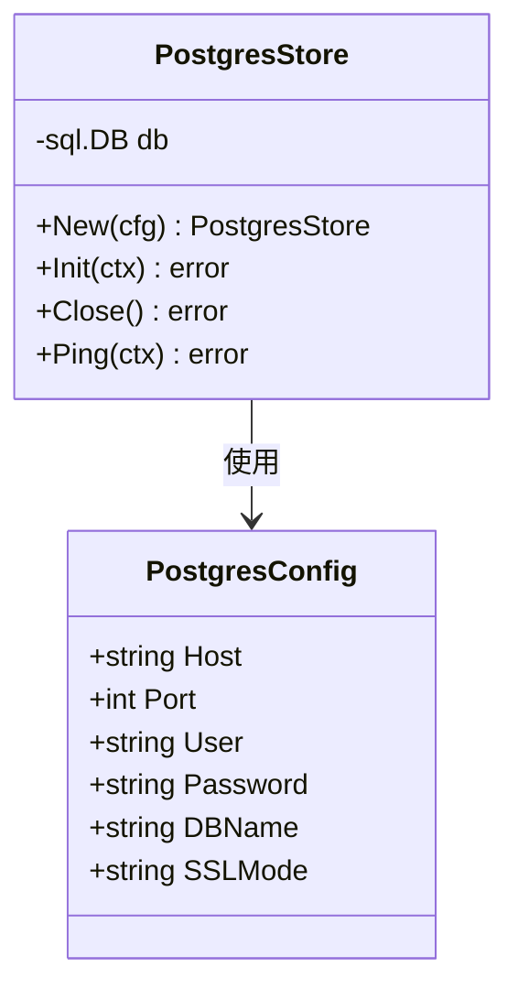

**图表来源**
- [store.go:14-34](file://internal/storage/postgres/store.go#L14-L34)

#### 连接池参数
PostgreSQL连接池配置：
- **最大打开连接数**：25个连接
- **最大空闲连接数**：5个连接
- **连接超时**：未显式设置，默认使用Go标准库行为

#### DSN生成机制
PostgreSQL使用DSN（数据源名称）格式连接字符串：

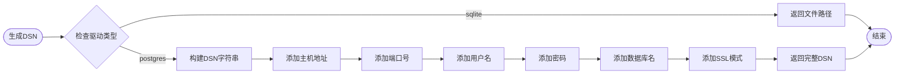

**图表来源**
- [config.go:197-214](file://internal/config/config.go#L197-L214)

**章节来源**
- [store.go:14-34](file://internal/storage/postgres/store.go#L14-L34)
- [config.go:197-214](file://internal/config/config.go#L197-L214)
- [001_init_postgres.sql:1-91](file://internal/storage/migrations/001_init_postgres.sql#L1-L91)

### 数据库迁移机制

#### 迁移文件结构
两个数据库使用相同的表结构但针对各自数据库特性进行优化：

| 表名 | 字段数量 | 索引数量 | 特殊特性 |
|------|----------|----------|----------|
| users | 6个字段 | 2个索引 | 支持角色和状态 |
| data_sources | 8个字段 | 3个索引 | JSONB支持 |
| data_tokens | 9个字段 | 4个索引 | 唯一约束 |
| data_records | 8个字段 | 5个索引 | JSONB数据存储 |
| statistics | 6个字段 | 3个索引 | 唯一复合索引 |
| system_configs | 5个字段 | 1个索引 | UPSERT操作 |

#### 迁移执行流程
数据库迁移在应用启动时自动执行：

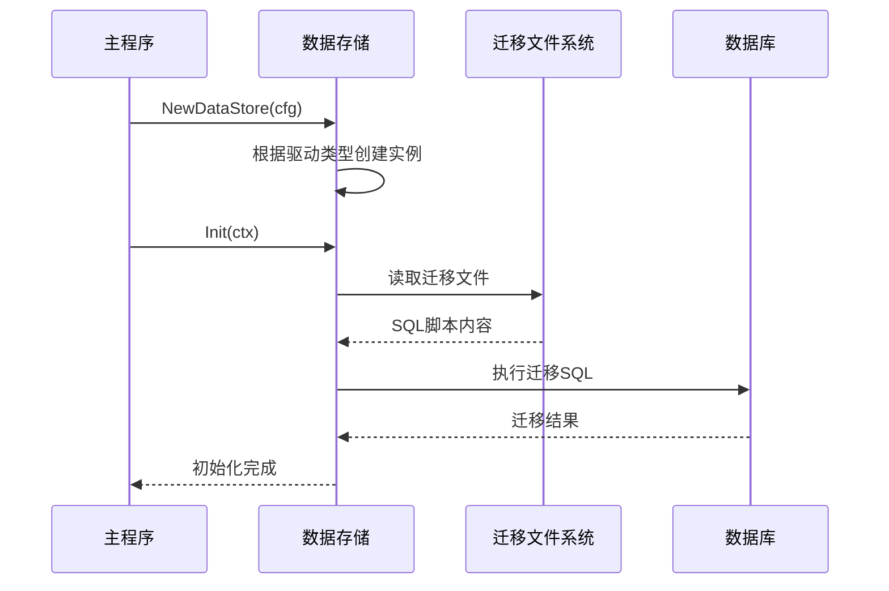

**图表来源**
- [main.go:45-64](file://cmd/server/main.go#L45-L64)

**章节来源**
- [main.go:45-64](file://cmd/server/main.go#L45-L64)

## 依赖分析

### 外部依赖关系
系统使用以下关键外部依赖：

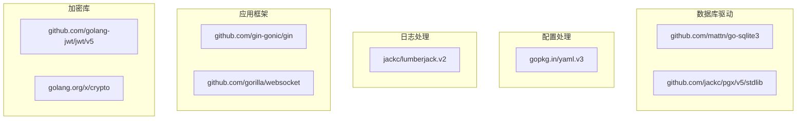

**图表来源**
- [go.mod:5-16](file://go.mod#L5-L16)

### 内部模块依赖
内部模块之间的依赖关系清晰且解耦：

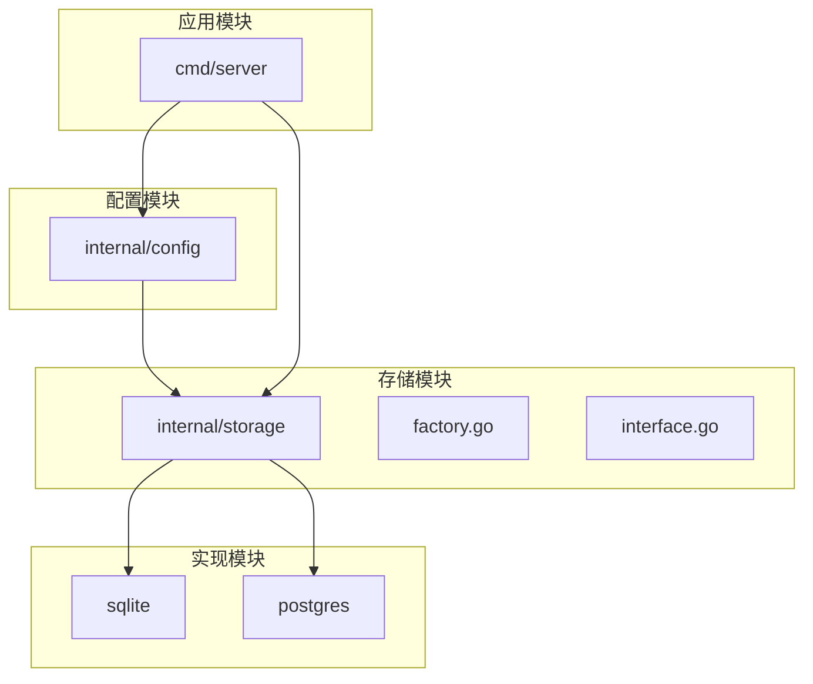

**图表来源**
- [factory.go:3-9](file://internal/storage/factory.go#L3-L9)

**章节来源**
- [go.mod:5-16](file://go.mod#L5-L16)
- [factory.go:3-9](file://internal/storage/factory.go#L3-L9)

## 性能考虑

### 连接池优化建议

#### SQLite性能特点
- **单连接限制**：SQLite天然的单写特性决定了最佳实践是使用单连接
- **WAL模式优势**：写-ahead日志模式显著提升并发读取性能
- **Busy Timeout**：合理的超时设置避免长时间阻塞

#### PostgreSQL性能优化
- **连接池大小**：根据应用负载调整最大连接数
- **连接复用**：合理利用连接池减少连接建立开销
- **查询优化**：利用索引和适当的查询计划

### 监控和调优指标

| 指标类型 | SQLite建议 | PostgreSQL建议 |
|----------|------------|----------------|
| 连接数 | 1个活跃连接 | 5-25个连接 |
| 查询延迟 | <10ms | <5ms |
| 并发用户 | <100 | <1000 |
| 磁盘I/O | WAL模式 | 适当缓存 |
| 内存使用 | 低内存占用 | 适度缓存 |

## 故障排除指南

### 常见配置问题

#### SQLite相关问题
1. **权限错误**：确保应用程序对数据目录有写入权限
2. **文件锁定**：避免多个进程同时访问同一个数据库文件
3. **磁盘空间不足**：监控WAL文件大小和磁盘使用情况

#### PostgreSQL相关问题
1. **连接失败**：检查网络连通性和防火墙设置
2. **认证失败**：验证用户名、密码和SSL配置
3. **连接超时**：调整连接池参数和网络超时设置

### 排错步骤

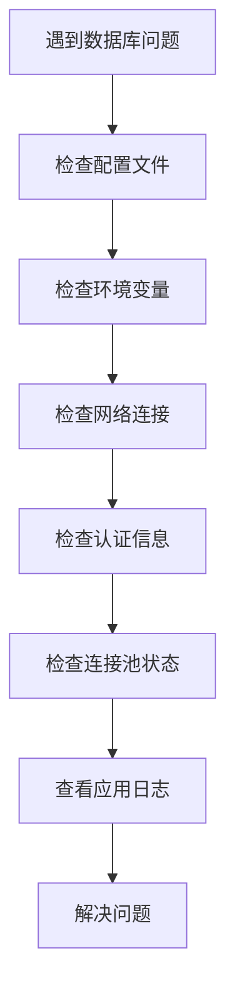

**章节来源**
- [store.go:33-53](file://internal/storage/sqlite/store.go#L33-L53)
- [store.go:23-33](file://internal/storage/postgres/store.go#L23-L33)

## 结论
DataCollector的数据库配置系统提供了灵活、可扩展的解决方案。通过YAML配置文件和环境变量覆盖机制，用户可以在不同环境中轻松切换数据库驱动。SQLite适合开发测试和小型部署，PostgreSQL适合生产环境和高并发场景。合理的连接池配置和迁移机制确保了系统的稳定性和可维护性。

## 附录

### 部署环境配置示例

#### 开发环境（SQLite）
```yaml
database:
  driver: "sqlite"
  sqlite:
    path: "./data/datacollector.db"
```

#### 生产环境（PostgreSQL）
```yaml
database:
  driver: "postgres"
  postgres:
    host: "db.prod.example.com"
    port: 5432
    user: "datacollector"
    password: "${DB_PASSWORD}"
    dbname: "datacollector"
    sslmode: "require"
```

#### Docker环境配置
```yaml
database:
  driver: "sqlite"
  sqlite:
    path: "/app/data/datacollector.db"
```

### 环境变量参考

| 环境变量 | 用途 | 示例值 |
|----------|------|--------|
| DB_DRIVER | 数据库驱动类型 | "sqlite" 或 "postgres" |
| DB_SQLITE_PATH | SQLite文件路径 | "/app/data/datacollector.db" |
| DB_HOST | PostgreSQL主机 | "localhost" |
| DB_PORT | PostgreSQL端口 | "5432" |
| DB_USER | 数据库用户名 | "datacollector" |
| DB_PASSWORD | 数据库密码 | "secure-password" |
| DB_NAME | 数据库名称 | "datacollector" |

### 最佳实践建议

1. **生产环境优先使用PostgreSQL**
2. **合理设置连接池大小**
3. **定期备份数据库**
4. **监控数据库性能指标**
5. **使用环境变量管理敏感信息**
6. **定期更新数据库驱动版本**