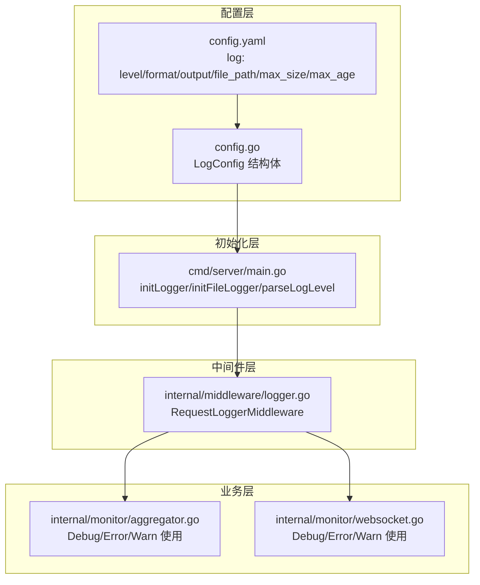
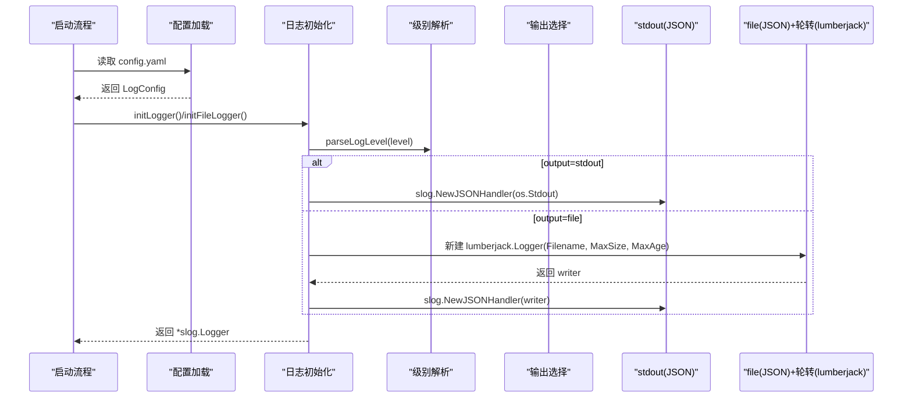
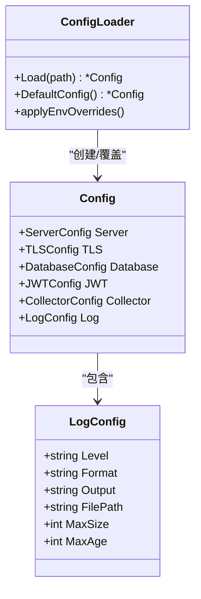
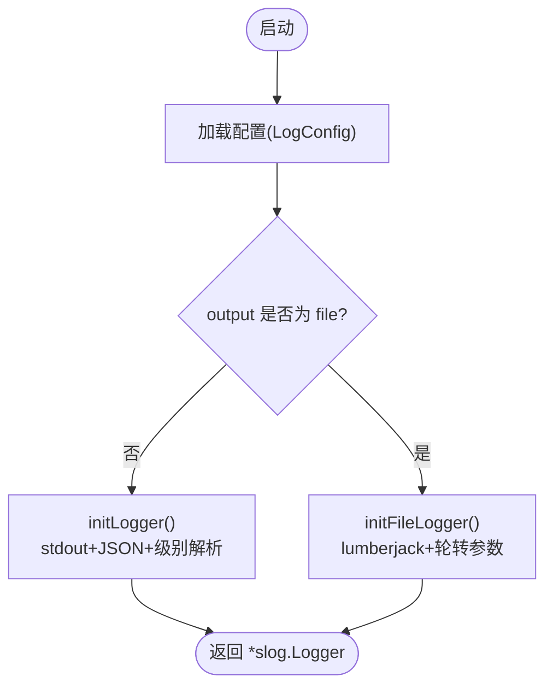
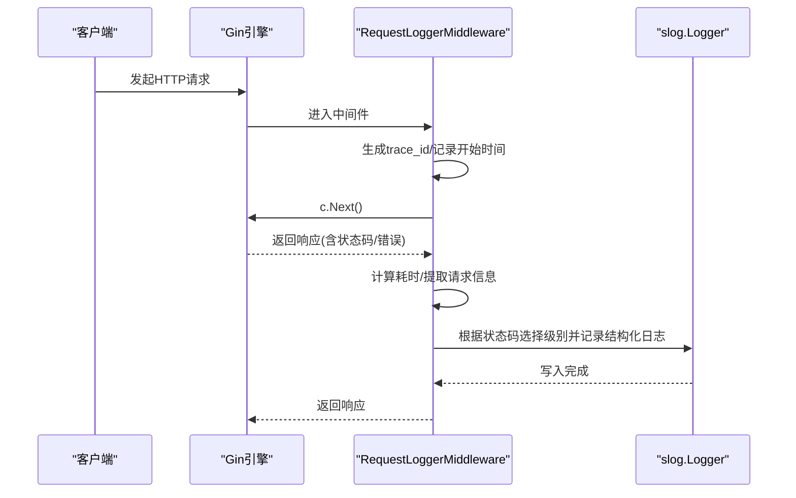
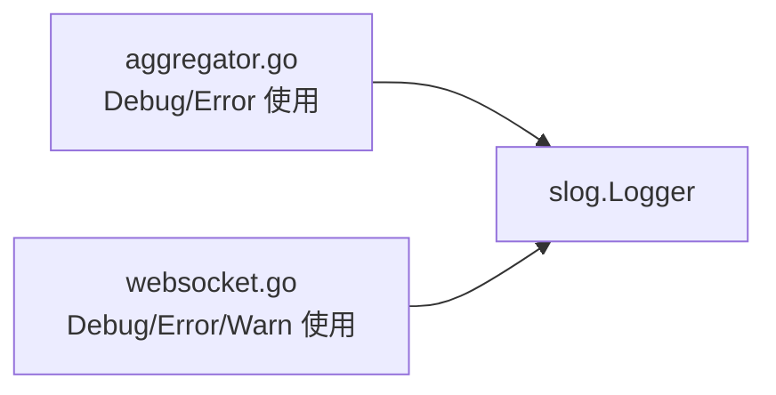
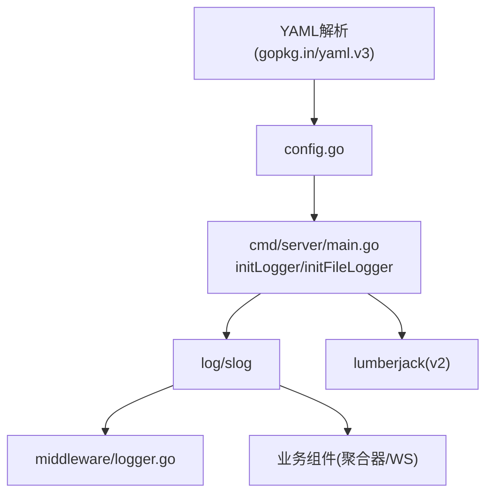

# 日志配置

<cite>
**本文引用的文件**
- [config.yaml](file://configs/config.yaml)
- [config.go](file://internal/config/config.go)
- [main.go](file://cmd/server/main.go)
- [logger.go](file://internal/middleware/logger.go)
- [aggregator.go](file://internal/monitor/aggregator.go)
- [websocket.go](file://internal/monitor/websocket.go)
</cite>

## 目录
1. [简介](#简介)
2. [项目结构与日志相关模块](#项目结构与日志相关模块)
3. [核心配置项详解](#核心配置项详解)
4. [架构总览](#架构总览)
5. [组件详细分析](#组件详细分析)
6. [依赖关系分析](#依赖关系分析)
7. [性能考量](#性能考量)
8. [故障排查指南](#故障排查指南)
9. [结论](#结论)

## 简介
本文件面向DataCollector的运维与开发人员，系统性地说明日志配置在config.yaml中的定义与运行时行为，涵盖：
- 日志级别（debug/info/warn/error）的含义与性能影响
- 输出格式（json/text）的选择与解析方法
- 输出目标（stdout/file）的差异与适用场景
- 日志文件路径、最大文件大小、最大保留天数等轮转参数
- JSON格式日志的优势与解析方法
- 生产环境日志配置最佳实践与常见问题排查

## 项目结构与日志相关模块
DataCollector的日志体系由以下模块协同构成：
- 配置层：在配置文件中定义日志参数，并在启动时加载
- 初始化层：根据配置选择stdout或文件输出，并启用结构化JSON日志与可选的文件轮转
- 中间件层：HTTP请求日志按状态码自动分级
- 业务层：各子系统在关键事件处记录结构化日志

图表来源
- [config.yaml:34-41](file://configs/config.yaml#L34-L41)
- [config.go:72-80](file://internal/config/config.go#L72-L80)
- [main.go:131-153](file://cmd/server/main.go#L131-L153)
- [logger.go:11-66](file://internal/middleware/logger.go#L11-L66)
- [aggregator.go:115-127](file://internal/monitor/aggregator.go#L115-L127)
- [websocket.go:70-126](file://internal/monitor/websocket.go#L70-L126)

章节来源
- [config.yaml:34-41](file://configs/config.yaml#L34-L41)
- [config.go:72-80](file://internal/config/config.go#L72-L80)
- [main.go:131-153](file://cmd/server/main.go#L131-L153)
- [logger.go:11-66](file://internal/middleware/logger.go#L11-L66)
- [aggregator.go:115-127](file://internal/monitor/aggregator.go#L115-L127)
- [websocket.go:70-126](file://internal/monitor/websocket.go#L70-L126)

## 核心配置项详解
本节逐项解释config.yaml中log部分的配置项及其含义、默认值与取值范围。

- level（日志级别）
  - 作用：控制日志输出的最低级别，低于该级别的日志将被忽略
  - 取值：debug、info、warn、error
  - 默认：info
  - 性能影响：级别越低（如debug），输出越多，I/O与CPU开销越大；生产环境建议使用info或更高级别以降低开销
  - 解析逻辑：启动时通过解析函数将字符串映射为具体级别

- format（输出格式）
  - 作用：控制日志条目的序列化格式
  - 取值：json
  - 默认：json
  - 说明：当前实现固定使用JSON格式处理器，text格式未在代码中启用

- output（输出目标）
  - 作用：决定日志写入位置
  - 取值：stdout、file
  - 默认：stdout
  - 行为差异：
    - stdout：直接输出到标准输出，适合容器化部署与日志收集系统（如sidecar）
    - file：写入指定文件，并启用文件轮转与压缩

- file_path（日志文件路径）
  - 作用：当output=file时生效，指定日志文件绝对或相对路径
  - 默认：./logs/datacollector.log
  - 注意：初始化阶段会确保logs目录存在

- max_size（最大文件大小）
  - 作用：当日志文件达到该大小（MB）时触发轮转
  - 默认：100（MB）
  - 影响：数值越小，轮转越频繁，磁盘占用更均匀但可能增加I/O；数值越大，轮转次数减少但单文件更大

- max_age（最大保留天数）
  - 作用：保留旧日志文件的最大天数
  - 默认：30（天）
  - 影响：过短可能导致排查困难，过长会占用更多磁盘空间

章节来源
- [config.yaml:34-41](file://configs/config.yaml#L34-L41)
- [config.go:72-80](file://internal/config/config.go#L72-L80)
- [main.go:138-153](file://cmd/server/main.go#L138-L153)
- [main.go:171-184](file://cmd/server/main.go#L171-L184)

## 架构总览
DataCollector的日志架构围绕slog与可选的lumberjack轮转器构建，整体流程如下：

图表来源
- [config.yaml:34-41](file://configs/config.yaml#L34-L41)
- [config.go:72-80](file://internal/config/config.go#L72-L80)
- [main.go:131-153](file://cmd/server/main.go#L131-L153)
- [main.go:186-200](file://cmd/server/main.go#L186-L200)

## 组件详细分析

### 配置模型与加载
- LogConfig结构体定义了日志配置字段，支持从YAML文件加载与环境变量覆盖
- 默认配置提供合理的生产级初始值
- 环境变量覆盖仅包含日志级别，便于在不同环境快速调整

图表来源
- [config.go:72-80](file://internal/config/config.go#L72-L80)
- [config.go:12-21](file://internal/config/config.go#L12-L21)
- [config.go:82-98](file://internal/config/config.go#L82-L98)
- [config.go:100-146](file://internal/config/config.go#L100-L146)
- [config.go:148-195](file://internal/config/config.go#L148-L195)

章节来源
- [config.go:72-80](file://internal/config/config.go#L72-L80)
- [config.go:12-21](file://internal/config/config.go#L12-L21)
- [config.go:82-98](file://internal/config/config.go#L82-L98)
- [config.go:100-146](file://internal/config/config.go#L100-L146)
- [config.go:148-195](file://internal/config/config.go#L148-L195)

### 启动时日志初始化与轮转
- 默认初始化使用stdout与JSON处理器，级别为info
- 当output=file时，使用lumberjack进行文件轮转，包含：
  - 文件名、最大文件大小（MB）、最大保留天数（天）、最多备份数、压缩开关
- 级别解析函数将字符串映射为slog.Level

图表来源
- [main.go:131-153](file://cmd/server/main.go#L131-L153)
- [main.go:186-200](file://cmd/server/main.go#L186-L200)

章节来源
- [main.go:131-153](file://cmd/server/main.go#L131-L153)
- [main.go:186-200](file://cmd/server/main.go#L186-L200)

### HTTP请求结构化日志中间件
- 中间件为每个请求生成trace_id并记录：
  - 方法、路径、状态码、耗时、客户端IP、User-Agent
  - 若存在错误，附加错误列表
- 根据HTTP状态码自动选择日志级别：
  - 5xx：error
  - 4xx：warn
  - 其他：info

图表来源
- [logger.go:11-66](file://internal/middleware/logger.go#L11-L66)

章节来源
- [logger.go:11-66](file://internal/middleware/logger.go#L11-L66)

### 业务组件中的日志使用
- 统计聚合器在持久化失败时记录错误日志，并继续运行
- WebSocket Hub在注册/注销客户端、广播通道满等情况记录调试/警告日志

图表来源
- [aggregator.go:115-127](file://internal/monitor/aggregator.go#L115-L127)
- [websocket.go:70-126](file://internal/monitor/websocket.go#L70-L126)

章节来源
- [aggregator.go:115-127](file://internal/monitor/aggregator.go#L115-L127)
- [websocket.go:70-126](file://internal/monitor/websocket.go#L70-L126)

## 依赖关系分析
- 配置层依赖YAML解析库，提供结构化配置与默认值
- 初始化层依赖slog与lumberjack，实现结构化JSON日志与文件轮转
- 中间件层依赖slog，按HTTP状态码动态选择级别
- 业务层广泛使用slog记录关键事件，形成统一的日志风格

图表来源
- [config.go:9](file://internal/config/config.go#L9)
- [main.go:13](file://cmd/server/main.go#L13)
- [logger.go:3-9](file://internal/middleware/logger.go#L3-L9)
- [aggregator.go:115-127](file://internal/monitor/aggregator.go#L115-L127)
- [websocket.go:70-126](file://internal/monitor/websocket.go#L70-L126)

章节来源
- [config.go:9](file://internal/config/config.go#L9)
- [main.go:13](file://cmd/server/main.go#L13)
- [logger.go:3-9](file://internal/middleware/logger.go#L3-L9)
- [aggregator.go:115-127](file://internal/monitor/aggregator.go#L115-L127)
- [websocket.go:70-126](file://internal/monitor/websocket.go#L70-L126)

## 性能考量
- 日志级别
  - debug：输出最详细的信息，I/O与CPU开销最大，适合开发与定位复杂问题
  - info：生产环境推荐级别，兼顾可观测性与性能
  - warn/error：仅记录异常与错误，开销最小，适合高流量生产环境
- 输出格式
  - JSON格式便于结构化采集与检索，解析成本略高于纯文本，但收益显著
- 输出目标
  - stdout：容器化部署首选，利于集中收集；避免磁盘IO瓶颈
  - file：需关注磁盘空间与轮转策略；lumberjack提供压缩与多备份，降低维护成本
- 轮转参数
  - max_size：建议结合应用吞吐量与磁盘预算设置；过大导致单文件难以管理，过小增加I/O
  - max_age：平衡排查需求与磁盘占用；生产环境通常保留7-30天

[本节为通用性能讨论，无需特定文件引用]

## 故障排查指南
- 配置加载失败
  - 现象：启动时提示配置文件加载失败并回退默认配置
  - 排查：检查配置文件语法与字段拼写；确认路径正确
  - 参考路径：[main.go:155-169](file://cmd/server/main.go#L155-L169)，[config.go:82-98](file://internal/config/config.go#L82-L98)
- 目录创建失败
  - 现象：无法创建logs或data目录导致启动失败
  - 排查：检查权限与磁盘空间；确认父目录可写
  - 参考路径：[main.go:171-184](file://cmd/server/main.go#L171-L184)
- 文件输出无日志
  - 现象：设置output=file后未见日志文件
  - 排查：确认logs目录存在且可写；检查file_path是否正确；验证lumberjack轮转是否触发
  - 参考路径：[main.go:138-153](file://cmd/server/main.go#L138-L153)，[main.go:171-184](file://cmd/server/main.go#L171-L184)
- 日志级别无效
  - 现象：设置为debug但看不到详细日志
  - 排查：确认环境变量未覆盖；检查parseLogLevel映射是否正确
  - 参考路径：[main.go:186-200](file://cmd/server/main.go#L186-L200)，[config.go:191-195](file://internal/config/config.go#L191-L195)
- HTTP请求日志缺失
  - 现象：中间件未记录请求日志
  - 排查：确认中间件已注册；检查路由与中间件顺序；核对slog实例是否被替换
  - 参考路径：[logger.go:11-66](file://internal/middleware/logger.go#L11-L66)
- 业务日志异常
  - 现象：聚合器或WebSocket Hub出现错误未记录
  - 排查：确认logger注入与使用；检查错误处理分支是否记录日志
  - 参考路径：[aggregator.go:115-127](file://internal/monitor/aggregator.go#L115-L127)，[websocket.go:70-126](file://internal/monitor/websocket.go#L70-L126)

章节来源
- [main.go:155-169](file://cmd/server/main.go#L155-L169)
- [config.go:82-98](file://internal/config/config.go#L82-L98)
- [main.go:171-184](file://cmd/server/main.go#L171-L184)
- [main.go:138-153](file://cmd/server/main.go#L138-L153)
- [main.go:186-200](file://cmd/server/main.go#L186-L200)
- [config.go:191-195](file://internal/config/config.go#L191-L195)
- [logger.go:11-66](file://internal/middleware/logger.go#L11-L66)
- [aggregator.go:115-127](file://internal/monitor/aggregator.go#L115-L127)
- [websocket.go:70-126](file://internal/monitor/websocket.go#L70-L126)

## 结论
- 在生产环境中，建议采用stdout+JSON+合理级别（info）的组合，必要时启用文件输出与lumberjack轮转
- 通过配置项与环境变量灵活调整日志策略，满足不同阶段的可观测性需求
- 借助HTTP请求中间件与业务组件的日志，可实现端到端的结构化观测

[本节为总结性内容，无需特定文件引用]