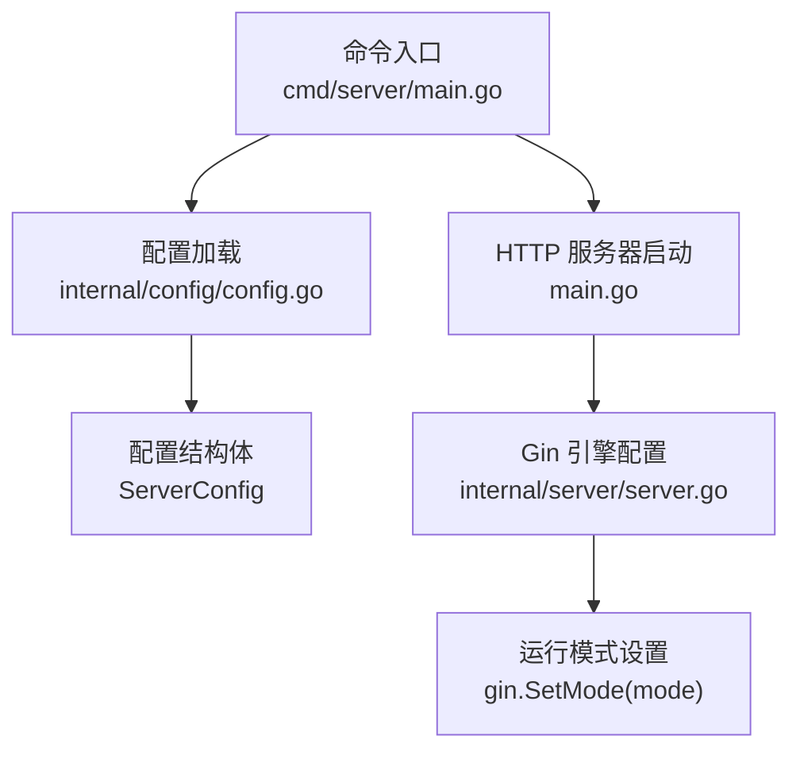
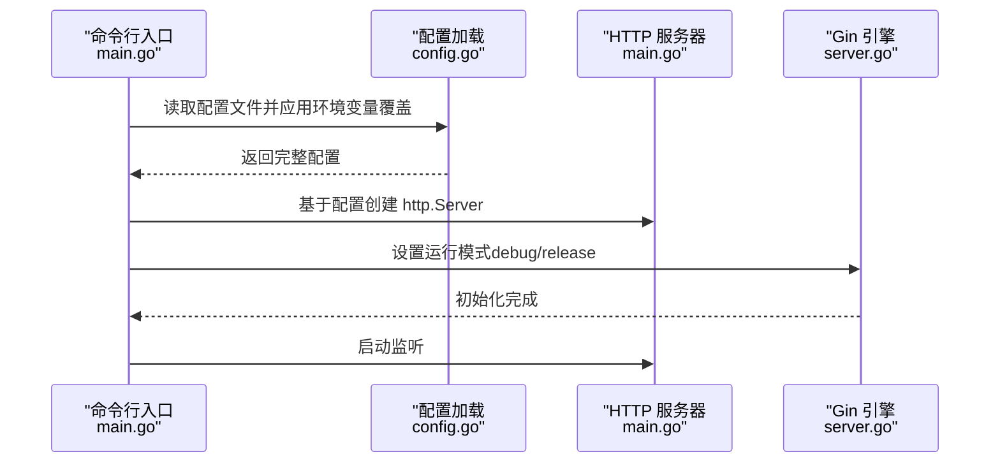
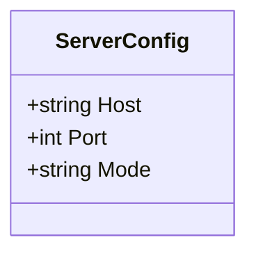

# 服务器配置

<cite>
**本文引用的文件**
- [config.yaml](file://configs/config.yaml)
- [config.go](file://internal/config/config.go)
- [server.go](file://internal/server/server.go)
- [main.go](file://cmd/server/main.go)
- [logger.go](file://internal/middleware/logger.go)
- [setup.go](file://internal/api/setup.go)
</cite>

## 目录
1. [简介](#简介)
2. [项目结构](#项目结构)
3. [核心组件](#核心组件)
4. [架构总览](#架构总览)
5. [详细组件分析](#详细组件分析)
6. [依赖分析](#依赖分析)
7. [性能考虑](#性能考虑)
8. [故障排查指南](#故障排查指南)
9. [结论](#结论)

## 简介
本章节聚焦于 DataCollector 的服务器配置，系统性解析 config.yaml 中 server 部分的配置项，包括：
- host 绑定地址
- port 端口号
- mode 运行模式（debug/release）

同时说明各配置项的作用、默认值、可选值范围与使用场景；解释不同运行模式对性能与调试的影响；给出生产与开发环境的最佳实践建议；并说明服务器启动参数与环境变量覆盖机制。

## 项目结构
服务器配置位于配置文件与配置加载模块中，启动流程在命令入口中完成，运行模式通过 Web 框架设置生效。

图表来源
- [main.go:84-101](file://cmd/server/main.go#L84-L101)
- [config.go:22-27](file://internal/config/config.go#L22-L27)
- [server.go:55-57](file://internal/server/server.go#L55-L57)

章节来源
- [config.yaml:1-4](file://configs/config.yaml#L1-L4)
- [config.go:22-27](file://internal/config/config.go#L22-L27)
- [main.go:84-101](file://cmd/server/main.go#L84-L101)
- [server.go:55-57](file://internal/server/server.go#L55-L57)

## 核心组件
- 配置结构体：定义了 server 部分的字段与默认值
- 配置加载：从 YAML 文件读取配置，并应用环境变量覆盖
- 服务器启动：基于配置创建 HTTP 服务器实例
- 运行模式设置：通过 Web 框架设置 debug 或 release 模式

章节来源
- [config.go:22-27](file://internal/config/config.go#L22-L27)
- [config.go:82-98](file://internal/config/config.go#L82-L98)
- [config.go:101-146](file://internal/config/config.go#L101-L146)
- [main.go:84-101](file://cmd/server/main.go#L84-L101)
- [server.go:55-57](file://internal/server/server.go#L55-L57)

## 架构总览
下图展示了服务器配置在启动流程中的关键交互：

图表来源
- [main.go:30-36](file://cmd/server/main.go#L30-L36)
- [main.go:84-101](file://cmd/server/main.go#L84-L101)
- [config.go:82-98](file://internal/config/config.go#L82-L98)
- [server.go:55-57](file://internal/server/server.go#L55-L57)

## 详细组件分析

### server 配置项详解
- 配置项位置：config.yaml 的 server 节点
- 结构体映射：internal/config/config.go 中的 ServerConfig

图表来源
- [config.go:22-27](file://internal/config/config.go#L22-L27)

章节来源
- [config.yaml:1-4](file://configs/config.yaml#L1-L4)
- [config.go:22-27](file://internal/config/config.go#L22-L27)

#### host 绑定地址
- 作用：指定 HTTP 服务器监听的网络地址
- 默认值：来自配置文件与默认配置
- 可选值范围：合法的 IPv4/IPv6 地址或主机名
- 使用场景：
  - 开发环境：通常使用 0.0.0.0 或 127.0.0.1
  - 生产环境：建议绑定到内网 IP 或仅允许访问的 IP
- 环境变量覆盖：不支持直接覆盖 host，可通过其他方式（如容器网络）控制
- 相关实现：
  - 配置结构体字段与默认值
  - 服务器启动时拼接监听地址

章节来源
- [config.go:103-107](file://internal/config/config.go#L103-L107)
- [config.yaml:2](file://configs/config.yaml#L2)
- [main.go:90-93](file://cmd/server/main.go#L90-L93)

#### port 端口号
- 作用：指定 HTTP 服务器监听的 TCP 端口
- 默认值：来自配置文件与默认配置
- 可选值范围：1-65535（标准 TCP 端口范围）
- 使用场景：
  - 开发环境：常用 8080、3000 等非特权端口
  - 生产环境：使用 80/443 或经反向代理转发的高段口
- 环境变量覆盖：支持通过环境变量覆盖端口
  - 环境变量名：SERVER_PORT
  - 类型：整数
  - 优先级：高于配置文件与默认值
- 相关实现：
  - 配置结构体字段与默认值
  - 环境变量覆盖逻辑
  - 服务器启动时拼接监听地址

章节来源
- [config.go:105](file://internal/config/config.go#L105)
- [config.yaml:3](file://configs/config.yaml#L3)
- [config.go:179-184](file://internal/config/config.go#L179-L184)
- [main.go:90-93](file://cmd/server/main.go#L90-L93)

#### mode 运行模式
- 作用：控制 Web 框架的运行模式（debug/release），影响日志、中间件行为与性能
- 默认值：来自配置文件与默认配置
- 可选值范围：debug、release
- 使用场景：
  - 开发环境：debug 模式便于调试与错误栈输出
  - 生产环境：release 模式优化性能与减少冗余日志
- 环境变量覆盖：不支持直接覆盖 mode，需通过配置文件或代码设置
- 相关实现：
  - 配置结构体字段与默认值
  - 服务器引擎初始化时设置运行模式
  - 运行模式对中间件与日志的影响

章节来源
- [config.go:106](file://internal/config/config.go#L106)
- [config.yaml:4](file://configs/config.yaml#L4)
- [config.go:26](file://internal/config/config.go#L26)
- [server.go:55-57](file://internal/server/server.go#L55-L57)

### 运行模式对性能与调试的影响
- debug 模式：
  - 更详细的错误信息与堆栈跟踪
  - 可能增加日志输出与调试开销
  - 适合开发与问题定位
- release 模式：
  - 减少冗余日志与调试信息
  - 更高的运行效率与更低的资源占用
  - 适合生产部署

章节来源
- [server.go:55-57](file://internal/server/server.go#L55-L57)

### 服务器启动参数与环境变量覆盖机制
- 启动参数：
  - 服务器监听地址由 host 与 port 组合生成
  - 运行模式由 mode 设置
- 环境变量覆盖：
  - 支持覆盖的配置项：
    - SERVER_PORT：覆盖端口
    - DB_DRIVER、DB_HOST、DB_PORT、DB_USER、DB_PASSWORD、DB_NAME：数据库相关
    - JWT_SECRET：JWT 密钥
    - LOG_LEVEL：日志级别
  - 覆盖规则：环境变量优先于配置文件与默认值
  - 不支持覆盖的配置项：
    - SERVER_HOST：不支持直接覆盖
    - SERVER_MODE：不支持直接覆盖

章节来源
- [main.go:90-93](file://cmd/server/main.go#L90-L93)
- [config.go:148-195](file://internal/config/config.go#L148-L195)

### 配置加载与默认值
- 配置加载流程：
  - 从配置文件读取 YAML
  - 解析为结构体
  - 应用环境变量覆盖
  - 若文件不存在则回退到默认配置
- 默认值来源：
  - 配置文件中的默认值
  - DefaultConfig 返回的默认配置对象

章节来源
- [config.go:82-98](file://internal/config/config.go#L82-L98)
- [config.go:101-146](file://internal/config/config.go#L101-L146)

### 初始化与端口变更
- 系统初始化接口会更新服务器端口配置并持久化
- 该行为用于在首次安装时根据用户输入调整监听端口

章节来源
- [setup.go:132-196](file://internal/api/setup.go#L132-L196)

## 依赖分析
- 配置文件 -> 配置加载模块 -> 服务器启动 -> Web 框架
- 运行模式设置依赖于配置加载结果

图表来源
- [config.yaml:1-4](file://configs/config.yaml#L1-L4)
- [config.go:82-98](file://internal/config/config.go#L82-L98)
- [main.go:84-101](file://cmd/server/main.go#L84-L101)
- [server.go:55-57](file://internal/server/server.go#L55-L57)

章节来源
- [config.go:82-98](file://internal/config/config.go#L82-L98)
- [main.go:84-101](file://cmd/server/main.go#L84-L101)
- [server.go:55-57](file://internal/server/server.go#L55-L57)

## 性能考虑
- debug 模式会带来额外的日志与调试开销，不适合生产环境
- release 模式更注重运行效率与稳定性
- 端口选择应避免冲突，合理规划容器或反向代理以提升吞吐与安全性

[本节为通用指导，无需列出具体文件来源]

## 故障排查指南
- 无法访问服务
  - 检查 host 是否正确绑定到可访问的网络接口
  - 确认端口未被占用，必要时通过环境变量覆盖 SERVER_PORT
- 启动后立即退出
  - 查看配置文件是否存在语法错误
  - 确认配置文件路径正确
- 日志过多或过少
  - 检查日志级别配置与环境变量 LOG_LEVEL
- 运行模式不符合预期
  - 确认配置文件中的 mode 值
  - 确认未被其他逻辑覆盖

章节来源
- [config.go:82-98](file://internal/config/config.go#L82-L98)
- [config.go:148-195](file://internal/config/config.go#L148-L195)
- [main.go:155-169](file://cmd/server/main.go#L155-L169)

## 结论
- server 配置项简洁明确：host、port、mode 分别负责绑定地址、端口与运行模式
- 默认值与环境变量覆盖机制确保了灵活性与可运维性
- 生产环境建议使用 release 模式与安全的 host 绑定策略
- 如需动态调整端口，可通过初始化接口或环境变量 SERVER_PORT 实现