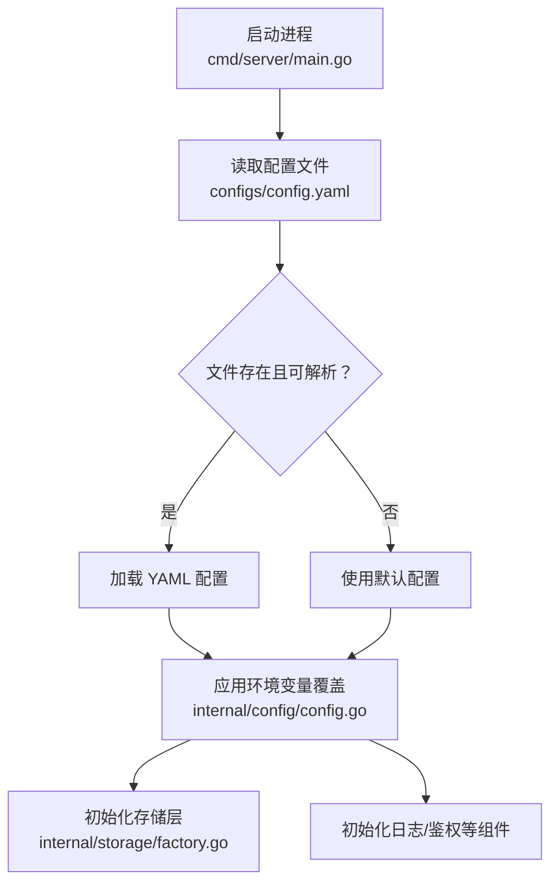
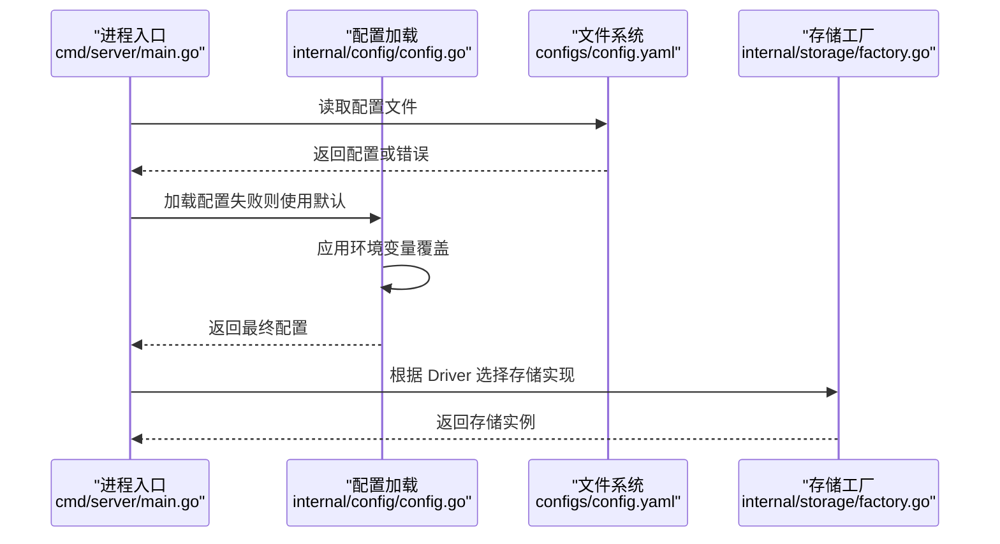
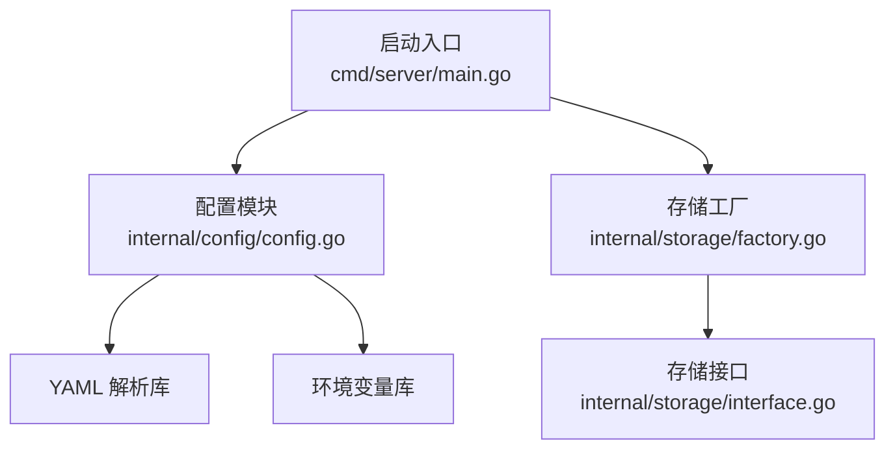
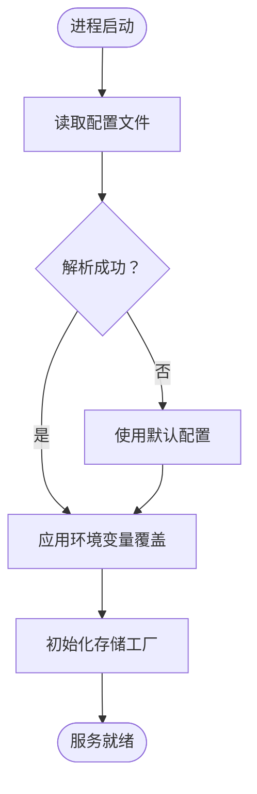

# 环境变量配置

<cite>
**本文引用的文件**
- [config.yaml](file://configs/config.yaml)
- [config.go](file://internal/config/config.go)
- [main.go](file://cmd/server/main.go)
- [docker-compose.yml](file://docker-compose.yml)
- [Dockerfile](file://Dockerfile)
- [factory.go](file://internal/storage/factory.go)
- [interface.go](file://internal/storage/interface.go)
</cite>

## 目录
1. [简介](#简介)
2. [项目结构](#项目结构)
3. [核心组件](#核心组件)
4. [架构总览](#架构总览)
5. [详细组件分析](#详细组件分析)
6. [依赖分析](#依赖分析)
7. [性能考虑](#性能考虑)
8. [故障排查指南](#故障排查指南)
9. [结论](#结论)
10. [附录](#附录)

## 简介
本章节面向运维与开发人员，系统性说明 DataCollector 的环境变量配置机制，包括：
- 如何通过环境变量覆盖 config.yaml 中的配置值
- 环境变量命名约定与优先级规则
- 敏感配置（数据库密码、JWT 密钥）通过环境变量设置的安全优势
- 不同部署平台（Docker、Kubernetes、传统服务器）的环境变量配置示例
- 配置加载顺序与冲突解决机制
- 配置验证与错误处理策略
- 提供配置模板与示例文件路径

## 项目结构
DataCollector 的配置体系由 YAML 文件与环境变量共同构成，加载流程如下：
- 启动时从默认路径读取 YAML 配置文件
- 若文件不存在或解析失败，则回退到内置默认配置
- 在加载完成后，应用环境变量对配置进行覆盖
- 最终配置用于初始化数据库、日志、JWT 等组件

图表来源
- [main.go:155-169](file://cmd/server/main.go#L155-L169)
- [config.go:82-98](file://internal/config/config.go#L82-L98)
- [factory.go:11-21](file://internal/storage/factory.go#L11-L21)

章节来源
- [main.go:155-169](file://cmd/server/main.go#L155-L169)
- [config.go:82-98](file://internal/config/config.go#L82-L98)

## 核心组件
- 配置结构体与默认值：定义了服务器、TLS、数据库、JWT、采集器、日志等配置项，并提供默认值。
- 配置加载与覆盖：从 YAML 文件加载，随后应用环境变量覆盖；若文件缺失则使用默认值。
- 存储工厂：根据数据库驱动选择具体存储实现（SQLite 或 PostgreSQL）。

章节来源
- [config.go:12-214](file://internal/config/config.go#L12-L214)
- [factory.go:11-21](file://internal/storage/factory.go#L11-L21)

## 架构总览
下图展示配置在启动流程中的关键交互：

图表来源
- [main.go:155-169](file://cmd/server/main.go#L155-L169)
- [config.go:82-98](file://internal/config/config.go#L82-L98)
- [factory.go:11-21](file://internal/storage/factory.go#L11-L21)

## 详细组件分析

### 环境变量命名约定与覆盖规则
- 命名规范：采用大写、下划线分隔，层级以“_”连接。例如：
  - 数据库驱动：DB_DRIVER
  - SQLite 路径：DB_SQLITE_PATH
  - PostgreSQL 主机：DB_HOST
  - PostgreSQL 端口：DB_PORT
  - PostgreSQL 用户：DB_USER
  - PostgreSQL 密码：DB_PASSWORD
  - PostgreSQL 数据库名：DB_NAME
  - 服务器端口：SERVER_PORT
  - JWT 密钥：JWT_SECRET
  - 日志级别：LOG_LEVEL
- 覆盖时机：在 YAML 配置加载成功后立即应用环境变量覆盖。
- 类型转换：数值类（如端口）会尝试解析为整数；其他字段按字符串直接覆盖。
- 优先级：环境变量覆盖 YAML 配置；若 YAML 文件缺失或解析失败，则使用内置默认值，随后再应用环境变量。

章节来源
- [config.go:148-195](file://internal/config/config.go#L148-L195)

### 配置加载顺序与冲突解决
- 加载顺序
  1) 读取 YAML 配置文件
  2) 解析 YAML 并校验结构
  3) 应用环境变量覆盖
  4) 初始化各子系统（存储、日志、鉴权等）
- 冲突解决
  - 若 YAML 文件不可读/解析失败：记录警告并使用默认配置，随后应用环境变量
  - 环境变量未设置：保留 YAML 原值或默认值
  - 环境变量设置为空字符串：不覆盖（保持原值）

章节来源
- [main.go:155-169](file://cmd/server/main.go#L155-L169)
- [config.go:82-98](file://internal/config/config.go#L82-L98)

### 敏感配置的安全优势
- 将数据库密码、JWT 密钥等敏感信息放入环境变量，避免硬编码在版本控制中
- 在容器编排平台（如 Kubernetes Secret）中注入，降低泄露风险
- 通过最小权限原则与访问控制进一步加固

章节来源
- [config.go:160-177](file://internal/config/config.go#L160-L177)
- [config.go:186-189](file://internal/config/config.go#L186-L189)

### 不同部署平台的环境变量配置示例

#### Docker Compose 示例
- SQLite 模式：通过环境变量设置驱动与 SQLite 路径
- PostgreSQL 模式：通过环境变量设置主机、端口、用户、密码、数据库名

章节来源
- [docker-compose.yml:13-16](file://docker-compose.yml#L13-L16)
- [docker-compose.yml:26-32](file://docker-compose.yml#L26-L32)

#### Dockerfile 示例
- 在镜像构建阶段设置默认环境变量，便于容器启动时直接生效
- 建议在生产环境中通过外部环境变量覆盖默认值

章节来源
- [Dockerfile:45-49](file://Dockerfile#L45-L49)

#### 传统服务器（Linux systemd 等）
- 通过系统环境变量或服务配置文件注入环境变量
- 确保服务用户对日志与数据目录具有写入权限

章节来源
- [config.go:148-195](file://internal/config/config.go#L148-L195)

### 配置验证与错误处理
- 配置文件读取失败：记录警告并回退到默认配置
- YAML 解析失败：记录错误并回退到默认配置
- 环境变量覆盖：
  - 数值类型（如端口）解析失败：忽略该环境变量，保留原值
  - 字符串类型（如密码、密钥）直接覆盖
- 存储初始化与健康检查：在启动阶段执行数据库 Ping，失败则退出

章节来源
- [main.go:155-169](file://cmd/server/main.go#L155-L169)
- [config.go:82-98](file://internal/config/config.go#L82-L98)

### 配置模板与示例文件
- YAML 配置模板：configs/config.yaml
- Docker Compose 示例：docker-compose.yml
- Dockerfile 示例：Dockerfile

章节来源
- [config.yaml:1-41](file://configs/config.yaml#L1-L41)
- [docker-compose.yml:1-56](file://docker-compose.yml#L1-L56)
- [Dockerfile:1-52](file://Dockerfile#L1-L52)

## 依赖分析
- 配置模块依赖
  - YAML 解析库：用于解析配置文件
  - 环境变量库：用于读取运行时环境变量
- 启动流程依赖
  - 配置加载依赖文件系统
  - 存储工厂依赖配置中的数据库驱动
  - 日志与鉴权等组件依赖最终配置

图表来源
- [config.go:3-10](file://internal/config/config.go#L3-L10)
- [main.go:155-169](file://cmd/server/main.go#L155-L169)
- [factory.go:11-21](file://internal/storage/factory.go#L11-L21)
- [interface.go:9-57](file://internal/storage/interface.go#L9-L57)

章节来源
- [config.go:3-10](file://internal/config/config.go#L3-L10)
- [main.go:155-169](file://cmd/server/main.go#L155-L169)
- [factory.go:11-21](file://internal/storage/factory.go#L11-L21)
- [interface.go:9-57](file://internal/storage/interface.go#L9-L57)

## 性能考虑
- 环境变量覆盖发生在启动阶段，对运行时性能影响极小
- 建议在容器编排中统一管理环境变量，减少重复配置带来的维护成本
- 对于高频变更的配置（如日志级别），可通过环境变量动态调整，无需重启

## 故障排查指南
- 配置文件无法读取或解析失败
  - 检查配置文件路径是否正确
  - 确认 YAML 语法与字段名称一致
  - 查看启动日志中的警告或错误信息
- 环境变量未生效
  - 确认环境变量名称大小写与下划线规范一致
  - 确认容器或服务已正确注入环境变量
  - 检查是否存在空字符串覆盖导致的异常行为
- 数据库连接失败
  - 检查数据库驱动与连接参数（主机、端口、用户、密码、数据库名）
  - 确认数据库服务可达且凭据正确
- JWT 密钥问题
  - 确认 JWT_SECRET 已设置且长度足够安全
  - 更换密钥后需重新签发令牌

章节来源
- [main.go:155-169](file://cmd/server/main.go#L155-L169)
- [config.go:148-195](file://internal/config/config.go#L148-L195)

## 结论
DataCollector 的环境变量配置机制提供了灵活、安全的配置覆盖能力。通过明确的命名约定与严格的加载顺序，能够在不同部署场景中稳定地注入敏感配置与运行时参数。建议在生产环境中优先使用环境变量管理敏感信息，并结合容器编排平台的密钥管理功能，确保配置安全与可维护性。

## 附录

### 环境变量清单与映射
- 数据库驱动：DB_DRIVER
- SQLite 路径：DB_SQLITE_PATH
- PostgreSQL 主机：DB_HOST
- PostgreSQL 端口：DB_PORT
- PostgreSQL 用户：DB_USER
- PostgreSQL 密码：DB_PASSWORD
- PostgreSQL 数据库名：DB_NAME
- 服务器端口：SERVER_PORT
- JWT 密钥：JWT_SECRET
- 日志级别：LOG_LEVEL

章节来源
- [config.go:148-195](file://internal/config/config.go#L148-L195)

### 配置加载流程图

图表来源
- [main.go:155-169](file://cmd/server/main.go#L155-L169)
- [config.go:82-98](file://internal/config/config.go#L82-L98)
- [factory.go:11-21](file://internal/storage/factory.go#L11-L21)