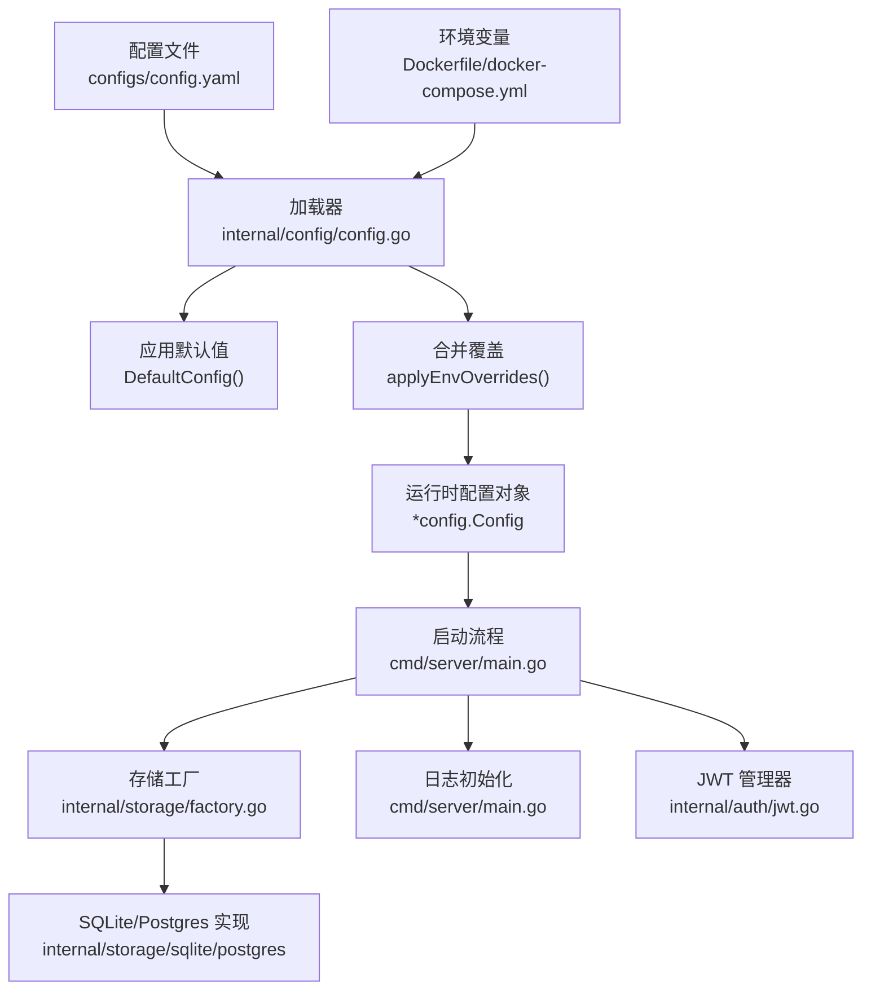
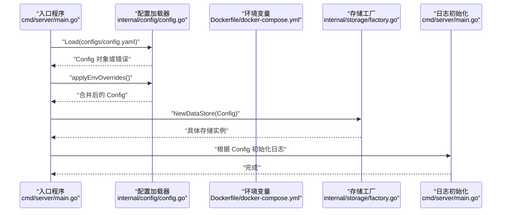
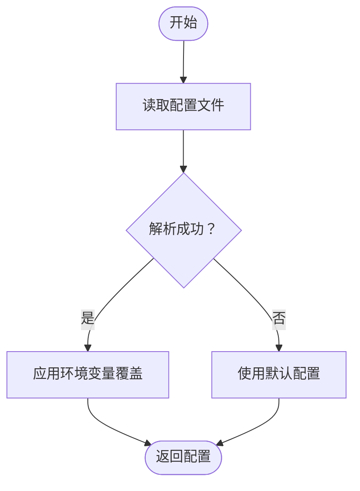
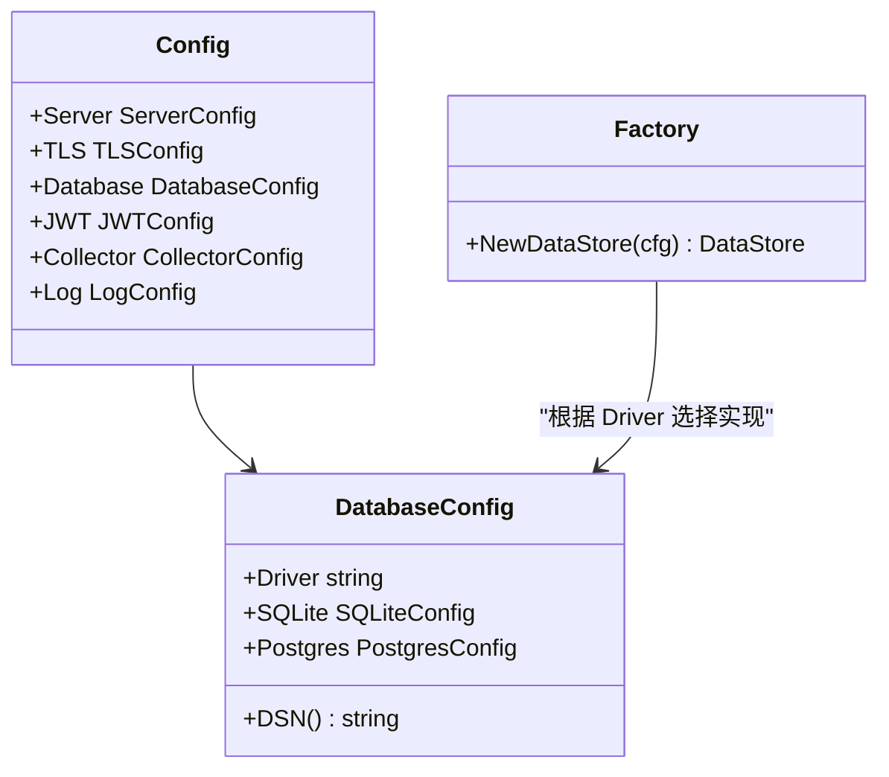
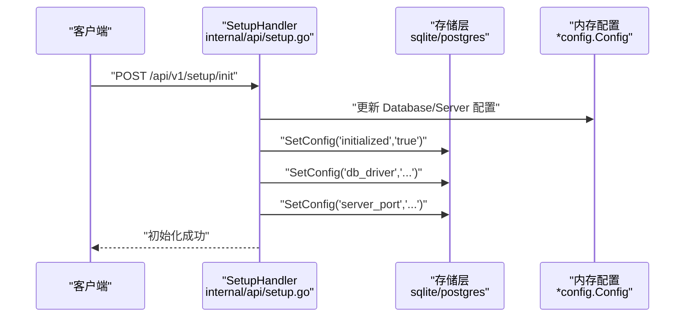
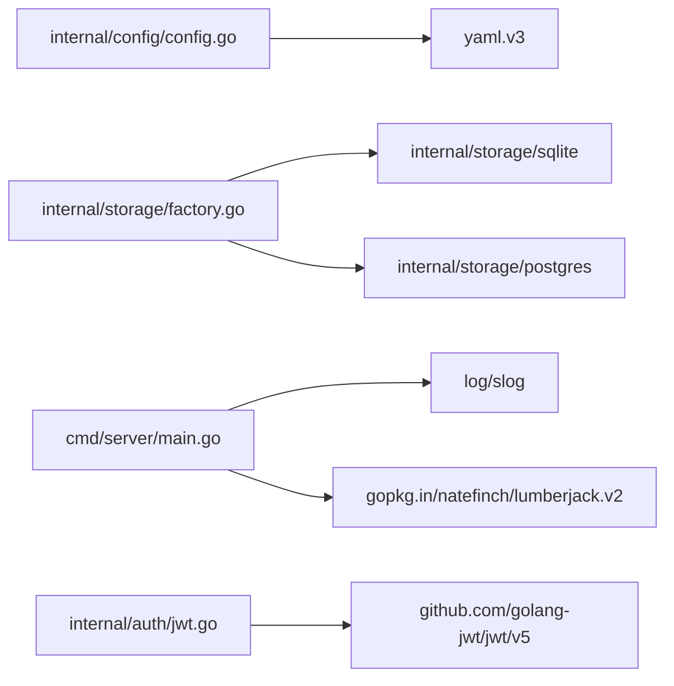

# 配置管理

<cite>
**本文引用的文件**
- [config.yaml](file://configs/config.yaml)
- [config.go](file://internal/config/config.go)
- [main.go](file://cmd/server/main.go)
- [docker-compose.yml](file://docker-compose.yml)
- [Dockerfile](file://Dockerfile)
- [logger.go](file://internal/middleware/logger.go)
- [jwt.go](file://internal/auth/jwt.go)
- [factory.go](file://internal/storage/factory.go)
- [setup.go](file://internal/api/setup.go)
- [sqlite/config.go](file://internal/storage/sqlite/config.go)
- [postgres/config.go](file://internal/storage/postgres/config.go)
</cite>

## 目录
1. [简介](#简介)
2. [项目结构与配置位置](#项目结构与配置位置)
3. [核心配置组件](#核心配置组件)
4. [架构总览](#架构总览)
5. [详细组件分析](#详细组件分析)
6. [依赖关系分析](#依赖关系分析)
7. [性能与可靠性考量](#性能与可靠性考量)
8. [故障排查指南](#故障排查指南)
9. [结论](#结论)
10. [附录：配置示例与最佳实践](#附录配置示例与最佳实践)

## 简介
本章节面向运维与开发人员，系统性阐述 DataCollector 的配置管理机制，涵盖：
- 配置文件 config.yaml 的字段与含义
- 环境变量覆盖与优先级
- 不同部署环境（开发、测试、生产）的配置示例
- 配置加载、验证与错误处理流程
- 配置热更新的可行性与限制
- 安全与最佳实践建议

## 项目结构与配置位置
DataCollector 的配置主要来源于以下位置：
- 配置文件：configs/config.yaml
- 运行时环境变量：Dockerfile 中预设，docker-compose.yml 中覆盖
- 启动时加载：cmd/server/main.go 负责读取配置文件并应用环境变量覆盖
- 运行期持久化配置：通过内部存储（SQLite/Postgres）写入 system_configs 表

图表来源
- [config.yaml](file://configs/config.yaml)
- [config.go](file://internal/config/config.go)
- [main.go](file://cmd/server/main.go)
- [Dockerfile](file://Dockerfile)
- [docker-compose.yml](file://docker-compose.yml)
- [factory.go](file://internal/storage/factory.go)

章节来源
- [config.yaml](file://configs/config.yaml)
- [config.go](file://internal/config/config.go)
- [main.go](file://cmd/server/main.go)
- [Dockerfile](file://Dockerfile)
- [docker-compose.yml](file://docker-compose.yml)

## 核心配置组件
配置对象由多个子模块组成，分别控制服务器、TLS、数据库、JWT、采集器与日志行为。下表给出各模块的字段、默认值、可选值与典型用途。

- 服务器配置（server）
  - host：监听地址，默认 0.0.0.0
  - port：监听端口，默认 8080
  - mode：运行模式，可选 debug/release，默认 debug
  - 用途：控制 HTTP 服务绑定与运行模式

- TLS 配置（tls）
  - enabled：是否启用 HTTPS，默认 false
  - cert_file：证书路径（如启用）
  - key_file：私钥路径（如启用）
  - 用途：启用 HTTPS 传输加密

- 数据库配置（database）
  - driver：数据库驱动，可选 sqlite/postgres，默认 sqlite
  - sqlite.path：SQLite 文件路径，默认 ./data/datacollector.db
  - postgres.host/port/user/password/dbname/sslmode：PostgreSQL 连接参数
  - 用途：选择并配置数据存储后端

- JWT 配置（jwt）
  - secret：签名密钥（必须替换为强随机字符串）
  - expiration：令牌有效期，默认 24h
  - 用途：登录签发与校验

- 采集器配置（collector）
  - max_body_size：请求体最大字节，默认 1048576（1MB）
  - rate_limit_per_token：每令牌每分钟速率限制，默认 100
  - rate_limit_per_ip：每 IP 每分钟速率限制，默认 200
  - allowed_origins：CORS 允许来源列表，默认 ["*"]
  - 用途：保护服务免受滥用与跨域访问控制

- 日志配置（log）
  - level：日志级别，可选 debug/info/warn/error，默认 info
  - format：日志格式，当前为 JSON
  - output：输出目标，可选 stdout/file，默认 stdout
  - file_path：日志文件路径，默认 ./logs/datacollector.log
  - max_size/max_age：日志轮转大小与保留天数（仅 file 输出生效）
  - 用途：统一日志策略与轮转

章节来源
- [config.yaml](file://configs/config.yaml)
- [config.go](file://internal/config/config.go)

## 架构总览
配置加载与应用的关键流程如下：

图表来源
- [main.go](file://cmd/server/main.go)
- [config.go](file://internal/config/config.go)
- [factory.go](file://internal/storage/factory.go)

## 详细组件分析

### 配置加载与默认值
- 配置文件加载：从 configs/config.yaml 读取 YAML 并反序列化为 Config 结构体
- 默认值：若文件缺失或无法解析，回退到 DefaultConfig() 提供的默认值
- 环境变量覆盖：在加载后调用 applyEnvOverrides()，按需覆盖部分字段

图表来源
- [config.go](file://internal/config/config.go)
- [main.go](file://cmd/server/main.go)

章节来源
- [config.go](file://internal/config/config.go)
- [main.go](file://cmd/server/main.go)

### 环境变量覆盖与优先级
- 覆盖范围：数据库驱动、SQLite 路径、PostgreSQL 主机/端口/用户/密码/库名、服务器端口、JWT 密钥、日志级别
- 优先级：环境变量 > 配置文件 > 默认值
- Docker 预设：Dockerfile 在容器内设置了 DB_DRIVER、DB_SQLITE_PATH、LOG_OUTPUT、LOG_FILE_PATH 等环境变量
- docker-compose：默认使用 SQLite，可通过环境变量切换至 PostgreSQL

章节来源
- [config.go](file://internal/config/config.go)
- [Dockerfile](file://Dockerfile)
- [docker-compose.yml](file://docker-compose.yml)

### 数据库配置与存储工厂
- 工厂函数根据 driver 选择具体实现：sqlite 或 postgres
- DSN 生成：DatabaseConfig.DSN() 依据 driver 生成连接字符串
- 初始化：启动时通过 storage.NewDataStore(cfg) 创建存储实例并执行迁移

图表来源
- [config.go](file://internal/config/config.go)
- [factory.go](file://internal/storage/factory.go)

章节来源
- [config.go](file://internal/config/config.go)
- [factory.go](file://internal/storage/factory.go)

### JWT 配置与安全
- 密钥：必须替换为强随机字符串；过短或弱密钥会降低安全性
- 有效期：默认 24 小时；可根据业务调整
- 刷新策略：当剩余有效期小于 2 小时才允许刷新

章节来源
- [config.go](file://internal/config/config.go)
- [jwt.go](file://internal/auth/jwt.go)

### 日志配置与轮转
- 输出目标：stdout 或 file
- 轮转：当 output=file 时，使用 lumberjack 进行按大小与时间的轮转
- 级别解析：parseLogLevel 将字符串映射为 slog 级别

章节来源
- [main.go](file://cmd/server/main.go)
- [logger.go](file://internal/middleware/logger.go)

### 初始化与持久化配置
- 初始化接口：SetupHandler 支持检查状态、测试数据库连接、初始化系统与重新初始化
- 持久化：通过存储层的 system_configs 表保存初始化标记与运行时配置键值
- 影响范围：初始化会更新内存中的 Config，并持久化关键配置键（如 db_driver、server_port）

图表来源
- [setup.go](file://internal/api/setup.go)
- [sqlite/config.go](file://internal/storage/sqlite/config.go)
- [postgres/config.go](file://internal/storage/postgres/config.go)

章节来源
- [setup.go](file://internal/api/setup.go)
- [sqlite/config.go](file://internal/storage/sqlite/config.go)
- [postgres/config.go](file://internal/storage/postgres/config.go)

## 依赖关系分析
- 配置加载依赖 YAML 解析库
- 存储工厂依赖数据库驱动（SQLite/Postgres）
- 日志依赖标准库 slog 与 lumberjack
- JWT 依赖第三方库进行签名与校验

图表来源
- [config.go](file://internal/config/config.go)
- [factory.go](file://internal/storage/factory.go)
- [main.go](file://cmd/server/main.go)
- [jwt.go](file://internal/auth/jwt.go)

章节来源
- [config.go](file://internal/config/config.go)
- [factory.go](file://internal/storage/factory.go)
- [main.go](file://cmd/server/main.go)
- [jwt.go](file://internal/auth/jwt.go)

## 性能与可靠性考量
- 日志轮转：file 输出时启用 lumberjack，避免单文件过大；合理设置 max_size 与 max_age
- 速率限制：collector.rate_limit_per_token 与 rate_limit_per_ip 控制请求频率，防止滥用
- 数据库连接：PostgreSQL 连接参数需与网络与安全策略一致；生产环境建议开启 SSL
- 启动自检：启动时对数据库执行 Ping，确保连接可用后再对外提供服务

[本节为通用指导，不直接分析具体文件]

## 故障排查指南
- 配置文件加载失败：检查 configs/config.yaml 语法与权限；查看启动日志中“failed to load config file”提示
- 环境变量未生效：确认 Dockerfile/docker-compose.yml 中的环境变量是否正确注入
- 数据库连接失败：使用 /api/v1/setup/test-db 进行连通性测试；核对主机、端口、凭据与 SSL 模式
- 日志输出异常：确认 log.output=file 时 file_path 是否可写；检查 max_size/max_age 设置是否合理
- JWT 校验失败：确认 JWT_SECRET 与签发方一致；检查令牌是否过期

章节来源
- [main.go](file://cmd/server/main.go)
- [setup.go](file://internal/api/setup.go)

## 结论
DataCollector 的配置管理以 YAML 文件为核心，结合默认值与环境变量覆盖，形成灵活可控的运行时配置。通过初始化接口可将关键配置持久化至存储层，便于多节点一致性管理。生产环境应重点关注数据库安全、日志轮转与 JWT 密钥管理，并遵循最小暴露原则与定期轮换策略。

[本节为总结性内容，不直接分析具体文件]

## 附录：配置示例与最佳实践

### 开发环境示例
- 使用 SQLite，本地文件路径，调试模式
- 环境变量：DB_DRIVER=sqlite，DB_SQLITE_PATH=./data/datacollector.db，LOG_OUTPUT=stdout

章节来源
- [config.yaml](file://configs/config.yaml)
- [Dockerfile](file://Dockerfile)
- [docker-compose.yml](file://docker-compose.yml)

### 测试环境示例
- 使用 PostgreSQL，禁用 SSL，便于快速搭建
- 环境变量：DB_DRIVER=postgres，DB_HOST=postgres-host，DB_PORT=5432，DB_USER=test，DB_PASSWORD=secret，DB_NAME=testdb，LOG_OUTPUT=file，LOG_FILE_PATH=/tmp/datacollector.log

章节来源
- [docker-compose.yml](file://docker-compose.yml)
- [Dockerfile](file://Dockerfile)

### 生产环境示例
- 使用 PostgreSQL，启用 SSL，严格最小权限
- 环境变量：DB_DRIVER=postgres，DB_HOST=postgres-host，DB_PORT=5432，DB_USER=readonly，DB_PASSWORD=strong-password，DB_NAME=datacollector，LOG_OUTPUT=file，LOG_FILE_PATH=/var/log/datacollector/datacollector.log，LOG_MAX_SIZE=100，LOG_MAX_AGE=30
- JWT：务必使用强随机密钥，定期轮换

章节来源
- [docker-compose.yml](file://docker-compose.yml)
- [Dockerfile](file://Dockerfile)
- [config.yaml](file://configs/config.yaml)

### 配置验证与错误处理
- 配置加载阶段：若 YAML 解析失败，回退默认配置并记录警告
- 初始化阶段：提供 /api/v1/setup/test-db 用于数据库连通性测试
- 运行阶段：日志统一采用 JSON 格式，便于集中收集与检索

章节来源
- [config.go](file://internal/config/config.go)
- [setup.go](file://internal/api/setup.go)
- [main.go](file://cmd/server/main.go)

### 配置热更新可能性与限制
- 当前实现：启动时一次性加载配置，运行期间不自动重载
- 可行方案：引入配置变更检测（如 fsnotify）或通过 API 动态更新（需扩展存储与传播机制）
- 限制：数据库连接字符串、TLS 证书等涉及底层资源的配置变更通常需要重启生效

章节来源
- [config.go](file://internal/config/config.go)
- [main.go](file://cmd/server/main.go)

### 安全建议
- JWT 密钥：使用足够熵的随机字符串，定期轮换；避免硬编码在代码或镜像中
- 数据库凭据：使用只读账户或最小权限账户；生产环境强制启用 SSL
- 日志敏感信息：避免记录明文密码与令牌；必要时进行脱敏
- CORS：生产环境建议收窄 allowed_origins，避免使用通配符

章节来源
- [config.go](file://internal/config/config.go)
- [config.yaml](file://configs/config.yaml)
- [jwt.go](file://internal/auth/jwt.go)