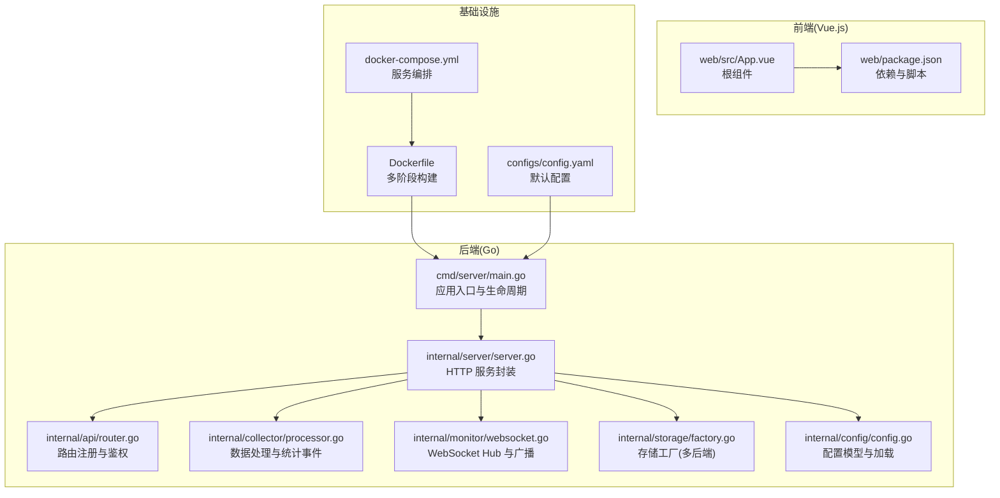
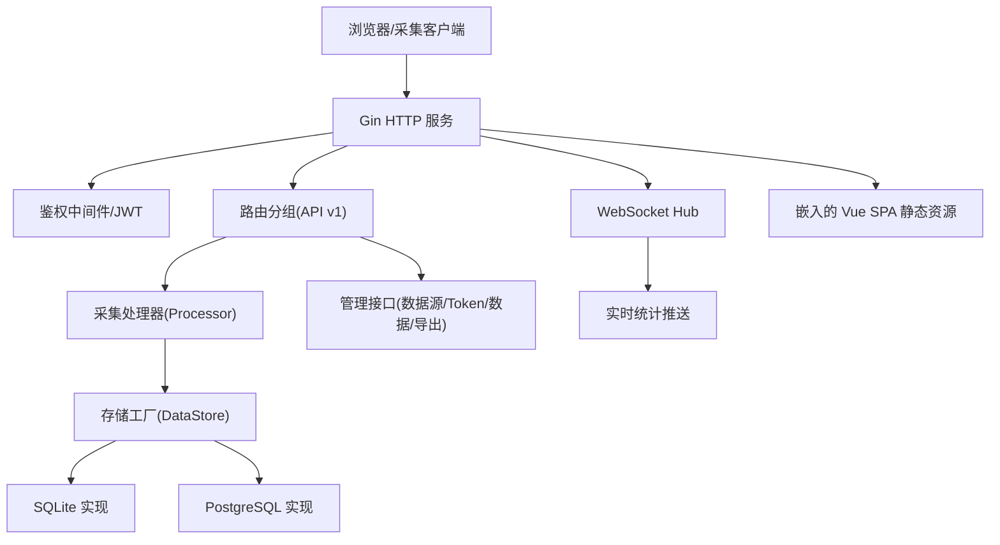
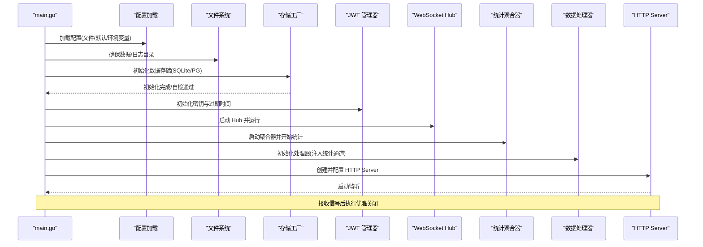
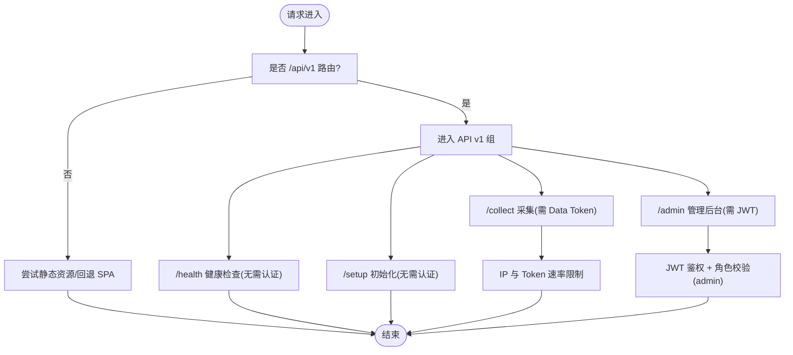
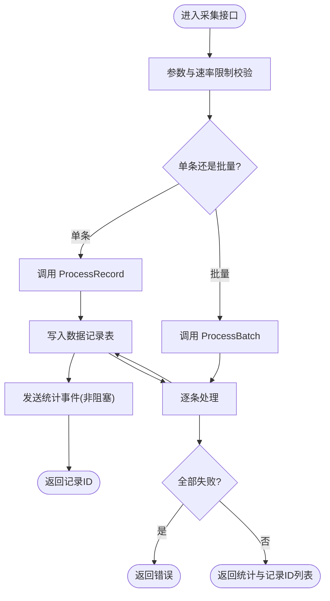
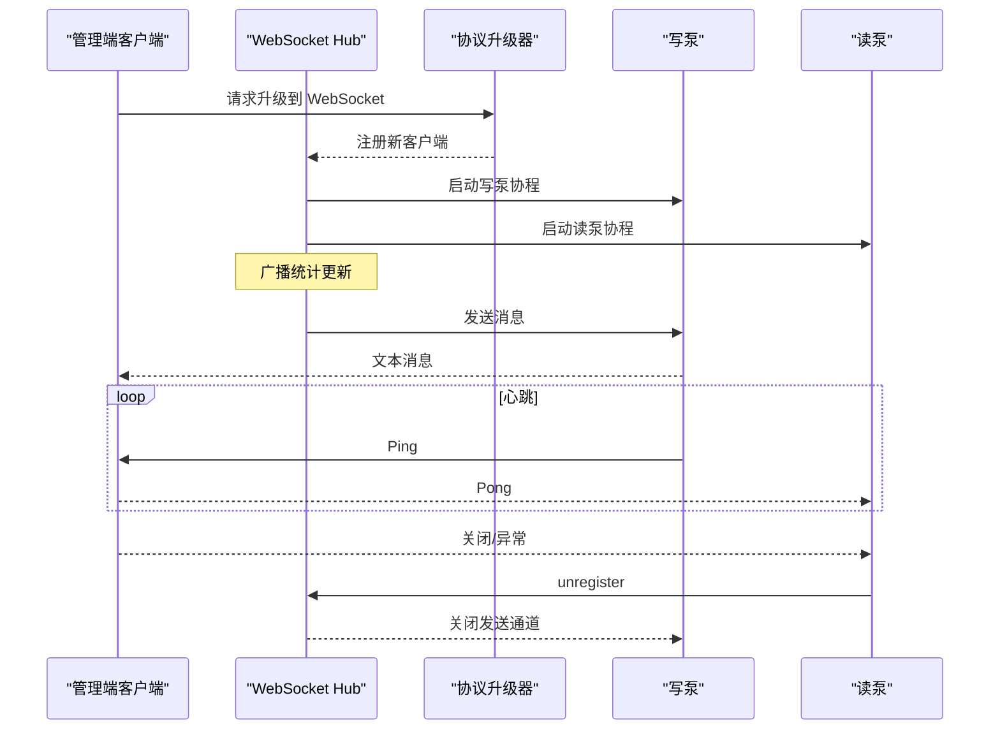
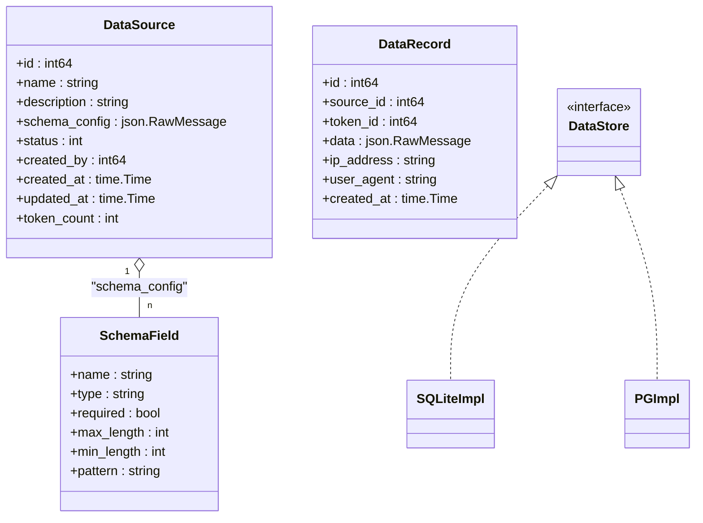
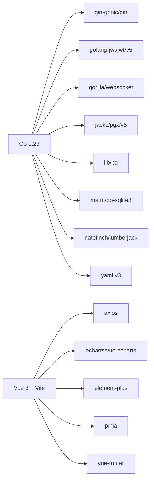

# 项目概述

<cite>
**本文引用的文件**
- [cmd/server/main.go](file://cmd/server/main.go)
- [configs/config.yaml](file://configs/config.yaml)
- [internal/config/config.go](file://internal/config/config.go)
- [internal/server/server.go](file://internal/server/server.go)
- [internal/api/router.go](file://internal/api/router.go)
- [internal/collector/processor.go](file://internal/collector/processor.go)
- [internal/monitor/websocket.go](file://internal/monitor/websocket.go)
- [internal/storage/factory.go](file://internal/storage/factory.go)
- [Dockerfile](file://Dockerfile)
- [docker-compose.yml](file://docker-compose.yml)
- [web/package.json](file://web/package.json)
- [go.mod](file://go.mod)
- [internal/model/source.go](file://internal/model/source.go)
- [internal/model/record.go](file://internal/model/record.go)
- [web/src/App.vue](file://web/src/App.vue)
</cite>

## 目录
1. [引言](#引言)
2. [项目结构](#项目结构)
3. [核心组件](#核心组件)
4. [架构总览](#架构总览)
5. [详细组件分析](#详细组件分析)
6. [依赖分析](#依赖分析)
7. [性能考虑](#性能考虑)
8. [故障排查指南](#故障排查指南)
9. [结论](#结论)
10. [附录](#附录)

## 引言
DataCollector 是一个面向数据采集与管理的全栈应用，旨在为用户提供统一的数据采集入口、灵活的数据源配置、实时统计与可视化展示、以及安全可控的访问控制。系统通过前后端分离与模块化设计，支持 SQLite 与 PostgreSQL 两种数据库后端，具备可扩展的 WebSocket 实时推送能力，适合中小规模到中等规模的采集场景与内部数据平台。

- 核心价值与目标
  - 提供标准化的数据采集接口，支持批量与单条上报，内置请求体大小限制与速率限制。
  - 提供管理后台，支持数据源建模、Token 管理、数据查询与导出、系统初始化与健康检查。
  - 通过 WebSocket 实时推送采集统计，辅助运营与监控。
  - 支持容器化部署，便于快速上线与运维。

- 目标用户
  - 产品与运营团队：查看采集趋势、核对数据质量。
  - 开发与测试团队：对接采集接口、调试数据源与 Token。
  - 运维团队：部署、监控与扩容，切换数据库后端。

## 项目结构
项目采用“后端 Go + 前端 Vue.js”的前后端分离架构，后端以 Gin 为核心 Web 框架，结合模块化的包组织方式；前端基于 Vue 3 + TypeScript + Vite，使用 Element Plus 与 ECharts 构建管理界面与图表展示；Docker 与 docker-compose 提供一键部署能力。

**图示来源**
- [cmd/server/main.go:1-201](file://cmd/server/main.go#L1-L201)
- [internal/server/server.go:1-139](file://internal/server/server.go#L1-L139)
- [internal/api/router.go:1-116](file://internal/api/router.go#L1-L116)
- [internal/collector/processor.go:1-84](file://internal/collector/processor.go#L1-L84)
- [internal/monitor/websocket.go:1-221](file://internal/monitor/websocket.go#L1-L221)
- [internal/storage/factory.go:1-22](file://internal/storage/factory.go#L1-L22)
- [internal/config/config.go:1-215](file://internal/config/config.go#L1-L215)
- [web/src/App.vue:1-4](file://web/src/App.vue#L1-L4)
- [web/package.json:1-30](file://web/package.json#L1-L30)
- [Dockerfile:1-52](file://Dockerfile#L1-L52)
- [docker-compose.yml:1-56](file://docker-compose.yml#L1-L56)
- [configs/config.yaml:1-41](file://configs/config.yaml#L1-L41)

**章节来源**
- [cmd/server/main.go:1-201](file://cmd/server/main.go#L1-L201)
- [internal/server/server.go:1-139](file://internal/server/server.go#L1-L139)
- [internal/api/router.go:1-116](file://internal/api/router.go#L1-L116)
- [internal/collector/processor.go:1-84](file://internal/collector/processor.go#L1-L84)
- [internal/monitor/websocket.go:1-221](file://internal/monitor/websocket.go#L1-L221)
- [internal/storage/factory.go:1-22](file://internal/storage/factory.go#L1-L22)
- [internal/config/config.go:1-215](file://internal/config/config.go#L1-L215)
- [web/src/App.vue:1-4](file://web/src/App.vue#L1-L4)
- [web/package.json:1-30](file://web/package.json#L1-L30)
- [Dockerfile:1-52](file://Dockerfile#L1-L52)
- [docker-compose.yml:1-56](file://docker-compose.yml#L1-L56)
- [configs/config.yaml:1-41](file://configs/config.yaml#L1-L41)

## 核心组件
- 应用入口与生命周期
  - 初始化日志、加载配置、确保数据/日志目录、数据库初始化与自检、启动 JWT 管理器、WebSocket Hub、统计聚合器、数据处理器、HTTP 服务与优雅关闭。
- HTTP 服务与路由
  - 基于 Gin 的 Server 封装，注册全局中间件（日志、CORS、请求体大小限制、速率限制），集中注册 API v1 路由组，提供 SPA 静态资源与回退。
- 数据采集与处理
  - Processor 负责将采集数据持久化并向上游统计通道发送事件，支持单条与批量处理。
- 实时监控与推送
  - WebSocket Hub 管理客户端连接、广播统计更新消息，提供心跳与异常处理。
- 存储抽象与多后端
  - 工厂模式按配置选择 SQLite 或 PostgreSQL 实现，屏蔽上层差异。
- 配置与部署
  - YAML 配置文件与环境变量覆盖，Docker 多阶段构建与 docker-compose 编排，支持 SQLite/PG 两种模式。

**章节来源**
- [cmd/server/main.go:25-129](file://cmd/server/main.go#L25-L129)
- [internal/server/server.go:54-87](file://internal/server/server.go#L54-L87)
- [internal/api/router.go:14-115](file://internal/api/router.go#L14-L115)
- [internal/collector/processor.go:16-83](file://internal/collector/processor.go#L16-L83)
- [internal/monitor/websocket.go:14-152](file://internal/monitor/websocket.go#L14-L152)
- [internal/storage/factory.go:11-21](file://internal/storage/factory.go#L11-L21)
- [internal/config/config.go:82-195](file://internal/config/config.go#L82-L195)
- [configs/config.yaml:1-41](file://configs/config.yaml#L1-L41)
- [Dockerfile:1-52](file://Dockerfile#L1-L52)
- [docker-compose.yml:1-56](file://docker-compose.yml#L1-L56)

## 架构总览
系统采用“后端 API + 管理前端 + 实时推送”的三层架构。后端以 Gin 提供 REST API 与 WebSocket，前端通过 Vue SPA 提供管理界面；数据层通过存储工厂适配 SQLite/PG；日志与配置通过统一入口管理；容器化提供开箱即用的部署体验。

**图示来源**
- [internal/server/server.go:54-87](file://internal/server/server.go#L54-L87)
- [internal/api/router.go:34-115](file://internal/api/router.go#L34-L115)
- [internal/collector/processor.go:16-28](file://internal/collector/processor.go#L16-L28)
- [internal/storage/factory.go:11-21](file://internal/storage/factory.go#L11-L21)
- [internal/monitor/websocket.go:14-61](file://internal/monitor/websocket.go#L14-L61)
- [internal/server/server.go:94-138](file://internal/server/server.go#L94-L138)

## 详细组件分析

### 应用入口与启动序列
应用入口负责串联各子系统，确保初始化顺序与优雅关闭。

**图示来源**
- [cmd/server/main.go:25-129](file://cmd/server/main.go#L25-L129)
- [internal/config/config.go:82-146](file://internal/config/config.go#L82-L146)
- [internal/storage/factory.go:11-21](file://internal/storage/factory.go#L11-L21)
- [internal/monitor/websocket.go:64-106](file://internal/monitor/websocket.go#L64-L106)
- [internal/collector/processor.go:22-28](file://internal/collector/processor.go#L22-L28)
- [internal/server/server.go:84-92](file://internal/server/server.go#L84-L92)

**章节来源**
- [cmd/server/main.go:25-129](file://cmd/server/main.go#L25-L129)

### API 路由与鉴权流程
后端通过 Gin 注册 API v1 路由组，区分公开健康检查、初始化、采集接口与需要 JWT 的管理后台接口，并在采集接口上叠加 IP 与 Token 两级速率限制。

**图示来源**
- [internal/server/server.go:76-86](file://internal/server/server.go#L76-L86)
- [internal/api/router.go:34-115](file://internal/api/router.go#L34-L115)

**章节来源**
- [internal/server/server.go:54-87](file://internal/server/server.go#L54-L87)
- [internal/api/router.go:14-115](file://internal/api/router.go#L14-L115)

### 数据采集处理流程
采集接口接收数据后，交由处理器进行持久化与统计事件发送，支持单条与批量处理，具备部分成功/失败的返回语义。

**图示来源**
- [internal/api/router.go:49-55](file://internal/api/router.go#L49-L55)
- [internal/collector/processor.go:30-83](file://internal/collector/processor.go#L30-L83)

**章节来源**
- [internal/collector/processor.go:16-83](file://internal/collector/processor.go#L16-L83)
- [internal/api/router.go:49-55](file://internal/api/router.go#L49-L55)

### WebSocket 实时推送
WebSocket Hub 管理客户端连接，周期性广播统计更新；客户端通过 Ping/Pong 保持心跳，异常关闭时自动清理。

**图示来源**
- [internal/monitor/websocket.go:134-221](file://internal/monitor/websocket.go#L134-L221)
- [internal/monitor/websocket.go:64-106](file://internal/monitor/websocket.go#L64-L106)

**章节来源**
- [internal/monitor/websocket.go:14-221](file://internal/monitor/websocket.go#L14-L221)

### 数据模型与存储抽象
- 数据源模型包含名称、描述、Schema 配置（字段定义）、状态与关联信息。
- 数据记录模型包含来源、Token、原始数据、IP、UA 与时间戳。
- 存储工厂根据配置选择 SQLite 或 PostgreSQL 实现，对外暴露统一接口。

**图示来源**
- [internal/model/source.go:8-35](file://internal/model/source.go#L8-L35)
- [internal/model/record.go:8-33](file://internal/model/record.go#L8-L33)
- [internal/storage/factory.go:11-21](file://internal/storage/factory.go#L11-L21)

**章节来源**
- [internal/model/source.go:1-35](file://internal/model/source.go#L1-L35)
- [internal/model/record.go:1-33](file://internal/model/record.go#L1-L33)
- [internal/storage/factory.go:1-22](file://internal/storage/factory.go#L1-L22)

## 依赖分析
- 技术栈与选择
  - 后端：Go + Gin（高性能 Web 框架）、gorilla/websocket（标准 WebSocket 实现）、pgx/lib/pq/sqlite3（数据库驱动）、slog/lumberjack（日志与轮转）、yaml（配置解析）。
  - 前端：Vue 3 + TypeScript + Vite（现代前端工具链）、Element Plus（UI 组件库）、ECharts（图表）、Pinia/Router（状态与路由）。
  - 部署：Docker 多阶段构建，docker-compose 编排，支持 SQLite/PG 两种模式。
- 外部依赖与版本
  - Go 1.23，gin-gonic/gin、golang-jwt/jwt/v5、gorilla/websocket、jackc/pgx、lib/pq、mattn/go-sqlite3、natefinch/lumberjack、yaml.v3 等。
- 依赖关系可视化

**图示来源**
- [go.mod:1-48](file://go.mod#L1-L48)
- [web/package.json:1-30](file://web/package.json#L1-L30)

**章节来源**
- [go.mod:1-48](file://go.mod#L1-L48)
- [web/package.json:1-30](file://web/package.json#L1-L30)

## 性能考虑
- 启动与初始化
  - 严格顺序初始化，数据库自检失败直接退出，避免后续流程异常。
  - 日志轮转与按环境选择输出，生产环境建议文件输出与合理日志级别。
- 采集处理
  - 处理器对统计事件发送采用非阻塞通道策略，避免阻塞主处理流程。
  - 批量处理逐条落库，失败不影响其他记录，返回部分成功语义。
- WebSocket
  - 客户端发送缓冲区满时主动关闭连接，防止内存膨胀；心跳周期与超时设置平衡实时性与资源占用。
- 存储与并发
  - 工厂模式隔离不同数据库实现，SQLite 适合单机与轻量场景，PG 适合高并发与可靠性需求。
- 前端
  - 图表与组件库按需引入，构建时进行类型检查与打包优化。

[本节为通用性能建议，不直接分析具体文件]

## 故障排查指南
- 启动失败
  - 检查配置文件路径与权限，确认默认配置加载与环境变量覆盖生效。
  - 查看日志输出（stdout/file）与轮转配置，定位初始化阶段错误。
- 数据库问题
  - 使用自检接口确认连接；切换 SQLite/PG 时检查 DSN 与凭据。
- 采集接口异常
  - 检查请求体大小限制与速率限制配置；确认 Data Token 有效与来源 ID 正确。
- WebSocket 不可用
  - 确认路由与 JWT 认证；观察 Hub 日志与客户端心跳；排查网络代理与跨域策略。
- 前端无法访问
  - 确认 SPA 回退逻辑与静态资源路径；检查服务端口映射与容器卷挂载。

**章节来源**
- [cmd/server/main.go:155-200](file://cmd/server/main.go#L155-L200)
- [internal/server/server.go:94-138](file://internal/server/server.go#L94-L138)
- [internal/api/router.go:49-55](file://internal/api/router.go#L49-L55)
- [internal/monitor/websocket.go:134-221](file://internal/monitor/websocket.go#L134-L221)

## 结论
DataCollector 通过清晰的模块划分与前后端分离设计，提供了从采集、存储、管理到实时可视化的完整能力。其可插拔的存储后端、完善的日志与配置体系、以及容器化部署方案，使其既适合快速落地，也便于长期演进。对于初学者，建议先从 SQLite 模式与默认配置入手；对于有经验的开发者，可基于现有接口扩展采集规则、接入更多数据库或增强实时推送能力。

[本节为总结性内容，不直接分析具体文件]

## 附录

### 快速开始指南
- 环境要求
  - Go 1.23+，Node.js 20+，Docker 与 docker-compose（可选）。
- 获取与构建
  - 克隆仓库后，使用构建脚本或直接编译后端；前端安装依赖并构建静态资源；Docker 多阶段构建生成镜像。
- 运行方式
  - 直接运行二进制：准备配置文件与数据/日志目录，启动服务。
  - 使用 Docker：默认 SQLite 模式一键启动；如需 PostgreSQL，可启用相应服务并设置环境变量。
- 基本使用示例
  - 初始化：访问初始化接口，完成数据库与基础配置。
  - 创建数据源与 Token：在管理后台创建数据源并生成采集 Token。
  - 采集数据：向采集接口提交数据（支持单条与批量），查看返回与统计。
  - 实时监控：登录管理后台，打开 WebSocket 监控页面，查看实时统计。

**章节来源**
- [Dockerfile:1-52](file://Dockerfile#L1-L52)
- [docker-compose.yml:1-56](file://docker-compose.yml#L1-L56)
- [configs/config.yaml:1-41](file://configs/config.yaml#L1-L41)
- [internal/api/router.go:36-45](file://internal/api/router.go#L36-L45)
- [internal/api/router.go:53-55](file://internal/api/router.go#L53-L55)